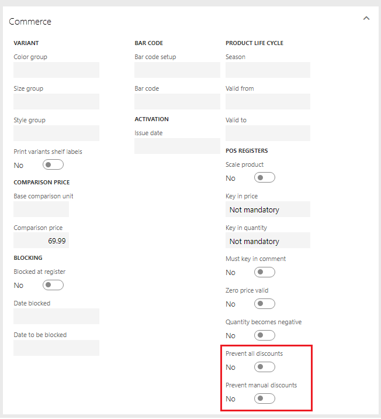

---
# required metadata

title: Options for preventing discounts for retail products
description: There are various reasons why retailers may want to prevent some products from being discounted, either from a promotion or during the sale at the POS.
author: jblucher
ms.date: 06/20/2017
ms.topic: article
ms.prod: 
ms.technology: 

# optional metadata

ms.search.form: RetailPeriodicDiscount
# ROBOTS: 
audience: Application User
# ms.devlang: 
ms.reviewer: josaw
# ms.tgt_pltfrm: 
ms.custom: 85183
ms.assetid: e8c5a24f-7edd-4fd6-af80-5e0ac9f03127
ms.search.region: Global
ms.search.industry: Retail
ms.author: jeffbl
ms.search.validFrom: 2016-02-28
ms.dyn365.ops.version: AX 7.0.0, Retail July 2017 update

---

# Options for preventing discounts for retail products

[!include [banner](includes/banner.md)]

There are various reasons why retailers may want to prevent some products from being discounted, either from a promotion or during the sale at the POS.

The following options, which can be found on the **Commerce** tab of released products, will allow the product to be configured to prevent all or manual discounts. The settings can also be specified at the category level from the category hierarchy.

- **Prevent all discounts** – Select this option to prevent all types of discounts from being applied to this product. This includes promotions such as mix and match, quantity and threshold discounts, as well as manual line and transaction discounts that are applied during a sale by a POS user.
- **Prevent manual discounts** – Select this option to only prevent the manual line or transaction discounts that are applied during a sale by a POS user. Products with this option selected are still eligible for promotions, such as mix and match and quantity and threshold discounts.

> [!NOTE]
> These settings do not restrict the price override operation, because that sets the base price and is not treated as a discount.

[!INCLUDE[footer-include](../includes/footer-banner.md)]