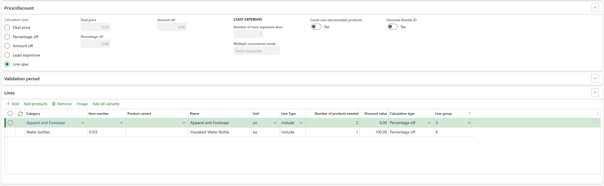
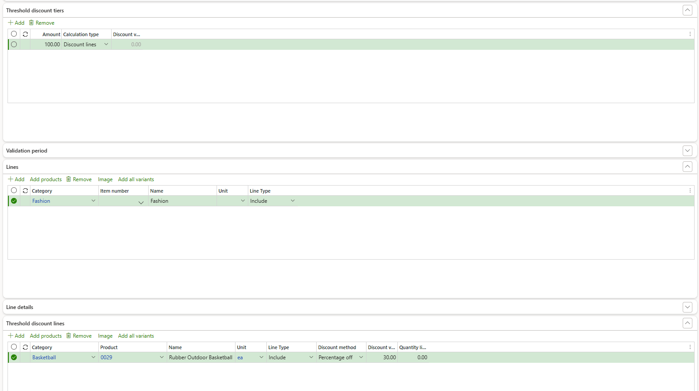

# Pricing examples

[!include [banner](../includes/banner.md)]

This article provides examples of typical uses of pricing and discounts in Microsoft Dynamics 365 Commerce.

## Purchase product A, and receive a discount on product B when both items are in the cart

Follow these steps to configure a mix and match discount so that users who purchase product A receive a discount on product B when both items are in their cart.

1. In Commerce headquarters, go to **Retail and Commerce** \> **Pricing and discounts** \> **Mix and match discounts**.
1. On the Action Pane, select **New** \> **Mix and match discounts**.
1. Configure general settings for the new mix and match discount, such as the price groups, discount name, priority, and validation period. For more information about how to configure these settings, see [Retail discounts](retail-discounts-overview.md).
1. On the **Price/discount** FastTab, in the **Calculation type** field, select **Line spec**.
1. On the **Lines** FastTab, select **Add** to add a line for the first product (product A). Set the **Line group** field to **A** and the **Discount value** field to **0** (zero).
1. Select **Add** to add a line for the second product (product B). Set the **Line group** field to **B** and the **Discount value** field to the discount value of the offer.

In the example in the following image:

- The discount is applicable when the cart contains a quantity of 2 for items in the **Apparel and Footwear** category and a quantity of 1 for item 0103.
- When the discount is applied, the item 0103 in the cart gets 100 percent off.

## Receive a discount on a specific item when the cart total reaches a specific amount

Follow these steps to configure a threshold discount where users receive a discount on a specific item when their cart total reaches a specific amount.

1. In headquarters, go to **Retail and Commerce** \> **Pricing and discounts** \> **Threshold discounts**.
1. On the Action Pane, select **New** to create a threshold discount.
1. Configure general settings for the new threshold discounts, such as the price groups, discount name, priority, and validation period. For more information about how to configure these settings, see [Retail discounts](retail-discounts-overview.md).
1. On the **Threshold discount tiers** FastTab, select **Add** to add a tier. In the **Amount** field, enter the discount amount.
1. In the **Calculation type** field, select **Discount lines**.
1. On the **Lines** FastTab, add the products that qualify for cart total calculation.
1. On the **Threshold discount lines** FastTab, add the products that should be discounted.

For more information about how to configure threshold discounts, see [Set up a threshold discount](/dynamicsax-2012/appuser-itpro/set-up-a-threshold-discount).

In the example in the following image:

- The discount is applicable when the total amount for items in the **Fashion** category reaches $100.
- When the discount is applied, the item 0029 in the cart gets 30 percent off.

[!INCLUDE[footer-include](../includes/footer-banner.md)]
