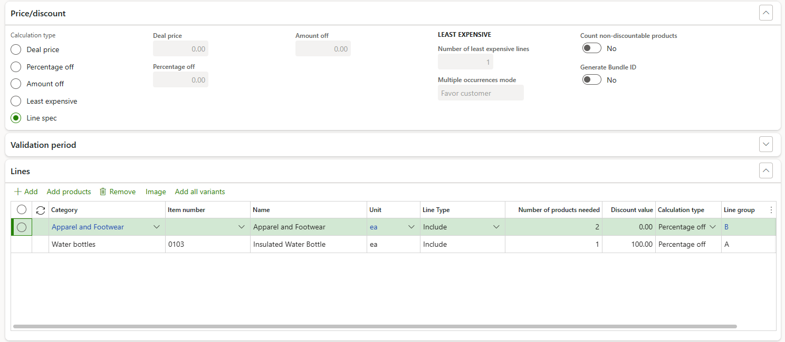

# Pricing examples

[!include [banner](../includes/banner.md)]

This article provides examples of typical usages of pricing and discounts in Microsoft Dynamics 365 Commerce.

## Purchase product A, and receive a discount on product B when both items are in the cart

To configure a mix and match discount where when a user purchases product A, they receive a discount on product B when both items are in their cart, follow these steps.

1. In Commerce headquarters, go to **Retail and Commerce \> Pricing and discounts \> Mix and match discounts**.
1. On the Action Pane, select **New \> Mix and match discounts**.
1. Configure general settings for the new mix and match discount, such as price groups, discount name, priority, and validation period. For more information on configuring these settings, see [Retail discounts](retail-discounts-overview.md).
1. On the **Price/discount** FastTab, for **Calculation type**, select **Line spec**.
1. On the **Lines** FastTab, select **Add** to add the first product (product A), and then set the **Line group** as "A", with a **Discount value** of "0" (zero).
1. On the **Lines** FastTab, select **Add** to add the second product (product B), and then set the **Line group** as "B", with the **Discount value** of the offer.

The following example screenshot shows:
- When there are two quantities of items under category "Apparel and Footwear" and one quantity of item "0103" in the cart, the discount is applicable.
- When the discount is applied, the item "0103" in the cart gets 100% off.

## Receive a discount on a specific item when cart total reaches a certain amount

To configure a threshold discount where a user receives a discount on a specific item when their cart total reaches a certain amount, follow these steps.

1. In Commerce headquarters, go to **Retail and Commerce \> Pricing and discounts \> Threshold discounts**.
1. On the Action Pane, select **New** to create a new threshold discount.
1. Configure general settings for the new threshold discounts such as price groups, discount name, priority, and validation period. For more information on configuring these settings, see [Retail discounts](retail-discounts-overview.md).
1. On the **Threshold discount tiers** FastTab, select **Add** to add a new tier, and then for **Amount**, enter the discount amount.
1. For **Calculation type**, select **Discount lines**.
1. On the **Lines** FastTab, add the products that qualify for cart total calculation.
1. On the **Threshold discount lines** FastTab, add the products to be discounted.

For more information on configuring threshold discounts, see [Set up a threshold discount](/dynamicsax-2012/appuser-itpro/set-up-a-threshold-discount).

The following example screenshot shows:
- When the total amount for the items under "Fashion" category reaches $100, the discount is applicable.
- When the discount is applied, the item "0029" in the cart gets 30% off.

[!INCLUDE[footer-include](../includes/footer-banner.md)]
