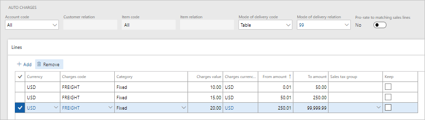
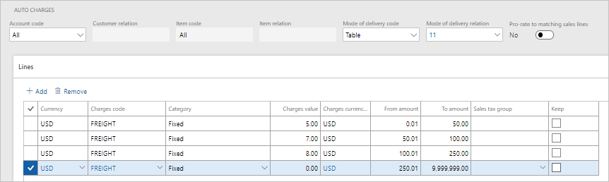
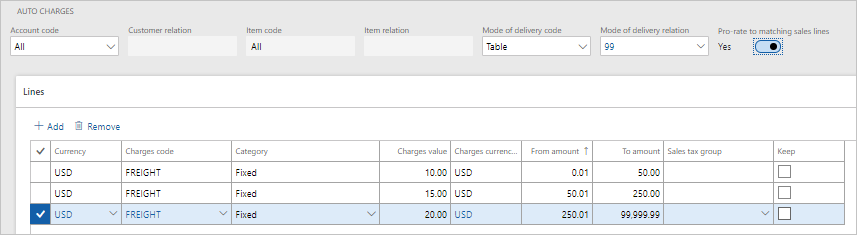
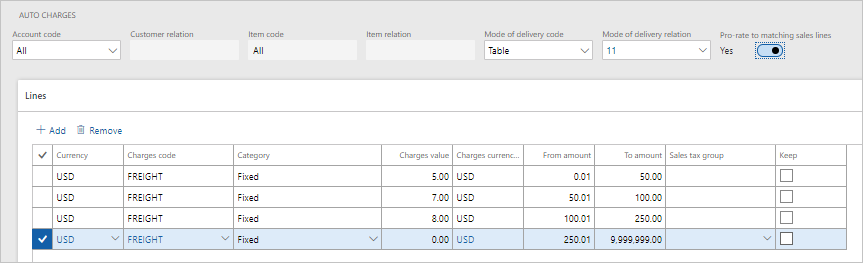
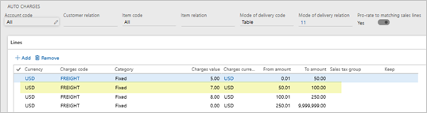
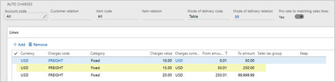
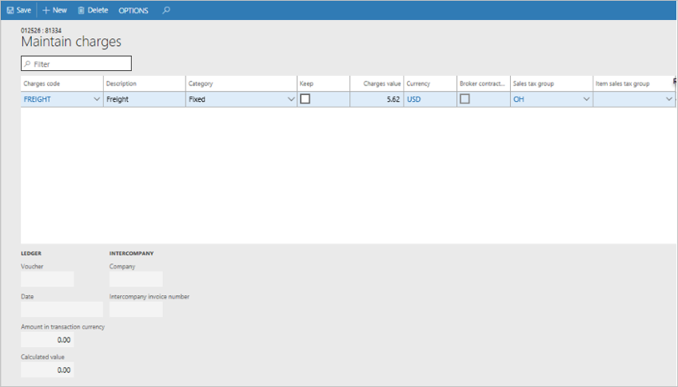

---
# required metadata

title: Prorate header charges to matching sales lines
description: This topic describes additional capabilities for calculating and applying auto-charges to Commerce channel orders by using the advanced auto-charges feature.
author: hhaines
ms.date: 03/30/2020
ms.topic: article
ms.prod: 
ms.technology: 

# optional metadata

ms.search.form:  
# ROBOTS: 
audience: Application User
# ms.devlang: 
ms.reviewer: josaw
# ms.tgt_pltfrm: 
ms.custom: 
ms.assetid: 
ms.search.region: global
ms.search.industry: Retail
ms.author: hhaines
ms.search.validFrom: 
ms.dyn365.ops.version: 10.0.1

---

# Prorate header charges to matching sales lines

[!include [banner](includes/banner.md)]

This topic describes the functionality for grouping header-level auto-charges and prorating them to commerce sales lines. This functionality is available for transactions that are created at the point of sale (POS) in Retail version 10.0.1 and sales that are created in a call center in Retail version 10.0.2.

This functionality is available only if the [advanced auto-charges](/dynamics365/unified-operations/retail/omni-auto-charges) feature is turned on by using the option on the **Commerce parameters** page. Additionally, the enhanced calculation method for auto-charges can be applied only to sales orders that are created through commerce channels (the POS, a call center, and the Dynamics e-Commerce platform).

This new functionality gives organizations more flexibility in the way that header-level auto-charges are calculated and applied to sales transactions.

In versions of the app earlier than version 10.0.1, header-level auto-charges that have a specific mode of delivery relation are calculated only when there is a match with the mode of delivery that is defined on the sales order header.

For example, header-level auto-charges are defined for mode of delivery **99** and mode of delivery **11**. A sales order is created, and mode of delivery **99** is defined on the order header. However, some of the sale lines are set up so that they're shipped by using mode of delivery **11**. In this case, only the header-level charges that are linked to mode of delivery **99** are considered and applied to the sales order.

In Commerce, the header-level charges have an additional feature that lets you define a [tiered charge configuration](/dynamics365/unified-operations/retail/configure-call-center-delivery) that is based on the order value. For example, if the order value is between $50.00 and $200.00, an organization might want to charge a freight charge of $5.00. However, if the order value is between $200.01 and $500.00, the freight charge might be $4.00.

Some organizations want the benefits of the tiered charge calculation that is provided with header-level charges. However, in scenarios that involve mixed modes of delivery, they also want to make sure that the charges that are calculated are based on a match with the mode of delivery that is defined on each sales line.

You can now configure header-level auto-charges so that all modes of delivery on the order are considered when charges are calculated. This functionality requires a more complex calculation logic to calculate the header-level charges. The logic groups together all the items that are shipped using the same mode of delivery, and it treats that group as the calculation group for the items when it calculates the header-level auto-charges. For items that have the same mode of delivery, auto-charges are calculated based on the combined sales value of the items. In this way, the appropriate auto-charge tier is determined.

After the appropriate header-level charges are obtained for the sales lines that are shipped using the same mode of delivery, the calculated charges are prorated down to the sales line level. Because these charges are at the line level and not kept at the header level, a more specific link is made between the item and the charge value that calculated for it. This behavior can be useful in partial return scenarios, where an organization wants to refund only part of the charge instead of the whole charge when only some items are returned.

## Scenarios

The following two sample scenarios outline how these charges are calculated both when the new functionality is used and when it isn't used.

### Scenario 1

This scenario outlines the behavior when the **Pro-rate to matching sales lines** option is set to **No** in the auto-charge setup. (The behavior is equivalent to the behavior of header-level charges in app versions that are earlier than version 10.0.1.)

In this scenario, the organization has defined header-level charges for mode of delivery relation **99** and mode of delivery relation **11**. No auto-charges are configured for mode of delivery **21**.

A sales order is created in the call center, and the mode of delivery is set to **99**. This order contains five items. Two order lines have been configured to use mode of delivery **99**, two lines have been configured to use mode of delivery **11**, and one line has been configured to use mode of delivery **21**, as shown in the following table.

| Item  | Line quantity | Delivery mode | Price per unit |
|-------|---------------|---------------|----------------|
| 81331 | 1             | 11            | $10            |
| 81332 | 1             | 99            | $50            |
| 81333 | 2             | 11            | $30            |
| 81334 | 3             | 99            | $10            |
| 81334 | 3             | 21            | $5             |

In this scenario, the whole order is evaluated against the auto-charge table for mode of delivery **99**. The full total of all sales lines is used to determine a matching tier in the auto-charge configuration, and this charge is applied at the order header level. In this example, the order total is $165.00, and the $15.00 freight charge is applied to the order header. Auto-charges that are configured for mode of delivery **11** are never referenced or applied.

In this scenario, if a customer returns some of the items on the order, and if the [charge code has been configured so that it will be refunded](/dynamics365/unified-operations/retail/omni-auto-charges#setup-and-configuration-2), the total header-level charge is systematically applied to the refund, even if only some of the items are returned.

### Scenario 2

In this scenario, header-level charges are defined for mode of delivery relation **99** and mode of delivery relation **11**. However, the **Pro-rate to matching sales lines** option is set to **Yes** for these auto-charge tables.

This scenario uses the same sales order that contains five lines. The mode of delivery on the order header is set to **99**, but the mode of delivery for each item on the sales order is configured as shown in the following table.

| Item  | Line quantity | Delivery mode | Price per unit |
|-------|---------------|---------------|----------------|
| 81331 | 1             | 11            | $10            |
| 81332 | 1             | 99            | $50            |
| 81333 | 2             | 11            | $30            |
| 81334 | 3             | 99            | $10            |
| 81334 | 3             | 21            | $5             |

Because the auto-charge configuration is set to prorate to matching sales lines, the system performs the following calculation steps.

1. All items that have the same mode of delivery are grouped together, and the system calculates the total product value of the items in the group.

    **Delivery mode 11**

    - Item 81331, quantity 1 = $10
    - Item 81333, quantity 2 = $60 net ($30 per unit)
    - **Total product value for delivery mode 11 = $70**

    **Delivery mode 99**

    - Item 81332, quantity 1 = $50
    - Item 81334, quantity 3 = $30 net
    - **Total product value for delivery mode 99 = $80**

    **Delivery mode 21**

    - Item 81334, quantity 3 = $15 net
    - **Total product value for delivery mode 21 = $15**

2. The system looks for the configuration for header-level auto-charges that matches the customer and mode of delivery settings for each group of items. If the configuration is found, the system looks in the tiered configuration to find the charge that should be applied, based on the total product value of items in the mode of delivery group.

    **Delivery mode 11**

    - Total product value = $70
    - **Charge value = $7**

    **Delivery mode 99**

    - Total product value = $80
    - **Charge value = $15**

    **Delivery mode 21**

    - Total product value = $15
    - **Charge value = $0** (No auto-charges have been configured for this combination of a customer and a mode of delivery.)

    

    

3. The system calculates the charge value that should be applied to each line, based on proration logic that considers the proportional value of the line in relation to the group's total product value.

    **Delivery mode 11**

    - Charge value = $7
    - Group product value = $70
    - Line 1 value = $10 (= 14.2857 percent of the group value)
    - Line 3 value = $60 (= 85.7143 percent of the group value)
    - **Line charge for line 1 = $1**
    - **Line charge for line 3 = $6**

    **Delivery mode 99**

    - Charge value = $15
    - Group product value = $80
    - Line 2 value = $50 (= 62.5 percent of the group value)
    - Line 4 value = $30 (= 37.5 percent of the group value)
    - **Line charge for line 2 = $9.38**
    - **Line charge for line 4 = $5.62**

    **Delivery mode 21**

    - Charge value = $0
    - Group product value = $15
    - Line 5 value = $15 (= 100 percent of the group value)
    - **Line charge for line 5 = $0**

Therefore, for this example, item 81334 will be assigned a freight charge of $5.62. You can view these charges on the **Maintain charges** page for the sales line. The following illustration shows what this page looks like for item 81334.

When this method of calculation is used in a partial return scenario, if the charge code is refundable, only the part of the charge that is allocated to that line will be refunded when the item is returned.

## Additional resources

[Omni-channel advanced auto charges](omni-auto-charges.md)

[Enable and configure auto charges by channel](auto-charges-by-channel.md)

[!INCLUDE[footer-include](../includes/footer-banner.md)]