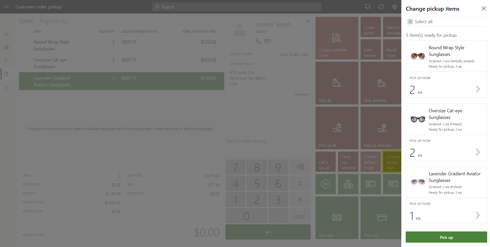

---
# required metadata

title: Process customer order pickups in POS
description: This topic explains the functionality that is available in the point of sale (POS) application for processing customer order pickups.
author: Hhainesms
ms.date: 01/06/2021
ms.topic: article
ms.prod:
ms.technology: 

# optional metadata

# ms.search.form:
audience: Application User
# ms.devlang: 
ms.reviewer: josaw
# ms.tgt_pltfrm: 
# ms.custom:
ms.search.region: global
# ms.search.industry:
ms.author: hhaines
ms.search.validFrom: 2020-01-20
ms.dyn365.ops.version: 10.0.8
---

# Process customer order pickups in POS

[!include [banner](includes/banner.md)]

When a [customer order](customer-orders-overview.md) is created for store pickup, a store user can use the point of sale (POS) application to start the pickup of inventory. POS will run the final payment capture as required. It will also complete the inventory and financial posting for the quantities that are picked up.

If you're a store user, you can perform the pickup by using either the **Recall order** operation or the **Order fulfillment** operation in POS. To make the **Pick up** operation available, you must first follow one of these steps:

- To use the **Recall order** operation, search for and select the order that will be picked up.
- To use the **Order fulfillment** operation, search for and select one or more order lines.

If the selected order or order lines aren't configured for pickup at that specific store, or if the order has already been fully picked up, the **Pick up** operation will be unavailable.

In Microsoft Dynamics 365 Commerce version 10.0.17 and later, the **Improved user experience for pick up order processing in Point of Sale** feature can be turned on through Feature management in Commerce headquarters. If this feature is turned off, users can't select pickup quantities. By default, the full quantity that was ordered for the line is the quantity that will be picked up. This experience can be problematic, because users might forget to select some items for pickup when they perform the pickup through order fulfillment.

The **Improved user experience for pick up order processing in Point of Sale** feature gives users more control over the selection of products that will be picked up and the quantity of those products that will be picked up. Users don't have to select every line of the sales order on the order fulfillment page before they select **Pick up**. All the items that can be picked up will be shown. Users can specify multiple lines for pickup even if only one product line is selected.

When the **Improve user experience for pick up order processing in Point of Sale** feature is turned on, and you select the **Pick up** operation, the **Pick up** dialog box appears. There, you can select the items and quantities that will be picked up. By default, any ordered quantity that has inventory in a picked or packed state is considered eligible for pickup. By default, that quantity is set as the pickup quantity. You can change the quantity that was entered, provided that the quantity isn't 0 (zero) and doesn't exceed the total open (that is, non-invoiced) quantity for the selected line.

After you select the quantities that will be picked up and then select **Pick up**, the transaction page appears. If the [omni-channel payments](omni-channel-payments.md) feature is turned on, and there are pre-authorized credit card payments on file, you must apply the payment.

On the transaction page, the system calculates the amounts that are due by calculating the total that is due for the selected pickup items and then subtracting any previously applied deposits or authorized credit card payments. You must process payment to complete the pickup transaction. If the [screen layout](pos-screen-layouts.md) of the transaction page is configured so that it includes the **Conclude transaction** operation, and no amount is due, you can complete the transaction without selecting a payment method. If the **Conclude transaction** operation isn't available, you can select the **$0.00 amount due** link in the **Totals** pane to conclude the transaction without having to select a payment method.

## Changing pickup lines or quantities

If you must change the pickup quantity after you've selected the items that will be picked up, you can select **Set quantity**. You can't set the pickup quantity to **0** (zero) or increase it to a value that exceeds the non-invoiced quantity that remains for the ordered line. To remove a pickup line from the transaction cart, select **Void transaction**. The current transaction will be stopped, and the flow for the **Pick up** operation will be restarted.

If the **Improve user experience for pick up order processing in Point of Sale** feature is turned on, organizations can add a button for the **Change pickup lines** operation to the screen layout of the transaction page. After you create the pickup transaction cart in POS and select items, you can select **Change pickup lines** if you must change the pickup items but don't want to void the whole transaction. In the **Change pickup lines** dialog box that appears, you can change the pickup items and quantities. The transaction cart is then updated to reflect your changes.

[!INCLUDE[footer-include](../includes/footer-banner.md)]