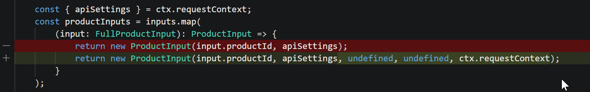
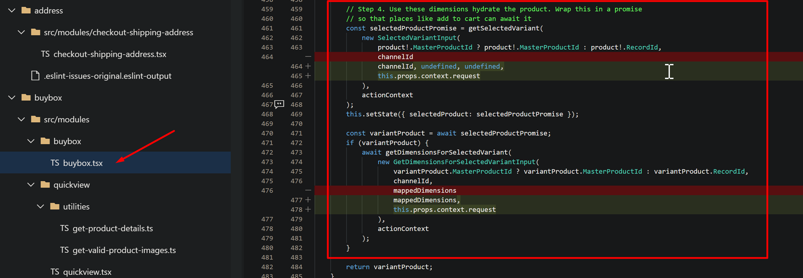

---
  
# required metadata

title: Commerce Catalogs for B2B
description: Us these catalogs to be able to sell select products to you B2B organization at specific prices.
author: ashishmsft
ms.date: 03/01/2022
ms.topic: article
audience: Application User, Developer, IT Pro
ms.reviewer: josaw
ms.search.region: Global
ms.author: asharchw
ms.search.validFrom: 2022-02-28
---

  
# Commerce product catalogs 

[!INCLUDE[banner](includes/banner.md)]

_**Applies To:** Microsoft Dynamics 365 Commerce - 10.0.26 & later releases

You can use Commerce product catalogs to identify the products that you want to offer in your B2B Online stores. When you create the catalog, you identify the online stores that the products are offered in, add the products that you want to include, and enhance the product offerings by adding merchandising details. You can create multiple catalogs for a B2B online store.

Commerce product catalogs allows you to define the following - 

+ Catalog-specific navigation hierarchy 
  + Allowing Organizations to create a distinct category structure for their specific catalog.
+ Catalog-specific attribute metadata - Attributes contain details about the product. You can assign attributes to a category of Navigation hierarchy that way you can define values for those attributes at product level that are assigned to that category.
  + Organizations will be abel to define catalog-specific attribute values
  + Organizations will be able to control the visibility of attributes at a catalog-level  
  + Organizations will be able to choose the refiners specific to an individual catalog
+ Channels 
  + Currently, end to end support for Catalogs is available with B2B Online stores only. Organizations are able to associate  more than one B2B online channels with a catalog. 
+ Customer hierarchies 
  + For a given B2B Channel, Organizations can choose to make a specific catalog available to their select B2B Partners (Customer Hierarchies in Dynamics 365) and they can achieve that by associating Customer Hierarchies to a Catalog. 
+ Price groups - A core reason for defining a catalog to use with a B2B channel is to be able to configure specific prices and promotions for that catalog. B2B Customers ordering from this catalog will receive these prices and promotions upon signing-in & selecting this catalog on eCommerce. 
To configure catalog-specific prices, select the Price groups option from the Catalogs tab to link one or more price groups to the catalog. All trade agreements, price adjustment journals, and advanced discounts (threshold, quantity, mix and match) that have been linked to the same price group will be applied when customers order from this catalog.
  + Price groups for Catalogs allows Organization to make products available to their intended B2B organizations with their preferred pricing & discounts. 
  + [More information on Price groups](price-management.md)
  

> [!NOTE]
> This feature is available with Microsoft Dynamics 365 Commerce release of 10.0.26 & to see the abilities to be able to configure catalog-specific configurations like Navigation hierarchy, Customer hierarchy etc. - please go to Feature management workspace & enable the following feature **Enable use of multiple catalogs on retails channels.** & run 1110 CDX job. 

## Catalog process flow

Creating and processing a catalog is a four-step process. The following diagram illustrates the catalog process flow:

+ Step-1:**Configure** 
  + Associate navigation hierarchy
  + Determine time-effectiveness, set expiration date (if applicable) 
  + Add products & categorize them 
  + Associate Customer hierarchy (specific to your B2B organizations) 
  + Associate Price groups 
  + Associate 'Default dimension attribute group for refiners like Size, Style, Color' thru attribute groups from top-ribbon, 
  + Set attribute metadata (choose which attributes are supposed to be viewable & refinable. By default, all viewable attributes are searchable as well) 
 
  > [!NOTE]
  > 
You cannot create a new price group from catalogs form - instead you will have to create one from 'All price groups' form & then be able to associate in this view.

  > 
You cannot create a new customer hierarchy from catalogs form - instead you will have to create one from 'Customer hierarchies' form & then be able to associate in this view.

  
+ Step-2: **Validate** - General validation rules are like - 
  + There are no Uncategorized products 
  + All items are assorted to each channel associated to catalog
+ Step-3: **Approval** 
+ Step-4: **Publishing**

#### Basic catalog setup

Go to **Retail and Commerce** \> **Catalogs and assortments** \> **All catalogs** to configure your catalog.

When you create a new catalog, you must first link the catalog to one or more channels. This is done in the **Commerce channels** FastTab on the **Catalog setup** form. Click **Add** and select one or more channels. Only items linked to your selected channel [assortments](/dynamics365/unified-operations/retail/assortments) can be used when creating the catalog.

To add products to a catalog, a navigation hierarchy must be chosen. The navigation hierarchy will support the category structure for the catalog. You must pick from one of the navigation hierarchies linked to the channels selected on the **Commerce channels** FastTab of the **Catalog** page. If a navigation channel was not linked to a channel previously, go to **Retail and Commerce** \> **Channel setup** \> **Channel categories and product attributes** to link a navigation hierarchy default to each of your channels.

On the **Catalogs** menu tab, on the **Catalog setup** page, click **Add products** to configure the products to add to the catalog, or select a node in the navigation hierarchy (selecting a node will change the screen presentation and allow you to add products directly to a category within the catalog).

Click the top node of the catalog hierarchy to return to the main catalog header view. Configure effective and expiration dates as necessary on the **General** FastTab.

Before the catalog is available to use, it must be published. Click **Validate catalog** on the **Catalogs** menu to process a validation. This is required action and will validate that the required setup is accurate. Click **View results** to see the details of the validation. If errors are found, you must correct the data and run validation again until the validation has passed.

After validation is confirmed, click **Workflow** on the menu to start the approval workflow. Click **Submit** on the **Workflow** menu to execute the process. Configure the steps and authorized users for the workflow from **Retail and Commerce** \> **Headquarters setup** \> **Commerce workflows**. The workflow will define the steps needed to get the catalog into an **Approved** status. When the catalog is in an **Approved** status, you can click the **Publish** option on the **Catalogs** menu to complete the process. After the catalog is in a **Published** status, it can be used in call center order entry and send catalog processes. You can publish a catalog manually or by using a batch process. The effective date that you defined for the catalog determines when the products are available in the online store. The expiration date that you defined for the catalog determines when the products are removed from the online store.

> [!NOTE]
> 
You can publish a catalog that contains products that have warnings. But those products shall not appear in the online store.

## FAQs for Commerce catalogs 

#### I cannot configure 'catalog-specific' navigation hierarchy or see an option to associate a customer hierarchy? 
Please make sure from the 'Feature management' workspace - you have enabled following feature **Enable use of multiple catalogs on retails channels.** and that your environment is **10.0.26** or later release. 

#### In sitebuilder, can you select catalog & view 'catalog-specific' hierarchy? 
Yes, a sitebuilder user - who can access 'Products' tab - shall be able to select a catalog & view catalog-specific hierarchy. Also, they can enrich the category page for a specific category in the catalog. Note, if you would want to have enrichment specific to catalog - our recommendation is to have a distinct & unique Navigation hierarchy for that catalog. 
 
#### Can a B2B shopper purchase from multiple catalogs in a single checkout? 
Yes, we allow purchasing from multiple catalogs in a single checkout - in fact they can view that 'catalog-indicator' in the cart-view to understand which item was added from which catalog. 

#### What if a B2B shopper purchases same item from different catalogs - what would be the expected behavior? 
First & foremost - our recommendation is that for a given user - while they may have access to multiple catalogs at any point in time, our expectation is that those catalogs would be mutually-exclusive from products for an individual. In simple words, a product ideally shouldn't be part of more than catalog for a given user. 

But, should the situation arise - where a product were to belong to multiple catalogs - then system would maintain two cart lines, specific to each catalog, for the same product. Same product from two different catalogs will not be merged in the checkout.  

#### When a B2B shopper is shopping would there be any validation around catalog availability? 
Yes, a B2B shopper would only be allowed to proceed with checkout considering all items in the cart are from valid catalogs & should there were to be any cart items from 'Expired' or 'Retracted' catalogs - they will be removed & end-user will be notified about the same. 

#### During shopping experience would search & product discovery (including Related & Recommended product collections) be catalog-specific? 
Yes, as soon as user may select a specific catalog - entire shopper journey will ensure it's catalog-specific that includes Product discovery experiences like Search suggestions, Search results, category results, refiners, pricing, attributes, recommended products (New, Best-selling, Trending, Frequently bought together, Related products etc.) 

#### Can a B2B shopper purchase from default assortment (catalogID=0)?
No, a B2B shopper is not going to be allowed to purchase from default assortment (only intended for Anonymous browsing). 
This means if a B2B shopper were to be missing any catalog-assignment (pending updates from their administration) then in that case they shall not be able to see any catalogs to choose. And shall have no category hierarchy visible either. 

#### Is it allowed to curate marketing content for a product specific to a catalog? 
At the moment, product enrichment is still at a site & channel-level - that means if a product is enriched - and shared across multiple catalogs then a corresponding "product details page (PDP)" for that product would be rendered in same manner across all catalogs in a given site. 

#### Is catalog support available for both B2B & B2C online channels? 
At the moment, Commerce catalogs are expected and intended to work with B2B channels. 

#### Can we set up catalog specific up-sell/cross-sell items? 
Today, there's only support for 'Related products'. Up-sell/Cross-sell items configuration are available for call-centers. 
Additionally, applicability of following features is limited to Call-centers as well - 
+ Catalog source codes
+ Use the source ID to track costs and response rates
+ catalog-specific order and item scripts
+ Catalog page analysis
+ Catalog requests
+ Payment schedules
+ Free products based on source codes

#### Can we use 'Catalog source codes' for B2B orders thru eCommerce portal? 
The support for 'Catalog source codes' only exists for call-center channels.

#### As a developer, what's the critical change I must be watchful with introduction of this feature as well as if I were to be interested in extending catalog-context to my custom-scenarios? 

> 
 Please note - this is the standard process the customer need to follow as upon upgrade their customization may not auto-support latest features, and if your customization indeed were to want any new feature or bug fix to be included in their experiences, we recommend to update their customization code accordingly, similar to the changes Microsoft may have done for the core code. Review further below if indeed your customizations must be updated. 

All merchandising APIs have been attempted to be 'catalog-aware' for which passing in 'CatalogID' parameter is critical. 

As discussed earlier that catalog 0 is not a valid catalog for B2B users when they are signed in. Thus all API calls that pass 0 or use a default value will fail since the user won’t have access to catalog 0. In order to get the right experience, the API calls that customer does need to be updated to pass the catalog id that was selected from the catalog picker. Even if you use some default value, if the user switches the catalog, the website should provide the data accordingly to the selected catalog, so the APIs from customization should pass the selected catalog as well to match the APIs that are executed from core eCommerce code.

These are the cases that are possible 
1.	A customer introduced their own data action that calls a product-related API or calls a product related data action. For more information, see [Data actions](e-commerce-extensibility/data-actions.md). Required steps from the customer:
    1. If it uses a direct API call, update data action to pass catalog id, e.g.: 

    1. If it calls a different product-related data action inside the customization, the code needs to be updated to pass some new parameters such as requestContext (which is used to retrieve the current catalog id):

2. A customer has an overridden data action. For more information, see [Data action overrides](e-commerce-extensibility/data-action-overrides.md). 
Required steps: update the data action similar to #1.

3. A customer has module ejection, view extension, or created a new module, which includes calls to APIs or calls to data actions. For more information, see [Clone a module library module](e-commerce-extensibility/modules-overview.md#clone-a-module-library-module).
Required steps: update similar to #1, e.g.:

4. If a customer uses getById API call, they need to switch to getByIds instead since getById has some limitations and it won’t support catalog awareness.
5. If a customer has any data action that retrieves info for multiple products that could be from different catalogs, they need to split the API calls by catalog id. E.g. for the APIs in the cart, the cart may have products from different catalogs, so in order to receive product info, they need to group the products in the cart lines by catalog id, and call API for each catalog separately. E.g.

