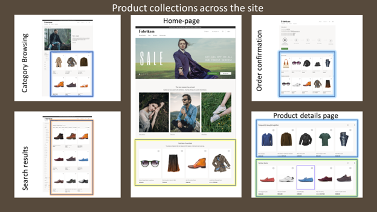

# Product collection modules

[!include [banner](includes/banner.md)]

This article provides an overview of product collection modules in Microsoft Dynamics 365 Commerce.

Product discovery is a primary tool that retailers use to engage with their customers on an e-Commerce website. Product collection modules help retailers build compelling shopping experiences by providing an intuitive visual interface that can be used to quickly author product collections.

Product collection modules represent physical products and services on the website. A product collection module is typically linked to a details page where customers can purchase a product or service, or learn more about it.

The sources for product collections can be lists of the following four types:

- Editorial lists of products that are manually defined in Dynamics 365 Commerce as related products for a product, or product lists
- Algorithmic lists, such as lists of new, best-selling, or trending products
- Recommendation lists that are based on machine learning
- Personalization lists that support personalized results for a customer. Customers must be signed in to the e-Commerce site to see personalized results. Guest users don't see personalized results. Customers can opt out of personalization from the [account management page](account-management.md).

The following illustration shows the different types of product collections being used on an e-Commerce site.

> [!NOTE]
> - Always use product collection modules to show a group of products of a similar type.
> - Before you use product collection modules, you must first enable cloud-powered search in Commerce headquarters. For instructions on how to configure cloud-powered search, see [Configure cloud-powered search capabilities](cloud-powered-search-overview.md#configure-cloud-powered-search-capabilities).

## Product collection modules and types

The following table describes various types of product collection modules in Dynamics 365 Commerce.

| Product collection module  | Type | Description |
|----------------------------|------|-------------|
| Category                   | Category | This module shows a list of products in a category, as defined by the navigation category hierarchy that the retailer created for a channel. |
| Related products           | Editorial | This module shows a list of products that a merchandising manager has configured as related products in Commerce, for the relation type that the author has selected. |
| Search results             | Search query | This type of product collection module shows a list of products that best match the search query that the customer entered. |
| Curated product lists      | Editorial | This module shows custom lists that merchandisers and editors have created in Commerce. |
| New                        | Algorithmic | This module shows a list of the newest products that have been assorted to channels and catalogs. This list can show personalized results for a signed-in user if the site author chooses that option. |
| Best selling               | Algorithmic | This module shows a list of products that are ranked by the highest number of sales. This list can show personalized results for a signed-in user if the site author chooses that option. |
| Trending                   | Algorithmic | This module shows a list of the highest-performing products for a given period. This list can show personalized results for a signed-in user if the site author chooses that option. |
| Frequently bought together | Artificial intelligence/Machine learning | This module uses machine learning to analyze consumer purchase patterns and recommend related items that are frequently bought together with a given product. This list can show personalized results for a signed-in user if the site author chooses that option. |
| People also like           | Artificial intelligence/Machine learning | This module uses machine learning to analyze consumer purchase patterns and recommend items that are related to a given product. This list can show personalized results for a signed-in user if the site author chooses that option. |
| Picks for you              | Artificial intelligence/Machine learning | This module uses machine learning to analyze the purchase patterns of the signed-in user and provide personalized recommendations that are based on those purchase patterns. For a guest user, this list will be collapsed. |

## Supported modules

The product collection module supports the [quick view module](quick-view-module.md), which lets users view product information and add items to the cart from a product collection page.

## Add a product collection module to a category page

To add a product collection module to a category page, follow these steps.

1. Go to **Pages**, and select **New** to create a new page.
1. In the **Create a new page** dialog box, under **Page name**, enter an appropriate page name, and then select **Next**.
1. Under **Choose a template**, select the same template as that used by your default category page, and then select **Next**.
1. Under **Choose a layout**, select a page layout (for example, **Flexible layout**), and then select **Next**.
1. Under **Review and finish**, review the page configuration. If you need to edit the page information, select **Back**. If the page information is correct, select **Create page**.
1. In the **Sub footer** slot, select the ellipsis (**...**), and then select **Add module**.
1. In the **Select modules** dialog box, select the **Container** module, and then select **OK**.
1. In the **Container** slot, select the ellipsis (**...**), and then select **Add module**.
1. In the **Select modules** dialog box, select the **Product collection** module, and then select **OK**.
1. In the properties pane for the product collection module, select **Add a product list**.
1. In the **Select product list configuration** dialog box, select the type of list, the list source, and enter the number of items. Configure any other options that are available for the list type. For more information about list types, see the table that follows.
1. Select **OK**.
1. Select **Save**, and then select **Preview** to preview the page.
1. Select **Finish editing** to check in the page, and then select **Publish** to publish it.

The following table shows the list types that are available for selection in the **Select product list configuration** dialog box.

| Type                       | Description | Usage | Page context | Specific context | Personalization |
|----------------------------|-------------|-------|--------------|------------------|-----------------|
| Products by category       | A list of products that belong to a given category. This category is determined from either the page context or the context that the author provides. | This type of list can be used on any page (for example, a home page, category page, marketing page, or product details page \[PDP\]) to promote a specific category of products. | Category from the page context, where available (for example, a category page) | The author can provide a specific category as context for the list. | Not applicable |
| Related products           | A list of products that a merchandising manager has configured as related products for the relation type in Commerce. | This type of list is used primarily on PDPs, but it can be used on any page if a parent product is provided. | Product from the page, relation type (mandatory) | The product can be selected in the picker, and the relation type is used. | Not applicable |
| Curated                    | A custom list that merchandisers and editors have created in Commerce. | Enrich category page, home page, checkout and cart pages, and product pages | Not applicable | Not applicable | Not applicable |
| Algorithmic                | <ul><li>**New** – A list of the newest products that have been assorted to channels and catalogs.</li><li>**Best-selling** – A list of products that are ranked by the highest number of sales.</li><li>**Trending** – A list of the highest-performing products for a given period.</li></ul> | Home page, enrich category page, and checkout and cart pages | Category from the page context (for example, a category page) | The category that is determined by the site author | Supported |
| Frequently bought together | A list that uses machine learning to analyze consumer purchase patterns and recommend related items that are frequently bought together with a given product. | This type of list is applicable only to the cart page. | Cart | Not applicable | Supported |
| People also like           | A list that uses machine learning to analyze consumer purchase patterns and recommend items that are related to a given product. | This type of list is used on PDPs to show products that other customers have bought. | Product context from the page | The product that is provided by the site author | Supported |
| Picks for you              | A list that uses machine learning to determine customer preferences. | This type of list can be used on any page. | Not applicable| Not applicable | Supported |

## Additional resources

[Module library overview](starter-kit-overview.md)

[Carousel module](add-carousel.md)

[Content rich block module](add-content-rich-block.md)

[Container module](add-container-module.md)

[Buy box module](add-buy-box.md)

[Product recommendations overview](product-recommendations.md)

[Quick view module](quick-view-module.md)

[!INCLUDE[footer-include](../includes/footer-banner.md)]
