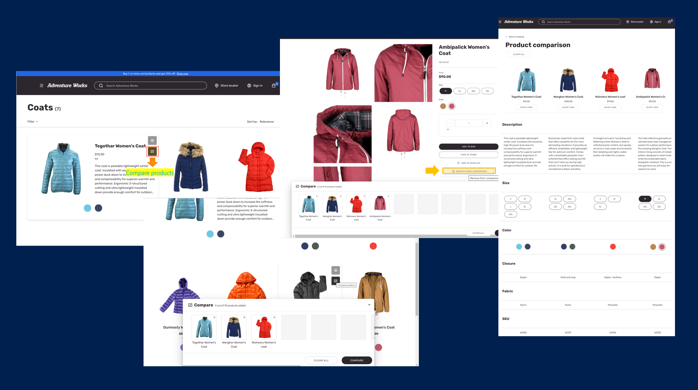

---

# required metadata

title: Product comparison on e-commerce websites
description: This article describes a feature that allows shoppers to do product comparisons on your Microsoft Dynamics 365 Commerce website.
author: ashishmsft
ms.date: 07/28/2022
ms.topic: article
audience: Application User, Developer, IT Pro
ms.reviewer: v-chgriffin, josaw
ms.search.region: Global
ms.author: asharchw
ms.search.validFrom: 2022-02-28
---

# Product comparison on e-commerce websites

[!include [banner](../includes/banner.md)]
[!include [banner](../includes/preview-banner.md)]

This article describes a feature that allows shoppers to do product comparisons on your Microsoft Dynamics 365 Commerce website.

> [!NOTE]
> This feature is available starting with the Dynamics 365 Commerce version 10.0.29 release to used for both B2C and B2B websites.

Enable shoppers to compare products across a wide range of categories in order to make the right purchase decision for themselves. 

On product list pages (PLPs) like category results, search results and product collections, through site builder similar to the "Quick view" button, you are now able to add a new button for "Product Comparison" which allows shoppers to add products to the comparison tray. Allowing shoppers to quickly add products for comparison by clicking on it from the product tile. This would bring up preview panel showing the total number of products that shopper may currently have in comparison and the preview of the product. Shoppers are also able to add products from the product details page (PDP) and they can add specific variant of the product if they were to be interested in comparing specific variants versus product masters.

Essentially, 'Comparison tray panel' allows you to add a few products to compare and upon clicking 'Compare' it will redirect you to the product comparison page for the comparison. Product comparison page shows you the product details comparing the images, price, product dimensions (size, style, color), aggregated ratings information as well as various product attributes.

> [!NOTE]
> - Product comparison page shows comparison among default set of properties as shared above as well as all attributes that are viewable on a PDP for a given product. 
> - Properties like Delivery modes, On-hand inventory, Unit of measure etc. are not viewable in product comparison. Also, a shopper is able to add products from different categories as long as they are from same catalog. Product comparison is currently limited to an individual catalog, shoppers cannot do cross-catalog comparison. 

## Product comparison module 

You shall be able to create a dedicated page for 'Product comparison' by simply adding a 'Product comparison module' to the body of the page under 'Main slot' of page structure. This module product allows you to compare the properties discussed above and you also have an option to allow your shoppers to have a 'Quick view' to be able to complete their purchase upon comparison and also, there is a content block for the empty state.

### Product comparison button on the product tiles in search and category results

The 'Product comparison button' lets users quickly add a product to the 'comparison tray' when they browse products on a list page, and they can add one or more products to the 'comparison tray' from the list page, without having to go to the product details page (PDP). 

The 'Product comparison button' is supported by the product collection, search results modules and product details page (PDP) buy-box.

The following illustration shows an example of placing a 'Product comparison button' on a product list page.

## How to limit the number of products in the comparison tray? 

The limit on the number of products in the comparison tray is configurable. By default, there's no limit provided but through **Site settings > Extensions** you can configure the limits for both mobile and desktop view. Allowing you to specify the maximum number of products that can be added to the comparison at the same time. If not defined, no limit will be enforced.

+ Products in the comparison limit - desktop devices
+ Products in the comparison limit - mobile and tablet devices

