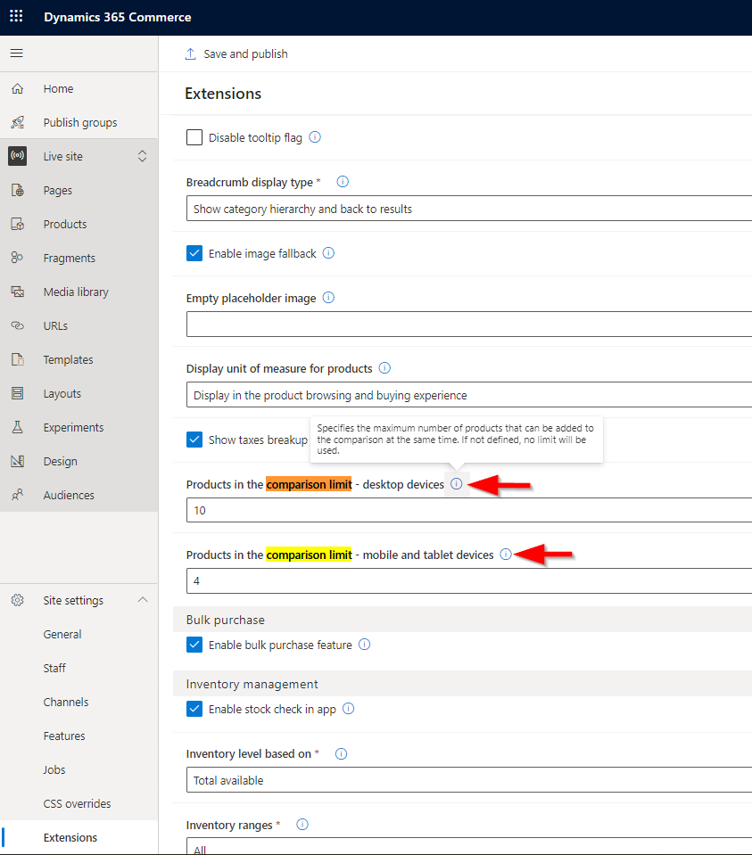

---

# required metadata

title: Product comparison on e-commerce websites
description: This article describes a feature that allows shoppers to do product comparisons on your Microsoft Dynamics 365 Commerce website.
author: ashishmsft
ms.date: 08/03/2022
ms.topic: article
audience: Application User, Developer, IT Pro
ms.reviewer: v-chgriffin, josaw
ms.search.region: Global
ms.author: asharchw
ms.search.validFrom: 2022-02-28
---

# Product comparison on e-commerce websites

[!include [banner](../includes/banner.md)]
[!include [banner](../includes/preview-banner.md)]

This article describes a feature that allows shoppers to do product comparisons on your Microsoft Dynamics 365 Commerce website.

> [!NOTE]
> The product comparison feature is available starting with the Dynamics 365 Commerce version 10.0.29 release and can be used for both business-to-consumer (B2C) and business-to-business (B2B) websites.

Product comparision functionality enables shoppers to compare products across a wide range of categories in order to make the right purchase decision. On product list pages (PLPs) such as category results, search results, and product collections pages, you are now able to add a new button for product comparison that allows shoppers to add products to the comparison tray. This is done in Commerce site builder similar to how the "Quick view" button is implemented. Allowing shoppers to quickly add products for comparison by selecting them from product tiles brings up preview panel showing the total number of products that shopper may currently have in comparison and the preview of the product. Shoppers are also able to add products from product details pages (PDP), and can add specific product variants to compare with product masters.

Using the comparison tray panel, customers can add a few products to compare, select **Compare**, and then be redirected to a product comparison page. The product comparison page shows customers product details for each selected product so they can compare the images, prices, product dimensions (size, style, color), aggregated ratings information, and various other product attributes.

> [!NOTE]
> - The product comparison page shows comparison among default set of properties as well as all attributes that are viewable on a PDP for a given product. 
> - Properties like delivery mode, on-hand inventory, and unit of measure are not viewable on a product comparison page. 
> - Customers are able to add products from different categories as long as they're from same catalog. 
> - Product comparison is currently limited to an individual catalog. In other words, shoppers aren't allowed to do cross-catalog comparisons. 

## Product comparison module 

You can create a dedicated product comparison page by adding a product comparison module to the body of a page under main slot of the page structure. In addition to allowing customers to compare product details of different products, you can configure the product comparison module to also give customers the option to quickly complete their purchase after comparison. The product comparison module also allows an **Empty comparison** slot for a content block module that describes the empty state, for example "Your product comparison is empty".

### Product comparison button on the product tiles in search and category results

The product comparison button lets users quickly add a product to the comparison tray when they browsing products on a list page. They can add one or more products to the comparison tray from the list page without having to go to a PDP. 

The product comparison button is supported by the product collection and search results modules, as well as the PDP buy box module.

The following example illustration from site builder shows how to place a product comparison button on a product list page.

## Limit the number of products in the comparison tray 

You can configure the limit of the number of products in the comparison tray. By default, there's no limit provided but through **Site settings \> Extensions** you can configure the limits for both mobile and desktop views, allowing you to separately specify the maximum number of products that can be added to the comparison at the same time. If not defined, no limit will be enforced.

- **Products in the comparison limit - desktop devices**
- **Products in the comparison limit - mobile and tablet devices**

