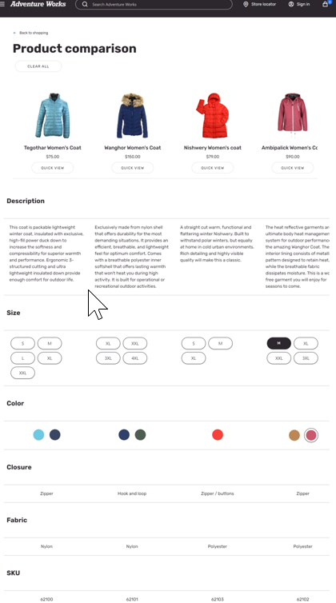

---

# required metadata

title: Product comparison modules
description: This article describes product comparison modules and how to implement them so that site users can do product comparisons on Microsoft Dynamics 365 Commerce websites.
author: ashishmsft
ms.date: 08/05/2022
ms.topic: article
audience: Application User, Developer, IT Pro
ms.reviewer: v-chgriffin
ms.search.region: Global
ms.author: asharchw
ms.search.validFrom: 2022-02-28
---

# Product comparison modules

[!include [banner](../includes/banner.md)]
[!include [banner](../includes/preview-banner.md)]

This article describes product comparison modules and how to implement it so that site users can do product comparisons on Microsoft Dynamics 365 Commerce websites.

> [!NOTE]
> The product comparison and product comaprison button modules are available starting with the Dynamics 365 Commerce version 10.0.29 release and can be used for both business-to-consumer (B2C) and business-to-business (B2B) websites.

Product comparison functionality enables shoppers to compare products across a wide range of categories to help them make the right purchase decision. On product list pages (PLPs) such as category results, search results, and product collections pages, you can add a button for product comparison that allows shoppers to add products to a comparison tray. This is done in Commerce site builder using the product comparison module, which functions similar to the [Quick view module](quick-view-module.md). When site users add products for comparison by selecting them from product tiles, a comparison tray appears at the bottom of the page that shows the total number of products the shopper is currently comparing along with short previews of the products. Site users are also able to add products from product details pages (PDPs), and can add specific product variants to compare with product masters.

When using the comparison tray, customers can add a few products to compare and then select **Compare** to be redirected to a product comparison page. The product comparison page shows customers product details for each selected product so they can compare images, prices, product dimensions (size, style, color), aggregated ratings information, and various other product attributes.

> [!NOTE]
> - The product comparison page compares a default set of product properties as well as all attributes that are viewable on a PDP for a given product. 
> - Properties like delivery mode, on-hand inventory, and unit of measure are not viewable on a product comparison page. 
> - Customers are able to add products from different categories as long as they're from same catalog. 
> - Product comparison is currently limited to an individual catalog. In other words, shoppers aren't allowed to do cross-catalog comparisons. 

## Add the product comparison module to a new product comparison page 

You can create a dedicated product comparison page by adding a product comparison module to the body of a page under the **Main slot** of the page structure. In addition to allowing customers to compare product details of different products, you can configure the product comparison module to also give customers the option to quickly complete their purchase after comparing products. The product comparison module also contains an **Empty comparison** slot to add a content block module that describes the empty state, for example "Your product comparison is empty".

To add the product comparison module to a new product comparison page, follow these steps.

1. Go to **Pages**, and select **New** to create a new page.
1. In the **Create a new page** dialog box, under **Page name**, enter an appropriate page name (for example, **Product comparison**), and then select **Next**.
1. Under **Choose a template**, select the appropriate template (for example, the template used by your default category page), and then select **Next**.
1. Under **Choose a layout**, select a page layout (for example, **Flexible layout**), and then select **Next**.
1. Under **Review and finish**, review the page configuration. If you need to edit the page information, select **Back**. If the page information is correct, select **Create page**.
1. In the **Main slot**, select the ellipsis (**...**), and then select **Add module**.
1. In the **Select modules** dialog box, select the **Container** module, and then select **OK**.
1. In the **Container** slot, select the ellipsis (**...**), and then select **Add module**.
1. In the **Select modules** dialog box, select the **Product comparison** module, and then select **OK**.
1. In the **Quick view button** slot, select the ellipsis (**...**), and then select **Add module**.
1. In the **Select modules** dialog box, select the **Product quick view** module, and then select **OK**.
1. In the properties pane on the right, configure the **Product quick view** module properties. 
1. In the **Empty comparison** slot, select the ellipsis (**...**), and then select **Add module**.
1. In the **Select modules** dialog box, select the **Content block** module, and then select **OK**.
1. In the properties pane on the right, configure the **Content block** module properties. 
1. Select **Save**, and then select **Preview** to preview the page.
1. Select **Finish editing** to check in the page, and then select **Publish** to publish it.

## Add a product comparison button to product tiles on search and category results pages

The product comparison button lets users quickly add a product to the comparison tray when they browsing products on a list page. They can add one or more products to the comparison tray from a list page without having to go to a PDP. 

The product comparison button is supported by the product collection, search results, and PDP buy box modules.

To add a product comparison button on product tiles in search and category results pages, follow these steps.

1. In site builder, go to **Pages** and open the category page you want to add product comparison button to.
1. In the **Main slot**, select the ellipsis (**...**), and then select **Add module**.
1. In the **Select modules** dialog box, select the **Search results** module, and then select **OK**.
1. In the **Product comparison button** slot of the **Search results** module, select the ellipsis (**...**), and then select **Add module**.
1. In the **Select modules** dialog box, select the **Product comparison button** module, and then select **OK**.
1. In the properties pane on the right, configure the **Product comparison button** module properties.  
1. Select **Save**, and then select **Preview** to preview the page.
1. Select **Finish editing** to check in the page, and then select **Publish** to publish it.

The following example illustration from Commerce site builder shows how to place a product comparison button on a product list page.

## Specify the maximum number of products to be displayed in the comparison tray 

You can specify the maximum number of products to be displayed in the comparison tray in site builder at **Site settings \> Extensions**. You can configure separate maximum limits for desktop and mobile/tablet views. If no maximum limit is defined, no limit will be enforced by default.

To specify the maximum number of products in the comparison tray, follow these steps.

1. In site builder, go to **Site settings \> Extensions**.
1. Scroll down to find the following settings:
    - **Products in the comparison limit - desktop devices**
    - **Products in the comparison limit - mobile and tablet devices**
1. For each of these settings, enter the maximum number of products that should be displayed for those viewports in the comparison tray. 
 

