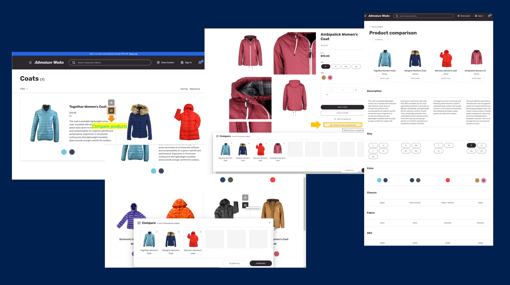
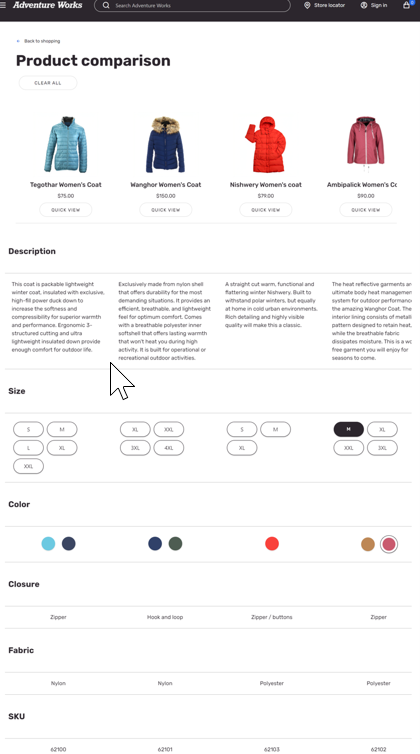
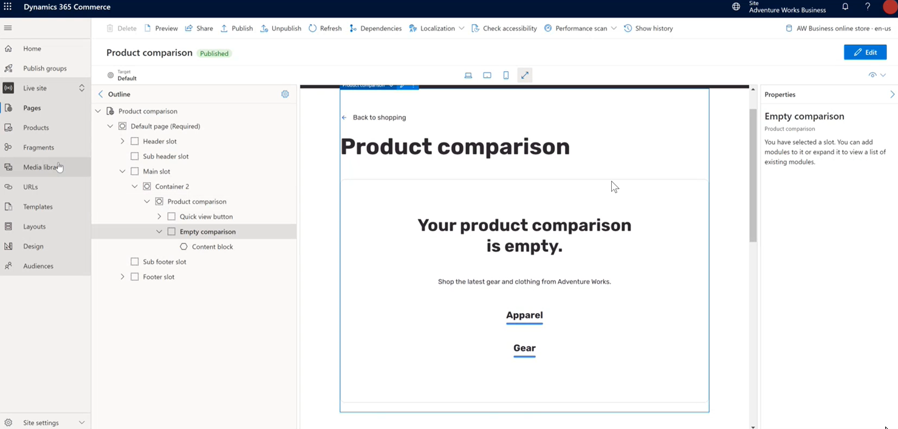
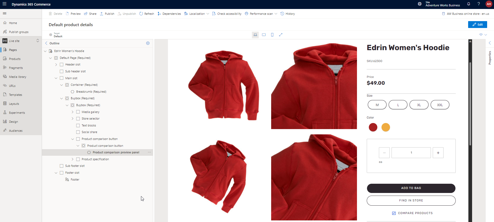
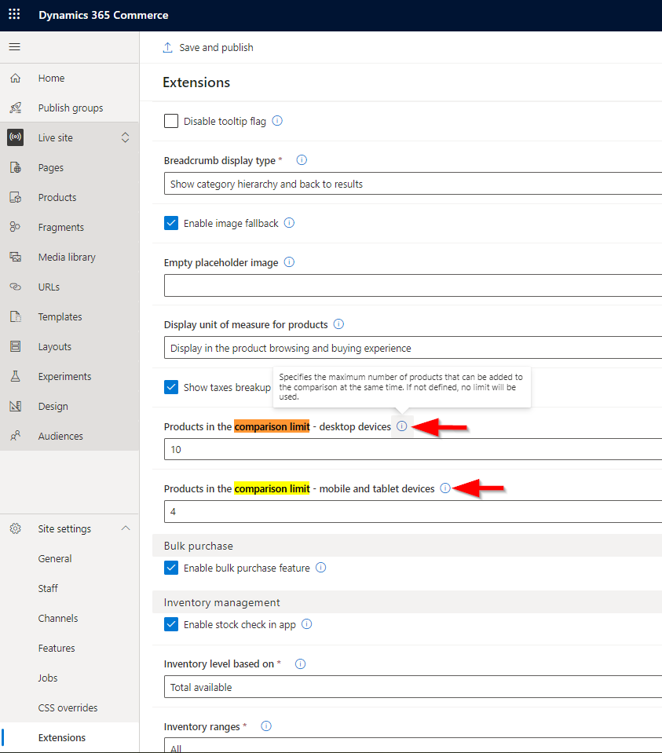

# Product comparison modules

[!include [banner](../includes/banner.md)]

This article describes product comparison modules and how to implement them so that customers can do product comparisons on Microsoft Dynamics 365 Commerce e-commerce websites.

> [!NOTE]
> The product comparison and product comparison button modules are available as of the Dynamics 365 Commerce version 10.0.29 release. They can be used for both business-to-consumer (B2C) and business-to-business (B2B) websites.

Product comparison functionality lets shoppers compare product details on a product comparison page to help them make better purchase decisions. This functionality is configured in Commerce site builder by using the product comparison module. On product list pages (PLPs), such as category results, search results, and product collections pages, you can configure a button for product comparison that lets shoppers add products to a comparison tray. This functionality is configured in site builder by using the product comparison button module, which works like the [quick view module](quick-view-module.md).

When site users add products for comparison by selecting them on product tiles, a comparison tray appears at the bottom of the page. The comparison tray shows the products that the shopper is currently comparing, together with short previews of the products. Site users can also add products from product details pages (PDPs), and they can add specific product variants to compare with product masters.

After customers add a few products to the comparison tray, they can select **Compare** to be redirected to a product comparison page. The product comparison page shows product details for each selected product so that customers can compare images, prices, product dimensions (size, style, and color), aggregated ratings information, and other product attributes.

The following illustration shows examples of the compare product button, the remove from comparison button, the comparison tray, and the product comparison page.

> [!NOTE]
> - The product comparison page compares a default set of product properties and all attributes that can be viewed on a PDP for a given product.
> - Properties such as the delivery mode, on-hand inventory, and unit of measure can't be viewed on a product comparison page.
> - Customers can add products from different categories to the comparison tray, provided that the products are from the same catalog.
> - Product comparison functionality is currently limited to comparing products in an individual catalog. Site users can't do cross-catalog comparisons.
> - You should ensure that the **Render module client side** property is cleared for all product comparison modules.
> - You should ensure that page-level caching is disabled for all pages where the product comparison module is used. These pages include PDPs, PLPs, and product comparison pages. For more information, see [Configure page caching](e-commerce-extensibility/page-caching.md).

The following illustration shows an example of a product comparison page.

## Add the product comparison module to a new product comparison page

You can create a dedicated product comparison page by adding a product comparison module to the body of a page. In addition to enabling customers to compare product details of different products, you can configure the product comparison module to give customers the option to quickly complete their purchase after they compare products. The product comparison module also contains an **Empty comparison** slot, where you can add a content block module that describes the empty state (for example "Your product comparison is empty").

To add a product comparison module to a new product comparison page, follow these steps.

1. Go to **Pages**, and select **New** to create a new page.
1. In the **Create a new page** dialog box, under **Page name**, enter an appropriate page name (for example, **Product comparison**), and then select **Next**.
1. Under **Choose a template**, select the appropriate template (for example, the template that is used by your default category page), and then select **Next**.
1. Under **Choose a layout**, select a page layout (for example, **Flexible layout**), and then select **Next**.
1. Under **Review and finish**, review the page configuration. If you must edit the page information, select **Back**. If the page information is correct, select **Create page**.
1. In the **Main slot**, select the ellipsis (**...**), and then select **Add module**.
1. In the **Select modules** dialog box, select the **Container** module, and then select **OK**.
1. In the **Container** slot, select the ellipsis (**...**), and then select **Add module**.
1. In the **Select modules** dialog box, select the **Product comparison** module, and then select **OK**.
1. In the **Quick view button** slot, select the ellipsis (**...**), and then select **Add module**.
1. In the **Select modules** dialog box, select the **Product quick view** module, and then select **OK**.
1. In the properties pane on the right, configure the **Product quick view** module properties.
1. In the **Empty comparison** slot, select the ellipsis (**...**), and then select **Add module**.
1. In the **Select modules** dialog box, select the **Content block** module, and then select **OK**.
1. In the properties pane on the right, configure the **Content block** module properties. 
1. Select **Save**, and then select **Preview** to preview the page.
1. Select **Finish editing** to check in the page, and then select **Publish** to publish it.

The following illustration shows an example of an empty comparison page in site builder.

## Add a product comparison button to product tiles on search and category results pages

The product comparison button lets users quickly add a product to the comparison tray when they browse products on a list page. They can add one or more products to the comparison tray from a list page without having to go to a PDP.

The product comparison button is supported by the product collection, search results, and PDP buy box modules.

To add a product comparison button to product tiles on search and category results pages, follow these steps.

1. In site builder, go to **Pages**, and open the category page that you want to add a product comparison button to.
1. In the **Main slot**, select the ellipsis (**...**), and then select **Add module**.
1. In the **Select modules** dialog box, select the **Search results** module, and then select **OK**.
1. In the **Product comparison button** slot of the **Search results** module, select the ellipsis (**...**), and then select **Add module**.
1. In the **Select modules** dialog box, select the **Product comparison button** module, and then select **OK**.
1. In the properties pane on the right, configure the **Product comparison button** module properties.
1. Select **Save**, and then select **Preview** to preview the page.
1. Select **Finish editing** to check in the page, and then select **Publish** to publish it.

## Add a product comparison preview panel module to pages on your website

A product comparison preview panel module provides your customers with the option to review products that they add to or remove from the comparison. The preview panel also provides the options to navigate to the comparison page directly or clear the entire list of products. 

We recommend that you enable the preview panel on all pages that have the **Product comparison button** enabled. The module can be added to the **Product comparison button** as a slot, or it can be used as a standalone module that you can configure on any page, even when there is no functionality to add or remove products to compare. 

You must manually add the product comparison preview panel module to a page. You should only add one preview panel module on a page. If you add multiple instances of the module to a page, the first module will be rendered and the rest will be ignored.

If you specify a product comparison limit, you have an option to enable grey placeholders on the preview panel that indicate how many more products can be added to the comparison. The grey placeholders are replaced with products as they are added to the comparison. To configure a product comparison limit and enable grey placeholders, in site builder, go to **Site settings > Extensions**, and make your changes in the **Product comparisons** section. The configuration will be applied to all preview panels for all pages. 

## Specify the maximum number of products to show in the comparison tray

You can specify the maximum number of products to show in the comparison tray by going to **Site settings \> Extensions** in site builder. You can configure separate maximum limits for desktop and mobile/tablet views. By default, no limit will be enforced if no maximum limit is defined.

> [!NOTE]
> For an optimal browsing experience, we recommend that you set the maximum number of products in the comparison tray to **2** for the mobile viewport and **4** for the desktop viewport to reduce the amount of horizontal scrolling that is required.

To specify the maximum number of products in the comparison tray, follow these steps.

1. In site builder, go to **Site settings \> Extensions**.
1. For the **Products in the comparison limit - desktop devices** property, enter the maximum number of products that should be shown in the comparison tray for desktop viewports.
1. For the **Products in the comparison limit - mobile and tablet devices** property, enter the maximum number of products that should be shown in the comparison tray for mobile and tablet viewports.
1. On the command bar, select **Save and publish**.

