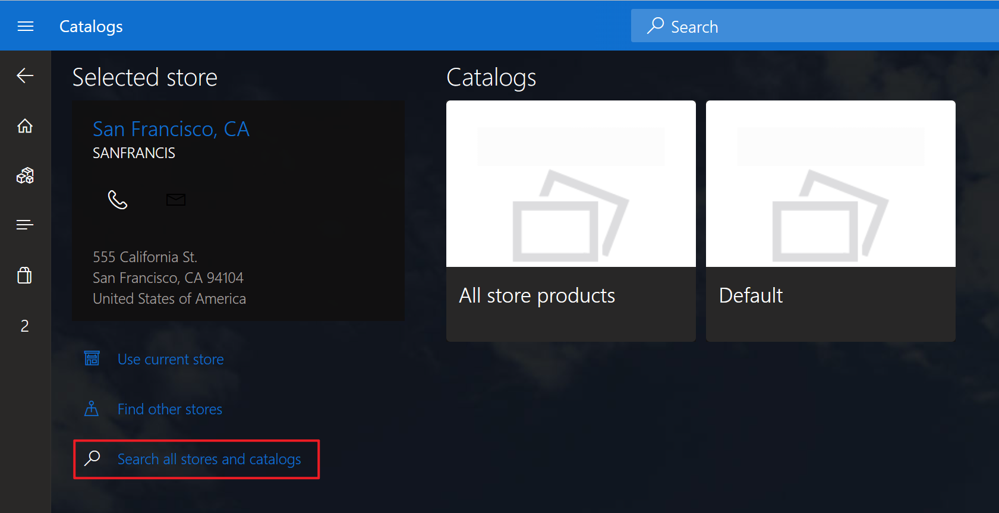

# Product discovery checklist

[!include [banner](includes/banner.md)]

This article describes the checklist to make products discoverable on a channel in different scenarios.

## Basic configurations

* Make sure the product is released to the legal entity of the channel's warehouse. See [Release an engineering product to a local company](https://learn.microsoft.com/en-us/dynamics365/supply-chain/engineering-change-management/engineering-scenarios#release) for more details.
* Make sure the product is assorted to the channel. See [Set up assortments](set-up-assortments.md) for more details. You can validate the product is assorted the channel using the **Validate a channel's assortment** section.
* Make sure distribution schedule 1040 (Products) and 1150 (Catalog) jobs are run. In case any key table is deleted from the jobs, you can run **Retail and Commerce** \> **Headquarters setup** \> **Commerce scheduler** \> **Initialize commerce scheduler** to add them back.

## Additional configurations to check if you are using cloud-powered search

When [Cloud-powered search overview](cloud-powered-search-overview) is used, the products will be published to search indexes.

* Since the price information is required to be accurate in the search indexes, to ensure products can be published successfully, we need to ensure the prices can be calculated as well.
  * Make sure the sales unit of measure is configured for the product.
  * Make sure the currency exchange rate works for the channel currency and the accounting currency. If they are using different currencies, follow below steps.
    1. The channel currency is configured on the channel setting (**Retail and Commerce** > **Channels** > **Stores** > **All stores** for a brick-and-mortar store, or **Retail and Commerce** > **Channels** > **Online stores** for an online store).
    1. The accounting currency is configured on **General ledger** > **Ledger Setup** > **Ledger**.
    1. The currency exchange rate can be configured on **General ledger** > **Currencies** > **Currency exchange rates**.
    1. Assign the exchange rate as the **Exchange rate type** on **Retail and Commerce** > **Headquarters setup** > **Parameters** > **Commerce shared parameters**.
  * If the channel is associated with a new site or new warehouse, make sure the distribution schedule jobs are run, 1040 (Products) for site data, 1120 (Mode of delivery) or 1070 (Channel configuration) for warehouse data.
* If the channel is an online store, it's mandatory to enable cloud-powered search.
* If the channel is an online store, make sure the e-Commerce site language is included in the channel's languages.

## Product discovery under the channel's navigation hierarchy

* Make sure a navigation hierarchy is associated with the channel. See [Configure a channel to use a channel navigation hierarchy](configure-channel-hierarchy.md) for more details.
* Make sure the product is added to a category of the channel's navigation hierarchy.

## Unblock your business on Store Commerce app when there is a product discovery issue

In case you encounter a product discovery issue on Store Commerce app, there is a quick workaround to sell the product without engaging Microsoft's support.
1. When you see a message like "We didn't find anything to display here." on the search screen, it means the product cannot be discovered in the channel. Click the "Search other stores" link below the message.
1. Click the "Search all stores and catalogs" link. The selected store will changed to "All stores and catalogs" afterwards.
  
1. Click the "All store products" tile. A real-time service call will be performed to search the product.
  
1. If the product is still not found, probably the product is not released to the legal entity properly. Please double check the product's setup.

[!INCLUDE[footer-include](../includes/footer-banner.md)]
