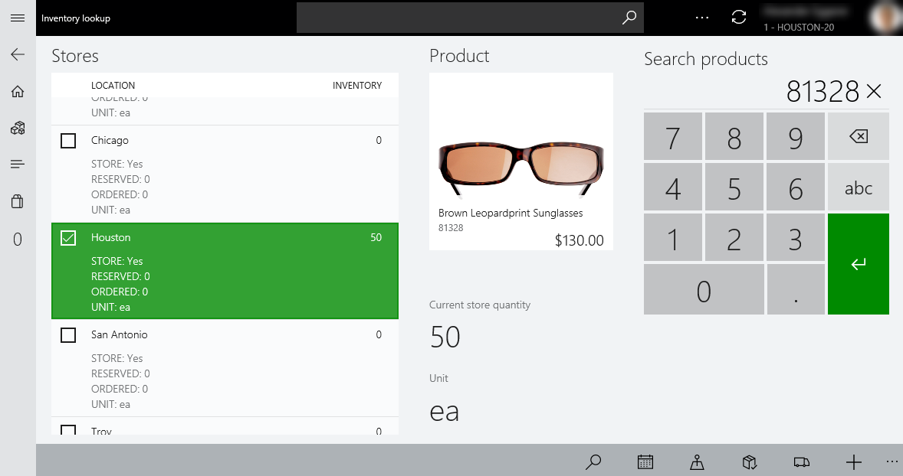
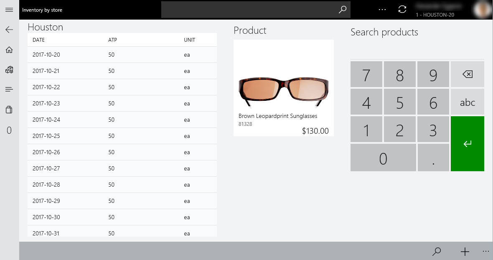

---

# required metadata

title: Inventory lookup in the point of sale (POS)
description: This topic describes the options that are available for viewing inventory information in the point of sale (POS). 
author: ashishmsft
manager: AnnBe
ms.date: 03/12/2018
ms.topic: article
ms.prod: 
ms.service: dynamics-365-retail
ms.technology: 

# optional metadata

ms.search.form: 
# ROBOTS: 
audience: Application User
# ms.devlang: 
ms.reviewer: josaw
ms.search.scope: Core, Operations, Retail
# ms.tgt_pltfrm: 
ms.custom: 
ms.assetid: 
ms.search.region: global
ms.search.industry: Retail
ms.author: asharchw
ms.search.validFrom: 2018-03-30
ms.dyn365.ops.version: Application update 5, AX 8.0

---

# Inventory lookup in the point of sale (POS)

[!include [banner](includes/banner.md)]

Inventory lookup in the point of sale (POS) helps retailers achieve real-time operational excellence and gain insights by connecting stores, the POS, and the back office. This functionality provides an accurate real-time view of product inventory across stores and distribution centers. It also helps retailers drive additional efficiencies and cost savings by improving inventory planning in real time.

An accurate real-time view of inventory across an organization helps store associates provide timely, superior customer service. The moment that matters most is the moment when the customer is ready to make a purchase decision. It's important that cashiers in the store have real-time inventory information at their fingertips, so that they can accurately promise product delivery and pickup.

You can open the **Inventory lookup** page from the **Retail Modern POS** workspace or the **Retail Cloud POS** workspace.

On the **Inventory lookup** page, you can use the numeric keyboard to enter a product number. You can then view the on-hand quantity for multiple stores and warehouses.

**Reserved** and **Ordered** quantities are also shown for each location.

- **Reserved** – This quantity refers to the **Physical reserved** value from the back office for the specified product number at the location.
- **Ordered** – This quantity refers to the **Ordered in total** value from the back office for the specified product number at the location.

## Locations that inventory availability information is shown for

The list of locations includes two types of entities:

- **Stores** – The list shows stores that are configured by using the store locator group for the current store in the Headquarters.
- **Distribution centers** – Various types of distribution centers (such as warehouses) can be configured in Commerce. However, the list shows inventory availability information only for distribution centers of the **Standard** default type.

    > [!NOTE]
    > Inventory availability information isn't shown for warehouses of the **Transit**, **Quarantine**, and **Goods in Route** types for the POS.

On the **Inventory lookup** page, you can view available to promise (ATP) quantities for each store, in addition to the current on-hand quantities, reserved quantities, and ordered quantities. Select the store to view the ATP information for, and then select **Show store availability**.

## Opening the Dimension based matrix view to show all variants

On the **Product details** page of a product master, or on the **Inventory lookup** page, select **View all variants** from the app-bar at bottom of the page. The **Dimension based matrix** view for the initial launch from these pages shows the inventory availability information for all variants of a product for the current store.

> [!NOTE]
> The **View all variants** button is available only for item product masters that have product variants. It isn't available for standalone products or kits.

Select **View all variants** on the **Product details** page of a product master, or on the **Inventory lookup** page, without selecting a location, to go to the **Dimension based matrix** view to view the inventory availability information for all variants of a product for the current store.

> [!NOTE]
> In the preceding illustration, the display order of the dimensions is alphabetic, because the display order of dimensions wasn't configured for the selected product.

In the **Dimension based matrix** view, the cells for the product variants include an on-hand value in the lower-right corner. The following table explains the meaning of the various values.

| On-hand value                            | Description |
|------------------------------------------|-------------|
| Numeric value that is more than 0 (zero) | A variant has been released to the selected location, and you can perform additional actions in the cell. (These actions are described in more detail later in this topic.) |
| **0** (zero)                             | A variant has been released to the selected location, but the item isn't available in selected location. However, you can perform additional actions in the cell. (These actions are described in more detail later in this topic.) |
| **n/a** or an inactive cell              | A variant hasn't been released to the selected location, and you can't perform additional actions in the cell. |

You can also change the pivot for dimensions by selecting the new dimension to use.

> [!NOTE]
> In the preceding illustrations, the display order of the dimensions for the selected product is custom (non-alphabetic). It's based on the dimension display order that is set in the back office.

Additionally, in the **Dimension based matrix** view, more actions can be performed to help boost a store associate's productivity. Here are some examples:

- Change the store location to look up the inventory availability of all product variants at other locations. These locations include other stores in the store locator group and distribution centers of the **Standard** default type.
- Sell an individual product variant to a customer by using cash and carry, in-store pickup, or shipment to an address.
- Provide the customer with ATP information for an individual product variant at a specific location.

> [!NOTE]
> In the preceding illustration, the display order of the dimensions is alphabetic, because the display order of dimensions wasn't configured for the selected product.

The following table provides more information about the additional actions that are available.

| Action               | Description |
|----------------------|-------------|
| Sell now             | Add the selected item variant to the transaction, and redirect the user to the transaction screen. (This action isn't available when the selected location is a distribution center.) |
| Pick up in store     | Create a customer order for the product variant that will be picked up from the selected location, and redirect the user to the transaction screen. (This action isn't available when the selected location is a distribution center.) |
| Ship product         | Create a customer order for the product variant that will be shipped from the selected location, and redirect the user to the transaction screen. |
| Availability         | Show the ATP information for the selected variant combination for the selected location. |
| Show all locations   | Switch to the standard inventory lookup view, and highlight inventory availability information for the item variant across all stores in the store locator group, and also in distribution centers of the **Standard/Default** type. |
| View product details | Redirect the user to the **Product details** page of the associated product master. |
