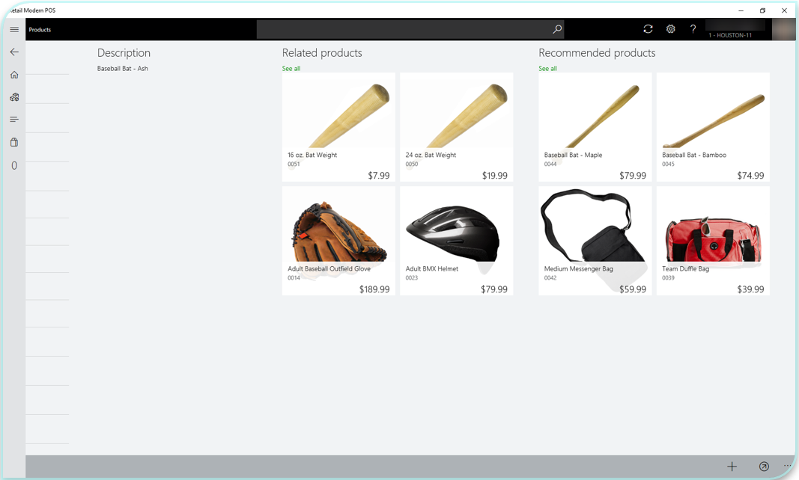

---
# required metadata

title: Add product recommendations on POS
description: This article describes using product recommendations on a point of sale (POS) device.
author: bebeale
ms.date: 02/03/2022
ms.topic: article
ms.prod: 
ms.technology: 

# optional metadata

ms.search.form: RetailParameters
# ROBOTS: 
audience: Application User
# ms.devlang: 
ms.reviewer: josaw
# ms.tgt_pltfrm: 
ms.custom: 259664
ms.assetid: 5dd8db08-cd96-4f7e-9e65-b05ca815d580
ms.search.region: global
ms.search.industry: Retail
ms.author: asharchw
ms.search.validFrom: 2016-11-30
ms.dyn365.ops.version: Version 1611

---

# Add product recommendations on POS

[!include [banner](includes/banner.md)]

At its core, product recommendations are a transformative business application that span across all commerce spaces to create rich, engaging, and tailored product discovery experiences. To implement this feature on POS, follow the steps on [how to add recommendations to your POS devices.](add-recommendations-control-pos-screen.md) 

For more information about product recommendations features, read the [product recommendations overview.](../commerce/product-recommendations.md) 

## Scenarios

Product recommendations are enabled for the following POS scenarios. They are available in the Store Commerce app or Store Commerce for web.

1. On the **Product details** page:

    - If a store associate visits a **Product details** page when they are looking at previous transactions across different channels, the recommendations service suggests additional items that are likely to be purchased together. Depending on the add-ons for the service, retailers can show **Shop similar looks** and **Shop similar description** recommendations for products, in addition to personalized recommendations for users who have a previous purchase history.

    

2. On the **Transaction** page:

    - The recommendation engine suggests items based on the entire list of items in the basket that are frequently bought together.

    > [!NOTE]
    > To display recommendations on the **Transaction** page, the retailer needs to update the screen layout in Dynamics 365 Commerce. The **Recommendations** control must be dropped onto the **Transaction** page.

    

## Configure Commerce to enable POS recommendations 

To set up product recommendations, confirm that you've completed the provisioning process for Commerce product recommendations by following the steps in [Enable product recommendations](../commerce/enable-product-recommendations.md). By default, recommendations appear on both the **Product details** page and the **Customer details** page after you complete the provisioning steps and the data has successfully cooked. 

## Add recommendations to the transaction screen

1. To add recommendations to the transaction screen, follow the steps in [Add recommendations to the transaction screen](add-recommendations-control-pos-screen.md).
1. To reflect changes that were made in the POS screen layout designer, run channel configuration job **1070** in Commerce headquarters.

> [!NOTE] 
> If you want to enable POS recommendations by using the RecoMock comma-separated values (CSV) file, you must deploy the CSV file to the Microsoft Dynamics Lifecycle Services (LCS) asset library before you configure the layout manager. If you use the RecoMock CSV file, you don't have to enable recommendations. The CSV file is available only for demo purposes. It's recommended for customers or solution architects who want to mimic the appearance of recommendation lists for demo purposes without having to purchase an add-on stock keeping unit (SKU).

## Additional resources

[Product recommendations overview](product-recommendations.md)

[Enable Azure Data Lake Storage in a Dynamics 365 Commerce environment](enable-adls-environment.md)

[Enable product recommendations](enable-product-recommendations.md)

[Enable personalized recommendations](personalized-recommendations.md)

[Opt out of personalized recommendations](personalization-gdpr.md)

[Enable "shop similar looks" recommendations](shop-similar-looks.md)

[Add recommendations to the transaction screen](add-recommendations-control-pos-screen.md)

[Adjust AI-ML recommendations results](modify-product-recommendation-results.md)

[Manually create curated recommendations](create-editorial-recommendation-lists.md)

[Create recommendations with demo data](product-recommendations-demo-data.md)

[Product recommendations FAQ](faq-recommendations.md)

[!INCLUDE[footer-include](../includes/footer-banner.md)]
