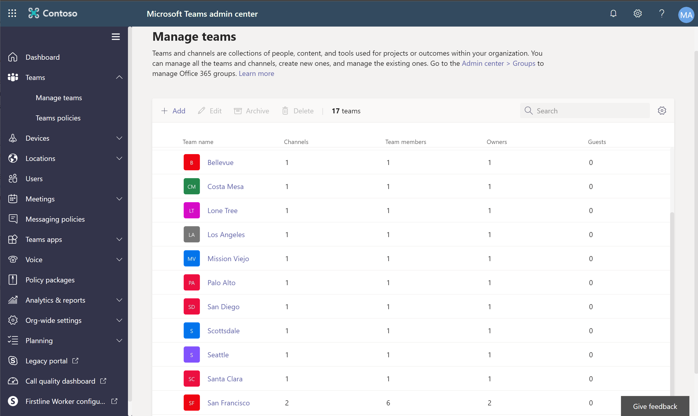
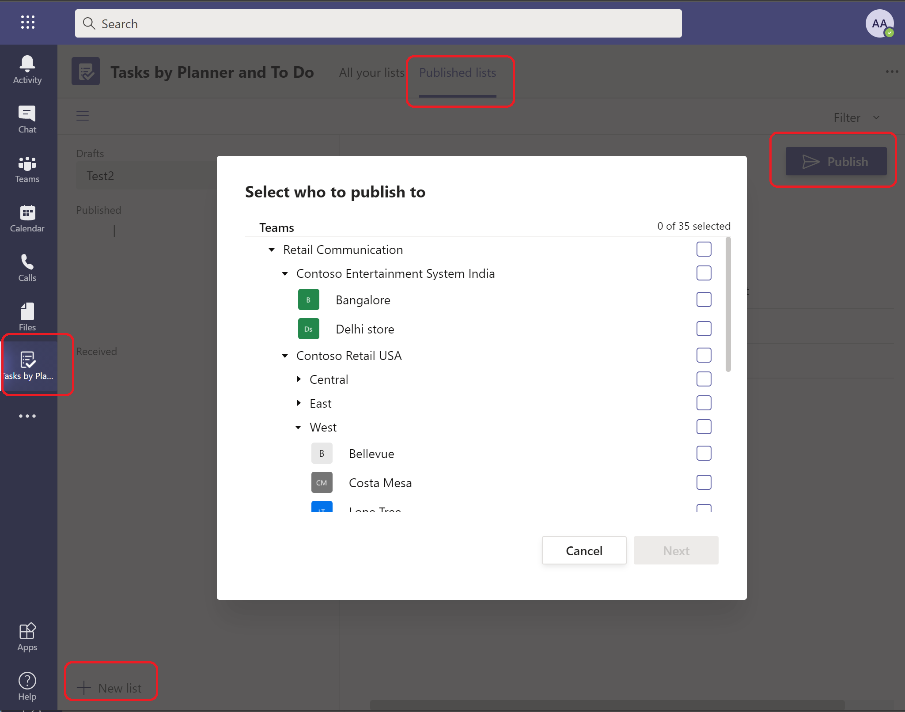

---
# required metadata
title: Provision Microsoft Teams from Dynamics 365 Commerce
description: This topic describes how to provision Microsoft Teams by using organizational data from Dynamics 365 Commerce.
author: gvrmohanreddy
ms.date: 03/31/2021
ms.topic: article
ms.prod: 
ms.technology: 
# optional metadata
# ms.search.form: 
#ROBOTS: 
audience: Application User
# ms.devlang: 
ms.reviewer: v-chgri
ms.search.scope: Retail, Core, Operations
# ms.tgt_pltfrm: 
# ms.custom: 
ms.search.region: Global
# ms.search.industry: 
ms.author: gmohanv
ms.search.validFrom: 2021-01-15
ms.dyn365.ops.version: 10.0.18
---

# Provision Microsoft Teams from Dynamics 365 Commerce

[!include [banner](includes/banner.md)]

This topic describes how to provision Microsoft Teams by using organizational data from Dynamics 365 Commerce.

Dynamics 365 Commerce offers an easy way to provision Teams if you haven't yet set up teams for your retail stores there. By taking advantage of well-defined information from Commerce that you want to use in Teams, you can help your store employees get started in Teams. This information includes the organizational hierarchy, store names, employee information, and Azure Active Directory (Azure AD) accounts. 

The process of provisioning Teams has two main steps:

1. In Teams, create a team for each retail store, and add store workers as members of the appropriate team. If an employee is associated with more than one retail store, team membership will reflect that fact. A communications team that includes regional managers as members will be created to help publish tasks from Teams.
1. Upload your organizational hierarchy from Commerce to Teams.

## Provision Teams in Commerce headquarters

Before you provision Microsoft Teams, complete these tasks:

- Confirm that all regional managers have been made communications managers.
- Confirm that the Azure account of every store manager and worker has been associated with that manager's or worker's worker record in Commerce headquarters.

To provision Teams in Commerce headquarters, follow these steps.

1. Go to **Retail and Commerce \> Channel setup \> Microsoft Teams Integration Configuration**.
1. On the Action Pane, select **Provision teams**. A batch job that is named **Teams provision** is created.
1. Go to **System administration \> Inquiries \> Batch jobs**, and find the most recent job that has the description **Teams provision**. Wait until this job has finished running.

> [!TIP]
> If none of your regional managers, store managers, and store workers have been associated with a Teams license, you might receive the following error message: "Failed to retrieve appliable Sku categories for the user." To correct the issue, select **Sync teams and members** on the Action Pane.

<!-- -->

## Validate Teams provisioning in the Teams admin center

To validate Microsoft Teams provisioning in the Microsoft Teams admin center, follow these steps.
	
1. Go to the [Teams admin center](https://admin.teams.microsoft.com/), and sign in as the administrator of your e-commerce tenant.
1. In the left navigation pane, select **Teams** to expand it, and then select **Manage teams**.
1. Confirm that one team has been created for each Commerce retail store.
1. Select a team, and confirm that store workers have been added to it as members.
1. In the left navigation pane, select **Users**, and confirm that all store employees in all stores have been added as users.

The following illustration shows an example of the **Manage teams** page in the Teams admin center.

## Upload a Commerce organizational hierarchy to Teams
	
The Commerce organizational hierarchy can be used in Microsoft Teams to publish tasks to all or selected stores that use the same hierarchy structure.

To upload a Commerce organizational hierarchy to Teams, follow these steps.
	
1. In Commerce headquarters, go to **Retail and Commerce \> Channel setup \> Microsoft Teams Integration Configuration**.
1. Select **Download targeting hierarchy**, and then select **Retail Stores by Region** to download a comma-separated values (CSV) file of the organizational hierarchy.
1. Install the Microsoft Teams PowerShell module by following the steps in [Install Microsoft Teams PowerShell](/microsoftteams/teams-powershell-install).
1. When you're prompted in the Teams PowerShell window, sign in by using the administrator account for your Azure AD tenant.
1. Follow the steps in [Set up your team targeting hierarchy](/microsoftteams/set-up-your-team-hierarchy) to upload the CSV file for the targeting hierarchy.

## Verify that the organizational hierarchy was uploaded to Teams

To verify that the organizational hierarchy was uploaded to Microsoft Teams, follow these steps.

1. Sign in to Teams as a communications manager.
1. In the left navigation pane, select **Tasks by Planner**.
1. On the **Published lists** tab, create a new list that has a dummy task.
1. Select **Publish**. The organizational hierarchy should appear in the **Select who to publish to** dialog box, as shown in the example in the following illustration.

## Additional resources

[Dynamics 365 Commerce and Microsoft Teams integration overview](commerce-teams-integration.md)

[Enable Dynamics 365 Commerce and Microsoft Teams integration](enable-teams-integration.md)

[Synchronize task management between Microsoft Teams and Dynamics 365 Commerce POS](synchronize-tasks-teams-pos.md)

[Manage user roles in Microsoft Teams](manage-user-roles-teams.md)

[Map stores and teams if there are pre-existing teams in Microsoft Teams](map-stores-existing-teams.md)

[Dynamics 365 Commerce and Microsoft Teams integration FAQ](teams-integration-faq.md)