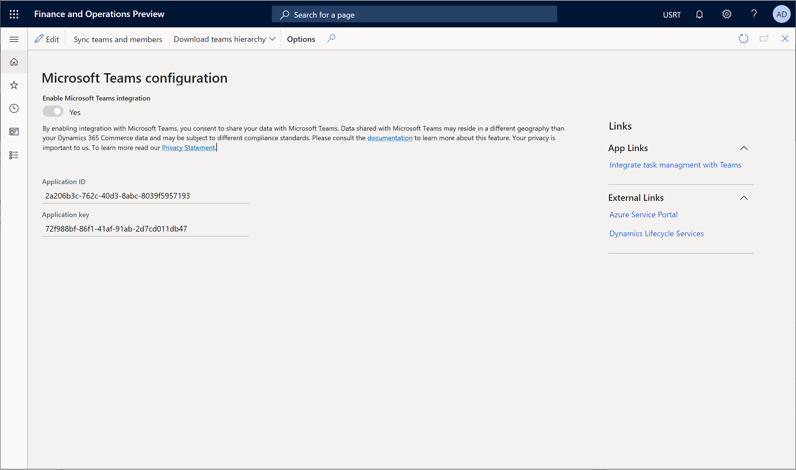

---
# required metadata
title: Provision Microsoft Teams from Dynamics 365 Commerce
description: This topic describes how to provision Microsoft Teams using organizational data from Dynamics 365 Commerce.
author: gvrmohanreddy
manager: annbe
ms.date: 03/01/2021
ms.topic: article
ms.prod: 
ms.service: dynamics-365-commerce
ms.technology: 
# optional metadata
# ms.search.form:  
#ROBOTS: 
audience: Application User
# ms.devlang: 
ms.reviewer: v-chgri
ms.search.scope: Retail, Core, Operations
# ms.tgt_pltfrm: 
# ms.custom: 
ms.search.region: Global
# ms.search.industry: 
ms.author: gmohanv
ms.search.validFrom: 2021-01-15
ms.dyn365.ops.version: 10.0.18
---

# Provision Microsoft Teams from Dynamics 365 Commerce

[!include [banner](includes/banner.md)]
[!include [banner](includes/preview-banner.md)]

This topic describes how to provision Microsoft Teams using organizational data from Dynamics 365 Commerce.

If you have not yet set up teams in Microsoft Teams for your retail stores, Dynamics 365 Commerce offers a way to provision Microsoft Teams easily. You can leverage well-defined information from Commerce such as organizational hierarchy, store names, employee information, and Azure Active Directory (Azure AD) accounts to use in Microsoft Teams to get your store employees started in Microsoft Teams.

Provisioning Microsoft Teams is a two-step process:

1. Create a team per each retail store and add store workers to their corresponding teams as members in Teams. If an employee is associated with two or more retail stores, team membership will reflect that. A communication team will be created to include regional managers as members to help publishing tasks from Microsoft Teams.  
1. Upload your organizational hierarchy from Commerce to Teams.  

## Provision Microsoft Teams

Before provisioning Teams, do the following:

- Ensure that all regional managers have been made communication managers.
- Ensure that all store managers and workers have their Azure AD accounts associated with their worker records in Commerce headquarters.

To provision Microsoft Teams, follow these steps.

1. Go to **Retail and Commerce \> Channel setup \> Microsoft Teams Integration Configuration**.
1. Select **Provision teams** on the Action Pane.
1. Notice that a batch job called *Teams provision* will be created. 
1. Go to **System administration \> Inquiries \> Batch jobs**.
1. Find the most recent job with the description "Teams provision." Wait until when this job is ended.

> [!TIP]
> If you see the error "Failed to retrieve appliable Sku categories for the user," this indicates that none of your regional managers, store managers, and store workers have been associated with a Microsoft Teams license. To correct this error, select **Sync teams and members** on the Action Pane.  

## Verify teams provisioning in the Teams administrator portal

To verify teams provisioning in the eams administrator portal, follow these steps.
	
1. Go to https://admin.teams.microsoft.com/.
2. Sign in as administrator of your e-commerce tenant. 
3. In the left navigation pane, select **Teams** to expand it, and then select **Manage teams*.
4. Confirm that one team per Commerce retail store has been created. 
5. Select a specific team and confirm that store workers have been added as members to the team. 
6. In the left navigation pane, select **Users**, and then confirm that all store employees across the stores have been added as users.

## Upload the organizational hierarchy to Microsoft Teams 
	
The organization hierarchy from Dynamics 365 Commerce can be leveraged in Microsoft Teams for publishing tasks to all or selected stores using the same hierarchy structure. 
	
1. Go to **Retail and Commerce \> Channel setup \> Microsoft Teams Integration Configuration**.
1. Click *Download targeting hierarchy* and select *Retail Stores by Region* to download the CSV file of targeting hierarchy. 
1. Install the Teams PowerShell module per the steps outlined in [Install Microsoft Teams PowerShell](https://docs.microsoft.com/microsoftteams/teams-powershell-install).  
1. Use the Teams Powershell module to upload the targeting hierarchy using CSV file downloaded with hierarchy by following this guideline: [Set up your team targeting hierarchy](https://docs.microsoft.com/microsoftteams/set-up-your-team-hierarchy). 
1. Sign in using the Azure AD admininstrator account for your tenant. 

## Validate that the organizational hierarchy was uploaded to Teams

To validate that the organizational hierarchy was uploaded to Teams, follow these steps.

1. Sign in to **Teams** as a communication manager. 
1. In the left navigation pane, select **Tasks by Planner**.
1. Select the **Published lists** tab.
1. Create a new list with a dummy task.
1. Select **Publish**. 

You will see the organizational hierarchy on the **Select who to publish to** dialog box, as shown in the following example image. 

## Additional resources

[Dynamics 365 Commerce and Microsoft Teams integration ](commerce-teams-integration.md)

[Synchronize task management between Microsoft Teams and POS](synchronize-tasks-teams-pos.md)

[Configure Microsoft Teams integration](configure-teams-integration.md)

[Manage user roles in Microsoft Teams](manage-user-roles-teams.md)

