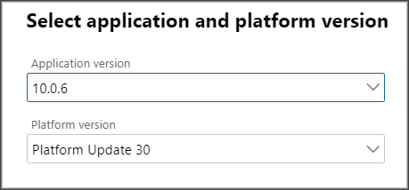
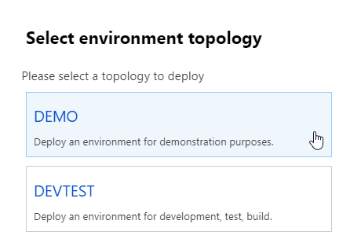
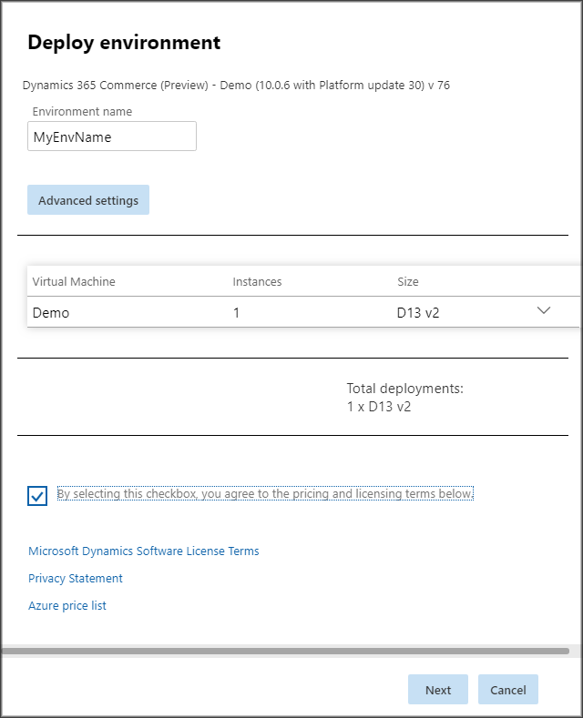

---
# required metadata

title: Provision a Dynamics 365 Commerce evaluation environment
description: This topic explains how to provision a Microsoft Dynamics 365 Commerce evaluation environment.
author: psimolin
ms.date: 12/17/2020
ms.topic: article
ms.prod: 
ms.technology: 

# optional metadata

# ms.search.form: 
# ROBOTS: 
audience: Application User
# ms.devlang: 
ms.reviewer: v-chgri
# ms.tgt_pltfrm: 
ms.custom: 
ms.assetid: 
ms.search.region: Global
ms.search.industry: 
ms.author: psimolin
ms.search.validFrom: 2019-10-31
ms.dyn365.ops.version: 
---

# Provision a Dynamics 365 Commerce evaluation environment

[!include [banner](includes/banner.md)]

This topic explains how to provision a Microsoft Dynamics 365 Commerce evaluation environment.

Before you begin, we recommend that you take a quick scan through this topic to get an idea of what the process requires.

> [!NOTE]
> Commerce evaluation environments aren't generally available, and are granted to partners and customers on a per-request basis. For more information, reach out to your Microsoft partner contact.

To successfully provision a Commerce evaluation environment, you must create a project that has a specific product name and type. The environment and Commerce Scale Unit (CSU) also have some specific parameters that you must use when you expect to provision e-Commerce later. The instructions in this topic describe all the steps that are required to complete provisioning and the parameters that you must use.

After you successfully provision your Commerce evaluation environment, you must complete a few post-provisioning steps to prepare it for use. Some steps are optional, depending on the aspects of the system that you want to evaluate. You can always complete the optional steps later.

For information about how to configure your Commerce evaluation environment after you provision it, see [Configure a Commerce evaluation environment](cpe-post-provisioning.md). For information about how to configure optional features for your Commerce evaluation environment, see [Configure optional features for a Commerce evaluation environment](cpe-optional-features.md).

## Prerequisites

The following prerequisites must be in place before you can provision your Commerce evaluation environment:

- You have been onboarded into the evaluation program and granted capacity for an evaluation environment.
- You have access to the Microsoft Dynamics Lifecycle Services (LCS) portal.
- You are an existing Microsoft Dynamics 365 partner or customer and are able to create a Dynamics 365 Commerce project.
- You have administrator access to your Microsoft Azure subscription, or you're in contact with a subscription administrator who can assist you if required.
- You have your Azure Active Directory (Azure AD) tenant ID available.
- You've created an Azure AD security group that can be used as an e-Commerce system admin group, and you have its ID available.
- You've created an Azure AD security group that can be used as a Ratings and Reviews moderator group, and you have its ID available. (This security group can be the same as the e-Commerce system admin group.)

Note that this list isn't exhaustive. If you experience any issues, reach out to your Microsoft partner contact for assistance.

## Provision your Commerce evaluation environment

These procedures explain how to provision a Commerce evaluation environment. After you successfully complete them, the Commerce evaluation environment will be ready for configuration. All the activities that are described here occur in the LCS portal.

### Create a new project

To create a new project in LCS, follow these steps.

1. On the LCS home page, select the plus sign (**+**) to create a project.
1. In the right pane, follow one of these steps:

    - If you're a partner, select **Migrate, create solutions, and learn**.
    - If you're a customer, select **Prospective presales**.

1. Enter a name, description, and industry.
1. In the **Product name** field, select **Dynamics 365 Commerce**.
1. In the **Product version** field, select **Dynamics 365 Commerce**.
1. In the **Methodology** field, select **Dynamics Retail implementation methodology**.
1. Optional: You can import roles and users from an existing project.
1. Select **Create**. The project view appears.

### Add the Azure Connector

To add the Azure Connector to your LCS project, follow the steps in [Complete the Azure Resource Manager (ARM) onboarding process](../fin-ops-core/dev-itpro/deployment/arm-onboarding.md).

### Deploy the environment

To deploy the environment, follow these steps.

> [!NOTE]
> You might not have to complete steps 6, 7, and/or 8, because pages that have a single option are skipped. When you're in the **Environment parameters** view, confirm that the text **Dynamics 365 Commerce - Demo (10.0.*x* with Platform update *xx*)** appears directly above the **Environment name** field. For details, see the illustration that appears after step 8.

1. On the top menu, select **Cloud-hosted environments**.
1. Select **Add** to add an environment.
1. In the **Application version** field, select the most current version. If you have a specific need to select an application version other than the most current version, do not select a version prior to **10.0.14**.
1. In the **Platform version** field, use the platform version that is automatically chosen for the application version you selected. 

    

1. Select **Next**.
1. Select **Demo** as the environment topology.

    

1. On the **Deploy environment** page, enter an environment name. Leave the advanced settings as they are.

    

1. Adjust the VM size as required. (We recommend VM stock keeping unit \[SKU\] **D13 v2**.)
1. Review the pricing and licensing terms, and then select the check box to indicate that you agree to them.
1. Select **Next**.
1. On the deployment confirmation page, verify that the details are correct, and then select **Deploy**. You're returned to the **Cloud-hosted environments** view, and your environment should appear in the list.

    Your requested environment will appear as queued and then deploying. The environment workflows will take some time to be completed. Therefore, check back after approximately six to nine hours.

1. Before you continue, make sure that the status of your environment is **Deployed**.

### Initialize the Commerce Scale Unit (cloud)

To initialize the CSU, follow these steps.

1. In the **Cloud-hosted environments** view, select your environment in the list.
1. In the environment view on the right, select **Full details**. The environment details view appears.
1. Under **Environment features**, select **Manage**.
1. On the **Commerce** tab, select **Initialize**. The CSU initialization parameters view appears.
1. In the **Region** field, select the region that is the same or close to the region that you deployed the environment to.
1. Leave the **Version** field as it is.
1. Select **Initialize**.
1. On the deployment confirmation page, verify that the details are correct, and then select **Yes**. The **Commerce management** view displays again, where the **Commerce** tab is selected. Your CSU has been queued for provisioning.
1. Before you continue, make sure that the status of your CSU is **Success**. Initialization takes approximately two to five hours.

If you can't find the **Manage** link in the environment details view, reach out to your Microsoft contact for assistance.

During the deployment process, you might receive the following error message:

> Evaluation (demo/test) environments need to register the scale unit connector application \<application ID\> in headquarters.

If the CSU initialization fails and you receive this error message, make a note of the application ID, which is a globally unique identifier (GUID), and then follow the steps in the next section to register the CSU deployment application in Commerce headquarters.

### Register the CSU deployment application in Commerce headquarters (if required)

To register the CSU deployment application in Commerce headquarters, follow these steps.

1. In Commerce headquarters, go to **System administration \> Setup \> Azure Active Directory applications**.
1. In the **Client Id** column, enter the application ID from the CSU initialization error message that you received.
1. In the **Name** column, enter any descriptive text (for example, **CSU Eval**).
1. In the **User ID** column, enter **RetailServiceAccount**.
1. Retry the CSU initialization and deployment from LCS.

### Initialize e-Commerce

To initialize e-Commerce, follow these steps.

1. On the **e-Commerce** tab, review the evaluation consent, and then select **Setup**.
1. In the **e-Commerce environment name** field, enter a name. Be aware that this name will appear in some of the URLs that point to your e-Commerce instance.
1. In the **Commerce Scale Unit name** field, select your CSU in the list. (The list should have only one option.)

    The **e-Commerce geography** field is set automatically.

1. Select **Next** to continue.
1. In the **Supported host names** field, enter any valid domain, such as `www.fabrikam.com`.
1. In the **AAD security group for system admin** field, enter the first few letters of the name of the security group that you want to use, and then select the magnifying glass symbol to view the search results. Select the correct security group in the list.
1.	In the **AAD security group for ratings and review moderator** field, enter the first few letters of the name of the security group that you want to use, and then select the magnifying glass symbol to view the search results. Select the correct security group in the list.
1. Leave the **Enable ratings and review service** option set to **Yes**.
1. Select **Initialize**. The **Commerce management** view displays again, where the **e-Commerce** tab is selected. E-Commerce initialization has started.
1. Before you continue, wait until the status of e-Commerce initialization is **Initialization successful**.
1. Under **Links** in the lower right, make a note of the URLs for the following links:

    * **e-Commerce site** – The link to the root of your e-Commerce site.
    * **Commerce site builder** – The link to the site management tool.

## Next steps

To continue the process of provisioning and configuring your Commerce evaluation environment, see [Configure a Commerce evaluation environment](cpe-post-provisioning.md).

## Additional resources

[Dynamics 365 Commerce evaluation environment overview](cpe-overview.md)

[Configure a Dynamics 365 Commerce evaluation environment](cpe-post-provisioning.md)

[Configure BOPIS in a Dynamics 365 Commerce evaluation environment](cpe-bopis.md)

[Configure optional features for a Dynamics 365 Commerce evaluation environment](cpe-optional-features.md)

[Dynamics 365 Commerce evaluation environment FAQ](cpe-faq.md)

[Microsoft Lifecycle Services (LCS)](/dynamics365/unified-operations/dev-itpro/lifecycle-services/lcs-user-guide)

[Commerce Scale Unit (cloud)](/business-applications-release-notes/october18/dynamics365-retail/retail-cloud-scale-unit)

[Microsoft Azure portal](https://azure.microsoft.com/features/azure-portal)

[Dynamics 365 Commerce website](https://aka.ms/Dynamics365CommerceWebsite)

[!INCLUDE[footer-include](../includes/footer-banner.md)]