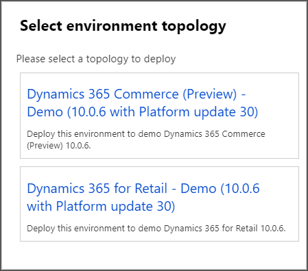
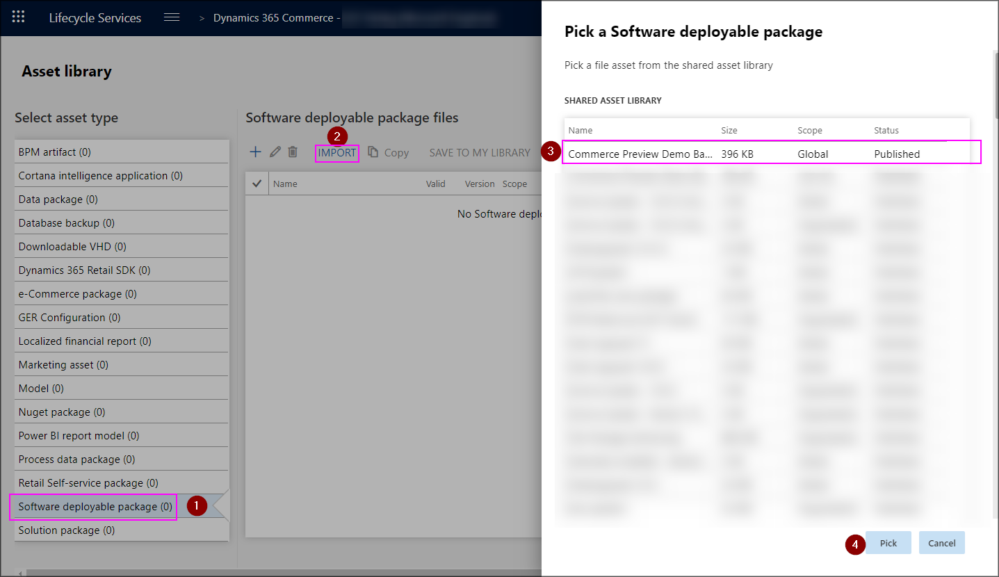

# Commerce Preview environment provisioning guide
This guide provides you step-by-step instructions for provisioning and configuring your Microsoft Dynamics 365 Commerce Preview environment. Before you begin, it is recommended that you at least skim through the documentation to get an idea of what the process entails and what the guide contains.
## Summary
To provision the environment successfully, the project needs to be created with a specific product name and type. The environment and Retail Cloud Scale Unit also have some specific parameters you need to use when provisioning them to be able to start the e-Commerce provisioning later. These instructions contain all the required steps you need to take and parameters you need to use.

After successful provisioning, there are a few post-provisioning steps you need to take to prepare your Preview environment for use. Some steps are optional, depending on which aspects of the system you wish to evaluate. Should you later change your mind, you can always run the optional steps later.

If you have any questions about the provisioning steps or you encounter any issues, please let us know on Microsoft Dynamics 365 Commerce Preview Yammer group at https://aka.ms/Dynamics365CommercePreviewYammer

## Prerequisites
The following are prerequisites for provisioning your Dynamics 365 Preview environment:
* You have access to **LCS** (Lifecycle Services portal)
* You have been **accepted into the Dynamics 365 Commerce Preview program**
* You have the required permissions to create either **Prospective presales**- or **Migrate, create solutions, and learn**-project
* You are a member of the **Environment manager** or **Project Owner** role in the project where you will be provisioning the environment
* You have admin access to your Azure subscription, or contact with a subscription admin who can perform the two steps that require admin permissions on your behalf
* You have your **AAD Tenant Id** available
* You have created a **AAD security group** to be used as **e-Commerce system admins group** and you have its ID available
* You have created a **AAD security group** to be used as **Ratings and Reviews moderator group** and you have its ID available (can be the same SG as the system admin group above)
## Provisioning preview environment
These instructions cover the provisioning of a Microsoft Dynamics 365 Commerce Preview environment. After successfully completing these steps, you will have a Preview environment that is ready to be configured. All the activities described here take place in the LCS portal.
### Before starting
##### Grant access to e-Commerce applications
1. For this step you will need to know your **AAD Tenant Id**. You need to authorize e-Commerce applications to access your Azure subscription. The easiest way to accomplish this is to assemble a URL like this:

https://login.windows.net/{AAD_TENANT_ID}/oauth2/authorize?client_id=fbcbf727-cd18-4422-a723-f8274075331a&response_type=code&redirect_uri=https://sb.manage.commerce.dynamics.com/_commerce/Consent&response_mode=query&prompt=admin_consent&state=12345

2. **Do not click the URL directly**, instead copy and paste it into your browser or text editor and replace **\{AAD_TENANT_ID\}** with your **AAD Tenant Id**, before navigating to the URL
3. You will be presented with the Microsoft AAD login dialog where you will confirm that you wish to grant **"e-Commerce UX"** access to your subscription
4. You will be sent to a page which confirms whether the operation was successful

*Note: **The person logging in needs to be AAD tenant administrator**. Without successfully completing this step, the rest of the provisioning steps will fail.*
##### Log in to the LCS
1. Log in to the LCS portal at https://lcs.dynamics.com
1. Make sure that you are logged in with the LCS account you used to request access to the Preview
### Create project
##### Creating new project
1. Click "**+**" to create a new project
1. If you are a partner, choose "**Migrate, create solutions, and learn**"
1. If you are a customer, choose "**Prospective presales**"
1. Enter name, description and industry as you see fit
1. For "**Product name**", select "**Microsoft Dynamics 365 for Retail**"
1. For "**Product version**", select "**Microsoft Dynamics 365 for Retail**"
1. For "Methodology", select "**Dynamics AX implementation methodology**"
1. You may import roles and users from existing project if that is desired
1. Proceed with "**Create**"
1. You are sent to the project view

##### Add Azure Connector
1. If you are a partner, click "**Project settings**" from the tools tiles to the far right
1. If you are a customer, choose "**Project settings**" from the menu
1. Select "**Azure connectors**"
1. Click "**+ Add**" to add Azure Connector
1. Enter name as you see fit
1. Enter your **Azure Subscription ID**
1. Enable "**Configure to use Azure Resource Manager (ARM)**"
1. Verify that "**Azure subscription AAD Tenant Domain (or ID)**" is correct. Consult your Azure subscription admin if required
1. Proceed with "Next"
1. Follow the instructions on the screen to grant required application(s) access to your subscription. Consult your Azure subscription admin if required:
	1. Log in to the Azure portal - https://portal.azure.com/
	1. Make sure that you have the correct directory selected
	1. Click "**Subscriptions**" from the menu on the left
	1. Locate the correct subscription from the list and select it. Use search if required
	1. Choose "**Access control (IAM)**" from the menu
	1. Click "**Add**" under "**Add a role assignment**" on the right side, "**Add role assignment**" pane opens
	1. For "**Role**", select "**Contributor**"
	1. For "**Assign access to**", leave as "**Azure AD user, group, or service principal**"
	1. Under "**Select**", enter "**b96b7e94-b82e-4e71-99a0-cf7fb188acea**"
	1. Select "**Dynamics Deployment Services [wsfed-enabled]**" from the list
	1. Click "**Save**"
1. Proceed with "**Next**"
1. Follow the instructions on the screen to grant required application(s) access to your subscription. Consult your Azure subscription admin if required
1. Proceed with "**Next**"
1. For "**Azure region**", choose either "**East US**", "**East US 2**", "**West US**" or "**West US 2**"
1. Proceed with "**Connect**"
1. Your Azure Connector should appear in the list
### Import Extension
1. Navigate back to your project front page by clicking the project name on the top
1. If you are a partner, click "**Asset library**" from the tools tiles to the far right
1. If you are a customer, choose "**Asset library**" from the menu
1. Select "**Software deployable package**" from the list on the left
1. Click "**IMPORT**" from the action pane
1. Select "**Dynamics 365 Commerce Preview Demo Extension**" from the list of assets under "**SHARED ASSET LIBRARY**"
1. Click "**Pick**"
1. You will be returned to the Asset library and you should see the extension in the list

### Deploy environment
1. From the menu, select "**Cloud-hosted environments**"
1. Click "**+ Add**" to add ahttps://lcs.dynamics.com/v2n environment
1. For "**Application version**", select "**10.0.6**"
1. For  "**Platform version**" select "**Platform Update 30**"
1. Proceed with "**Next**"
1. For environment topology, choose "**DEMO**"
1. For environment topology, choose "**Dynamics 365 Commerce (Preview) - Demo**"
1. If you configured a single Azure Connector earlier, that will be used for this environment. In case you configured multiple Azure Connectors, you have the option to select which connector you would like to use. "**East US**", "**East US 2**", "**West US**" or "**West US 2**" is recommended for best end-to-end performance
1. Enter "**Environment name**" as appropriate
1. Adjust VM size as you see fit
1. Leave "**Advanced settings**" as they are
1. After studying the pricing and licensing terms on the screen, tick the checkbox to indicate agreement
1. Proceed with "**Next**"
1. In the deployment confirmation screen, after verifying that the details are correct click "**Deploy**"
1. You are sent back to "**Cloud-hosted environments**"-view and your environment should appear in the list
1. Your requested environment will show as queued and then deploying.  It will take some time for the all environment creation workflows to complete, so please check back after a few hours (**6 – 9 hours**)
1. Make sure that your environment status is "**Deployed**" before proceeding
### Initialize RCSU
1. While in the "**Cloud-hosted environments**"-view, select your environment from the list
1. From the environment view on the right side of the screen, click "**Full details**" - you are sent to environment details-view
1. Under "**ENVIRONMENT FEATURES**", click "**Manage**"
1. From "**Retail**"-tab, press "**Initialize**" - you will be sent to the RCSU initialization parameters view
1. For region, select "**East US**", "**East US 2**", "**West US**" or "**West US 2**"
1. For version, specify "**XXXXX**"
1. Enable "**Apply extension**"
1. From the list of extensions, choose "**Dynamics 365 Commerce Preview Demo Extension**"
1. Proceed with "**Initialize**"
1. In the deployment confirmation screen, after verifying that the details are correct click "**Yes**"
1. You are sent back to the "**Retail management**"-view with "**Retail**"-tab activated. Your RCSU has been queued for provisioning
1. Wait until your RCSU status is "**SUCCESS**" before proceeding (**will take 2 - 5 hours**)
### Initialize e-Commerce
1. Switch to the "**e-Commerce (Preview)**"-tab
1. After reviewing the Preview consent proceed with clicking "**Setup**"
1. Enter "**e-Commerce tenant name**" as you see fit - However, note that this will be visible in some of the URLs pointing to your e-Commerce instance
1. For "**Retail cloud scale unit name**", select your RCSU from the list (list should only have one option)
1. "**e-Commerce geography**" is automatically populated and cannot be changed
1. Proceed to the next page with "**Next**"
1. For "**Supported host names**", enter any valid domain (e.g. www.fabrikam.com)
1. For "**AAD security group for system admin**" enter the AAD SG ID that you wish to use as e-Commerce system admin group
1. For "**AAD security group for ratings and review moderator**" enter the AAD SG ID that you wish to use as Ratings and Reviews moderator group
1. Leave the B2C values empty (7 fields that start with B2C)
1. Proceed with "**Initialize**"
1. You are sent back to the "**Retail management**" view with "**e-Commerce (Preview)**" tab activated. Your e-Commerce initialization has started
1. Wait until your e-Commerce initialization status is "**INITIALIZATION SUCCESSFUL**" before proceeding
1. Under "**LINKS**" on the bottom right
	* Make note of the link "**e-Commerce site**", this is the link to the root of your C2 site
	* Make note of the link "**e-Commerce site management tool**", this is the link to the site management tool (C1 authoring tool)
## Post-provisioning steps
At this stage, the environment has been provisioned end-to-end, but there are still few configuration steps that need to be taken care of before you can start evaluating the environment.
### Before starting
Log in to the environment (HQ)
1. From the menu, select "**Cloud-hosted environments**"
1. Select your environment from the list
1. Click "**Full details**" from the environment info on the right
1. Click "**Login**" to open a menu, choose "**Log on to environment**"

Make sure that **USRT** legal entity is selected (top right corner)

### Configure POS
##### Associate worker with your identity
1. Using the menu on the left, go to **Human resources > Workers > Workers**
1. In the list, find and select record "**000713 - "Andrew Collette"**"
1. On the Action Pane, click **Retail**
1. Click Associate existing identity
1. In the Email field (right of "**Search using email**"), type your email address
1. Click Search
1. Select the record with your name
1. Click OK
1. Click Save
##### Activate Cloud POS
1. Log in to the LCS portal
1. Navigate to your project
1. From the menu, select "**Cloud-hosted environments**"
1. Select your environment from the list
1. Click "**Full details**" from the environment info on the right
1. Click "**Login**" to open a menu, choose "**Log on to Cloud Point of Sale**", POS should load up
1. Click "**Next**"
1. Log in with your AAD account
1. Under "**Store name**", choose "**San Francisco**"
1. Click "**Next**"
1. Under "**Register and device**", choose "**SANFRAN-1**"
1. Click "**Activate**"
1. You should be logged out and end up in the POS login screen
1. You can now log in to the Cloud POS experience using Operator ID "**000713**" and password "**123**"
### Site setup
1. Log in to the **site management tool** using the URL you noted earlier
1. Click on the "**Fabrikam**"-site, site setup dialog will open
1. For domain, select the domain you entered earlier when initializing the e-Commerce
1. For default channel, select "**Fabrikam extended online store**"
1. For default language, select "**en-us**"
1. Leave "**Path**" as it is
1. Click OK
1. You will be sent to the list of pages on the site
### Set up and run jobs
##### Scheduling a recurring product availability job
1. Log in to the environment (HQ)
1. Using the menu on the left, go to **Retail > Retail IT > Products and inventory > Product availability**
1. Expand the **Run in the background** section
1. Select **Yes** in the **Batch processing** field
1. Click **Recurrence**
1. Select the **No end date** option
1. In the Count field, enter "**15**"
1. Click OK
1. Click OK
##### Scheduling a recurring P-job
1. Using the menu on the left, go to **All workspaces > Retail IT**
1. Click **Distribution schedule**
1. Select **P-0001**
1. Click **Create batch job**
1. Click **Run in the background**
1. Enable **Batch processing**
1. Click **Recurrence**
1. Select the **No end date** option
1. In the Count field, enter "**10**"
1. Click OK
1. Click OK
##### Scheduling recurring order synchronization
1. Using the menu on the left, go to **All workspaces > Retail store financials**
1. Under "**Posting**" on the right side-menu, Click **Synchronize orders**
1. In the **Organization hierarchy** field, select '**Retail Stores by Region**'
1. Make sure that the root node is selected
1. Click the arrow to add your selection
1. Click the **Run in the background** tab
1. Enable **Batch processing**
1. Click **Recurrence**
1. Select the **No end date** option
1. In the Count field, enter "**10**"
1. Click OK
1. Click OK
##### Scheduling a recurring send notifications job
1. Using the menu on the left, go to **Retail > Retail IT > Email and notifications > Send email notification**
1. Expand the **Run in the background** section
1. Select **Yes** in the **Batch processing** field
1. Click **Recurrence**
1. Set the **Recurrence pattern** to **Minutes**
1. Select the **No end date** option
1. In the Count field, enter "**2**"
1. Click OK
1. Click OK
##### Run full data sync
1. Using the menu on the left, go to **Retail > Headquarters setup > Retail scheduler > Channel database**
1. "**Default*" channel should be selected from the list on the left, select the other channel available
1. Click "Full data sync" from the action pane
1. Enter "**9999**" as the distribution schedule
1. Click OK
1. Click OK
### After these steps you are ready to start evaluating your preview environment!
Use the "**e-Commerce site management tool**" URL to navigate to the C1 authoring experience and "**e-Commerce site**" URL to navigate to the C2 site experience.
***
## Additional resources
### How to find your AAD Tenant Id
AAD Tenant Id is GUID and looks like this: **72f988bf-86f1-41af-91ab-2d7cd011db47** (example)
##### From Azure Portal
1. Log in to the Azure portal - https://portal.azure.com/
1. Make sure that you have the correct directory selected
1. Click "**Azure Active Directory**" from the menu on the left
1. Choose "**Properties**" under "**Manage**"
1. AAD Tenant Id is shown under "**Directory ID**"
##### From OpenID Connect metadata
Create "**OpenID URL**" by replacing **\{YOUR_DOMAIN\}** with your domain, e.g. microsoft.com : https://login.microsoftonline.com/{YOUR_DOMAIN}/.well-known/openid-configuration would become https://login.microsoftonline.com/microsoft.com/.well-known/openid-configuration

1. Navigate to the "**OpenID URL**" with your domain in it
1. AAD Tenant Id can be seen in multiple property values
1. Locate "**authorization_endpoint**" and extract the GUID right after "**login.microsoftonline.com/**"
### How to find the ID of your AAD security group
AAD security group ID is a GUID and looks like this: **436ea7f5-ee6c-40c1-9f08-825c5811066a** (example)

This step assumes that the user is a member of the group they are attempting to locate ID for
1. Navigate to the Graph Explorer at https://developer.microsoft.com/en-us/graph/graph-explorer#
1. Click "**Sign In with Microsoft**" and sign in using your credentials
1. After signing in, click "**show more samples**" from the left
1. Enable "**Groups**" from the right pane
1. Close the right pane
1. Click "**all groups I belong to**"
1. Locate your group from the "**Response Preview**" text box
1. Security group ID is noted under property "**id**"
### Useful links
* LCS (Lifecycle services) - https://docs.microsoft.com/en-us/dynamics365/unified-operations/dev-itpro/lifecycle-services/lcs-user-guide
* RCSU (Retail Cloud Scale Unit) - https://docs.microsoft.com/en-us/business-applications-release-notes/october18/dynamics365-retail/retail-cloud-scale-unit
* Microsoft Azure portal - https://azure.microsoft.com/en-us/features/azure-portal/
* Dynamics 365 Commerce website - https://aka.ms/Dynamics365CommerceWebsite
* Dynamics 365 for Retail - https://docs.microsoft.com/en-us/dynamics365/unified-operations/retail/
### Microsoft Dynamics 365 Commerce Preview support
If you experience issues while performing the provisioning steps, please visit the Microsoft Dynamics 365 Commerce Preview Yammer group for assistance. https://aka.ms/Dynamics365CommercePreviewYammer

If you are having issues accessing the Yammer group, you can also reach us via email at mailto:Dynamics365Commerce@microsoft.com. This email address is not actively monitored so expect a delay in response.
***
## Prerequisites for optional features
If you want to evaluate transactional email features, the following prerequisites must be met:
* You have an email server available for your use (SMTP server) which can be used from the Azure subscription where you provision the preview environment
* You have the server FQDN/IP, SMTP port number and authentication details available

If you want to evaluate Digital Asset Management features, specifically ingest new omni-channel images, the following prerequisites must be met:
* You need to have your **CMS tenant name** available - instructions on how to find it can be found below with the step details
### Configure image backend (optional)
##### Finding your CMS tenant identifier
Note: Before you can complete this step, you must complete "**Site Setup**"
1. Log in to the site management tool using the URL you noted earlier
1. Open "**Fabrikam**"-site
1. Choose "**Assets**" from the menu on the left
1. From "**Select type**" drop down, choose "**Images**"
1. Select the first image
1. Locate "**Public URL**"-field from the property inspector on the right, it has an URL in it
1. In the "**Public URL**"-field, your CMS tenant identifier is between "/cms/api/" and "/imageFileData", make note of that. For example, in "../cms/api/**fabrikam**/imageFileData/..", "**fabrikam**" would be the CMS tenant identifier
##### Updating the media base URL
Using the CMS tenant identifier you noted earlier, craft the "**DAM Base URL**":

https://cms-ppe-imageresizer-mr.trafficmanager.net/cms/api/{CMS_TENANT_NAME}/imageFileData/search?fileName=

Replace **\{CMS_TENANT_NAME\}** with your CMS tenant identifier. Have this URL available when performing the following steps:

1. Log in to the environment (HQ)
1. Using the menu on the left, go to **Retail > Channel setup > Channel profiles**
1. Click **Edit**
1. From the "**Profile properties**", replace the property value for "**Media Server Base URL**" with the URL you created earlier (DAM Base URL)
1. Select the other channel from the list on the left, under "**Default**"-channel
1. Under "**Profile properties**", click "**+ Add**"
1. For the property that was added, choose "**Media Server Base URL**" as property key and enter the URL you created earlier for property value (DAM Base URL)
1. Click Save

### Configure email server (optional)
Please note, that the SMTP server or email service you enter here must be accessible from within the Azure subscription you are using for the environment.
1. Log in to the environment (HQ)
1. Using the menu on the left, go to **System administration > Setup > Email > Email parameters**
1. Click the **SMTP settings** tab
1. In the **Outgoing mail server field**, type the FQDN or IP-address of your SMTP-server or email service
1. In the **SMTP port number** field, enter the port number (default is the 25 when not using SSL)
1. In the **User name** field, type a value (if authentication is required)
1. In the **Password** field, type a value (if authentication is required)
1. Click **Save**
1. Click **Refresh**
1. Click the **Test email** tab
1. In the Email provider field, choose "**SMTP**"
1. In the **Send to** field, enter the email address where you want the test email to be delivered
1. Click **Send test email**
### Configure email templates (optional)
The email template for each transactional event that you wish to send emails for needs to be updated with a valid sender email address.
1. Using the menu on the left, go to **Organization administration > Setup > Organization email templates**
1. Click **Show list**
1. For each of the templates in the list:
	1. In the **Sender email** field, type the email address to be used as sender email address for this email template
	1. (Optional) In the **Sender name** field, type a name that will be used as sender for this email template
1. Click **Save**
### Customizing email templates (optional)
You might want to customize the email templates to use different images or update the links in the template to link back to your Preview environment. The steps below explain how to download the default templates, customize them and update the templates in the system.
1. Using browser, download the following HTML-documents to your local computer
	1. [Order confirmation template](./includes/CnfmOrder.html)
	1. [Issue gift card template](./includes/IssueGiftCard.html)
	1. [New order template](./includes/NewOrder.html)
	1. [Pack order template](./includes/PackOrder.html)
	1. [Pick order template](./includes/PickOrder.html)
1. Customize the templates using text- or HTML-editor, please see a list of supported tokens below
1. Log in to the environment (HQ)
1. Using the menu on the left, go to **Organization administration > Setup > Organization email templates**
1. Expand the list on the left to see all the templates
1. For each of the templates you wish to customize, perform the following steps:
	1. Select the template from the list
	1. Under "**Email message content**", select appropriate language version of the template from the list (default en-us)
	1. Under "**Email message content**", click "**Edit**", you should see "**Upload email template**" pane opening
	1. Click "**Browse**" and locate the HTML-file with the customized content
	1. Click "**Upload**", your template is uploaded to the system and preview is shown
	1. Click "**OK**"
	1. (Optional) Customize the "**Subject**" property of the template
	1. Click "**Save**"

##### Supported tokens in the template
These tokens will be replaced at email rendering time with the actual values that apply to the customer and their order:

**Sales order** - The following tokens apply to the overall sales order

|Name of the token|Token|
|---|---|
|Order number|%salesid%|
|Customer's name|%customername%|
|Delivery address|%deliveryaddress%|
|Billing address|%customeraddress%|
|Order date|%shipdate%|
|Delivery mode|%modeofdelivery%|
|Discount|%discount%|
|Sales tax|%tax%|
|Order total|%total%|

**Sales line** - These tokens are populated for each product in the order.

NOTE: place the Product list - start and Product list - end tokens below at the beginning and end of the block of HTML that repeats for every product.

|Name of the token|Token|
|---|---|
|Product list - start|\<!--%tablebegin.salesline% -->|
|Product list - end|\<!--%tableend.salesline%-->|
|Product name|%lineproductname%|
|Description|%lineproductdescription%|
|Quantity|%linequantity%|
|Line unit price|%lineprice% (verify)|
|line item total|%linenetamount%|
|line discount|%linediscount%|
|Ship date|%lineshipdate%|
|Procurement method|%linedeliverymode%|
|delivery address|%linedeliveryaddress%|
|Sales unit of the line (?)|%lineunit%|
