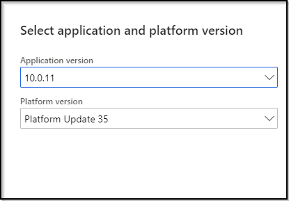

---
# required metadata

title: Provision a Dynamics 365 Commerce preview environment
description: This topic explains how to provision a Microsoft Dynamics 365 Commerce preview environment.
author: psimolin
manager: annbe
ms.date: 01/31/2020
ms.topic: article
ms.prod: 
ms.service: dynamics-365-commerce
ms.technology: 

# optional metadata

# ms.search.form: 
# ROBOTS: 
audience: Application User
# ms.devlang: 
ms.reviewer: v-chgri
ms.search.scope: Retail, Core, Operations
# ms.tgt_pltfrm: 
ms.custom: 
ms.assetid: 
ms.search.region: Global
ms.search.industry: 
ms.author: psimolin
ms.search.validFrom: 2019-10-31
ms.dyn365.ops.version: 
---

# Provision a Dynamics 365 Commerce preview environment

[!include [banner](includes/banner.md)]

This topic explains how to provision a Dynamics 365 Commerce preview environment.

Before you begin, we recommend that you take a quick scan through this topic to get an idea of what the process requires.

> [!NOTE]
> If you haven't yet been granted access to the Dynamics 365 Commerce preview, you can request preview access from the [Dynamics 365 Commerce website](https://aka.ms/Dynamics365CommerceWebsite).

## Overview

To successfully provision your Commerce preview environment, you must create a project that has a specific product name and type. The environment and commerce scale unit (CSU) also have some specific parameters that you must use when you provision e-Commerce later. The instructions in this topic describe all the steps required to complete provisioning and the parameters that you must use.

After you successfully provision your Commerce preview environment, you must complete a few post-provisioning steps to prepare it. Some steps are optional, depending on the aspects of the system that you want to evaluate. You can always complete the optional steps later.

For information about how to configure your Commerce preview environment after you provision it, see [Configure a Commerce preview environment](cpe-post-provisioning.md). For information about how to configure optional features for your Commerce preview environment, see [Configure optional features for a Commerce preview environment](cpe-optional-features.md).

If you have any questions about the provisioning steps, or if you encounter any issues, let Microsoft know in the [Microsoft Dynamics 365 Commerce Preview Yammer group](https://aka.ms/Dynamics365CommercePreviewYammer).

## Prerequisites

The following prerequisites must be in place before you can provision your Commerce preview environment:

- You have access to the Microsoft Dynamics Lifecycle Services (LCS) portal.
- You are an existing Microsoft Dynamics 365 partner or customer and are able to create a Dynamics 365 Commerce project.
- You've been accepted into the Dynamics 365 Commerce Preview program.
- You have the required permissions to create a project for **Migrate, create solutions, and learn**.
- You're a member of the **Environment manager** or **Project owner** role in the project where you will provision the environment.
- You have admin access to your Microsoft Azure subscription, or you're in contact with a subscription admin who can complete the two steps that require admin permissions on your behalf.
- You have your Azure Active Directory (Azure AD) tenant ID available.
- You've created an Azure AD security group that can be used as an e-Commerce system admin group, and you have its ID available.
- You've created an Azure AD security group that can be used as a Ratings and Reviews moderator group, and you have its ID available. (This security group can be the same as the e-Commerce system admin group.)

## Provision your Commerce preview environment

These procedures explain how to provision a Commerce preview environment. After you successfully complete them, the Commerce preview environment will be ready for configuration. All the activities that are described here occur in the LCS portal.

> [!IMPORTANT]
> Preview access is tied to the LCS account and organization that you specified in your Commerce preview application. You must use the same account to provision the Commerce preview environment. If you need to use a different LCS account or tenant for the Commerce preview environment, you must provide those details to Microsoft. For contact information, see the [Commerce preview environment support](#commerce-preview-environment-support) section later in this topic.

### Confirm that preview features are available and turned on in LCS

To confirm that preview features are available and turned on in LCS, follow these steps.

1. Sign in to the [LCS portal](https://lcs.dynamics.com) by using the same LCS account that you used to request access to the preview.
1. On the LCS home page, scroll all the way to the right, and select the **Preview feature management** tile.

    

1. Scroll down to **Private preview features**, and confirm that the following features are available and turned on:

    - e-Commerce Evaluation
    - Commerce Preview Program Environments

    

1. If those features don't appear in the list, contact Microsoft, and provide your work email address, LCS account, and tenant details. For contact information, see the [Commerce preview environment support](#commerce-preview-environment-support) section.

### Create a new project

To create a new project in LCS, follow these steps.

1. On the LCS home page, select the plus sign (**+**) to create a project.
1. In the right pane, follow one of these steps:

    - If you're a partner, select **Migrate, create solutions, and learn**.
    - If you're a customer, select **Prospective presales**.

1. Enter a name, description, and industry.
1. In the **Product name** field, select **Dynamics 365 Retail**.
1. In the **Product version** field, select **Dynamics 365 Retail**.
1. In the **Methodology** field, select **Dynamics Retail implementation methodology**.
1. Optional: You can import roles and users from an existing project.
1. Select **Create**. The project view appears.

### Add the Azure Connector

To add the Azure Connector to your LCS project, follow these steps.

1. Follow one of these steps:

    - If you're a partner, select the **Project settings** tile on the far right.
    - If you're a customer, select **Project settings** on the top menu.

1. Select **Azure connectors**.
1. Select **Add** to add the Azure Connector.
1. Enter a name.
1. Enter your Azure subscription ID.
1. Turn on the **Configure to use Azure Resource Manager (ARM)** option.
1. Verify that the **Azure subscription AAD Tenant Domain (or ID)** value is correct. Consult your Azure subscription admin as required.
1. Select **Next**.
1. Follow the instructions on the page to grant the required applications access to your subscription. Consult your Azure subscription admin as required.

    1. Sign in to the [Azure portal](https://portal.azure.com/).
    1. Make sure that the correct directory is selected, and then, on the menu on the left, select **Subscriptions**.
    1. Find the correct subscription in the list, and select it. Use the search functionality as required.
    1. On the menu, select **Access control (IAM)**.
    1. On the right, under **Add a role assignment**, select **Add**. The **Add role assignment** pane appears.
    1. In the **Role** field, select **Contributor**.
    1. In the **Assign access to** field, leave the default value, **Azure AD user, group, or service principal**.
    1. Under **Select**, enter **b96b7e94-b82e-4e71-99a0-cf7fb188acea**.
    1. Select **Dynamics Deployment Services \[wsfed-enabled\]** in the list.
    1. Select **Save**.

1. Select **Next**.
1. Follow the instructions on the page to grant the required applications access to your subscription. Consult your Azure subscription admin as required.
1. Select **Next**.
1. In the **Azure region** field, select **East US**, **East US 2**, **West US**, or **West US 2**.
1. Select **Connect**. Your Azure Connector should appear in the list.

### Import the Commerce Preview Demo Base Extension

To import the Commerce Preview Demo Base Extension into your project, follow these steps.

1. Open the home page for your project by selecting the project name at the top.
1. Follow one of these steps:

    - If you're a partner, select the **Asset library** tile on the far right.
    - If you're a customer, select **Asset library** on the top menu.

1. In the list on the left, select **Software deployable package**.
1. Select **Import**.
1. Under **Shared asset library**, select **Commerce Preview Demo Base Extension** in the list of assets.
1. Select **Pick**. You're returned to the Asset library, and you should see the extension in the list.

The following illustration shows the actions that must be taken on the LCS **Asset library** page.

### Deploy the environment

To deploy the environment, follow these steps.

> [!NOTE]
> You might not have to complete steps 6, 7, and/or 8, because pages that have a single option are skipped. When you're in the **Environment parameters** view, confirm that the text **Dynamics 365 Commerce - Demo (10.0.*x* with Platform update *xx*)** appears directly above the **Environment name** field. For details, see the illustration that appears after step 8.

1. On the top menu, select **Cloud-hosted environments**.
1. Select **Add** to add an environment.
1. In the **Application version** field, select the most current version. If you have a specific need to select an application version other than the most current version, do not select a version prior to **10.0.8**.
1. In the **Platform version** field, use the platform version that is automatically chosen for the application version you selected. 

    

1. Select **Next**.
1. Select **Demo** as the environment topology.

    

1. Select **Dynamics 365 Commerce - Demo** as the environment topology. If you configured a single Azure Connector earlier, it will be used for this environment. If you configured multiple Azure Connectors, you can select which connector to use: **East US**, **East US 2**, **West US**, or **West US 2**. (For the best end-to-end performance, we recommend that you select **West US 2**.)

    

1. On the **Deploy environment** page, enter an environment name. Leave the advanced settings as they are.

    

1. Adjust the VM size as required. (We recommend VM stock keeping unit \[SKU\] **D13 v2**.)
1. Review the pricing and licensing terms, and then select the check box to indicate that you agree to them.
1. Select **Next**.
1. On the deployment confirmation page, verify that the details are correct, and then select **Deploy**. You're returned to the **Cloud-hosted environments** view, and your environment should appear in the list.

    Your requested environment will appear as queued and then deploying. The environment workflows will take some time to be completed. Therefore, check back after approximately six to nine hours.

1. Before you continue, make sure that the status of your environment is **Deployed**.

### Initialize the commerce scale unit (CSU)

To initialize CSU, follow these steps.

1. In the **Cloud-hosted environments** view, select your environment in the list.
1. In the environment view on the right, select **Full details**. The environment details view appears.
1. Under **Environment features**, select **Manage**.
1. On the **Commerce** tab, select **Initialize**. The CSU initialization parameters view appears.
1. In the **Region** field, select **East US**, **East US 2**, **West US**, or **West US 2**.
1. In the **Version** field, select **Specify a version** in the list, and then specify **9.18.20014.4** in the field that appears. Be sure to specify the exact version that is indicated here. Otherwise, you will have to update RCSU to the correct version later.
1. Turn on the **Apply extension** option.
1. In the list of extensions, select **Commerce Preview Demo Base Extension**.
1. Select **Initialize**.
1. On the deployment confirmation page, verify that the details are correct, and then select **Yes**. The **Commerce management** view displays again, where the **Commerce** tab is selected. Your CSU has been queued for provisioning.
1. Before you continue, make sure that the status of your CSU is **Success**. Initialization takes approximately two to five hours.

### Initialize e-Commerce

To initialize e-Commerce, follow these steps.

1. On the **e-Commerce** tab, review the preview consent, and then select **Setup**.
1. In the **e-Commerce tenant name** field, enter a name. However, be aware that this name will appear in some of the URLs that point to your e-Commerce instance.
1. In the **Commerce scale unit name** field, select your CSU in the list. (The list should have only one option.)

    The **e-Commerce geography** field is set automatically, and the value can't be changed.

1. Select **Next** to continue.
1. In the **Supported host names** field, enter any valid domain, such as `www.fabrikam.com`.
1.	In the **AAD security group for system admin** field, enter the first few letters of the name of the security group that you want to use. Select the magnifying class icon to display the search results. Select the correct security group from the list.
2.	In the **AAD security group for ratings and review moderator** field, enter the first few letters of the name of the security group that you want to use. Select the magnifying class icon to display the search results. Select the correct security group from the list.
1. Leave the **Enable ratings and review service** option turned on.
1. Select **Initialize**. The **Commerce management** view displays again, where the **e-Commerce** tab is selected. E-Commerce initialization has started.
1. Before you continue, wait until the status of e-Commerce initialization is **Initialization successful**.
1. Under **Links** in the lower right, make a note of the URLs for the following links:

    * **e-Commerce site** – The link to the root of your e-Commerce site.
    * **e-Commerce site management tool** – The link to the site management tool.

## Commerce preview environment support

If you experience issues while you're completing the provisioning steps, visit the [Microsoft Dynamics 365 Commerce Preview Yammer group](https://aka.ms/Dynamics365CommercePreviewYammer) for help.

## Next steps

To continue the process of provisioning and configuring your Commerce preview environment, see [Configure a Commerce preview environment](cpe-post-provisioning.md).

## Additional resources

[Dynamics 365 Commerce preview environment overview](cpe-overview.md)

[Configure a Dynamics 365 Commerce preview environment](cpe-post-provisioning.md)

[Configure optional features for a Dynamics 365 Commerce preview environment](cpe-optional-features.md)

[Dynamics 365 Commerce preview environment FAQ](cpe-faq.md)

[Microsoft Lifecycle Services (LCS)](https://docs.microsoft.com/dynamics365/unified-operations/dev-itpro/lifecycle-services/lcs-user-guide)

[Retail Cloud Scale Unit (RCSU)](https://docs.microsoft.com/business-applications-release-notes/october18/dynamics365-retail/retail-cloud-scale-unit)

[Microsoft Azure portal](https://azure.microsoft.com/features/azure-portal)

[Dynamics 365 Commerce website](https://aka.ms/Dynamics365CommerceWebsite)

