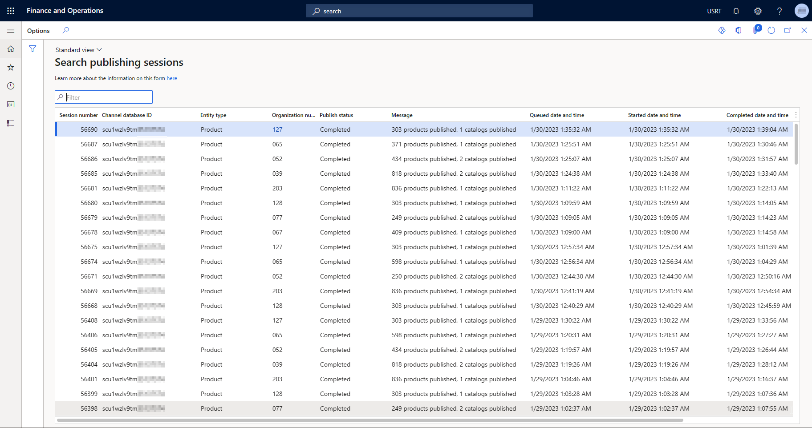

---
# required metadata

title: View product search publishing status in headquarters
description: This article describes the capability to view product search publishing status in Microsoft Dynamics 365 Commerce headquarters.
author: ashishmsft
ms.date: 06/13/2023
ms.topic: article
audience: Application User, Developer, IT Pro
ms.reviewer: v-chgriffin
ms.search.region: Global
ms.author: asharchw
ms.search.validFrom: 2023-01-30

---

# View product search publishing status in headquarters

[!include[banner](../includes/banner.md)]

This article describes the capability to view product search publishing status in Microsoft Dynamics 365 Commerce headquarters.

Starting in Commerce version 10.0.32, you can view the publishing status for product search in headquarters. With this capability, whenever you publish product information by channel, you're able to see how many products and catalogs were successfully published to the Azure Cognitive Search index, and how many products failed. The total product count is for simple and product masters, and excludes variants.

Product search publishing sessions are queued upon the conclusion of the **1040**, **1070** and **1150** Commerce Data Exchange (CDX) jobs that are scheduled after selecting **Publish channel updates** from the **Channel categories and products attributes** form (**Retail and Commerce \> Channel setup \> Channel categories and product attributes**). 

To enable the product search publishing status capability, you must turn on the **Search publishing sessions monitoring** feature in the feature management workspace (**Workspaces \> Feature management**). Enabling this feature makes the **Session publishing sessions** form discoverable, which shows the status of Commerce publishing sessions to the Azure Cognitive Search index.

The **Search publishing sessions form** displays the following columns:

- **Session number**
- **Channel database ID**
- **Entity type**
- **Organization number**
- **Publish status**
- **Message**
- **Queued date and time**
- **Started date and time**
- **Completed date and time**

Descriptions for each search session publishing status are listed in the following table. 

|Publishing status |Description |
--- | --- |
|Queued|Waiting for publisher to start publishing.|
|In-progress|Publishing is in progress.|
|Completed|Publishing was successfully completed.|
|Failed|There was an error during publishing, system will retry automatically.|
|Timed out|Due to some reason (for example, a bad query plan, unavailability of required resources, or network latency issues), the system couldn't complete the publish operation in the normal timeframe.|

Along with the publishing status and product count, the product search publishing status capability also provides visibility into when was a job was successfully published, how long it was waiting to be published, and the time duration that was needed to publish for a particular channel. 

## Frequently asked questions

#### Can the system show what products weren't published to the Azure Cognitive Search search index? 

Currently, the system shows the aggregated count of products that are published across all catalogs for a given channel (including the default assortment based catalog, also known as "Catalog=0"). For example, if you publish 100 products, the system might show that 80 products were successfully published, and 20 products weren't published. The Commerce team is working on functionality to give you more visibility into which products weren't successfully published. 

#### Can the system show why products are failing to get published?

Ideally, we want to show all failure reasons in this view, but there are going to be so many reasons for which the product publishing might be failing and some maybe fixable by updating product configuration and other may require support from Microsoft to address some deeper technical issues. For the issues that maybe fixable by updating product configuration, we recommend you leverage 'Channel merchandising configuration validator' available in headquarters, that would actually help in parallel or complement where it would kind of a showcase to you what product configurations would have been required.

#### Can the system show the breakdown of the products that are published/not published by each catalog? 

Currently, the system is limited to showing the aggregated product count for a given channel across all catalogs. In future versions, the Commerce team hopes to provide a breakdown of published/not published products by each catalog. 

#### Can the system show the breakdown of the products published or failed by each catalog? 

Currently, it's limited to show the aggregated product count for a given channel across all catalogs and all locales, in future versions we will look for opportunity to provide the published products count by each locale. We recommend you leverage 'Channel merchandising configuration validator' for common mistakes that may cause issues with locales specific product publishing where it can identify missing values (Product name, category name, attribute values or product description) for a specific locale. 

