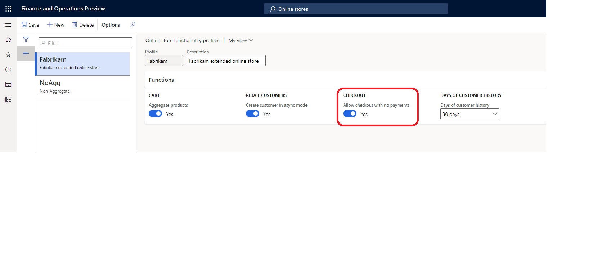

---
# required metadata

title: Purchasing a free item in e-commerce
description: This topic covers how to purchase a free item in e-commerce
author:  anupamar-ms
ms.date: 05/28/2021
ms.topic: article
ms.prod: 
ms.technology: 

# optional metadata

# ms.search.form: 
# ROBOTS: 
audience: Application User
# ms.devlang: 
ms.reviewer: v-chgri
# ms.tgt_pltfrm: 
ms.custom: 
ms.assetid: 
ms.search.region: Global
ms.search.industry: 
ms.author: anupamar
ms.search.validFrom: 2019-10-31
ms.dyn365.ops.version: 
---

# Purchase a free item in e-commerce

[!include [banner](includes/banner.md)]

This topic describes the configurations needed to purchase a free item in e-commerce. 

## Zero Price Valid

In addition to setting up a product with $0 price, its required that the product is also setup with **Zero Price Valid** setting to true. This setting can be configured on Headquarters. In Headquarters, go to **Released Products by Category** and navigate to the product that you want to sell for free. On the Product form, navigate to Commerce section and set **Zero Price Valid** to true.
The example below shows a product set with zero price valid to true 

## Functionality Profile for the Online Store
When free transactions are processed, a payment is not required. The functionality profile for your online store should be updated to allow transactions with no payments.
In Headquarters, create a functionality profile for your online store if you dont have one setup already. Navigate Retail Commerce -> Channel Setup - > Online Store Setup.  Create a new Funtionality Profile. To allow free transactions with no payments, set **Allow checkout with no payments** to true.  
The example below shows an online store profile with Allow checkout with no payments set to true 

Next, navigate Retail Commerce -> Channels - > Online Stores. Open the online store for your e-commerce site and associate it with the functionality profile that was created. 
The example below shows an online store functionality profile associated to an online store 

## Additional resources

[Module library overview](starter-kit-overview.md)

[Search results module](search-result-module.md)

[Buy box module](add-buy-box.md)

[Configure product dimension values to appear as swatches](./dev-itpro/dimensions-swatch.md)

[!INCLUDE[footer-include](../includes/footer-banner.md)]
