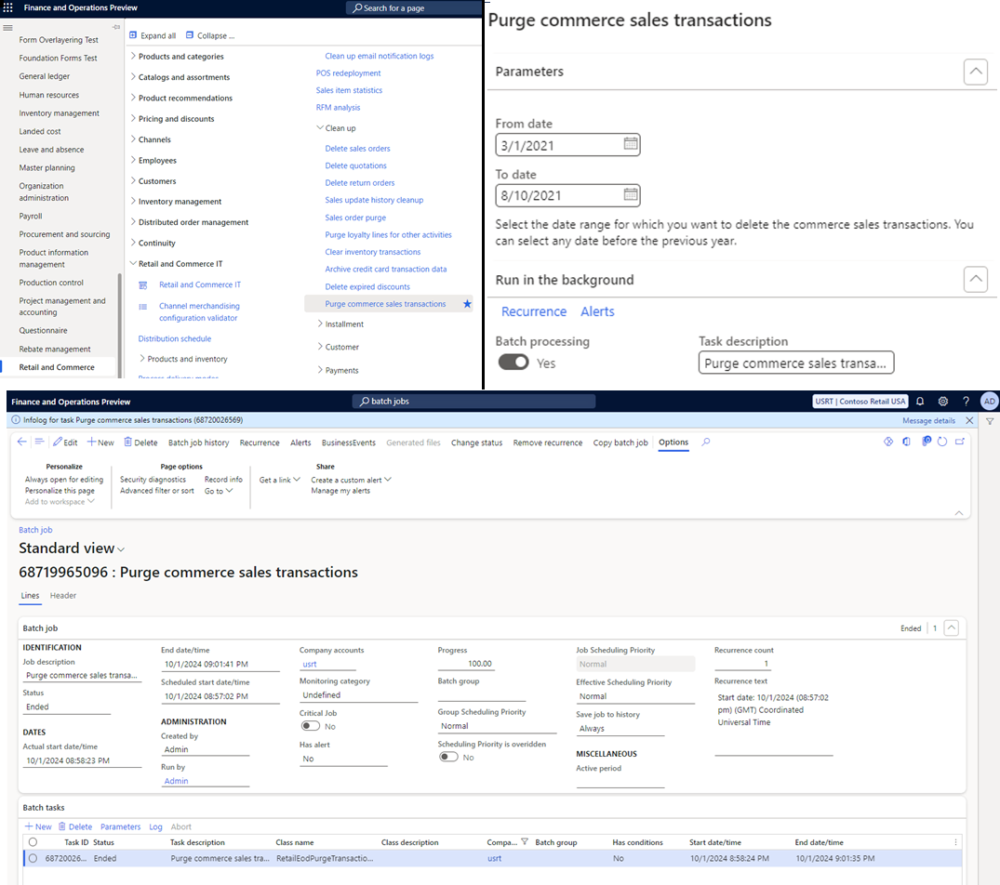

# Purge Commerce transactions

[!include [banner](../includes/banner.md)]
[!include [banner](../includes/preview-banner.md)]

This article describes how to use the Purge Commerce sales transactions capability to delete old transactional data that's no longer needed in Microsoft Dynamics 365 Commerce.

Retaining large amounts of data in Commerce backend systems can increase data costs and impact system performance, so organizations often want to remove outdated data. With the Commerce version 10.0.42 release, Commerce provides the capability for organizations to delete old transactional data themselves. The **Purge commerce sales transactions** form is available in Commerce headquarters at **Retail and Commerce IT \> Clean up**, but is hidden by default. Organizations running Commerce version 10.0.42 must contact the Microsoft support team to enable the capability in their environments. In later Commerce releases this capability is enabled by default in all environments. 

Users with the appropriate role can select a date range to delete transactions irrespective of their posting status. Currently the date range is limited to a maximum of six months at a time, and both the start and end dates must be before the previous calendar year. For example, if the current year is 2024, both the start and end dates of the date range must be from 2022 or earlier. 

> [!NOTE]
> Currently this capability is only available to users assigned the "Retail operations manager" role. However, due to the risks associated with irreversible transaction deletion, in later releases this capability will be restricted to users assigned the "Information technology officer" role. 

The purge job runs as a batch job, with only one active job per legal entity. Once the purge batch job is completed, the information log for the job displays details of the tables and record counts that were deleted. The purge job doesn't lock the tables from which it deletes transactions, allowing the system to continue using these tables for other business processes. 

The following example image shows details of the **Purge commerce sales transactions** form and how to find it.

 
