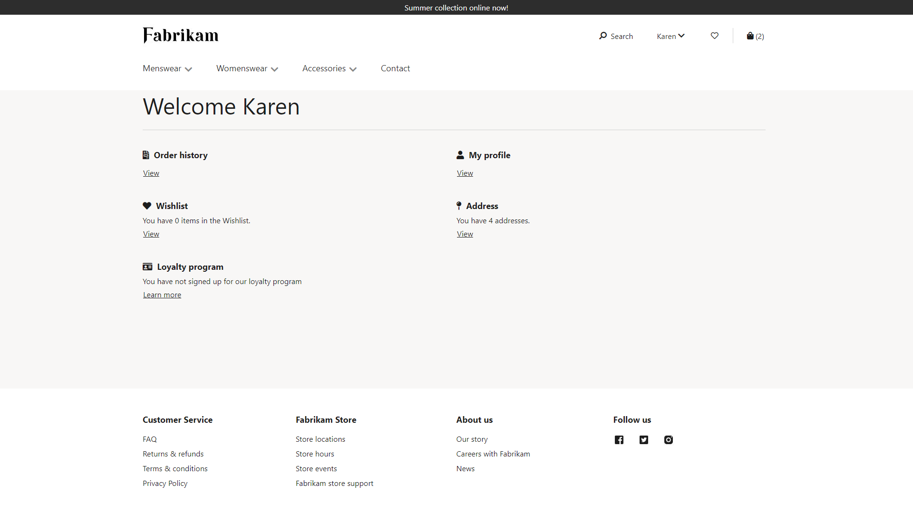
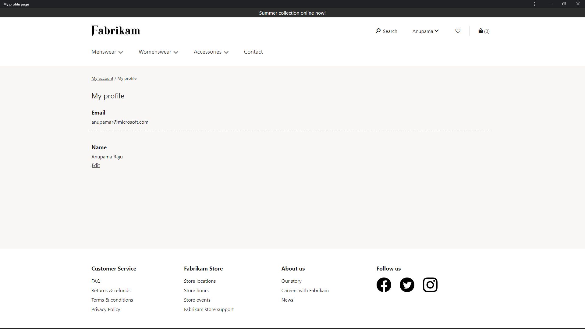
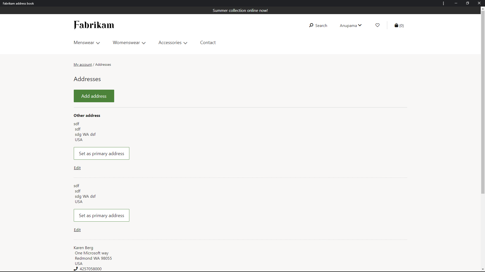
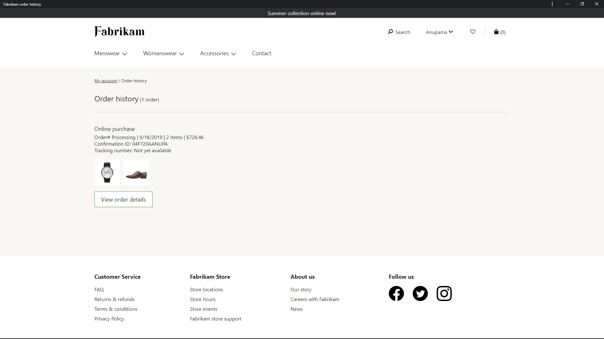
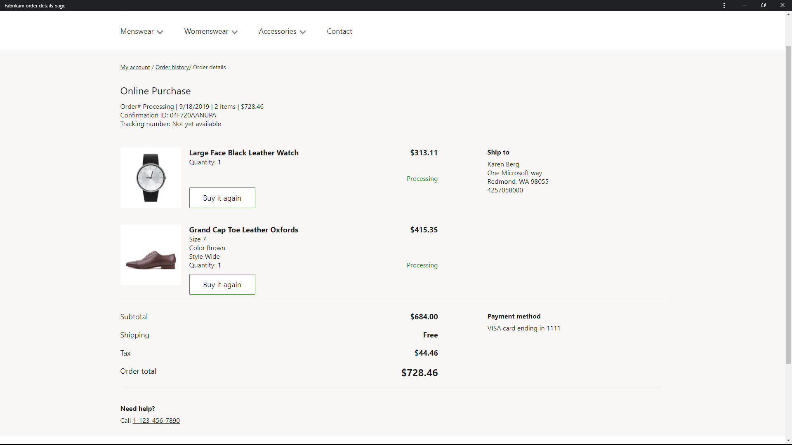
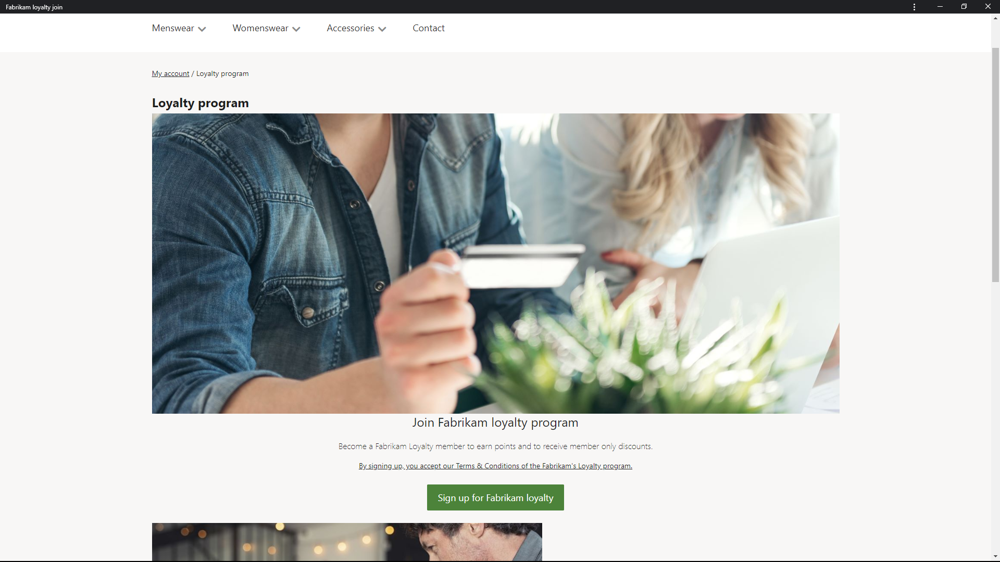
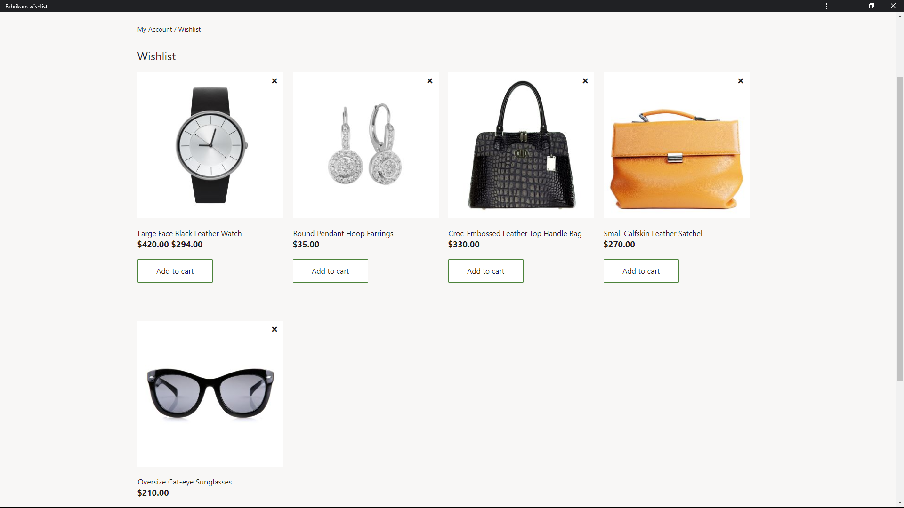

---
# required metadata

title: Quick tour of account management
description: This topic provides a quick tour of account management pages in Dynamics 365 Commerce.
author: anupamar-ms
manager: annbe
ms.date: 10/01/2019
ms.topic: article
ms.prod: 
ms.service: dynamics-ax-retail
ms.technology: 

# optional metadata

ms.search.form:  
audience: Application User
# ms.devlang: 
ms.reviewer: v-chgri
ms.search.scope: Retail, Core, Operations
# ms.tgt_pltfrm: 
# ms.custom: 
ms.search.region: Global
ms.search.industry: 
ms.author: anupamar
ms.search.validFrom: 2019-10-31
ms.dyn365.ops.version: Release 10.0.5
---

# Quick tour of account management

[!include [banner](../includes/preview-banner.md)]
[!include [banner](../includes/banner.md)]

This topic provides a quick tour of account management pages in Dynamics 365 Commerce.

## Overview

Account management pages enable customers to view account and order-related information. Account management pages include the account management landing page, user profile page, address page, order history page, order details page, loyalty rewards page, and wish list page.

### Account management landing page

The account management landing page provides a quick summary of all account-related information, including user profile, orders, wish list, addresses, loyalty, etc. When a customer signs in and goes to "My Account," this is first the page that will be shown. From there, the customer can access more details on each area. 

The following image shows an example of the account management landing page.

### User profile page

The user profile page displays the account information such as name and phone number. Customers can update their profile information on this page. This page can be customized to include additional customer account preferences such as opt-in for marketing email.

The following image shows an example of the user profile page built with the starter kit.

### Address page

The address page enables customers to add an address to their account. It also shows the list of addresses that a customer has added or saved to their account. These are addresses that the customer entered on the address page, or while placing an order. 

The following image shows an example of the address page.

### Order history page

The order history page shows a summary of all orders submitted by a customer with this account. It gives a quick summary of the items ordered, confirmation number, sales ID, tracking information, etc. For more detailed information on each order, there is an order details page that includes a more detailed breakdown of the order, which includes shipping address, payment information, discounts, taxes, and shipping costs for the order.

The following images show examples of the order history and order details pages.

### Loyalty rewards page

The loyalty rewards page enables a customer to become a loyalty program member. Once a customer is signed up for a loyalty program, details including points earned and points redeemed can be viewed on the loyalty rewards page. 

The following image shows an example of a loyalty rewards page.

### Wish list page

The wish list page displays the list of items added to the wish list by a customer. A product or product variant can be added to the wish list. From the wish list page, a customer can remove an item or add one directly to the cart. 

The following image shows an example of a wish list page.

Refer to [Account Management](account-management.md) for details on account management modules and authoring. 
