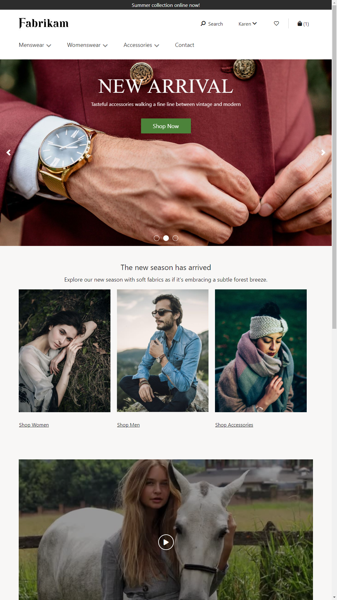
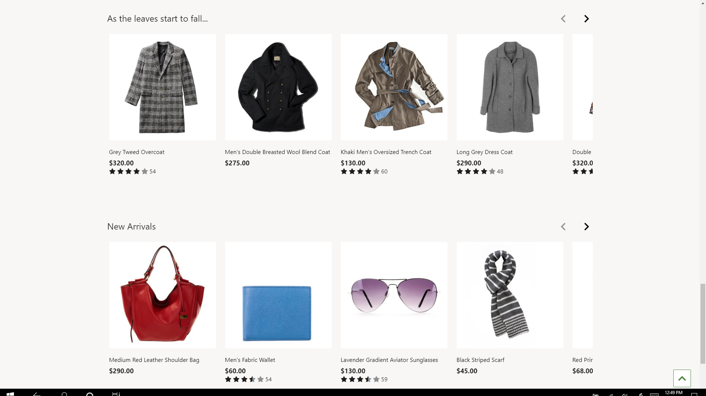

---
# required metadata

title: Home page overview
description: This topic provides an overview of the home page in Microsoft Dynamics 365 Commerce.
author: anupamar-ms
ms.date: 09/15/2020
ms.topic: overview
ms.prod: 
ms.technology: 

# optional metadata

ms.search.form:  
audience: Application User
# ms.devlang: 
ms.reviewer: v-chgri
# ms.tgt_pltfrm: 

ms.search.region: Global
ms.search.industry: 
ms.author: anupamar
ms.search.validFrom: 2019-10-31
ms.dyn365.ops.version: Release 10.0.5

---

# Home page overview

[!include [banner](includes/banner.md)]

This topic provides an overview of the home page in Microsoft Dynamics 365 Commerce.

The home page is the default page that shoppers go to when they visit an e-Commerce site. Typically, this page showcases products and promotions by using a combination of marketing modules. The home page should be rich with images and text to keep shoppers engaged.

The following illustration shows an example of a home page that was built by using the module library and the "Fabrikam" theme.

The top of the home page has a header that shows all the product categories and other pages that the retailer wants customers to browse. The bottom of the home page has a footer that contains quick links to various topics that might interest customers.

The main section of the home page can highlight products, categories, or promotions by using various Dynamics 365 Commerce modules:

- **Hero** – Typically, the first item at the top of the main section shows one or more "hero" images that highlight new products and promotions in the store. If there are multiple hero images, they are hosted in a carousel module so that users can browse them.

    The following illustration shows an example of a home page where the first item in the main section is a hero layout of a content block module that is named "New Arrival."

    

- **Feature** – A feature layout of a content block module is used to market products or promotions by using a combination of images and text. Features layouts can be used independently, or they can be hosted in a carousel module.

    The following illustration shows an example of feature layout of a content block module on a home page.

    

- **Tile** – A tile layout of a content block module is used to showcase multiple products or category of products by using a combination of images and text in a multicolumn layout. In the illustration of a home page that appears earlier in this topic, a tile  layout is used for the three-column rendering of the **Shop Women**, **Shop Men**, and **Shop Accessories** items.
- **Video player** – A video player module can be used to showcase video content on the home page. The illustration of a home page that appears earlier in this topic includes a video player module.
- **Text block** – A content rich block module can be used to present text content on the home page in a single-column or multicolumn layout.
- **Product recommendations** – Product recommendations modules are used to show lists, such as **New**, **Trending**, and **Best Selling** on the home page. These lists showcase products based on shopping trends, and they can be algorithmically generated or manually curated. They help customers quickly discover top products and then continue to shop.

    The following illustration shows an example of product recommendations modules on a home page.

    

> [!NOTE]
> All the modules that are listed here can be used on any site page. However, their placement on the home page is important because that page is where customers first interact with your site.

## Additional resources

[Product details pages overview](quick-tour-pdp.md)

[Cart and checkout pages overview](quick-tour-cart-checkout.md)

[Account management pages overview](quick-tour-account-management.md)

[!INCLUDE[footer-include](../includes/footer-banner.md)]
