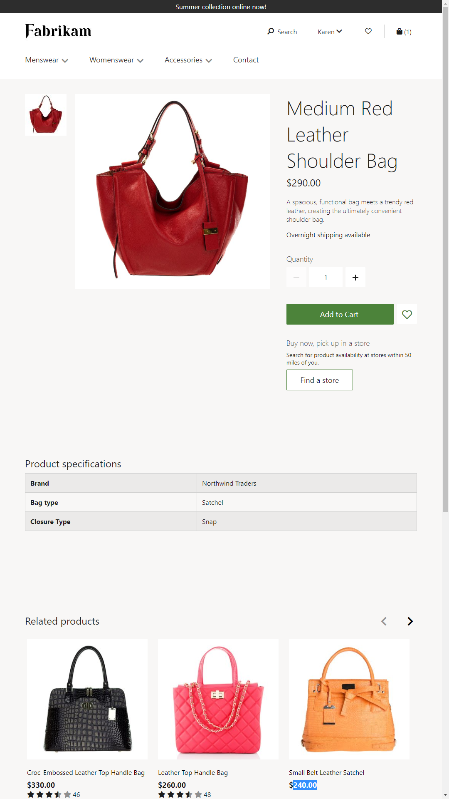

# Product details pages overview

[!include [banner](includes/banner.md)]

This article provides an overview of product details pages (PDPs) in Microsoft Dynamics 365 Commerce.

A PDP provides detailed information about a product, and lets customers select product options such as a size, style, and color. A PDP should showcase all the product information that a customer requires to make a purchase decision.

The following illustration shows an example of a PDP.

## Header and footer modules

The top of a PDP has a header that shows all the product categories and other pages that the retailer wants customers to browse. The bottom of the page has a footer that contains quick links to various articles that might interest customers.

## Buy box module

The most important module on a PDP is the buy box module, which appears as the first item in the main section of the page. A buy box module shows important product information, such as the product name, the product description, the product price, product images, and product ratings.

The buy box module lets the customer select product options (for example, a size, style, and color) and add the product to the cart. It also lets the customer buy the product online and pick it up in a store. The buy online and pick up in store module uses integration with Bing Maps application programming interfaces (APIs) to find nearby stores or stores in another location that the customer specifies.

A buy box module requires a product ID. This ID is derived from the page context. If a buy box module is added to a page where the page context doesn't include a product ID, it won't render the information correctly.

## Product specifications module

The product specifications module can be used to showcase additional details about the product. These details are taken from product attributes in Commerce. The product specifications module shows every attribute where the **visible** property is set to **true**. It requires a product ID to retrieve the product attributes.

## Recommendations module

The recommendations module is an important module on a PDP. While customers browse for products, more product options should be presented to them, so that they can find the correct product and make a purchase. Recommendations help customers easily discover related content and continue to shop.

Different types of recommendation lists are available:

- The **People also like** list is based on machine learning. It uses the transaction history of other customers to provide recommendations. This list is generated by the recommendations service and resembles "Customers who bought this also bought..." lists. A product ID is required to generate this list.
- A **Related** list can be configured for a product in Commerce. For example, for a brown leather travel handbag, more handbags that are leather-based or designed for travel purposes can be configured for the related list. Other types of related lists, such as **Accessories** and **More like this**, can also be configured in Commerce. A product ID is required to generate this list. Therefore, if it's added to a home page, where the page context doesn't include a product ID, the list will be empty.
- Algorithmically generated recommendation lists, such as **Trending**, **Best Selling**, and **New**, can be used on PDPs. Although these lists might not be directly related to the product on the PDP, they are another way to help customers find products that might interest them. These types of lists don't require a product ID. They are generic lists that are generated based on shopping patterns across the site.
- Editorial lists are manually curated lists. For example, a retailer might decide to manually curate lists of products that it wants to showcase.

## Ratings and reviews modules

Three modules can be used to show and add reviews:

- **Reviews** – This module lists ratings and reviews that have been provided by other customers. Customers can sort and filter the reviews. This module also lets customers like or dislike reviews, and report issues.
- **Write review** – This module lets customers write their own reviews of a product.
- **Ratings histogram** – This module includes a histogram that shows the ratings trend for a product.

For more details, see [Ratings and reviews overview](ratings-reviews-overview.md).

## Marketing modules

If marketing content is unique to a specific product, any marketing module can be added to the PDP. You can add marketing modules to a PDP by "enriching" the page. For more details, see [Enrich a product page](enrich-product-page.md).

## Additional resources

[Home page overview](quick-tour-home-page.md)

[Cart and checkout pages overview](quick-tour-cart-checkout.md)

[Account management pages overview](quick-tour-account-management.md)

[Enrich a product details page](enrich-product-page.md)

[!INCLUDE[footer-include](../includes/footer-banner.md)]
