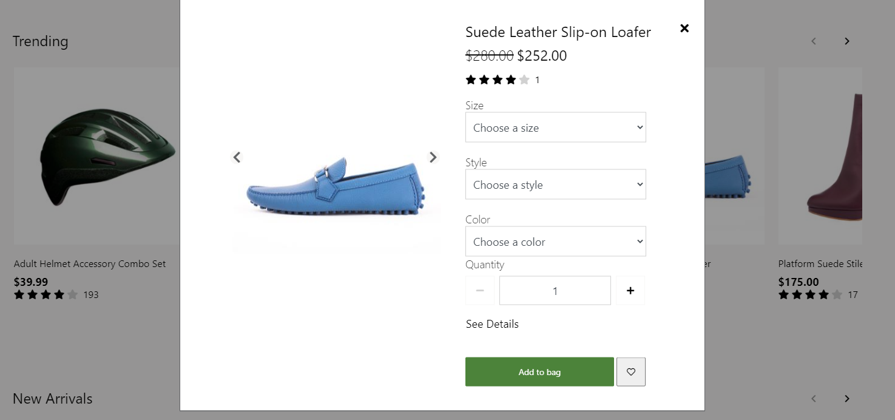

# Quick view module

[!include [banner](includes/banner.md)]

This article covers quick view modules and describes how to add them to site pages in Microsoft Dynamics 365 Commerce.

The quick view module lets users quickly view product information when they browse products on a list page, and add one or more products to the cart from the list page, without having to go to the product details page (PDP). The quick view module provides an overview of the product information that users require to make an "add to cart" decision. It also provides a link to the PDP, so that users can view additional product details and purchase options.

The quick view module is supported by the [product collection](product-collection-module-overview.md) and [search results](search-result-module.md) modules.

> [!IMPORTANT]
> The quick view module is available as of the Commerce version 10.0.17 release.

The following illustration shows an example of a quick view module on a product list page.

## Module properties

The quick view module supports some of the same functions as the buy box module. Therefore, the properties of a quick view module resemble the properties of a buy box module.

| Property | Values | Description |
|----------------|--------|-------------|
| Heading tag | **H1**, **H2**, **H3**, **H4**, **H5**, or **H6** | This property defines the heading tag for the product title. If the quick view module is at the top of the page, this property should be set to **H1** to meet accessibility standards. |
| Allow custom price | **True** or **False** | If this property is set to **True**, the user can enter a custom price. |
| Minimum price | Integer | This property is applicable only if the **Allow custom price** property is set to **True**. It defines the minimum price that the user can enter (for example, $1). |
| Maximum price | Integer | This property is applicable only if the **Allow custom price** property is set to **True**. It defines the maximum price that the user can enter (for example, $1,000). |

## Commerce site builder settings

Like the buy box module, the quick view module respects the settings at **Site Settings \> Extensions \> Add product to cart**. However, the **Navigate to cart page** setting is ignored, because it's inconsistent with the purpose of the quick view module, which is to enable users to browse multiple products on a list page and add them to the cart without moving away from the list page.

## Add a quick view module to a product collection module

A quick view module can be added to the product collection and search results modules.

To add a quick view module to a product collection module in Commerce site builder, follow these steps.

1. Go to **Pages**, and then select the home page for the Fabrikam site.
1. Go to any **Product Collection** module on the homepage, select the ellipsis (**...**), and then select **Add module**.
1. In the **Select modules** dialog box, select the **Quick View** module, and then select **OK**.
1. In the properties pane of the **Quick View** module, select **Heading**. In the **Heading** dialog box, set the **Heading Level** field to **H2**, and then select **OK**.
1. Select **Save**, select **Finish editing** to check in the page, and then select **Publish** to publish it.

## Additional resources

[Module library overview](starter-kit-overview.md)

[Buy box module](add-buy-box.md)

[Product collection module](product-collection-module-overview.md)

[Search results module](search-result-module.md)

[!INCLUDE[footer-include](../includes/footer-banner.md)]
