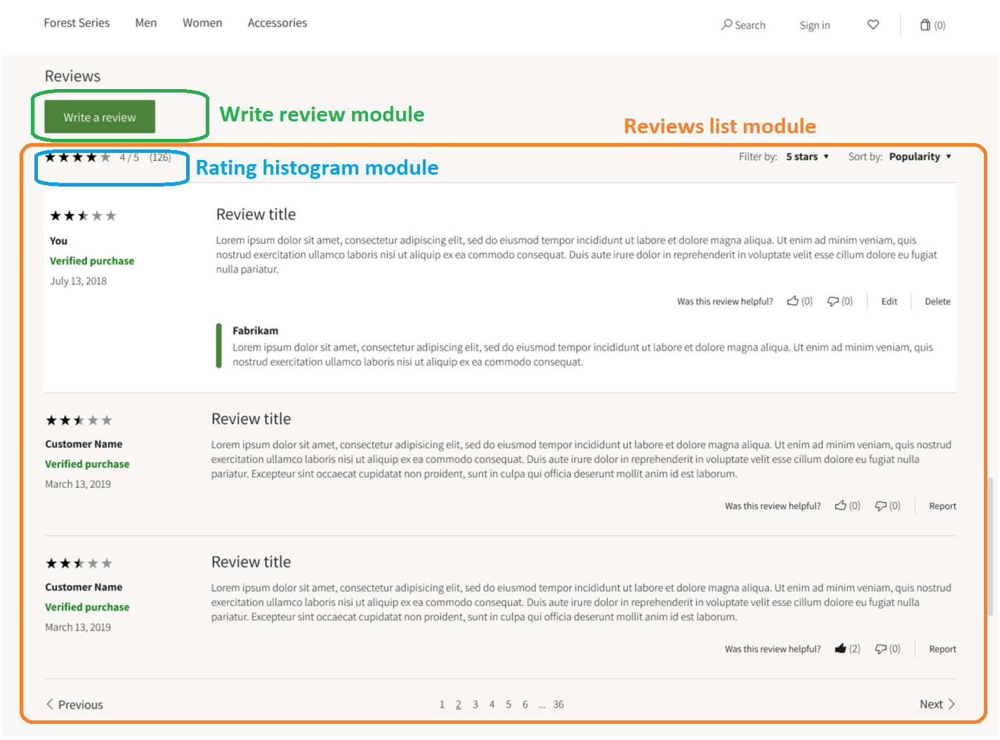
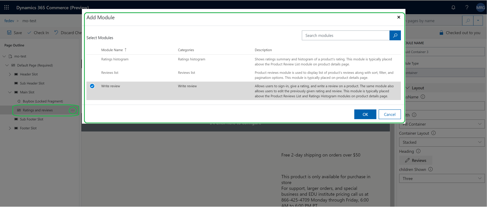
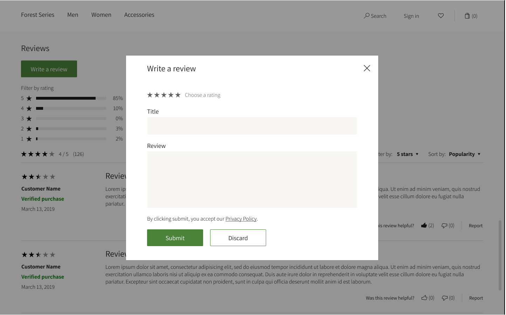
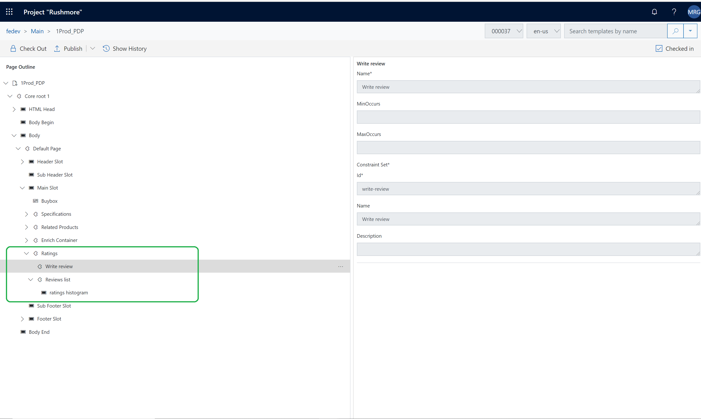
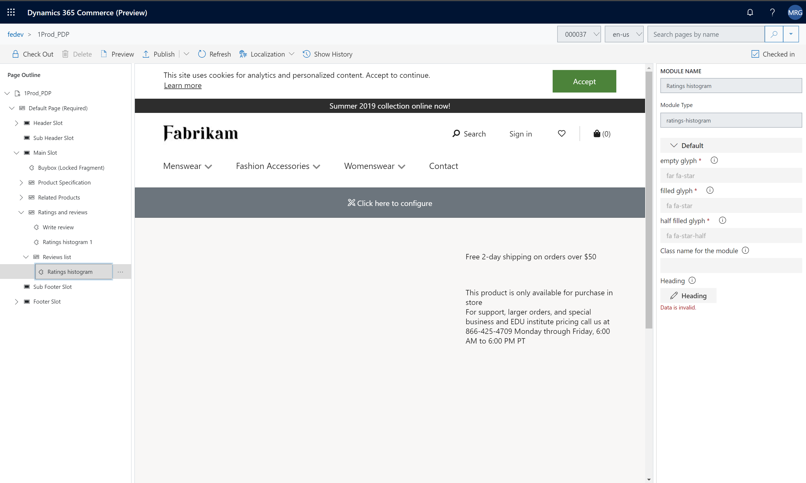

# Ratings and reviews modules

[!include [banner](includes/banner.md)]

This article covers ratings and reviews modules used on product details pages (PDPs) in Microsoft Dynamics 365 Commerce.

Ratings and reviews on e-Commerce websites help customers learn about products before they make a purchase decision, and are also a mechanism for collecting customer feedback about products. 

Ratings are shown on product list pages, category list pages, search results pages, and other site pages. 

Ratings histograms and product reviews are shown on PDPs. A **Write a review** button lets customers submit ratings and reviews for a product. These PDP features are controlled by ratings and review modules.

## Ratings and reviews modules on PDPs 

Three modules show the ratings and reviews summary on PDPs:
- Write review module
- Product reviews list module
- Ratings histogram module
 
The following illustration shows what the ratings and reviews modules look like on a PDP.

> [!TIP] 
> For information about how to optimize PDP templates and layouts so that you can share the configurations for ratings and reviews modules among multiple PDPs on your e-Commerce site, see [Templates and layouts overview](templates-layouts-overview.md).

The following illustration shows how the **Add module** dialog box presents ratings and reviews modules in Dynamics 365 Commerce.

### Write review module

The write review module includes a **Write a review** button that lets users sign in, assign a rating, and write a review of a product. This module also lets users edit a rating or review that they previously submitted. This module typically appears above the ratings histogram and product reviews list modules on a PDP.
The following illustration shows the **Write a review** dialog box that appears when a customer selects **Write a review**. The customer can use this dialog box to submit a rating and a review.

The following table shows the write review module property that needs to be configured in the authoring tool.

| Property name | Value        | Property description                 |
|---------------|--------------|--------------------------------------|
| Name          | Write review | The name of the write review module. |

### Ratings histogram module

The ratings histogram module shows a ratings histogram. This module typically appears between the write review module and the product reviews list module on a PDP.
The ratings histogram module requires no configuration. You just have to add the module in the PDP template. 
The following illustrations shows what a PDP template looks like in Dynamics 365 Commerce when ratings and reviews modules are configured for display on PDPs.

### Product reviews list module

The product reviews list module shows a list of product reviews together with sort, filter, and pagination options. This module typically appears after the ratings histogram module on a PDP.
The following table shows the product reviews list module properties that need to be configured in the authoring tool.

| Property name              | Value | Property description |
|----------------------------|-------| ---------------------|
| Reviews shown on each page | 10    | The number of reviews that should be shown at a time on a PDP. **Next** and **Previous** buttons are included, so that users can move through the pages of reviews. |

#### Ratings histogram – Summary view

The product reviews list module includes a slot where you can add a ratings histogram module. The following illustration shows how you can add a ratings histogram module in the product reviews list module in Dynamics 365 Commerce.

## Additional resources

[Module library overview](starter-kit-overview.md)

[Container module](add-container-module.md)

[Cart module](add-cart-module.md)

[Checkout module](add-checkout-module.md)

[Order confirmation module](order-confirmation-module.md)

[Header module](author-header-module.md)

[Footer module](author-footer-module.md)

[!INCLUDE[footer-include](../includes/footer-banner.md)]
