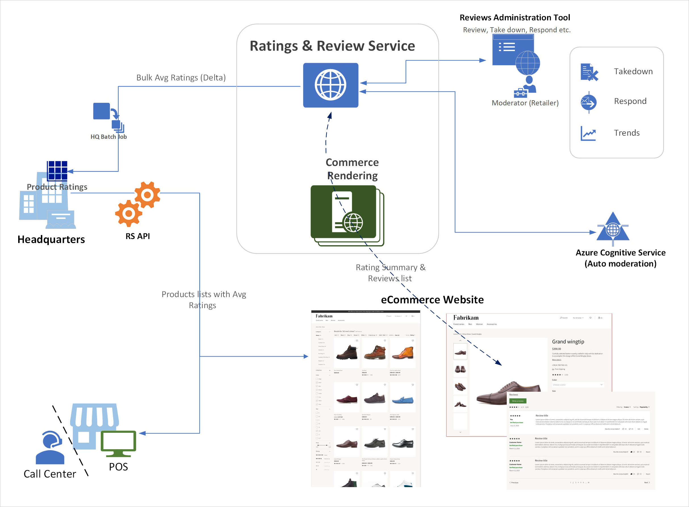

# Ratings and reviews overview

[!include [banner](includes/banner.md)]

This article covers ratings and reviews in Microsoft Dynamics 365 Commerce.

Ratings and reviews are crucial for e-commerce customers who want to know how other customers perceive a product. They can also help consumers make purchase decisions. In Dynamics 365 Commerce, the ratings and reviews solution lets retailers capture product reviews and ratings from customers. Retailers can then show average ratings and review information across their e-commerce website.

Average rating information is shown in point of sale (POS) and call center channels. Therefore, sales associates can use it to help users make decisions. Ratings and reviews can also serve as a feedback mechanism that retailers can use to improve the quality of a product and therefore increase sales.

Ratings and reviews functionality in Dynamics 365 Commerce is an omnichannel solution and is natively available as part of the platform. The ratings and reviews solution is built on top of Microsoft Azure, which provides high scalability and reliability.

The following illustration shows how the ratings and reviews solution works in Dynamics 365 Commerce.

The ratings and reviews solution in Dynamics 365 Commerce uses Azure Cognitive Services to offer automatic moderation of profane words in 40 languages. Because human approval isn't required, moderation costs are reduced. The system also offers moderator tools that can be used to respond to customer concerns, feedback, and take-down requests, and to address data requests from users.

The ratings and reviews solution provides widgets that show rating summaries in product lists, in search results, on product details page, and in other places. The widgets show complete review lists, and they also provide sorting and filtering options.

The ratings and reviews solution also provides a business intelligence (BI) template that includes a set of metrics to provide insights into ratings and reviews. Ratings and reviews data can be exported for further analysis.

The following video provides an overview of ratings and reviews capabilities in Dynamics 365 Commerce.

> [!VIDEO https://learn-video.azurefd.net/vod/player?id=3203014a-c3b2-4e4c-ad2c-032eb266d45d]

## Additional resources

[Opt in to use ratings and reviews](opt-in-ratings-reviews.md)

[Manage ratings and reviews](manage-reviews.md)

[Configure ratings and reviews](configure-ratings-reviews.md)

[Sync product ratings in Dynamics 365 Commerce](sync-product-ratings.md)

[Enable manual publishing of ratings and reviews by a moderator](manual-publish-rating-reviews.md)

[Import and export ratings and reviews](import-export-reviews.md)

[Configure Service-to-Service authentication](service-to-service-auth.md)

[Ratings and reviews FAQ](ratings-reviews-faq.md)

[!INCLUDE[footer-include](../includes/footer-banner.md)]
