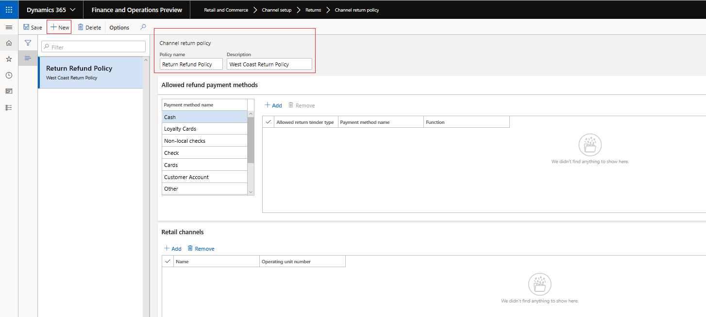
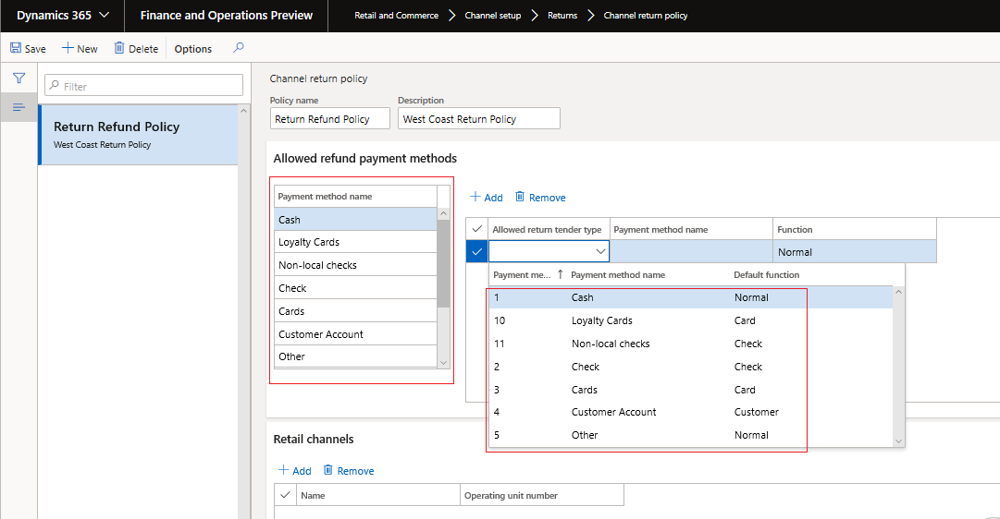
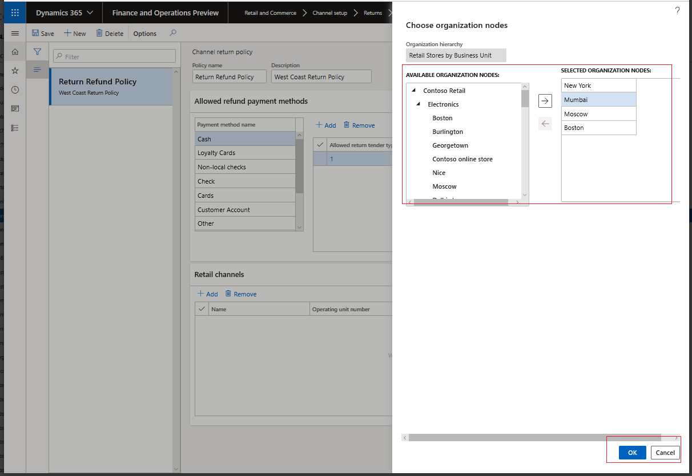
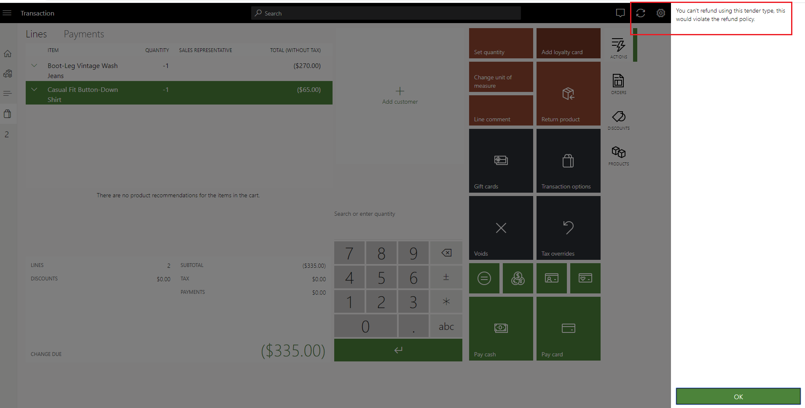
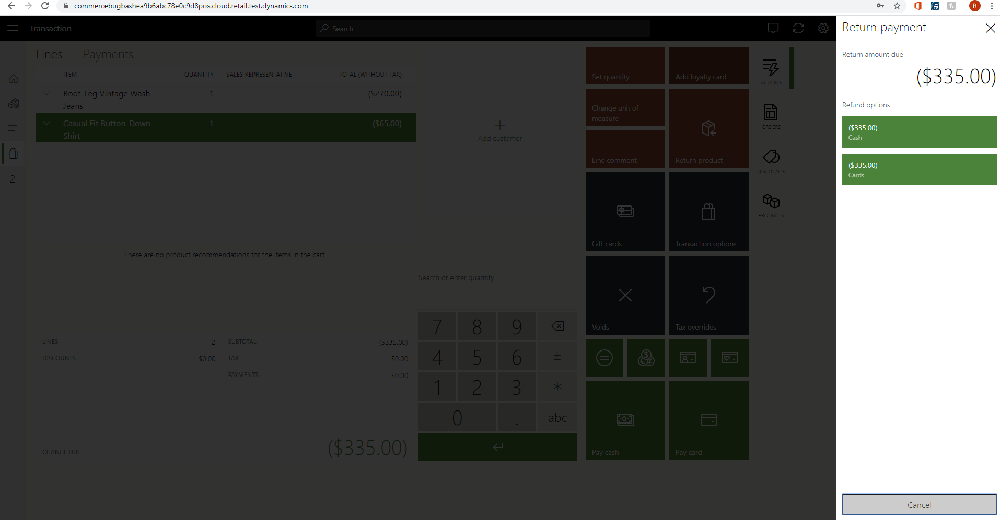

# Create and update a returns and refunds policy for a channel

[!include [banner](includes/banner.md)]

This article decribes how to set up a returns and refunds policy for a channel in Microsoft Dynamics 365 Commerce.

The channel return policy in Dynamics 365 Commerce enables retailers to set enforcements on which payment tenders can be allowed for processing a return on a point of sale (POS) device.  

The scope of the policy is currently limited to setting the payment tenders that can be allowed for a channel. The "allowed" list is based on the payment methods used to make the purchase. For example:

- If a purchase was made using a gift card, the store policy is to process refunds only to a new gift card or to give store credit. 
- If a sale is made using cash, the options allowed for refund are cash, gift card, and customer account, but not credit card. 

## Enable return policy

This feature is turned on by default. You can find it in the **Feature Management** workspace by searching for **Enable channel return policies** in the list of feature names.

## Configure return policy

Follow these steps to configure a return policy for a retail store or online retail channel.

1. Go to **Retail and Commerce** \> **Channel Setup** \> **Returns** \> **Channel return policy**.

1. Select **New** to create a new return policy template. To use an existing template, select the template in the left pane. For new templates, add a name and description that will help you identify the policy when it is being applied to the channel.

   
     
   
1. In the **Allowed refund payment methods** section, define **Allowed** return payment tenders that are specific to each payment method.
   
   
    > [!IMPORTANT]
    > - The payment methods are derived from the payment methods set for the organization.
    > - Adding an allowed return tender type for each listed payment method will ensure that returns can be made to the allowed return tender type.
    
1. Associate the return policy template with the stores where it will be used. Select **Add** in the **Retail Channels** tab and associate the available channels. 

    - In the **Choose organization nodes** dialog box, select the stores, regions, and organizations that the template should be associated with.
    - Only one return policy template can be associated with each store.
    - Use the arrow buttons to select stores, regions, or organizations.
    - The effective date on the policy will be the date on which the policies are applied to the channels and the channel jobs are run. 

    

1. On the **Distribution schedule** page, run the **1070** job to make the channel return policy available to the POS.

## Preview the channel return policy in the POS

Follow the steps in either of the following examples to view the allowed return tender types in POS.

1. Sign in to the POS as a cashier or manager.
1. Under **Shift and Drawer**, select **Show journal**.
1. Select the transaction that is part of the return. 
1. Select the items to refund, and choose the payment method.  
    - If the payment tender selected is in the allowed list of return tender types, the cashier can complete the transaction.
    - If the payment tender selected is not allowed, an error message is displayed.
    - Select **Amount Due** to display a list of all the allowed return tender types.

-or-

1. Sign in to the POS as a cashier or manager.
1. Select **Return Transaction** and enter the receipt ID using a barcode scan or by manual entry. 
1. Select the transaction that is part of the return. 
1. Select the items to refund, and choose the payment method.  
    - If the payment tender selected is in the allowed list of return tender types, the cashier can complete the transaction.
    - If the payment tender selected is not allowed, an error message is displayed.
    - Select **Amount Due** to display a list of all the allowed return tender types.

[!INCLUDE[footer-include](../includes/footer-banner.md)]
