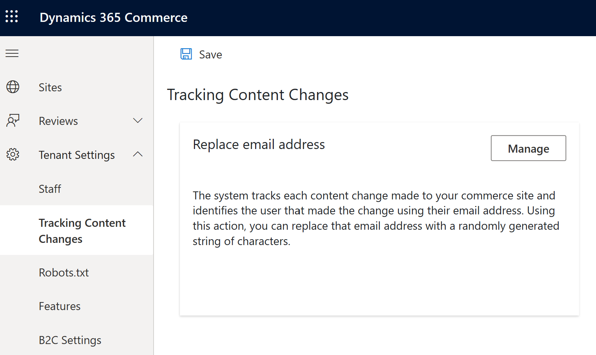
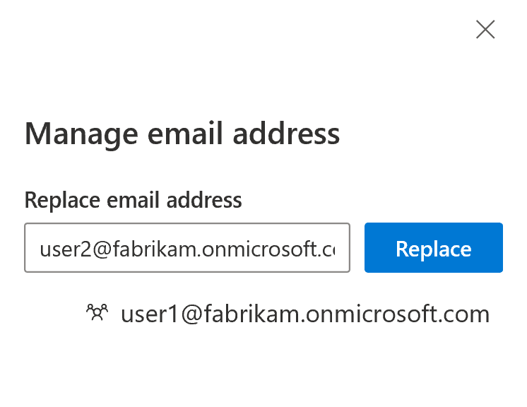

---
# required metadata

title: Replace user IDs associated with tracked content changes
description: This topic describes how to replace user IDs that are associated with tracked content changes in Microsoft Dynamics 365 Commerce site builder.
author: BrianShook
ms.date: 04/20/2020
ms.topic: article
ms.prod: 
ms.technology: 

# optional metadata

# ms.search.form: 
audience: Developer
# ms.devlang: 
ms.reviewer: v-chgri
# ms.tgt_pltfrm: 
ms.custom: 
ms.assetid: 
ms.search.region: Global
# ms.search.industry: 
ms.author: brshoo
ms.search.validFrom: 2020-04-13
ms.dyn365.ops.version: 

---

# Replace user IDs associated with tracked content changes

[!include [banner](includes/banner.md)]

This topic describes how to replace user IDs that are associated with tracked content changes in Microsoft Dynamics 365 Commerce site builder.

In Dynamics 365 Commerce, the site builder authoring tool tracks changes that are made to items in the content management system (CMS). Therefore, a document change history can be shown to help teams track their efforts when they collaborate on content. To assign user identities to tracked changes, the system uses user IDs from the Azure Active Directory (Azure AD) identity management system. These user IDs are also the email addresses that are issued by Azure AD. Commerce system admins can replace user ID references in the change tracking history logs in site builder as they require.

## Replace a user ID in site builder

To replace a user ID in site builder, follow these steps.

1. Go to the **Home** page for your site.
1. In the left navigation pane, expand **Tenant Settings**, and then select **Tracking Content Changes**.

    

1. On the **Tracking Content Changes** page, select **Manage**.
1. In the **Replace email address** field, enter the user ID email address that should be removed from the change tracking logs, and then select **Replace**. (You can enter multiple email addresses before you select **Replace**.)

    

1. Select **OK**, and then select **Save**. A message box notifies you that the records for the user IDs that you entered have been updated.

> [!NOTE]
> Site builder replaces every user ID email address with an anonymized, randomly generated string to remove all CMS references to the email address. This action affects only the history logs that are referenced in the specific e-Commerce environment (tenant) that is associated with the site builder instance.

## Additional resources

[Compliance overview](compliance-overview.md)

[Accessibility features and capabilities](accessibility.md)

[Cookie compliance](cookie-compliance.md)

[Add a privacy policy page](add-privacy-page.md)

[!INCLUDE[footer-include](../includes/footer-banner.md)]
