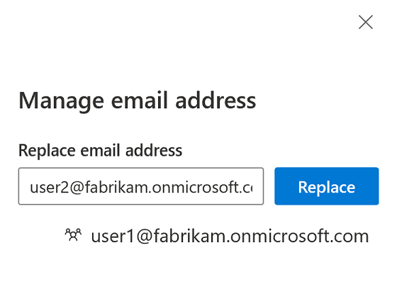

---
# required metadata

title: Replace user IDs associated with tracked content changes
description: This topic describes how to replace user IDs associated with tracked content changes in Microsoft Dynamics 365 Commerce site builder.
author: BrianShook
manager: annbe
ms.date: 04/20/2020
ms.topic: article
ms.prod: 
ms.service: Dynamics365Operations
ms.technology: 

# optional metadata

# ms.search.form: 
audience: Developer
# ms.devlang: 
ms.reviewer: v-chgri
ms.search.scope: Retail, Core, Operations
# ms.tgt_pltfrm: 
ms.custom: 
ms.assetid: 
ms.search.region: Global
# ms.search.industry: 
ms.author: brshoo
ms.search.validFrom: 2020-04-13
ms.dyn365.ops.version: 

---

# Replace user IDs associated with tracked content changes

[!include [banner](includes/banner.md)]

This topic describes how to replace user IDs associated with tracked content changes in Microsoft Dynamics 365 Commerce site builder.

## Overview

In Dynamics 365 Commerce, the site builder authoring tool tracks changes made to items within the content management system (CMS). This allows for the display of document change history, which helps teams track their efforts when collaborating on content. To assign user identities to tracked changes, the system uses Azure Active Directory (Azure AD) identity management system user IDs. These user IDs are also the email addresses issued by Azure AD. Site builder allows Commerce system administrators to replace user ID references within the site builder change tracking history logs if needed.

## Replace a user ID in site builder

To replace a user ID in site builder, follow these steps.

1. Go to **Home** for your site.
1. In the left navigation menu, expand **Tenant Settings** and then select **Tracking Content Changes**.

    

1. On the **Tracking Content Changes** page, select **Manage**.
1. In the **Replace email address** field, enter the user ID email address to be removed from the change tracking logs, and then select **Replace**. (Multiple entries can be entered before selecting **Replace**.)

    

1. Select **OK**, and then select **Save**. A dialog box will appear to indicate that the records for the user ID provided have been updated. 

> [!NOTE]
> Commerce site builder replaces each user ID email address with an anonymized, randomly-generated string to remove all CMS references to the email address. This action only affects the history logs referenced within the specific e-Commerce environment (tenant) that is associated with the site builder instance.

## Additional resources

[Compliance overview](compliance-overview.md)

[Accessibility features and capabilities](accessibility.md)

[Cookie compliance](cookie-compliance.md)

[Add a privacy policy page](add-privacy-page.md)
