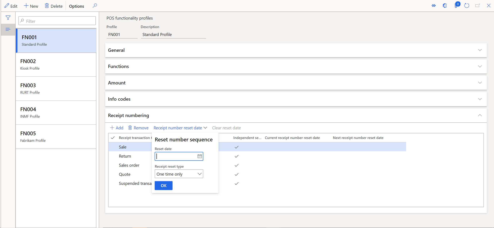

# Reset receipt numbers 

[!include [banner](includes/banner.md)]

> [!NOTE]
> We require that you select the **Independent sequence** property for all receipt types in the functionality profile before using this feature. Also, the system time zone of the device, where the POS is being used, should match the corresponding store time zone. Due to these limitations, we recommend that you do not use this feature in production while we work to fix these issues in a future release. 

Retailers generate receipt numbers for various actions in the store, such as cash and carry transactions, return transactions, customer orders, quotations, and payments. Although retailers define their own receipt formats, some countries or regions have regulations that put restrictions on these receipt formats. For example, these regulations might limit the number of characters on the receipt, require consecutive receipt numbers, restrict some special characters, or require a reset of receipt numbers at the beginning of the year. Microsoft Dynamics 365 Commerce makes the process of managing receipt numbers very flexible, to help retailers meet regulatory requirements. This article explains how to use the functionality for resetting receipt numbers.

In Commerce, receipt formats can be alphanumeric. You can put both static content and dynamic content in them. Static content includes alphabetic character, numbers, and special characters. Dynamic content includes one or more characters that represent information such as the store number, terminal number, date, month, year, and number sequences that are automatically incremented. The formats are defined in the **Receipt numbering** section of the functionality profile. The following table describes the characters that represent the dynamic content.

| Characters | Description |
|------------|-------------|
| S          | The character **S** is used for the store number. For example, if a store is numbered HOUSTON1, the format **SSS** shows "ON1" on the receipt. The format **SSSSS** shows "STON1" on the receipt. |
| T          | The character **T** is used for the terminal number. For example, if a terminal is numbered 0001, the format **TTTT** shows "0001" on the receipt. |
| C          | The character **C** is used for the staff ID number. For example, if a staff member has an ID of 000160, the format **CCCC** shows "0160" on the receipt. |
| ddd        | The characters **ddd** correspond to the day of the year, from 1 through 366. For example, on January 15, the format **ddd** shows "015" on the receipt. |
| MM         | The characters **MM** are used for the two-digit month. For example, in January, the format **MM** show "01" on the receipt. |
| DD         | The characters **DD** are used for the two-digit day of the month. For example, on January 15, the format **DD** shows "15" on the receipt. |
| YY         | The characters **YY** are used for the two-digit year. For example, in any month during the year 2020, the format **YY** shows "20" on the receipt. |
| \#         | A number sign (**\#**) is used for sequential numbering. For example, the format **####** shows "0001," "0002," "0003," and so on, on the receipt. |

You can reset the sequential numbering of the receipt on a specific date. Then, for the first transaction that occurs after 12:00 AM on the selected reset date, the system resets the receipt's number sequence to 1. You can also specify whether the reset occurs only one time, or whether it recurs every year. If yearly recurrence is specified, the reset automatically occurs every year until the retailer chooses to stop it. 

To turn on the reset in headquarters, follow these steps.

1. Go to **Retail and Commerce \> Channel setup \> POS setup \> POS profiles \> Functionality profiles**.
1. On the **Receipt numbering** FastTab, select **Reset number reset date**.
1. In the drop-down dialog box, in the **Reset date** field, select a future date when the reset should occur.
1. In the **Reset receipt type** field, select **One time only** or **Yearly**.
1. Select **OK**.
1. Go to **Retail and Commerce \> Retail and Commerce IT \> Distribution schedule** and run the **1070 (Channel configuration)** job to synchronize the latest functionality profile settings to POS clients.

After you select a date, it appears in the **Next receipt number reset date** column. The reset date is applicable to all receipt transaction types. Therefore, the receipt number sequence will be reset for all receipt types.

When the reset date arrives, the receipt number is reset for the first transaction of each type. In addition, in the functionality profile, the reset date is moved from the **Next receipt number reset date** column to the **Current receipt number reset date** column. This change indicates that if a register isn't used on the reset date, the receipt number will be reset the next time that the register *is* used. For example, on December 3, 2019, you select **January 1, 2020**, as the reset date. On January 1, when the registers make their first transaction, the receipt number are reset. However, one register isn't used at all during December and January, but then starts to be used in February. In this case, because a reset action was defined, the receipt number for that register will be reset when the register makes its first transaction in February.

You can use the **Clear reset date** functionality to clear future reset dates. However, if the reset date occurred in the past, it can't be undone. Therefore, the reset will still occur for all registers where the reset hasn't yet occurred.

> [!NOTE]
> - If you use **Independent sequence** property for all or some receipt types, please make sure include dynamic date characters (for example, **ddd**, **MM**, **DD**, and **YY**) to help prevent duplicate receipt ids.
> - The reset date set in **Functionality profiles** isn't associated with a specific time zone. For example, if you select **January 1, 2020** as the reset date, POS devices in all time zones will reset the receipt back to "1" on January 1, 2020 local time.
> - If you want the receipt masks to be changed together when the reset date arrives, follow below steps: 
1.First set the reset date in **Functionality profiles** (for example, "January 1, 2020") before reset date, like one week before. Run the **1070 (Channel configuration)** job
2.When the reset date arrives, before opening store, set the receipt masks to what you want in **Functionality profiles**. Run the **1090 (Registers)** job.
3.After you finish configuring all these settings, **please remember to relaunch POS to take all this new configurations to POS devices**. 
4.After finish all above steps, open POS, create new orders, POS will start creating orders using new receipt masks with the receipt ID reset.
> - Depending on the reset date that you select, and the receipt format, you might have duplicate receipt numbers. Although the point of sale (POS) system can handle these situations, they increase the amount of time that is required to process returns, because sales associates must select among the duplicate receipts. Other complications that are related to data cleanup can occur if the duplicate receipts weren't a planned consequence. Therefore, we recommend that you use dynamic date characters (for example, **ddd**, **MM**, **DD**, and **YY**) to help prevent duplicate receipt numbers after a reset.

[!INCLUDE[footer-include](../includes/footer-banner.md)]
