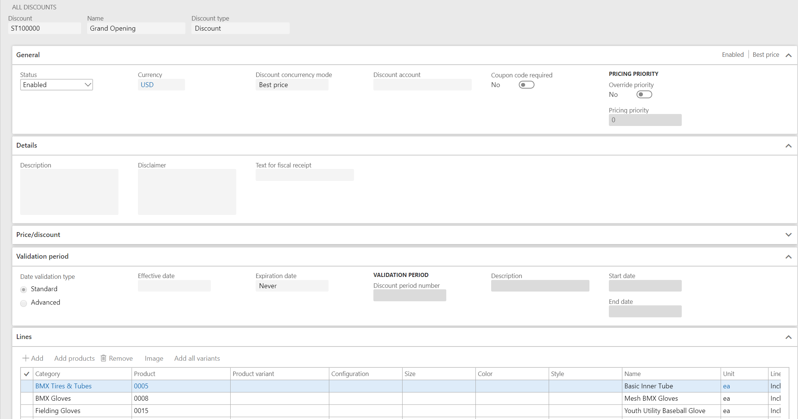

# Retail discounts

[!include [banner](includes/banner.md)]

This article provides an overview of the discount functionality in the Dynamics 365 Commerce. It explains the properties found on the various discount forms, and best practices for discount management. However, this article doesn't cover the various discount types in detail, for example, simple, quantity, mix and match, and threshold discounts. These details will be covered in separate articles created for each of these discount types.

Because retailers require flexible discounting, and discount styles and types vary by industry, there are many ways to define discounts in Commerce. The discounting functionality was added on top of the existing discount functionality in the core product (Supply Chain Management), resulting in some duplication of functionality. As a result, the discount types can be configured for five different entities: customer, loyalty program, channel, catalog, and affiliations. Because of the number of discounting options, it's especially important that you plan and document your discounting strategy.

## Create discounts

Each discount type has a dedicated page that you use to create and manage the discount. Commerce also has an **All discounts** page and a **Pricing and discounts management** workspace, both of which you can use to create a new discount of any type.

### Discount headers and discount lines

All discounts have a header and one or more lines. All discount types have properties defined on the header and some discount types have additional properties defined per line. For example, quantity discounts have quantity tiers. People often think about discounts in Commerce only in terms of the discount header and assume that all the lines on the discount are related to each other because they share a discount header. However, this view of discounts is too simplistic. For simple discounts and quantity discounts, it's more accurate to think of each discount line as an independent discount that shares some properties with the other discount lines. In fact, the pricing engine evaluates simple and quantity discounts in just this manner. Each discount line for simple discounts and quantity discounts is independent. For simple discounts, it's easy to understand that each discount line is independent of all other discount lines on the same discount, because there isn't a quantity or amount criterion required to qualify for the discount. For quantity discounts, you might think that the lines can be combined to reach the quantity criterion for a discount, but they don't. The quantity tiers must be reached independently for each line of a quantity discount. If your pricing strategy requires a quantity discount to apply when multiple sales lines combined reach the quantity criterion, Microsoft recommends that you group those items into a supplementary category and then configure that category as the quantity discount line.

When you create discounts, we recommend that you always avoid or minimize overlapping discount lines. Overlapping discount lines occur when two or more discount lines in the same discount can be applied to the same product. In this case, the pricing engine must treat the discount as two or more independent discounts that must then be evaluated against each other to find the best discount amount. In addition, it can be difficult for a user to know what the discount will be just by looking at the discount definition.

> [!NOTE]
> When the number of lines in a single discount reaches a few thousand, users may experience performance issues when enabling discounts with quantity limits, or enabling discounts with both include and exclude lines. Users may also see performance degradation to a much lesser degree in pricing calculation for call center and POS orders. To avoid these performance issues, you can instead create a single category that contains all of the discounted products, and then create a discount line using the category.

## Manage discounts

### Settings and options that are common to all discounts

This section describes the properties that are common to all types of discounts.

When you manage discounts, it's important that you understand each discount option individually, but it's equally important that you understand which options affect each other and how. The common settings for discounts fall into two categories. In the first category are settings that filter discounts for consideration. Examples include **Status**, **Currency**, and **Unit of measure**. Settings in the second category control the order in which multiple discounts are considered and applied. Examples include **Discount concurrency mode** and **Pricing priority**. The following image shows the various properties of a discount.

### Discount ID

This field is labeled **Discount** and holds a unique ID for each discount. It's set when you first create a discount and can't be changed later. In **Commerce parameters**, you can set up independent number sequences for each type of discount. In this case, make sure that the number sequences won't collide. For example, you can use a unique prefix for each discount type. For example, D for **d**iscount, Q for **q**uantity, MM for **m**ix and **m**atch, and T for **t**hreshold.

### Discount name

This field is a short free text field that is used to describe the discount. The string value in this field is shown in the Store Commerce app and Store Commerce for web cart line and printed on the Store Commerce app and Store Commerce for web customer receipts. Therefore, your cashiers and end customers will see this description. It's the primary means for Store Commerce app and Store Commerce for web users and customers to know which discount was applied.

### Discount type

There are five types of discounts in Commerce: **Discount**, **Discount with quantity limit**, **Quantity**, **Mix and match**, and **Threshold**. The discount type is set when you first create a discount and can't be changed later, except for **Discount** and **Discount with quantity limit** where the two discount types can switch to the other by changing the quantity limit. The discount type determines whether there's a quantity or amount criterion that must be met to qualify for the discount.

### Status

The status of a discount can be either **Enabled** or **Disabled**. When you first create a discount, the status is **Disabled**. Discounts can only be edited when they're disabled. When discount data is pushed to a channel, disabled discounts aren't pushed if the **Clean up irrelevant master data after sync** parameter in **Commerce scheduler parameters** is enabled. If a discount was previously enabled and pushed to the channel, then this new push will also remove the discount from the channel if the **Clean up irrelevant master data after sync** parameter is enabled. When you change the status to **Enabled**, various validation checks are performed on the discount, depending on the type of discount. The list of validation checks has increased in recent updates of the product to prevent incomplete or poorly defined discounts from being pushed to commerce channels. Here's a partial list of the validations that are performed when you enable a discount:

- A discount must have at least one discount line.
- The percentage value for a percentage discount must be more than 0 (zero) and less than or equal to 100.
- The amount value for an amount discount must be more than 0 (zero). Zero and negative amounts aren't valid.
- A discount must have at least one price group. A discount that doesn't have a price group will never be applied to a transaction.
- A Unit of measure (UoM) is required for quantity and mix-and-match discount lines.
- For quantity discounts that have two or more quantity tiers, the discount value is validated to increase as quantities increase.
- For threshold discounts that have two or more threshold tiers, the discount value for each tier must be equal to or more than the largest discount of the previous tier.
- For mix-and-match least-expensive discounts, the number of least-expensive products must be more than 1 and less than the number of products that are required to trigger the discount.

### Currency

The currency of a discount defines the currency of all amount and price fields on the discount. Different discount types have different field options. The currency also acts as a filter during discount calculation. In Commerce, all sales order and Store Commerce app/Store Commerce for web transactions have a currency, and the pricing engine will consider only discounts that have the same currency.

### Discount concurrency mode

This determines which discounts compete on a transaction, and which discounts are compounded together. The three values for this option are **Exclusive**, **Best price**, and **Compounded**.

**Exclusive** discounts are always evaluated and applied before **Best price** and **Compounded** discounts if all other settings are the same, and will prevent all other discounts to be applied to the same lines where they are applied. Two or more **Exclusive** discounts will compete for the best price.

When the discount concurrency control is set to **Best price and compound within priority, never compound across priorities**, all **Compounded** discounts within the same pricing priority are combined, and the combined result competes with any **Best price** discounts in the same pricing priority. After the discount is applied to a transaction line, all discounts at lower pricing priorities are ignored.

When the discount concurrency control is set to **Best price only within priority, always compound across priority**, all **Best price** and **Compounded** discounts are treated as a **Best price** discount within a single pricing priority and they compete to determine the best discount for that pricing priority. Only a single discount can be applied to a product per pricing priority, and if that single discount is a **Best price** or **Compounded** discount, then it will compound with the best discount of **Best price** or **Compounded** discounts at lower pricing priorities.

When multiple discounts are applied to a transaction line, they're applied in the following order:

- Discount price discounts
- Amount-off discounts
- Percentage-off discounts

**Compound** discounts compete with **Best price** discounts when both types apply to a transaction line. Therefore, the **Compound** setting is used to determine which discounts are combined. Depending on the discount concurrency control mode used, two or more **Compound** discounts can be combined and compete with the **Best price** discounts that apply to the same products. The discount or discounts that have the largest total discount amount are applied.

### Discount account

Commerce lets you post discount amounts for a transaction to a separate general ledger (GL) account. The discount GL account is set by the product or customer. Commerce offers a unique way to separate the discount amounts during posting. You can post each type of discount to a specific GL account. Both options can make it easier for you to determine which discounts or discount types are being used in your general ledger.

> [!NOTE]
> When the discount account posting feature is enabled, then an additional debit entry and credit entry are made to reclassify the discount posting out of the Commerce discount GL account and into the discount GL account.

### Coupon code required

Starting with version 7.2 of the app, the call center coupons are now merged with discounts. For a discount, when **Coupon code required** is set to **Yes**, the **Status** field and the standard date fields, **Effective date** and **Expiration date**, aren't available. These properties are controlled by equivalent properties that are on the **Coupons** page.

When **Coupon code required** is set to **Yes** on a discount, the discount is applied to a transaction only if the coupon code or bar code is provided by the Store Commerce app or Store Commerce for web. The values of the coupon codes and bar codes are defined and configured in a separate page named **Coupons**. The Coupons page is where the coupon is linked to the discount. When Coupon code required is set to **No**, a coupon code isn't required, and the discount will always be applied through its price groups.

### Override priority and Pricing priority

These two fields work together. When **Override priority** is set to **Yes** , the **Pricing priority** field becomes available for editing. You can then select a pricing priority to set directly on the discount. When **Override priority** is set to **No** , the priority is inherited from the priority of the price group associated with the discount. In the case of multiple price groups association, the priority number is determined by selecting the highest pricing priority of all the price groups associated with the discount.

### Match all associated price groups

In Commerce version 10.0.16 and later, a configuration called **Match all associated price groups** is available on all discount forms. If the configuration is enabled, the discount will be considered only if all the price groups associated to the discount are applicable to the transaction. For example, if the two price groups named "PG-Student" (price group for student affiliation) and "RP-Houston" (price group for the Houston store) are associated to a discount, and **Match all associated price groups** is enabled, the discount will be considered only for students who are shopping in the Houston store. This configuration provides a way to restrict affiliation and loyalty-based discounts to limited stores.

> [!NOTE]
> If two or more channel price groups are associated to a discount, and **Match all associated price groups** is enabled, the discount won't apply because a transaction can be associated to only one store. Therefore, all the price groups associated to the discount don't match.

### Description

This field is a free-form text field. It isn't used in the Store Commerce app/Store Commerce for web systems or in transactions.

### Disclaimer

This is a free-form text field. It isn't used in the Store Commerce app/Store Commerce for web systems or in transactions.

### Line type

This field is on all discount lines. The possible values are **Include** and **Exclude**. This field is used in combination with the **Category**, **Product**, and **Variant** fields to define the set of products that the discount is applied to. Exclude discount lines always override include discount lines. When **Line type** is **Exclude** many of the other fields on the discount line are grayed out, as they don't apply.

### Unit of measure

**Unit of measure** (UoM) is a field on all discount lines except threshold discount lines. This field is label **Unit** in Commerce. The **Unit of measure** field acts as a _filter_ to determine whether a discount should be applied to a transaction line. The UoM on the transaction line must match the UoM on the discount line. Otherwise, the discount line isn't considered during discount calculation. No UoM conversion is done during discount calculation.

### Category, product, variant, and dimensions

**Category**, **Product**, **Variant, and dimensions** are the last discount settings that are common to all discounts. These fields are set on each discount line and specify what is being discounted. They act as a filter when the pricing engine searches for discounts that can be applied to a transaction. These fields are related to each other according to these rules – categories contain products, and products can come in different variations of size, color, style, and configuration.

The pricing engine doesn't use the parent/child relationships of categories, products, and variants to order discounts during discount calculation. This behavior differs from the way that the pricing engine handles sales price trade agreements. For example, both a discount for 10 percent on a category and a discount for 5 percent on a product in the same category will be considered. The larger of the two discount amounts will then be used, provided that all other properties are the same and the discounts aren't set to **Compounded**, in which they both will be combined. If you want to force a product discount to be used over a category discount you can use pricing priority or the discount's concurrence mode to cause one discount to be applied before another.

When you edit discounts, the **Category**, **Product**, **Variant**, and **Dimensions** settings act as filters for each other. The **Category** and **Product** fields are automatically set from the *Commerce Category Hierarchy* if a product or variant is entered directly. The following sections provide detailed descriptions of each of these fields.

#### Category

At a minimum, you must set the **Category** field. You can select any category from the product category hierarchy or any category from a supplemental category hierarchy. However, you can't select categories from channel navigation hierarchies or other non-commerce hierarchies. If only a category is specified on a discount line, the discount will be applied to any product in that category, even products that are added to the category after the discount has been created, provided that all other discount criteria are met, such as currency and UoM.

> [!NOTE]
> The category that you select on a discount line is hierarchy specific. Therefore, you can't specify a value by typing a partial value in the field, as you can in most Commerce fields. If you type in a full category name, the drop-down list will expand, and that category will be selected. In addition, you can press Alt+Down arrow to expand the selection dialog box and then press Tab to move between the hierarchy selection and hierarchy tree within the drop-down list, so that you can use the field without using a mouse.

The capability to work with categories is a key differentiator between discounts and trade agreement discounts, and the main reason that we discourage you from using trade agreement discounts. Categories are organized in a multi-level hierarchy. By contrast, the item discount groups that are used by trade agreements are only a single level of grouping, and each group is specific to one of the three trade agreement discount types, such as Line discount, Multiline discount, and Total discount. Therefore, for trade agreements, if you want to use the same set of products in all three trade agreement discount types, you must create and manage three independent discount groups. However, for discounts, you must maintain only one category. You can then use that category in all four discount types. You can also use the same category in price adjustments, assortment management, and loyalty management.

#### Product

The product can be a released product or a released product master. All discounts are company specific. Therefore, they work only with released products. If you select a product master, the discount will be applied to all variants of the product, even variants that are released after the discount is created, provided that all other discount criteria are met, such as currency and UoM.

#### Variant

When you select a variant on a discount line, the discount will be applied to just that variant, provided that all other discount criteria are met, such as currency and UoM.

#### Dimensions

Starting with the Retail 8.1.1 release, we've added the capability to set up discounts at a dimension level for a product. This provides the flexibility to choose one or more dimensions of a product as discount lines. This saves the merchandising manager from individually adding the variants on which the discounts apply. For example, you can specify a discount on all variants with a specific style or you can specify a discount on all variants that are of a specific color and style.

> [!NOTE]
> The capability to set up promotions based on dimensions is not supported for price adjustments. The specific interface for defining the dimensions is removed in Retail versions 10.0.4 and later.

## Improved discount calculation

The ability to find and calculate applicable discounts in a performant manner is a critical factor that affects a retailer's overall business efficiency. As of the Commerce version **10.0.23** release, the Commerce pricing engine includes an improved discount calculation feature that uses a flattened data schema to achieve faster discount lookup and calculation at runtime. When this feature is enabled, discount data that is configured in Commerce headquarters is denormalized before it's sent to channel databases. The publication of flattened discount data is then automatically triggered when a discount is enabled.

To enable the improved discount calculation feature, follow these steps.

1. In Commerce headquarters, go to **Retail and Commerce \> Pricing and discounts**.
1. Select **Process commerce discounts**.
1. In the dialog box that appears, schedule the batch job to run on a recurrent basis.
1. Go to **Workspaces \> Feature management**.
1. Search for and enable the **Improve discount computation performance by using flattened discount tables** feature.
1. Run the **1020** (**Prices and discounts**) and **1070** (**Channel configuration**) distribution schedule jobs.

> [!NOTE]
> Make sure that you test this feature extensively before you enable it in production environments, especially if you have customizations in the Commerce pricing engine.

## Best practices

- Before you create discounts, document your discounting strategy and procedure. Keep your documentation up to date as your use of the product evolves.
- Use independent number sequences for each discount type and configure the number sequences so that the discount ID by itself indicates the discount type. For example, prefix the ID of each discount type with a different alphanumeric constant: **Q** for quantity, **MM** for mix and match, and so on.
- Test your discount configuration using the price simulator before you enable discounts. The price simulator has an option that lets you treat disabled discounts as enabled. This option was designed specifically for testing discounts before they're enabled.
- Expire discounts when they're no longer valid. In this way, you prevent the total number of discounts that the pricing engine considers during a transaction from growing unbounded. Otherwise, the performance of discount calculation can be affected over time.
- Leverage the supplemental categories to group the products, for example clearance products or last season products.
- Always avoid or minimize overlapping discount lines.

[!INCLUDE[footer-include](../includes/footer-banner.md)]
