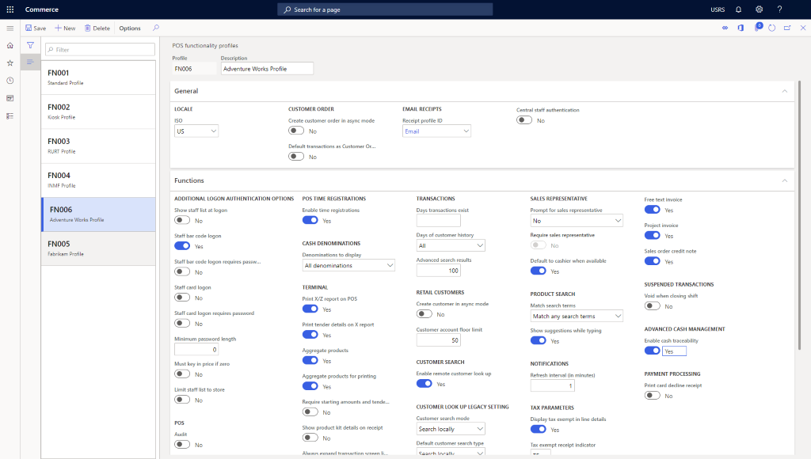

# Create a retail functionality profile

[!include [banner](includes/banner.md)]

This article describes how to create a functionality profile in Microsoft Dynamics 365 Commerce.

The commerce functionality profile provides various settings used for online channels. Each channel must specify a functionality profile.

## Create a functionality profile

To create a functionality profile, follow these steps.

1. In the navigation pane, go to **Modules \> Channel setup \> POS profiles \> Functionality profiles**.
1. On the action pane, select **New**.
1. In the **Profile** field, enter an ID for the profile ("FN006" in the example image below).
1. In the **Description** field, enter a value ("Adventure Works Profile" in the example image below).
1. In the **General** section, select a country for the **ISO** locale.
1. In the **General** section, modify other settings, as needed.
1. In the **General** section, select a **Receipt profile ID** for email receipts.
1. In the **Functions** section, modify settings, as needed.
1. In the **Amount** section, modify settings as, needed.
1. In the **Info Codes** section, modify settings, as needed.
1. In the **Receipt numbering** section, modify settings, as needed. 
  
The following image shows an example functionality profile.
  

## Additional resources

[Info codes and info code groups](info-codes-retail.md)  		  

[Create new address book](new-address-book.md) 

[Screen layout overview](pos-screen-layouts.md)		  

[Configure and install Retail hardware station](retail-hardware-station-configuration-installation.md) 

[!INCLUDE[footer-include](../includes/footer-banner.md)]
