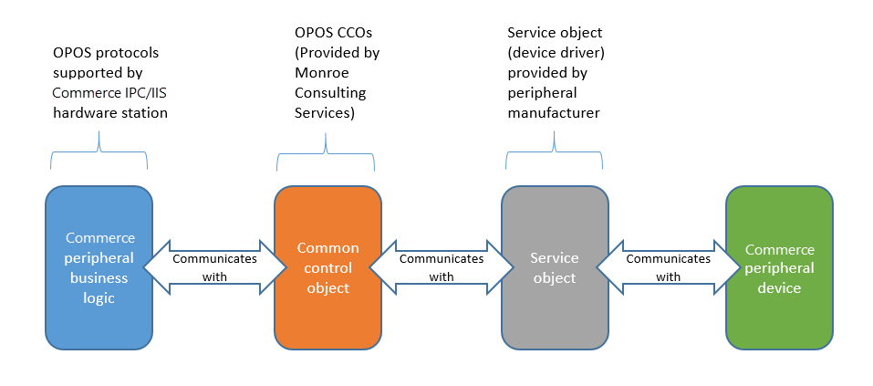

---
# required metadata

title: Peripherals
description: This article explains the concepts that are related to Commerce peripherals. 
author: BrianShook
ms.date: 09/08/2022
ms.topic: article
audience: Application User, IT Pro
ms.reviewer: josaw
ms.custom: ["268444"]
ms.collection: get-started
ms.search.region: Global
ms.author: brshoo
ms.search.validFrom: 2016-11-30

---

# Peripherals

[!include[banner](includes/banner.md)]

This article explains the concepts that are related to store peripherals. It describes the various ways that peripherals can be connected to the point of sale (POS) and the components that are responsible for managing the connection with the POS.

## Concepts

### POS registers

Navigation: Go to **Retail and Commerce \> Channel setup \> POS setup \> Registers**. The point of sale (POS) register is an entity that is used to define the characteristics of a specific instance of the POS. These characteristics include the hardware profile or setup for peripherals that will be used at the register, the store that the register is mapped to, and the visual experience for the user who signs in to that register.

### Devices

Navigation: Go to **Retail and Commerce \> Channel setup \> POS setup \> Devices**. A device is an entity that represents a physical instance of a device that is mapped to a POS register. When a device is created, it's mapped to a POS register. The device entity tracks information about when a POS register is activated, the type of client that is being used, and the application package that has been deployed to a specific device. 

Devices can be mapped to the following application types: Retail Modern POS, Retail Cloud POS, Retail Modern POS – Android, and Retail Modern POS – iOS.

### Modern POS

Modern POS is the POS program for Microsoft Windows. It can be deployed on Windows 10 and Windows 11 operating systems.

### Cloud POS

Cloud POS is a browser-based version of the Modern POS program that can be accessed in a web browser.

### Modern POS for iOS

Modern POS for iOS is an iOS-based version of the Modern POS program that can be deployed on iOS devices.

### Modern POS for Android

Modern POS for Android is an Android-based version of the Modern POS program that can be deployed on Android devices.

### POS peripherals

POS peripherals are devices that are explicitly supported for POS functions. These peripherals are typically divided into specific classes. For more information about these classes, see the "Device classes" section of this article.

### Hardware station

Navigation: Go to **Retail and Commerce \> Channels \> Stores \> All stores**. Select a store, and then select the **Hardware stations** FastTab. The **Hardware station** setting is a channel-level setting that is used to define instances where the peripheral logic will be deployed. This setting at the channel level is used to determine characteristics of the hardware station. It's also used to list hardware stations that are available for a Modern POS instance in a given store. The hardware station is built into the Modern POS programs for Windows and Android. The hardware station can also be deployed independently as a stand-alone Microsoft Internet Information Services (IIS) program. In this case, it's accessed via network.

### Hardware profile

Navigation: Go to **Retail and Commerce \> Channel setup \> POS setup \> POS profiles \> Hardware profiles**. The hardware profile is a list of devices that are configured for a POS register or a hardware station. The hardware profile can be mapped directly to a POS register or a hardware station.

## Devices classes
POS peripherals are typically divided into classes. This section describes and gives an overview of the devices that Modern POS supports.

### Printer

Printers include traditional POS receipt printers and full-page printers. Printers are supported through Object Linking and Embedding for Retail POS (OPOS) and Microsoft Windows driver interfaces. Up to two printers can be used at the same time. This capability supports scenarios where cash-and-carry customer receipts are printed on receipt printers, whereas customer orders, which carry more information, are printed on a full-page printer. Receipt printers can be connected directly to a computer via USB, connected to a network via Ethernet, or connected via Bluetooth.

### Scanner

Up to two bar code scanners can be used at the same time. This capability supports scenarios where a scanner that is more mobile is required in order to scan large or heavy items, whereas a fixed embedded scanner is used for most standard-sized items, to speed up checkout times. Scanners can be supported through OPOS, Universal Windows Platform (UWP), or keyboard wedge interfaces. USB or Bluetooth can be used to connect a scanner to a computer.

### MSR

One USB magnetic stripe reader (MSR) can be set up by using OPOS drivers. If you want to use a stand-alone MSR for electronic funds transfer (EFT) payment transactions, the MSR must be managed by a payment connector. Stand-alone MSRs can be used for customer loyalty entry, employee sign-in, and gift card entry, independently of the payment connector.

### Cash drawer

Two cash drawers can be supported per hardware profile. This capability enables two active shifts per register to be available at the same time. In the case of a shared shift, or a cash drawer that is used by multiple mobile POS devices at the same time, only one cash drawer is allowed per hardware profile. Cash drawers can be connected directly to a computer via USB, connected to a network, or connected to a receipt printer via an RJ12 interface. In some cases, cash drawers can also be connected via Bluetooth.

### Line display

Line displays are used to show products, transaction balances, and other useful information to the customer during a transaction. One line display can be connected to the computer via USB by using OPOS drivers.

### Signature capture

Signature capture devices can be connected directly to a computer via USB by using OPOS drivers. When signature capture is configured, the customer is prompted to sign on the device. After the signature is provided, it's shown to the cashier for acceptance.

### Scale

Scales can be connected to the computer via USB by using OPOS drivers. When a product that is marked as a "Weighed" product is added to a transaction, the POS reads the weight from the scale, adds the product to the transaction, and uses the quantity that the scale provided.

### PIN pad

Personal identification number (PIN) pads are supported through OPOS, but they must be managed via a payment connector.

### Secondary display

When a secondary display is configured, the number 2 Windows display is used to show basic information. By default, the secondary display isn't configurable and shows limited content. The purpose of the secondary display is to support an independent software vendor (ISV) extension. 

### Payment device

Payment device support is implemented through the payment connector. Payment devices can perform one or many of the functions that other device classes provide. For example, a payment device can function as an MSR/card reader, line display, signature capture device, or PIN pad. Support for payment devices is implemented independently of the stand-alone device support that is provided for other devices that are included in the hardware profile.

## Supported interfaces
### OPOS

To help guarantee that the largest range of devices can be used with Commerce, the OLE for POS industry standard is the primary peripheral device platform that is supported. The OLE for POS standard was produced by the National Retail Federation (NRF), which establishes industry-standard communication protocols for peripheral devices. OPOS is a widely adopted implementation of the OLE for POS standard. It was developed in the mid-1990s and has been updated several times since then. OPOS provides a device driver architecture that enables easy integration of POS hardware with Windows–based POS systems. OPOS controls handle communication between compatible hardware and the POS software. An OPOS control consists of two parts:

-   **Control object** – The control object for a device class (such as line displays) provides the interface for the software program. Monroe Consulting Services ([www.monroecs.com](http://www.monroecs.com/)) provides a standardized set of OPOS control objects that are known as the common control objects (CCOs). The CCOs are used to test the POS component of Commerce. Therefore, the testing helps guarantee that, if Commerce supports a device class through OPOS, many device types can be supported, provided that the manufacturer provides a service object that is built for OPOS. You don't have to explicitly test each device type.
-   **Service object** – The service object provides communication between the control object (CCO) and the device. Typically, the service object for a device is provided by the device manufacturer. However, in some cases, you might have to download the service object from the manufacturer's website. For example, a more recent service object might be available. To find the address of the manufacturer's website, see your hardware documentation.

 Support for the OPOS implementation of OLE for POS helps guarantee that, if the device manufacturers and POS publishers implement the standard correctly, POS systems and supported devices can work together, even if they weren't previously tested together. 

> [!NOTE]
> OPOS support doesn't guarantee support for all devices that have OPOS drivers. Commerce must first support that device type, or class, through OPOS. In addition, service objects might not always be up to date with the latest version of the CCOs. You should also be aware that, in general, the quality of service objects varies.

### Windows

Receipt printing at the POS is optimized for OPOS. OPOS tends to be much faster than printing through Windows. Therefore, it's a good idea to use OPOS, especially in environments where 40-column receipts are printed and transaction times must be fast. For most devices, you'll use OPOS controls. However, some OPOS receipt printers also support Windows drivers. By using a Windows driver, you can access the latest fonts and network one printer for multiple registers. However, there are drawbacks to using Windows drivers. Here are some examples of these drawbacks:

-   When Windows drivers are used, images are rendered before printing occurs. Therefore, printing tends to be slower than it is on printers that use OPOS controls.
-   Devices that are connected through the printer ("daisy-chained") might not work correctly when Windows drivers are used. For example, the cash drawer might not open, or the receipt printer might not work as you expect.
-   OPOS also supports a more extensive set of variables that are specific to receipt printers, such as paper cutting or slip printing.
-   Windows printers aren't supported through the IIS hardware station. 

If OPOS controls are available for the Windows printer that you're using, the printer should still work correctly with Commerce.

### Plug and play devices

When a plug and play device is connected to a Windows OS version that supports that type of device, no driver is required for the device to be used as intended. For example, if Windows detects a Bluetooth speaker device, the OS knows that the device has the "Speaker" class type and treats that device as a speaker. No additional setup is required. 

In the case of POS peripherals, many USB devices can be plugged in and recognized by the Windows OS as Human Interface Devices (HIDs). However, Windows might not be able to determine the capabilities that the device provides, because the device doesn't specify the class or type of device. In Windows 10, device classes for bar code scanners and MSRs have been added. Therefore, if a device declares itself to Windows 10 as a device of one of these classes, Windows will listen for events from the device at the appropriate times.

Modern POS supports UWP MSRs and scanners. Therefore, when Modern POS is ready for input from one of these devices, and a device that belongs to one of the device classes is connected, that device can be used. For example, if a plug and play bar code scanner is plugged into a Windows 10 computer, and bar code sign-in is configured for Modern POS, the bar code scanner will become active on the sign-in page. No additional setup is required.

Additional classes of POS peripherals are being added to Windows, such as classes for cash drawers and receipt printers. Support for these new device classes in Modern POS is pending.

> [!NOTE] 
> Certain USB devices may become unresponsive or unreliable when managed by a Windows 10 power management feature called [USB Selective Suspend](/windows-hardware/drivers/usbcon/usb-selective-suspend). If a USB peripheral becomes unresponsive, it may be necessary to disable the selective suspend feature for that device. For more information, see [Enabling Selective Suspend](/windows-hardware/drivers/usbcon/usb-selective-suspend#enabling-selective-suspend). 

### Keyboard wedge

Keyboard wedge devices send data to the computer as if that data were typed on a keyboard. Therefore, by default, the field that is active at the POS will receive the data that is scanned or swiped. In some cases, this behavior can cause the wrong type of data to be scanned into the wrong field. For example, a bar code might be scanned into a field that is intended for input of credit card data. In many cases, there's logic at the POS that determines whether the data that is scanned or swiped is a bar code or card swipe. Therefore, the data is handled correctly. However, when devices are set up as OPOS instead of keyboard wedge devices, there's more control over how the data from those devices can be consumed, because more is "known" about the device that the data originates from. For example, data from a bar code scanner is automatically recognized as a bar code, and the associated record in the database is found more easily and faster than if a generic string search were used, as in the case of keyboard wedge devices.

> [!NOTE]
> When keyboard wedge scanners are used in the POS, they must be programmed to send a carriage return, or **Enter** event, after the last scanned character. If this configuration isn't done, keyboard wedge scanners won't function properly. Consult documentation provided by your device manufacturer for details on how to append the carriage return event.  

### Device printers

Printers of the "Device" type can be configured to prompt the user to select a printer that is configured for the computer. When a printer of the "Device" type is configured, if Modern POS encounters a print command, the user will be prompted to select a printer in a list. This behavior differs from the behavior for Windows drivers, because the "Windows" printer type in the hardware profile doesn't show the user a list of printers. Instead, it requires that a named printer be provided in the **Device name** field.

### Network

Network-addressable cash drawers, receipt printers, and payment terminals can be used over a network, either directly through the Interprocess Communications (IPC) hardware station that is built into the Modern POS for Windows application or through the IIS hardware station for other Modern POS clients.

## Hardware station deployment options

### Dedicated

Modern POS clients for Windows and Android include **Dedicated** or built-in hardware stations. Those clients can communicate directly with peripherals using business logic that is built into the applications. The Android application only supports network devices. For more information on peripheral support for the Android, visit the [Set up POS hybrid app on Android and iOS](./dev-itpro/hybridapp.md) article.

To use the dedicated hardware station, follow these steps.

1. Assign a hardware profile to a register that will use the Modern POS for Windows or Android application.
1. Create a hardware station of the "Dedicated" type for the store where the register will be used. 
1. Open Modern POS in non-drawer mode, and use the **Manage hardware stations** operation to turn on the hardware station capabilities. The dedicated hardware station will be active by default. 
1. Sign out of Modern POS. Then sign back in, and open a shift. The peripherals that are configured in the hardware profile will now be usable. 

> [!NOTE]
> You only need a single hardware station with record type **Dedicated**. Do not set a hardware profile or EFT value on the record; the values will be set on the **POS Register** form. 

### Shared

Also sometimes referred to as the "IIS" hardware station, "IIS" implying that the POS application connects to the hardware station via Microsoft Internet Information Services. The POS application connects to the IIS hardware station via web services that run on a computer where the devices are connected. When the shared hardware station is used, the peripherals that are connected to a hardware station can be used by any POS register that is on the same network as the IIS hardware station. Because only Modern POS for Windows and Android include built-in support for peripherals, all other Modern POS applications must use the IIS hardware station to communicate with POS peripherals that are configured in the hardware profile. Therefore, each instance of the IIS hardware station requires a computer that runs the web service and application that communicates with the devices. 

The shared hardware station can be used to allow multiple point of sale clients to share peripherals or can be used to manage a committed set of peripherals for a single point of sale. 

When a hardware station is used to support sharing of peripherals between multiple POS clients, only cash drawers, receipt printers, and payment terminals should be used. You can't directly connect stand-alone bar code scanners, MSRs, line displays, scales, or other devices. Otherwise, conflicts will occur when multiple POS devices try to claim those peripherals at the same time. Here's how conflicts are managed for supported devices:

-   **Cash drawer** – The cash drawer is opened via an event that is sent to the device. Issues can occur if a cash drawer is called while the drawer is already open. A cash drawer that is used in a shared hardware station configuration should be set to **Shared** in the hardware profile. This setting prevents the POS from checking whether the cash drawer is already open when it sends open commands.
-   **Receipt printer** – If two receipt printing commands are sent to the hardware station at the same time, one of the commands can be lost, depending on the device. Some devices have internal memory or pooling that can prevent this issue. If a print command isn't successful, the cashier receives an error message and can retry the print command from the POS.
-   **Payment terminal** – If a cashier tries to tender a transaction on a payment terminal that is already being used, a message notifies the cashier that the terminal is being used and asks the cashier to try again later. Usually, cashiers can see that a terminal is already being used and will wait until the other transaction is completed before they try to tender again.

Validation is planned for a future release, to detect whether unsupported devices are set up for a hardware profile that is mapped to a shared hardware station. If any unsupported devices are detected, the user will receive a message that states that the devices aren't supported for shared hardware stations. In the case of shared hardware stations, the **Select upon tendering** option is set to **Yes** at the register level. The POS user is then prompted to select a hardware station when a tender is selected for a transaction at the POS. When the hardware station is selected only at the time of tender, the hardware station selection is added directly to the POS workflow for mobile scenarios. As an additional benefit, the line display on the payment terminal isn't used for shared scenarios. If the payment terminal is used as a line display, other users might be blocked from using that terminal until the transaction is completed. In mobile scenarios, lines might be added to a transaction over a longer period. Therefore, the **Select upon tendering** option is required in order to ensure optimum device availability.

### Network peripherals

The network designation for devices in the hardware profile enables cash drawers, receipt printers, and payment terminals to be connected via a network connection.

#### Modern POS for Windows

You can specify IP addresses for network peripherals in two places. If the Modern POS Windows client is using a single set of network peripherals, you should set the IP addresses for those devices by using the **IP configuration** option on the Action Pane for the register itself. In the case of network devices that will be shared among POS registers, a hardware profile that has network devices assigned to it can be mapped directly to a shared hardware station. To assign IP addresses, select that hardware station on the **Stores** page, and then use the **IP configuration** option in the **Hardware stations** section to specify the network devices that are assigned to that hardware station. For hardware stations that have only network devices, you don't have to deploy the hardware station itself. In this case, the hardware station is required only in order to conceptually group network-addressable devices according to their location in the store.

#### Cloud POS and Modern POS for iOS

The logic that drives physically connected and network-addressable peripherals is contained in the hardware station. Therefore, for all POS clients except Modern POS for Windows and Android, an IIS hardware station must be deployed and active to enable the POS to communicate with peripherals, regardless of whether those peripherals are physically connected to a hardware station or addressed over the network.

## Setup and configuration
### Hardware station installation

For guidance about how to install an IIS hardware station, see [Configure and install hardware station](retail-hardware-station-configuration-installation.md).

### Modern POS for Windows setup and configuration

For information, see [Configure, install and activate Modern POS (MPOS)](retail-modern-pos-device-activation.md).

### Modern POS for Android and iOS setup and configuration

For information, see [Set up POS hybrid app on Android and iOS](./dev-itpro/hybridapp.md).

### OPOS device setup and configuration

For more information about OPOS components, see the "Supported interfaces" section of this document. Typically, OPOS drivers are provided by the device manufacturer. When an OPOS device driver is installed, it adds a key to the Windows registry in one of the following locations:

-   **32-bit system:** HKEY\_LOCAL\_MACHINE\SOFTWARE\OLEforRetail\ServiceOPOS
-   **64-bit system:** HKEY\_LOCAL\_MACHINE\SOFTWARE\WOW6432Node\OLEforRetail\ServiceOPOS

Within the ServiceOPOS registry location, configured devices are organized according to the OPOS device class. Multiple device drivers are saved.

## Supported scenarios by hardware station type
### Client support – IPC hardware station vs. IIS hardware station

The following table shows the topologies and deployment scenarios that are supported.

| Client      | IPC hardware station | IIS hardware station |
|-------------|----------------------|----------------------|
| Windows app | Yes                  | Yes                  |
| Cloud POS   | No                   | Yes                  |
| Android     | Yes                  | Yes                  |
| iOS         | No                   | Yes                  |

### Network peripherals

Network peripherals can be supported directly through the hardware station that is built into the Modern POS for Windows and Android applications. For all other clients, you must deploy an IIS hardware station.

| Client      | IPC hardware station | IIS hardware station |
|-------------|----------------------|----------------------|
| Windows app | Yes                  | Yes                  |
| Cloud POS   | No                   | Yes                  |
| Android     | Yes                  | Yes                  |
| iOS         | No                   | Yes                  |

## Supported device types by hardware station type
### Modern POS for Windows with an IPC (built-in) hardware station

<table>
<colgroup>
<col width="50%" />
<col width="50%" />
</colgroup>
<thead>
<tr class="header">
<th>Supported device class</th>
<th>Supported interfaces</th>
</tr>
</thead>
<tbody>
<tr class="odd">
<td>Printer</td>
<td><ul>
<li>OPOS</li>
<li>Windows driver</li>
<li>Device</li>
<li>Network</li>
</ul></td>
</tr>
<tr class="even">
<td>Printer 2</td>
<td><ul>
<li>OPOS</li>
<li>Windows driver</li>
<li>Device</li>
<li>Network</li>
</ul></td>
</tr>
<tr class="odd">
<td>Line display</td>
<td>OPOS</td>
</tr>
<tr class="even">
<td>Dual display</td>
<td>Windows driver</td>
</tr>
<tr class="odd">
<td>MSR</td>
<td><ul>
<li>OPOS</li>
<li>UWP (No setup is required.)</li>
<li>Keyboard wedge (No setup is required.)</li>
</ul></td>
</tr>
<tr class="even">
<td>Drawer</td>
<td><ul>
<li>OPOS</li>
<li>Network  <strong>Note:</strong> Only one drawer can be set up if <strong>Use shared shift</strong> is configured on the drawer.</li>
</ul></td>
</tr>
<tr class="odd">
<td>Drawer 2</td>
<td><ul>
<li>OPOS</li>
<li>Network  <strong>Note:</strong> Only one drawer can be set up if <strong>Use shared shift</strong> is configured on the drawer.</li>
</ul></td>
</tr>
<tr class="even">
<td>Scanner</td>
<td><ul>
<li>OPOS</li>
<li>UWP (No setup is required.)</li>
<li>Keyboard wedge (No setup is required.)</li>
</ul></td>
</tr>
<tr class="odd">
<td>Scanner 2</td>
<td><ul>
<li>OPOS</li>
<li>UWP (No setup is required.)</li>
<li>Keyboard wedge (No setup is required.)</li>
</ul></td>
</tr>
<tr class="even">
<td>Scale</td>
<td>OPOS</td>
</tr>
<tr class="odd">
<td>PIN pad</td>
<td>OPOS (Support is provided through customization of the payment connector.)</td>
</tr>
<tr class="even">
<td>Signature capture</td>
<td>OPOS</td>
</tr>
<tr class="odd">
<td>Payment terminal</td>
<td><ul>
<li>Custom device support</li>
<li>Network (For more information, see the payment connector documentation.)</li>
</ul></td>
</tr>
</tbody>
</table>

### All Modern POS clients that have a committed "Shared" IIS hardware station

> [!NOTE]
> When the IIS hardware station is "committed" there is a one-to-one relationship between the POS client and the hardware station.

<table>
<colgroup>
<col width="50%" />
<col width="50%" />
</colgroup>
<thead>
<tr class="header">
<th>Supported device class</th>
<th>Supported interfaces</th>
</tr>
</thead>
<tbody>
<tr class="odd">
<td>Printer</td>
<td><ul>
<li>OPOS</li>
<li>Network</li>
</ul></td>
</tr>
<tr class="even">
<td>Printer 2</td>
<td><ul>
<li>OPOS</li>
<li>Network</li>
</ul></td>
</tr>
<tr class="odd">
<td>Line display</td>
<td>OPOS</td>
</tr>
<tr class="even">
<td>MSR</td>
<td>OPOS</td>
</tr>
<tr class="odd">
<td>Drawer</td>
<td><ul>
<li>OPOS</li>
<li>Network  <strong>Note:</strong> Only one drawer per hardware profile can be set up if <strong>Use shared shift</strong> is configured on the drawer.</li>
</ul></td>
</tr>
<tr class="even">
<td>Drawer 2</td>
<td><ul>
<li>OPOS</li>
<li>Network</li>
</ul></td>
</tr>
<tr class="odd">
<td>Scanner</td>
<td>OPOS</td>
</tr>
<tr class="even">
<td>Scanner 2</td>
<td>OPOS</td>
</tr>
<tr class="odd">
<td>Scale</td>
<td>OPOS</td>
</tr>
<tr class="even">
<td>PIN pad</td>
<td>OPOS (Support is provided through customization of the payment connector.)</td>
</tr>
<tr class="odd">
<td>Sig. capture</td>
<td>OPOS</td>
</tr>
<tr class="even">
<td>Payment terminal</td>
<td><ul>
<li>Custom device support</li>
<li>Network (For more information, see the payment connector documentation.)</li>
</ul></td>
</tr>
</tbody>
</table>

### All Modern POS clients that share an IIS hardware station

> [!NOTE]
> When the IIS hardware station is "shared," multiple devices can use the hardware station at the same time. For this scenario, you should use only the devices that are listed in the following table. If you try to share devices that aren't listed here, such as bar code scanners and MSRs, errors will occur when multiple devices try to claim the same peripheral. In the future, such a configuration will be explicitly prevented.

<table>
<colgroup>
<col width="50%" />
<col width="50%" />
</colgroup>
<thead>
<tr class="header">
<th>Supported device class</th>
<th>Supported interfaces</th>
</tr>
</thead>
<tbody>
<tr class="odd">
<td>Printer</td>
<td><ul>
<li>OPOS</li>
<li>Network</li>
</ul></td>
</tr>
<tr class="even">
<td>Printer 2</td>
<td><ul>
<li>OPOS</li>
<li>Network</li>
</ul></td>
</tr>
<tr class="odd">
<td>Drawer</td>
<td><ul>
<li>OPOS</li>
<li>Network  <strong>Note:</strong> Only one drawer per hardware profile can be set up if <strong>Use shared shift</strong> is configured on the drawer.</li>
</ul></td>
</tr>
<tr class="even">
<td>Drawer 2</td>
<td><ul>
<li>OPOS</li>
<li>Network</li>
</ul></td>
</tr>
<tr class="odd">
<td>Payment terminal</td>
<td><ul>
<li>Custom device support</li>
<li>Network (For more information, see the payment connector documentation.)</li>
</ul></td>
</tr>
</tbody>
</table>

## Configuration for supported scenarios
For more information about how to create hardware profiles, see [Connect peripherals to the point of sale (POS)](define-maintain-channel-clients-registers-hw-stations.md). 

### Modern POS for Windows with an IPC (built-in) hardware station

This configuration is the most typical configuration for traditional, fixed POS registers. For this scenario, the hardware profile information is mapped directly to the register itself. The EFT terminal number should also be set on the register itself. To set up this configuration, follow these steps.

1.  Create a hardware profile where all the required peripherals are configured.
2.  Map the hardware profile to the POS register.
3.  Create a hardware station of the **Dedicated** type for the store where the POS register will be used. A description is optional. 

    > [!NOTE]
    > You don't have to set any other properties on the hardware station. All other required information, such as the hardware profile, will come from the register itself.

4.  Go to **Retail and Commerce \> Retail and Commerce IT \> Distribution schedule**.
5.  Select the **1090** distribution schedule to sync the new hardware profile to the store. Select **Run now** to sync changes to the POS.
6.  Select the **1040** distribution schedule to sync the new hardware station to the store. Select **Run now** to sync changes to the POS.
7.  Install and activate Modern POS for Windows.
8.  Start Modern POS for Windows, and begin to use the connected peripheral devices.

### Modern POS for Android with an IPC (built-in) hardware station

**New for 10.0.8** - Epson network printers and cash drawers connected to those printers via DK port are now supported for the Modern POS for Android app. For details, visit the [Set up POS hybrid app on Android and iOS](./dev-itpro/hybridapp.md) article.

### All Modern POS clients that have a committed, shared IIS hardware station

This configuration can be used for all Modern POS clients that have a hardware station that is used exclusively by one POS register. To set up this configuration, follow these steps.

1.  Create a hardware profile where all the required peripherals are configured.
2.  Create a hardware station of the **Dedicated** type for the store where the POS register will be used.
3.  On the dedicated hardware station, set the following properties:
    -   **Host name** – The name of the host computer where the hardware station will run. 
    
        > [!NOTE]
        > Cloud POS can resolve **localhost** to determine the local computer where Cloud POS is running. However, the certificate that is required in order to pair Cloud POS with the hardware station must also have "Localhost" as the computer name. To avoid issues, we recommend that you list an instance of each dedicated hardware station for the store, as required. For each hardware station, the host name should be the specific computer name where the hardware station will be deployed.
    
    -   **Port** – The port to use for the hardware station to communicate with the Modern POS client.
    -   **Hardware profile** – If the hardware profile isn't provided on the hardware station itself, the hardware profile that is assigned to the register will be used.
    -   **EFT POS number** – The EFT terminal ID to use when EFT authorizations are sent. This ID is provided by the credit card processor.
    -   **Package name** – The hardware station package to use when the hardware station is deployed.

4.  Go to **Retail and Commerce \> Retail and Commerce IT \> Distribution schedule**.
5.  Select the **1090** distribution schedule to sync the new hardware profile to the store. Select **Run now** to sync changes to the POS.
6.  Select the **1040** distribution schedule to sync the new hardware station to the store. Select **Run now** to sync changes to the POS.
7.  Install the hardware station. For more information about how to install the hardware station, see [Configure and install Retail hardware station](retail-hardware-station-configuration-installation.md).
8.  Install and activate Modern POS. For more information about how to install Modern POS, see [Configure, install and activate Modern POS (MPOS)](retail-modern-pos-device-activation.md).
9.  Sign in to Modern POS, and select **Perform non-drawer operations**.
10. Start the **Manage hardware stations** operation.
11. Select **Manage**.
12. On the hardware station management page, set the option to turn on the hardware station.
13. Select the hardware station to use, and then select **Pair**.
14. After the hardware station is paired, select **Close**.
15. On the hardware station selection page, select the recently selected hardware station to make it active.

### All Modern POS clients that have a shared IIS hardware station

This configuration can be used for all Modern POS clients that share hardware stations with other devices. To set up this configuration, follow these steps.

1.  Create a hardware profile where the required peripherals are configured.
2.  Create a hardware station of the **Shared** type for the store where the POS register will be used.
3.  On the shared hardware station, set the following properties:
    -   **Host name** – The name of the host computer where the hardware station will run.
    -   **Description** – Text that will help identify the hardware station, such as **Returns** or **Front of store**.
    -   **Port** – The port to use for the hardware station to communicate with the Modern POS client.
    -   **Hardware profile** – For shared hardware stations, each hardware station should have a hardware profile. Hardware profiles can be shared among hardware stations, but they must be mapped to each hardware station. In addition, we recommend that you use shared shifts when multiple devices use the same shared hardware station. To set up a shared shift, go to **Retail and Commerce \> Channel setup \> POS setup \> POS profiles \> Hardware profiles**. For each shared hardware profile, select the cash drawer, and set the **Shared shift drawer** option to **Yes**.
    -   **EFT POS number** – The EFT terminal ID to use when EFT authorizations are sent. This ID is provided by the credit card processor.
    -   **Package name** – The hardware station package to use when the hardware station is deployed.

4.  Repeat steps 2 and 3 for each additional hardware station that is required in the store.
5.  Go to **Retail and Commerce \> Retail and Commerce IT \> Distribution schedule**.
6.  Select the **1090** distribution schedule to sync the new hardware profile to the store. Select **Run now** to sync changes to the POS.
7.  Select the **1040** distribution schedule to sync the new hardware station to the store. Select **Run now** to sync changes to the POS.
8.  Install the hardware station on each host computer that you set up in steps 2 and 3. For more information about how to install the hardware station, see [Configure and install Retail hardware station](retail-hardware-station-configuration-installation.md).
9.  Install and activate Modern POS. For more information about how to install Modern POS, see [Configure, install, and activate Modern POS (MPOS)](retail-modern-pos-device-activation.md).
10. Sign in to Modern POS, and select **Perform non-drawer operations**.
11. Start the **Manage hardware stations** operation.

12. Select **Manage**.
13. On the hardware station management page, set the option to turn on the hardware station.
14. Select the hardware station to use, and then select **Pair**.
15. Repeat step 14 for each hardware station that Modern POS will use.
16. After all the required hardware stations are paired, select **Close**.
17. On the hardware station selection page, select the recently selected hardware station to make it active. 

> [!NOTE]
> If devices often use different hardware stations, we recommend that you configure Modern POS to prompt cashiers to select a hardware station when they begin the tender process. Go to **Retail and Commerce \> Channel setup \> POS setup \> Registers**. Select the register, and then set the **Select upon tender** option to **Yes**. Use the **1090** distribution schedule to sync changes to the channel database.

## Extensibility
For information about extensibility scenarios for the hardware station, see [Integrate the POS with a new hardware device and generate the extension installer](dev-itpro/hardware-device-extension.md).

## Security
According to current security standards, the following settings should be used in a production environment: 

### Hardware station installer
The hardware station installer will automatically make these registry edits as part of the installation through self-service.

-   Secure Sockets Layer (SSL) should be disabled.
-   Only Transport Layer Security (TLS) version 1.2 (or the current highest version) should be enabled and used. 

### SSL and TLS
By default, SSL and all version of TLS except TLS 1.2 are disabled. To edit or enable these values, follow these steps:
    1.  Press the Windows logo key+R to open a **Run** window.
    2.  In the **Open** field, type **Regedit**, and then select **OK**.
    3.  If a **User Account Control** message box appears, select **Yes**.
    4.  In the **Registry Editor** window, navigate to **HKEY\_LOCAL\_MACHINESystemCurrentControlSetSecurityProvidersSCHANNELProtocols**. The following keys have been automatically entered to allow for TLS 1.2 only:
        -   TLS 1.2Server:Enabled=1
        -   TLS 1.2Server:DisabledByDefault=0
        -   TLS 1.2Client:Enabled=1
        -   TLS 1.2Client:DisabledByDefault=0
        -   TLS 1.1Server:Enabled=0
        -   TLS 1.1Client:Enabled=0
        -   TLS 1.0Server:Enabled=0
        -   TLS 1.0Client:Enabled=0
        -   SSL 3.0Server:Enabled=0
        -   SSL 3.0Client:Enabled=0
        -   SSL 2.0Server:Enabled=0
        -   SSL 2.0Client:Enabled=0
-   No additional network ports should be open, unless they're required for known, specified reasons.
-   Cross-origin resource sharing must be disabled and must specify the allowed origins that are accepted.
-   Only trusted certificate authorities should be used to obtain certificates that will be used on computers that run the hardware station.

> [!NOTE]
> It's very important that you review security guidelines for IIS and the Payment Card Industry (PCI) requirements.

## Peripheral simulator
For information, see [Peripheral simulator for Commerce](dev-itpro/retail-peripheral-simulator.md).

## Microsoft-tested peripheral devices
### IPC (built-in) hardware station

The following peripherals were tested by using the IPC hardware station that is built into Modern POS for Windows.

#### Printer

| Manufacturer | Model    | Interface | Comments                |
| ------------ | -------- | --------- | ----------------------- |
| Epson        | TM-T88V  | OPOS      |                         |
| Epson        | TM-T88IV | OPOS      |                         |
| HP           | H300     | OPOS      | Powered USB             |
| Star         | TSP650II | Custom    | Connected via network   |
| Star         | mPOP     | OPOS      | Connected via Bluetooth |
| Toshiba      | HSP100   | OPOS      |                         |
| Toshiba      | HSP150   | OPOS      |                         |

> [!NOTE]
> The Star TSP 100 printer isn't supported for the built-in hardware station. The built-in hardware station uses a 64-bit process, which isn't compatible with existing Star TP 100 drivers. 

#### Bar code scanner

| Manufacturer  | Model         | Interface | Comments |
| ------------- | ------------- | --------- | -------- |
| Datalogic     | Magellan 8400 | OPOS      |          |
| Honeywell     | 1900          | UWP       |          |
| HP Integrated | E1L07AA       | OPOS      |          |
| Symbol        | LS2208        | OPOS      |          |

#### Payment terminals and PIN pads

Dynamics 365 Commerce provides an out-of-box solution for integration with Adyen for payment services. The [Dynamics 365 Payment Connector for Adyen](dev-itpro/adyen-connector.md) uses the device-agnostic [Adyen Payment Terminal application programming interface (API)](https://www.adyen.com/blog/introducing-the-terminal-api) and can interact with all payment terminals that this API supports. For a complete list of supported payment terminals, see [Adyen POS terminals](https://www.adyen.com/pos-payments/terminals).

You can also use other payment providers with Dynamics 365 Commerce by creating a custom connector. Any payment terminal that is supported by the payment provider can be used with Dynamics 365 Commerce. Similarly, Dynamics 365 Commerce allows for any payment device integration model that is supported by the payment provider, such as local IP, cloud API, or direct connection (for example, via USB) to the POS. For more information, see [Create an end-to-end payment integration for a payment terminal](dev-itpro/end-to-end-payment-extension.md).

#### Cash drawer

| Manufacturer | Model     | Interface | Comments                |
|--------------|-----------|-----------|-------------------------|
| Star         | mPOP      | OPOS      | Connected via Bluetooth |
| APG          | Atwood    | Custom    | Connected via network   |
| Star         | SMD2-1317 | OPOS      |                         |
| HP           | QT457AA   | OPOS      |                         |
| Epson        |           | Custom    | Connected to network Epson printer via DK port |

#### Line display

| Manufacturer | Model    | Interface | Comments |
| ------------ | -------- | --------- | -------- |
| Epson        | DM-D110  | OPOS      |          |
| HP           | T-series | OPOS      |          |

#### Signature capture

| Manufacturer | Model  | Interface | Comments |
|--------------|--------|-----------|----------|
| Scriptel     | ST1550 | OPOS      |          |

#### Scale

| Manufacturer | Model         | Interface | Comments |
|--------------|---------------|-----------|----------|
| Datalogic    | Magellan 8400 | OPOS      |          |

#### MSR

| Manufacturer | Model       | Interface | Comments |
|--------------|-------------|-----------|----------|
| Magtek       | 21073075    | UWP       |          |
| Magtek       | 21073062    | OPOS      |          |
| HP           | IDRA-334133 | OPOS      |          |

### Dedicated IIS hardware station

The following peripherals were tested by using a dedicated (not shared) IIS hardware station together with Modern POS for Windows and Cloud POS.

#### Printer

| Manufacturer | Model    | Interface | Comments                |
| ------------ | -------- | --------- | ----------------------- |
| Epson        | TM-T88V  | OPOS      |                         |
| Epson        | TM-T88IV | OPOS      |                         |
| HP           | H300     | OPOS      | Powered USB             |
| Star         | TSP650II | Custom    | Connected via network   |
| Star         | mPOP     | OPOS      | Connected via Bluetooth |
| Toshiba      | HSP100   | OPOS      |                         |
| Toshiba      | HSP150   | OPOS      |                         |

#### Bar code scanner

| Manufacturer  | Model         | Interface | Comments |
| ------------- | ------------- | --------- | -------- |
| Datalogic     | Magellan 8400 | OPOS      |          |
| HP Integrated | E1L07AA       | OPOS      |          |
| Symbol        | LS2208        | OPOS      |          |

#### Payment terminals and PIN pads

Dynamics 365 Commerce provides an out-of-box solution for integration with Adyen for payment services. The [Dynamics 365 Payment Connector for Adyen](dev-itpro/adyen-connector.md) uses the device-agnostic [Adyen Payment Terminal API](https://www.adyen.com/blog/introducing-the-terminal-api) and can interact with all payment terminals that this API supports. For a complete list of supported payment terminals, see [Adyen POS terminals](https://www.adyen.com/pos-payments/terminals).

You can also use other payment providers with Dynamics 365 Commerce by creating a custom connector. Any payment terminal that is supported by the payment provider can be used with Dynamics 365 Commerce. Similarly, Dynamics 365 Commerce allows for any payment device integration model that is supported by the payment provider, such as local IP, cloud API, or direct connection (for example, via USB) to the POS. For more information, see [Create an end-to-end payment integration for a payment terminal](dev-itpro/end-to-end-payment-extension.md).

#### Cash drawer

| Manufacturer | Model     | Interface | Comments              |
|--------------|-----------|-----------|-----------------------|
| APG          | Atwood    | Custom    | Connected via network |
| Star         | SMD2-1317 | OPOS      |                       |
| HP           | QT457AA   | OPOS      |                       |
| Epson        |           | Custom    | Connected to network Epson printer via DK port |

#### Line display

| Manufacturer  | Model   | Interface | Comments |
|---------------|---------|-----------|----------|
| HP integrated | G6U79AA | OPOS      |          |
| Epson         | M58DC   | OPOS      |          |

#### Signature capture

| Manufacturer | Model  | Interface | Comments |
|--------------|--------|-----------|----------|
| Scriptel     | ST1550 | OPOS      |          |

#### Scale

| Manufacturer | Model         | Interface | Comments |
|--------------|---------------|-----------|----------|
| Datalogic    | Magellan 8400 | OPOS      |          |

#### MSR

| Manufacturer | Model       | Interface | Comments |
|--------------|-------------|-----------|----------|
| Magtek       | 21073075    | UWP       |          |
| Magtek       | 21073062    | OPOS      |          |
| HP           | IDRA-334133 | OPOS      |          |

### Shared IIS hardware station

The following peripherals were tested by using a shared IIS hardware station together with Modern POS for Windows and Cloud POS. 

> [!NOTE]
> Only a printer, payment terminal, and cash drawer are supported.

#### Printer

| Manufacturer | Model    | Interface | Comments                |
| ------------ | -------- | --------- | ----------------------- |
| Epson        | TM-T88V  | OPOS      |                         |
| Epson        | TM-T88IV | OPOS      |                         |
| HP           | H300     | OPOS      | Powered USB             |
| Star         | mPOP     | OPOS      | Connected via Bluetooth |
| Toshiba      | HSP100   | OPOS      |                         |
| Toshiba      | HSP150   | OPOS      |                         |

#### Payment terminal

Dynamics 365 Commerce provides an out-of-box solution for integration with Adyen for payment services. The [Dynamics 365 Payment Connector for Adyen](dev-itpro/adyen-connector.md) uses the device-agnostic [Adyen Payment Terminal API](https://www.adyen.com/blog/introducing-the-terminal-api) and can interact with all payment terminals that this API supports. For a complete list of supported payment terminals, see [Adyen POS terminals](https://www.adyen.com/pos-payments/terminals).

You can also use other payment providers with Dynamics 365 Commerce by creating a custom connector. Any payment terminal that is supported by the payment provider can be used with Dynamics 365 Commerce. Similarly, Dynamics 365 Commerce allows for any payment device integration model that is supported by the payment provider, such as local IP, cloud API, or direct connection (for example, via USB) to the POS. For more information, see [Create an end-to-end payment integration for a payment terminal](dev-itpro/end-to-end-payment-extension.md).

#### Cash drawer

| Manufacturer | Model     | Interface | Comments              |
|--------------|-----------|-----------|-----------------------|
| APG          | Atwood    | Custom    | Connected via network |
| Star         | SMD2-1317 | OPOS      |                       |
| HP           | QT457AA   | OPOS      |                       |
| Epson        |           | Custom    | Connected to network Epson printer via DK port |

## Troubleshooting
### Modern POS can detect the hardware station in its list for selection, but it can't complete the pairing

**Solution:** Verify the following list of potential failure points:

-   The computer that is running Modern POS trusts the certificate that is used on the computer that runs the hardware station.
    -   To verify this setup, in a web browser, go to the following URL: https://&lt;Computer Name&gt;:&lt;Port Number&gt;/HardwareStation/ping.
    -   This URL uses a ping to verify that the computer can be accessed, and the browser indicates whether the certificate is trusted. (For example, in Internet Explorer, a lock symbol appears in the address bar. When you select this symbol, Internet Explorer verifies whether the certificate is currently trusted. You can install the certificate on the local computer by viewing the details of the certificate that is shown.)
-   On the computer that runs the hardware station, the port that will be used by the hardware station is opened in the firewall.
-   The hardware station has correctly installed merchant account information through the Install merchant information tool that runs at the end of the hardware station installer.

### Modern POS can't detect the hardware station in its list for selection

**Solution:** Either of the following factors can cause this issue:

-   The hardware station hasn't been set up correctly in Headquarters. For more information, see [Configure and install Retail hardware station](retail-hardware-station-configuration-installation.md#troubleshooting). 
-   The jobs haven't been run to update the channel configuration. In this case, run the 1070 job for channel configuration.

### Modern POS doesn't reflect new cash drawer settings

**Solution:** Close the current batch. Changes to the cash drawer aren't updated to Modern POS until the current batch is closed.

### Modern POS is reporting an issue with a peripheral

**Solution:** Here are some typical causes of this issue:

-   Make sure that other device driver configuration utilities are closed. If these utilities are open, they might prevent Modern POS or the hardware station from claiming the device.
-   If the peripheral is shared with multiple POS devices, make sure that it belongs to one of the following categories:
    -   Cash drawer
    -   Receipt printer
    -   Payment terminal

    If the peripheral doesn't belong to one of these categories, the hardware station isn't designed to enable the peripheral to be shared among multiple POS devices.
-   Sometimes, device drivers can cause the common control objects (CCOs) to stop working correctly. If a device has recently been installed, but it isn't working properly or you notice other issues, you can often resolve the issue by reinstalling the CCOs. To download the CCOs, visit <http://monroecs.com/oposccos_current.htm>.
-   If you make frequent peripheral changes during testing or troubleshooting, you might have to reset IIS instead of waiting for the cache to refresh itself. To reset IIS, follow these steps:
    1.  From the **Start** menu, type **CMD**.
    2.  In the search results, right-click **Command prompt**, and then select **Run as administrator**.
    3.  In the **Command prompt** window, type **iisreset /Restart** and then press Enter.
    4.  After IIS has restarted, restart Modern POS.
-   While you're making frequent changes to peripheral devices, if you also frequently start and exit the POS client, the dllhost process from a previous POS session can interfere with the current session. In this case, a device might not be usable until you close the dynamic-link library (DLL) host that is managing the previous session. To close the DLL host, follow these steps:
    1.  From the **Start** menu, type **Task manager**.
    2.  In the search results, select **Task manager**.
    3.  In Task manager, on the **Details** tab, select the column header that is labeled **Name** to sort the table alphabetically by name.
    4.  Scroll down until you find dllhost.exe.
    5.  Select each DLL host, and then select **End task**.
    6.  After the DLL hosts have been closed, restart Modern POS.

## Additional resources

[Peripheral simulator for Commerce](dev-itpro/retail-peripheral-simulator.md)

[!INCLUDE[footer-include](../includes/footer-banner.md)]
