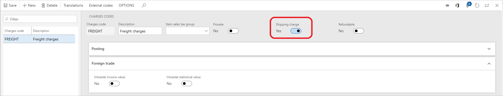
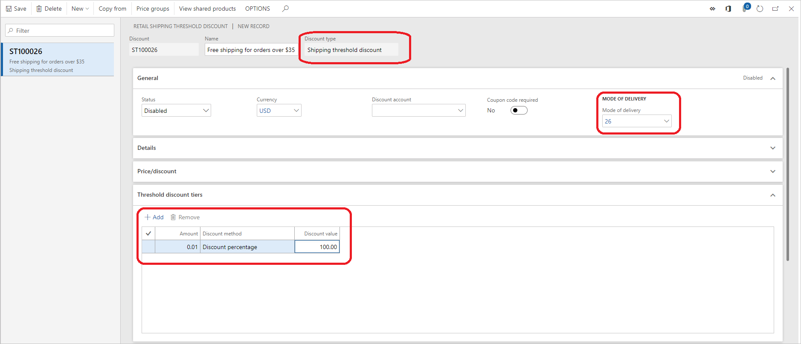

---
# required metadata

title: Shipping discount overview
description: This topic describes the shipping discount capabilities within Dynamics 365 Commerce and the corresponding setup steps required to start using these discounts.
author: ShalabhjainMSFT
ms.date: 01/22/2020
ms.topic: overview
ms.prod: 
ms.technology: 

# optional metadata

ms.search.form: RetailShippingThresholdDiscounts, RetailPriceDiscGroup
# ROBOTS: 
audience: IT Pro
# ms.devlang: 
ms.reviewer: josaw
# ms.tgt_pltfrm: 

ms.assetid: 
ms.search.region: global
ms.search.industry: Retail
ms.author: shajain
ms.search.validFrom: 2019-01-31
ms.dyn365.ops.version: 

---

# Shipping discount overview

[!include [banner](includes/banner.md)]

This topic provides an overview of the shipping promotion capability available within Dynamics 365 Commerce. Free or discounted shipping is one of the highly influencing factors driving the customers' online purchase decisions. Many retailers also leverage the free shipping benefit to motivate the customers to increase their basket size, thus increasing the revenue per transaction. With the 10.0 release of Retail, retailers can use "Retail shipping threshold discount" to define the thresholds, which once met, will qualify the customers for discounted or free shipping. For example, spend $50 or more to get free 'Overnight shipping' or sign up for the loyalty program and get free 'Two-day shipping'. 

This feature leverages the advanced auto charges capability that was available in the call center and e-Commerce modules but has now been made available in POS. For more information, see [Omni-channel advanced auto charges](/dynamics365/unified-operations/retail/omni-auto-charges). These advanced auto charges need to be enabled for shipping promotion to work. These can be enabled by turning on the "Use advanced auto-charges" configuration on the **Commerce parameters** \> **Customer orders** tab. Retailers can use the advanced auto charges feature to set various types of charges such as handling, installation, and disposal, however, the shipping discount is only applied to the shipping charges. Thus, the retailer needs to specify which of the charges are shipping charges. To specify a shipping charge, go to **Retail and Commerce** \> **Retail and Commerce IT** \> **Channel setup** \> **Charges** \> **Charge codes**. Select the **Shipping charge** check box for the desired charges. This is the only prerequisite for using the shipping threshold discount. 

The next step is to configure the shipping discount itself. To do this, go to **Retail and Commerce** \> **Pricing and discounts** \> **shipping discounts** \> **Shipping threshold discount**. You can define the thresholds, set the discount percent that should be applied when the thresholds are met, and choose a mode of delivery for which this discount applies, such as Standard overnight or Two-day shipping.

Like product discounts, this discount honors all the existing standard discount capabilities, such as allowing the retailer to restrict these discounts with coupons so that only the customers with coupons can get these discounts. Also, these discounts leverage the Price groups capability to determine the eligibility of the discount. For example, the retailer can choose to run these promotions only in the online channels and/or across channels for certain customer groups such as loyalty customers. Lastly, to view the charges applied on the sales lines and the applied promotion, you need to add **Manage charges** on the POS screen. Go to the **Screen layout** page to make those changes. Now run the jobs 1020, 1040, 1090, and 1110 to send the charges, shipping promotion, and screen layout information to the channels. 

When the cashier creates a customer order on POS or the customer places an order on an e-Commerce website, the charges are calculated automatically. However, if the mode of delivery on the order meets the mode of delivery and the transaction amount meets the threshold set on the shipping threshold discount, then the shipping discount gets applied. Currently, the shipping discounts apply only on POS and e-Commerce orders. These discounts will also be available for call center orders in a future release of the app. 

> [!NOTE]
> Unlike product discounts such as quantity, simple, mix and match, and threshold discounts, the shipping discount does not create discount lines. Instead, the shipping discount edits the shipping charge directly and appends the name of the discount to the charge description. 

[!INCLUDE[footer-include](../includes/footer-banner.md)]