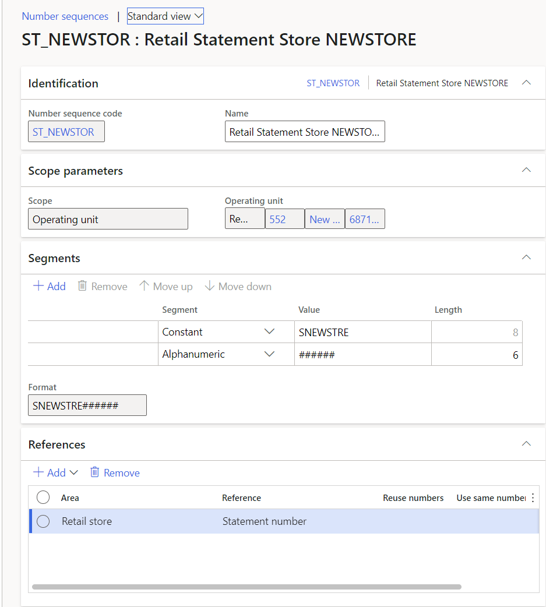
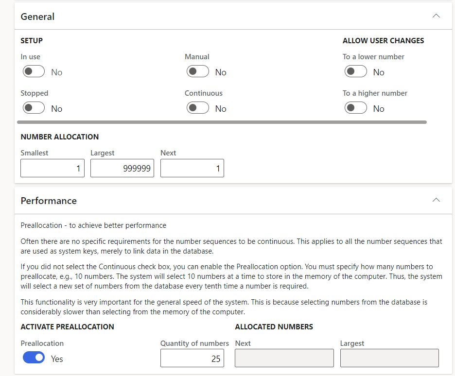

---
# required metadata

title: Set up number sequences for retail statements
description: This topic describes how to configure the number sequences that are required for retail statements in Microsoft Dynamics 365 Commerce.
author: analpert
ms.date: 04/27/2022
ms.topic: article
audience: Application User, Developer, IT Pro
ms.reviewer: v-chgriffin
ms.search.region: Global
ms.author: analpert
ms.search.validFrom: 2022-04-12

---

# Set up number sequences for retail statements

[!include [banner](includes/banner.md)]
[!include [banner](includes/preview-banner.md)]

This topic describes how to configure the number sequences that are required for retail statements in Microsoft Dynamics 365 Commerce.

Two types of retail statements are used in Dynamics 365 Commerce: 

- **Transactional statements** are intended to be created and posted at a high frequency. They are used to post all non-financial transactions in the store to Dynamics 365 Commerce headquarters. 
- **Financial statements** are intended to be created and posted one time per business day. They include only closed shifts from the retail stores that have been uploaded to Commerce headquarters through the p-job.

## Configure a number sequence for statement posting

After you've completed the setup of a retail store, in Commerce headquarters, you must configure a unique number sequence that will be used for statements during the statement creation process.

To configure a number sequence for statement posting in Commerce headquarters, follow these steps.

1. Go to **Organization administration \> Number sequences \> Number sequences**.
1. Select **New \> Number sequence** to create a new record.
1. On the **Identification** FastTab, in the **Number sequence code** field, enter a number sequence code.
1. In the **Number sequence name** field, enter a name.
1. On the **Scope parameters** FastTab, in the **Scope** field, select **Operating unit**.
1. In the **Operating unit** field, select the store that the number sequence will be used for.
1. On the **Segments** FastTab, define the segments.
1. On the **References** FastTab, set the **Area** field to **Retail store**.
1. Set the **Reference** field to **Statement number**, and then select **OK**.

    

1. On the **General** FastTab, in the **Number allocation** section, update the **Smallest** and **Largest** fields so that they match the length of the **Alphanumeric** segment that you defined on the **Segments** FastTab.
1. On the **Performance** FastTab, we recommend that you set the **Preallocation** option to **Yes** and the **Quantity of numbers** field to **25**.

    

1. On the Action Pane, select **Save** to save your changes and close the page.
