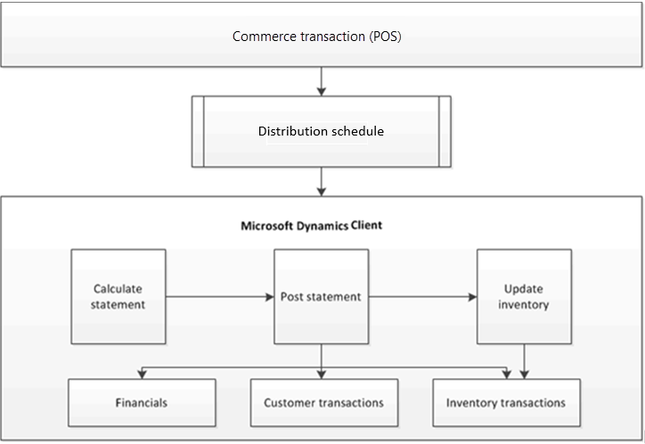

---
# required metadata

title: Retail statements
description: This article describes how statements are created and posted in Microsoft Dynamics 365 Commerce.
author: ashishmsft
ms.date: 02/03/2023
ms.topic: article
ms.prod: 
ms.technology: 

# optional metadata

ms.search.form: RetailParameters
# ROBOTS: 
audience: Application User
# ms.devlang: 
ms.reviewer: josaw
# ms.tgt_pltfrm: 
ms.assetid: df9c62a2-6f13-4a08-bdca-07d041172c1b
ms.search.region: Global
ms.search.industry: Retail
ms.author: asharchw
ms.search.validFrom: 2016-02-28
ms.dyn365.ops.version: Retail July 2017 update

---

# Retail statements

[!include [banner](includes/banner.md)]

This article describes how statements are created and posted in Microsoft Dynamics 365 Commerce.

In Dynamics 365 Commerce, the statement posting process is used to account for the transactions that occur in the Store Commerce app or Store Commerce for web. The statement posting process uses the distribution schedule to pull a set of POS transactions into the Commerce headquarters client. The parameters that are defined on the **Commerce parameters** and **Stores** pages are used to select the transactions that are pulled into individual statements.

The following illustration shows the statement posting process. In this process, transactions that are recorded in the POS are transmitted to the client by using the Commerce scheduler. After the client receives the transactions, you can create, calculate, and post the transaction statement for the store.

## Creating and posting statements

You can create a statement manually or by using batch processes that you set up to run periodically throughout the day. In both cases, the following steps are used to create and post statements.

### Create the statement

This step identifies the store that the statement is manually created for. If you configure a batch process, you can automatically create statements for all stores, based on a schedule that you define.

### Calculate the statement

In this step, the transaction lines are selected based on criteria that are defined for each store on the **Commerce parameters** and **Stores** pages. On these pages, you define the criteria and specify how the transactions are calculated. To view a list of the transactions that are included in the statement before you calculate the statement, use the **Transactions** page.

Statement calculation uses tender declarations from the registers as the counted amount. Alternatively, you can enter the counted amount manually. The statement shows the difference between the sales amount for the transactions and the actual counted amount in all payment methods. The statement is posted only if this difference is less than the maximum posting difference that is defined for the store.

> [!NOTE]
> The statement calculation process uses the global number sequence.

When you calculate a statement, the calculation includes the following tasks:

- For the selected date range, mark transactions that weren't included in a previous statement calculation.
- Calculate the total amounts that were tendered in the selected transactions. The results are shown on the statement lines, depending on the statement method:

    - If the statement method is **Total**, a line is created for each payment method in the selected transactions.
    - If the statement method is **Staff**, a line is created for each payment method in transactions that were performed by the selected staff member.
    - If the statement method is **POS terminal**, a line is created for each payment method in transactions that were performed on the selected register.
    - If the statement method is **Shift**, a line is created for each payment method in transactions that were performed during a shift.

If the **Split by Statement method** check box is selected on the **Stores** page, a separate statement is created based on the value that is selected in the **Statement method** field.

If your store's operating hours extend past midnight, you can configure statement posting so that it's based on the end of the business day instead of the end of the calendar day.

On the **Stores** page, on the **Statement/closing** FastTab, in the **End of business day** field, enter the time that the last transaction must be recorded to be included in the business day's statement. Select the **Post as business day** check box to post the transactions within the same business day. When the statement is posted, transactions that are recorded within the same business day can be included on the same sales order, even if some transactions occur before midnight and other transactions occur after midnight.

#### Example: Post a statement for a business day that extends over two calendar days

A store is open between 8:00 AM and 3:00 AM, and the **Post as business day** check box is selected in the store's configuration. On May 31, the store records transactions between 8:00 AM and midnight. The store also records transactions between 12:01 AM and 3:00 AM on June 1.

When the store posts its statement for the close of the business day, the sales order that is generated includes all transactions that were recorded between the business hours of 8:00 AM and 3:00 AM, even though the transactions occurred on two days, May 31 and June 1.

If the **Post as business day** check box is cleared for the same store, separate sales orders are generated when the store posts its statement for the close of the business day. One sales order includes the transactions that were recorded between the business hours of 8:00 AM and midnight on May 31, and the second sales order includes the transactions that were recorded between the business hours of 12:01 AM and 3:00 AM on June 1.

> [!NOTE]
> Before you can create statements, you should close the shifts in the statement period.

### Post the statement

When you post a statement, sales orders and invoices are created for the sales in the statement.

- Cash and carry sales are aggregated onto one sales order, and are invoiced for the default customer who is assigned to the store.
- Sales for which a customer was added to the transaction in POS generate separate sales orders and invoices, one for each unique customer.

Payment journals are automatically created for the payments in the statement, and the inventory is updated for the POS store.

[!INCLUDE[footer-include](../includes/footer-banner.md)]
