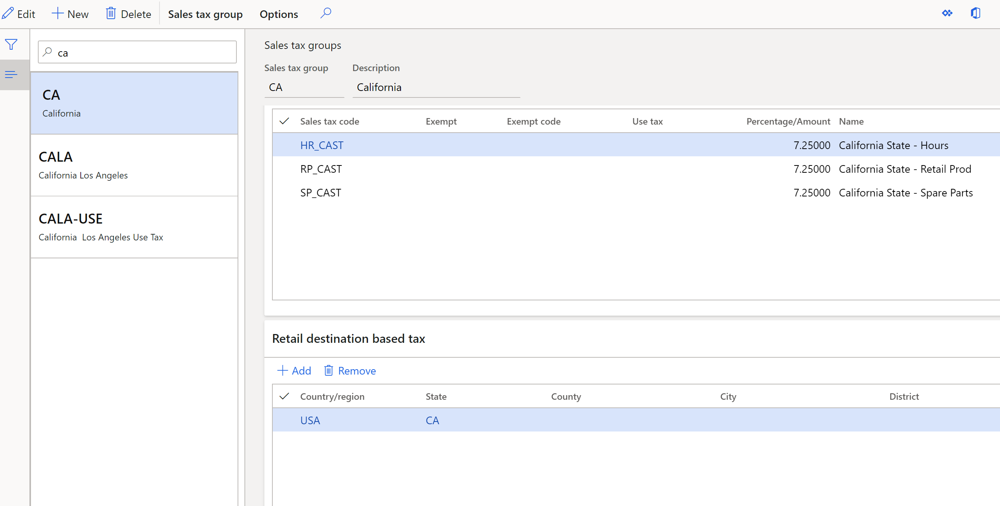

---
# required metadata

title: Configure sales tax for online orders
description: This topic provides an overview and details of sales tax group selection for different online order types in Dynamics 365 Commerce.
author: gvrmohanreddy
manager: AnnBe
ms.date: 11/04/2020
ms.topic: article
ms.prod: 
ms.service: dynamics-365-commerce
ms.technology: 

# optional metadata

# ms.search.form: 
# ROBOTS: 
audience: Application User
# ms.devlang: 
ms.reviewer: v-chgri
ms.search.scope: Core, Operations, Retail
# ms.tgt_pltfrm: 
ms.custom: 
ms.assetid:
ms.search.region: global
ms.search.industry: Retail
ms.author: gmohanv
ms.search.validFrom: 2020-11-01
ms.dyn365.ops.version: 10.0.16

---

# Sales taxes configuration for online orders

This topic provides an overview and details of sales tax group selection for different online order types. 

## Overview

Your e-commerce channel may want to support options like delivery or pickup for online orders and the sales tax applicability is based on the option selected by your online user. When a site customer chooses to buy an item online and gets it shipped to an address, the sales tax is determined based on the customer's shipping address tax group setting. When a customer opts to pick up a purchased item at a store, the sales tax is determined based on the pickup store's tax group setting. 

## Orders shippped to customer address 

In general, taxes for online orders that ship to customer addresses are defined by the destination. Every sales tax group has a "retail destination based tax" configuration in which your business can define destination details such as county/region, state, county, and city in a hierarchical form. When an online order is placed, the tax engine uses the delivery address of every line item in the order, and finds sales tax groups with matching destination-based tax criteria. For example, for an online order with line item delivery address to San Francisco, CA the tax engine finds the sales tax group and sales tax code for CA and then calculates tax for each line item accordingly.  

## Customer-based tax groups

In Commerce headquarters, there are two places where customer tax groups are configured:

- **Customer's profile**
- **Customer's shipping address**

### When a customer's profile has a tax group configured

A customer's profile record in headquarters may have a sales tax group configured, however for online orders the sales tax group configured in a customer's profile will not be used by the tax engine. 

### When a customer's shipping address has a tax group configured

When a customer's shipping address record has a tax group configured and an online order (or line item) is shipped to the the customer's shipping address, the tax group configured in the customer's address record will be used by the tax engine for tax calculations.

#### Configure a tax group for a customer's shipping address record

To configure a tax group for a customer's shipping address record in Commerce headquarters, follow these steps.

1. Go to **All customers**, and then select the desired customer. 
1. On the **Addresses** FastTab, select the desired address, and then select **More options \> Advanced**. 
1. Under **General** tab on the **Manage addresses** form, set the sales tax value as needed.

> [!NOTE]
> The tax group will be defined using the delivery address of the line and the destination-based taxes configured at the tax group itself. For more information, see [Set up taxes for online stores based on destination](https://docs.microsoft.com/dynamicsax-2012/appuser-itpro/set-up-taxes-for-online-stores-based-on-destination).

## Order pickup in store

For order lines with pickup in store and curbside pickup specified, the tax group from the selected pickup store will be applied. For details on how to configure the tax group for a given store, see [Set other tax options for stores](https://docs.microsoft.com/dynamicsax-2012/appuser-itpro/set-other-tax-options-for-stores).

> [!NOTE]
> When an order line is picked up at a store, a customer's address tax settings (if set up) will be ignored by the tax engine and the pickup store's tax configuration will be applied. 

## Additional resources

[Sales tax overview](https://docs.microsoft.com/dynamics365/finance/general-ledger/indirect-taxes-overview?toc=/dynamics365/commerce/toc.json) 

[Sales tax calculation methods in the Origin field](https://docs.microsoft.com/dynamics365/finance/general-ledger/sales-tax-calculation-methods-origin-field?toc=/dynamics365/commerce/toc.json) 

[Sales tax assignment and overrides](https://docs.microsoft.com/dynamics365/supply-chain/procurement/tasks/sales-tax-assignment-overrides?toc=/dynamics365/commerce/toc.json) 

[Whole amount and Interval calculation options for sales tax codes](https://docs.microsoft.com/dynamics365/finance/general-ledger/whole-amount-interval-options-sales-tax-codes?toc=/dynamics365/commerce/toc.json) 

[Calculation of tax exemption](tax-exempt-price-inclusive.md) 

