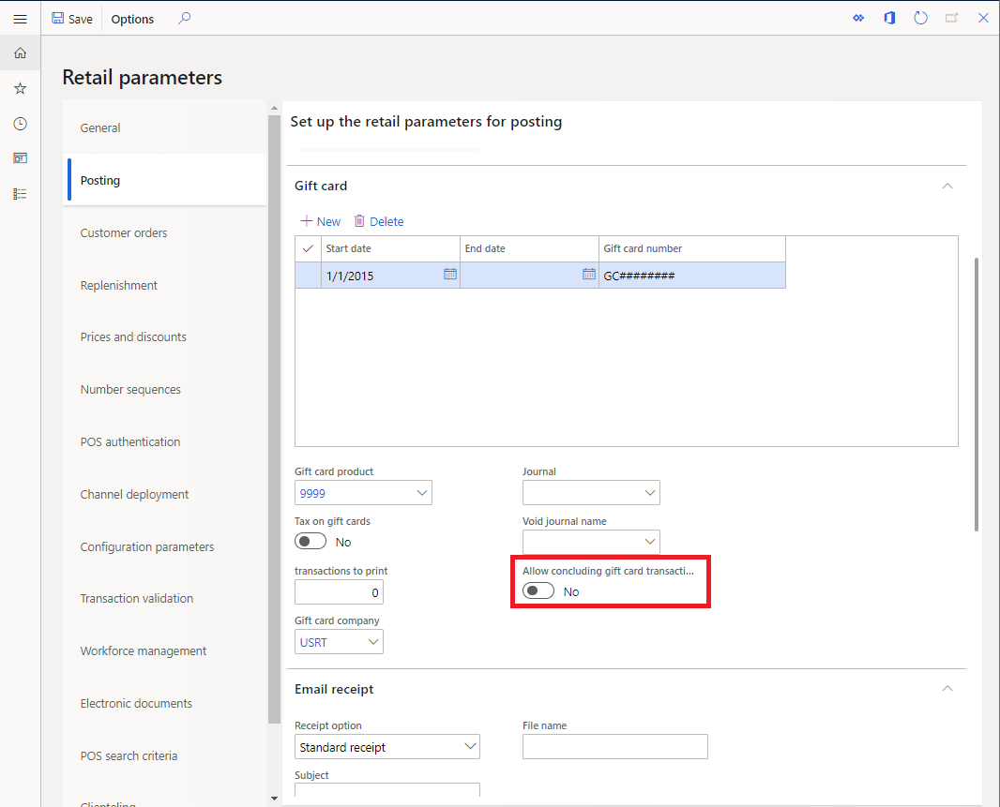
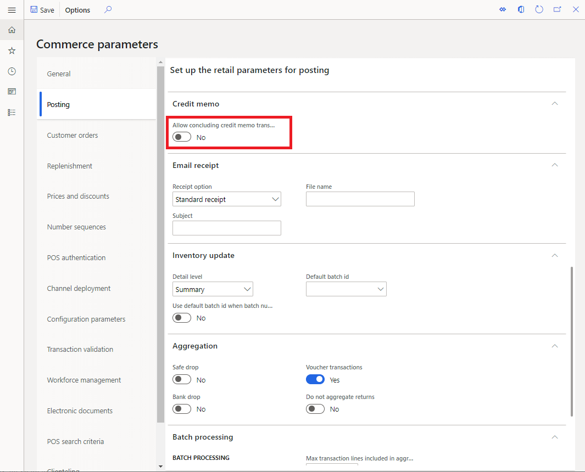

# Seamless offline switch for gift card and credit memo operations

[!include [banner](../finance/includes/banner.md)]

If a point of sale (POS) device loses its connection to the channel database, most POS operations and transactions that were in progress can proceed after the cashier receives a warning message about the loss of connectivity. However, in some cases, transactions have elements that rely on the real-time service, and those elements aren't supported when the POS is offline. This article describes some functionality that helps reduce the impact of lost connectivity in these scenarios.

## Completing gift card transactions in offline mode

Internal gift cards depend on the real-time service, because the balance for the gift cards must be centrally maintained in Microsoft Dynamics 365 Commerce Headquarters. To help prevent fraud or other synchronization issues, gift cards are locked as soon as they are added to a transaction. The locking function ensures that a gift card can't be used on multiple terminals at the same time. When a transaction is completed, the gift card is updated and unlocked.

However, if the POS loses connectivity after a gift card has been added to a transaction, the gift card can become unusable. To help prevent this situation, Dynamics 365 Commerce has a parameter that enables transactions that include a gift card line to be completed while the POS is offline. When this parameter is turned on, gift card transactions that are forced offline will be saved together with offline transactions, and they will be synced to Commerce Headquarters when the offline transactions are synced. The synchronization will also unlock the gift card so that it can be used at another terminal.

To enable the functionality to conclude gift card transactions after switching to offline mode, go to the **Posting** tab on the **Commerce parameters** page. On that tab, locate the **Gift card** fasttab and set **Allow concluding gift card transactions in offline mode** to **Yes**.

Commerce parameters are typically cached. Therefore, after the setting of this parameter is updated, and the distribution schedule is initiated to sync the change to the channel, the change can take up to 24 hours to take effect. To make the change effective immediately, reset Microsoft Internet Information Services (IIS).

## Completing credit memo transactions in offline mode

Like internal gift cards, credit memos are centrally maintained in Commerce Headquarters. Commerce has a parameter that enables credit memo transactions to be completed while the POS is offline. This parameter works like the gift card parameter that was mentioned in the previous section. When the parameter is turned on, credit memo transactions that are forced offline will be synced back to the channel database, together with other transactions that were performed while the POS was offline.

To enable the functionality to conclude credit memo transactions after switching to offline mode, go to the **Posting** tab on the **Commerce parameters** page. On that tab, locate the **Credit memo** fasttab and set **Allow concluding credit memo transactions in offline mode** to **Yes**.

Commerce parameters are typically cached. Therefore, after the setting of this parameter is updated, and the distribution schedule is initiated to sync the change to the channel, the change can take up to 24 hours to take effect. To make the change effective immediately, reset IIS.

## Related articles

- [Offline point of sale (POS) functionality](dev-itpro/pos-offline-functionality.md)
- [Online and offline point of sale (POS) operations](pos-operations.md)

[!INCLUDE[footer-include](../includes/footer-banner.md)]
