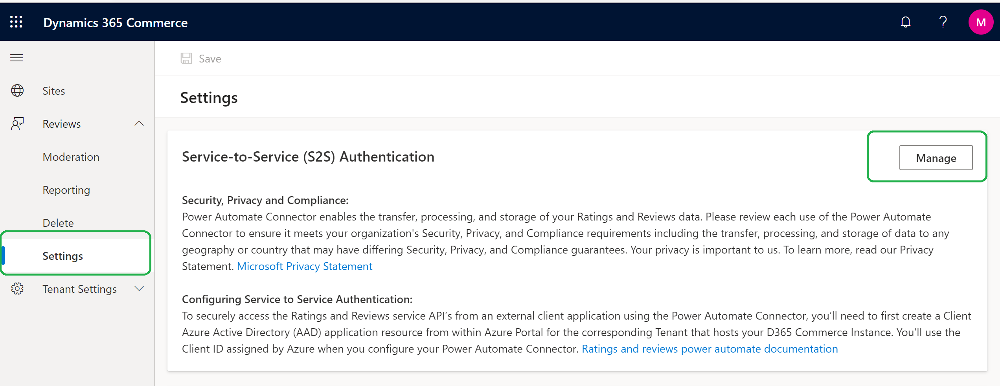
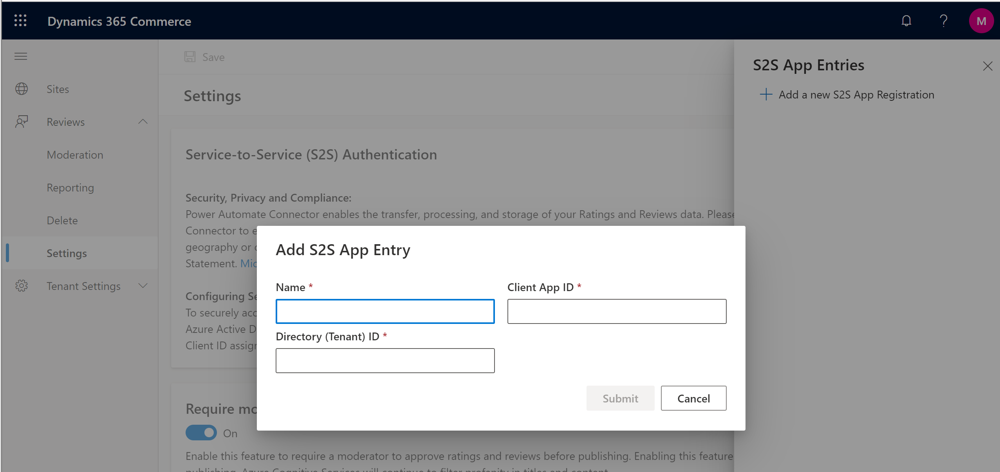

# Configure Service-to-Service authentication

[!include [banner](includes/banner.md)]

This article describes how to configure Service-to-Service (S2S) authentication in Microsoft Dynamics 365 Commerce to securely call service application programming interfaces (APIs) for ratings and reviews.

Dynamics 365 Commerce offers [ratings and reviews](ratings-reviews-overview.md) as an omni-channel solution. This solution enables access to service APIs from outside Commerce, so that various tasks can be performed. These tasks include importing ratings and reviews from your external system into Commerce, and exporting ratings and reviews from Commerce. To enable Commerce to securely call ratings and reviews service APIs, you must first configure S2S authentication by completing the procedures in this article.

## Add a new app registration

Before you add a new app registration, you must create an application by using the [Azure portal](https://portal.azure.com). To register an app in Microsoft Entra and enable authentication, follow the steps in [Use Microsoft Entra ID with a custom connector in Power Automate](/connectors/custom-connectors/azure-active-directory-authentication).

Collect the following IDs from the Azure portal. You will need these IDs in the steps that follow.

- Client application ID
- Client directory (tenant) ID

To add a new app registration in Commerce site builder, follow these steps.

1. Go to **Home \> Reviews \> Settings**.
1. Under **Service-to-Service (S2S) Authentication**, select **Manage**.

    

1. In the **S2S App Entries** pane that appears on the right, select **Add a new S2S App Registration**.
1. In the **Add S2S App Entry** dialog box, enter the following required information. Use the values from your Azure application registration.

    - **Name** – Enter the name of your application (for example, **Fabrikam App**).
    - **Client App ID** – Enter the application ID (for example **00000000-0000-0000-0000-000000000000**).
    - **Directory (Tenant) ID** – Enter the directory ID (for example, **00000000-0000-0000-0000-000000000000**).

    

1. Select **Submit**. The name of your application should appear in the list in the **S2S App Entries** pane.
1. Close the **S2S App Entries** pane.
1. Select **Save**.

## Edit an existing app registration

To edit an existing app registration in Commerce site builder, follow these steps.

1. Go to **Home \> Reviews \> Settings**.
1. Under **Service-to-Service (S2S) Authentication**, select **Manage**.
1. In the **S2S App Entries** pane, select the pencil symbol next to the entry that you want to edit.
1. Update values in the **Name**, **Client App ID**, and **Directory (Tenant) ID** fields as required.
1. Select **Submit**.
1. Close the **S2S App Entries** pane.
1. Select **Save**.

## Remove an existing app registration

To remove an existing app registration in Commerce site builder, follow these steps.

1. Go to **Home \> Reviews \> Settings**.
1. Under **Service-to-Service (S2S) Authentication**, select **Manage**.
1. In the **S2S App Entries** pane, select the trashcan symbol next to the entry that you want to remove. The entry is removed from the list.
1. Close the **S2S App Entries** pane.
1. Select **Save**.

## Additional resources

[Ratings and reviews overview](ratings-reviews-overview.md)

[Opt in to use ratings and reviews](opt-in-ratings-reviews.md)

[Manage ratings and reviews](manage-reviews.md)

[Configure ratings and reviews](configure-ratings-reviews.md)

[Sync product ratings](sync-product-ratings.md)

[Enable manual publishing of ratings and reviews by a moderator](manual-publish-rating-reviews.md)

[Import and export ratings and reviews](import-export-reviews.md)

[Ratings and reviews FAQ](ratings-reviews-faq.md)
