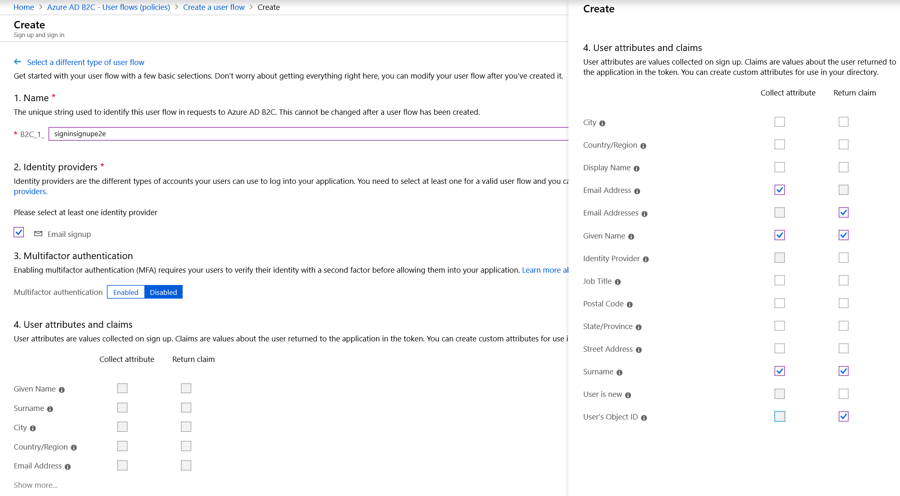
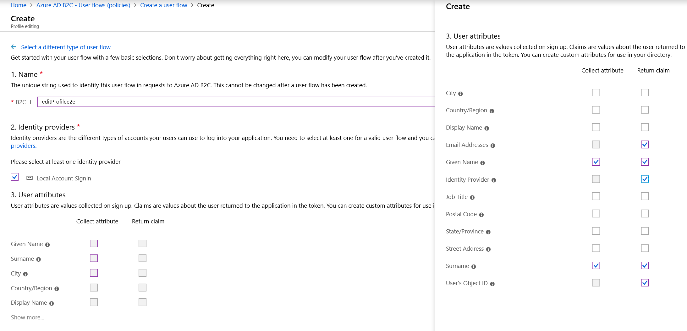
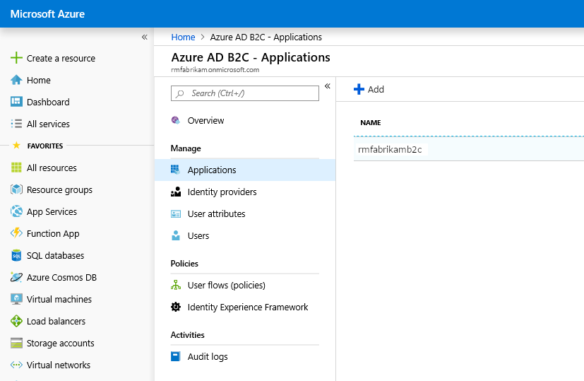

---
# required metadata

title: Set up a B2C tenant in Commerce
description: This topic describes how to set up your Azure Active Directory (Azure AD) business-to-consumer (B2C) tenants for user site authentication in Dynamics 365 Commerce.
author: BrianShook
manager: annbe
ms.date: 02/13/2020
ms.topic: article
ms.prod: 
ms.service: dynamics-365-commerce
ms.technology: 

# optional metadata

ms.search.form:  
audience: Application User
# ms.devlang: 
ms.reviewer: v-chgri
ms.search.scope: 
# ms.tgt_pltfrm: 
# ms.custom: 
ms.search.region: Global
ms.search.industry: retail
ms.author: BriShoo
ms.search.validFrom: 2020-02-13
ms.dyn365.ops.version: 

---

# Set up a B2C tenant in Commerce

[!include [banner](includes/banner.md)]

This topic describes how to set up your Azure Active Directory (Azure AD) business-to-consumer (B2C) tenants for user site authentication in Dynamics 365 Commerce.

## Overview

Dynamics 365 Commerce uses Azure AD B2C to support user credential and authentication flows. A user can sign up, sign in, and reset their password through these flows. Azure AD B2C stores sensitive user authentication information, such as username and password. The user record in the B2C tenant will store either a B2C local account record or a B2C social identity provider record. These B2C records will link back to the customer record in the Commerce environment.

## Create or link to an existing AAD B2C tenant in the Azure portal

1. Sign in to the [Azure portal](https://portal.azure.com/).
1. From the Azure portal menu, select **Create a resource**. Be sure to use the subscription and directory that will be connected with your Commerce environment.

    

1. Go to to **Identity \> Azure Active Directory B2C**.
1. Once on the **Create New B2C Tenant or Link to existing Tenant** page, use one of the options below that best suits your company's needs:

    - **Create a new Azure AD B2C Tenant**: Use this option to create a new AAD B2C tenant.
        1. Select **Create a new Azure AD B2C Tenant**.
        1. Under **Organization name**, enter the organization name.
        1. Under **Initial domain name**, enter the initial domain name.
        1. In the **Country or region** drop down menu, select the country or region.
        1. Select **Create** to create the tenant.

     

     - **Link an existing Azure AD B2C Tenant to my Azure subscription**: Use this option if you already have an Azure AD B2C tenant you want to link to.
        1. Select **Link an existing Azure AD B2C Tenant to my Azure subscription**.
        1. In the **Azure AD B2C Tenant** drop down menu, select the appropriate B2C tenant. If the message "No eligible B2C Tenants found" appears in the selection box, you do not have an existing eligible B2C tenant and will need to create a new one.
        1. For **Resource group**, select **Create new**. Enter a **Name** for the resource group that will contain the tenant, select the **Resource group location**, and then select **Create**.

    

1. Once the new Azure AD B2C directory is created (this may take a few moments), a link to the new directory will appear on the dashboard. This link will direct you to the "Welcome to Azure Active Directory B2C" page.

    

> [!NOTE]
> If you have multiple subscriptions within your Azure account or have set up the B2C tenant without linking to an active subscription, a **Troubleshoot** banner will direct you to link the tenant to a subscription. Select the troubleshooting message and follow the instructions to resolve the subscription issue.

The following image shows an example of an Azure AD B2C **Troubleshoot** banner.

<!--
The link will provide the following options:

For example, to switch directories to the location of your target Azure subscription, click on your account symbol and within the menu, select ‘Switch directory’

1. Navigate back to your main Azure directory.
1. Search for "B2C", and then from the results select **Azure Active Directory B2C**. 
1. On the **Create New B2C Tenant or Link to existing Tenant** page, select **Link an existing Azure AD B2C Tenant to my Azure subscription**. The newly-created B2C tenant instance should now show as an option in the **Azure AD B2C Tenant** selection bar.
1. Finalize the remaining required fields, selecting the ‘Subscription’, ‘Resource group’ (select or create new), and ‘Resource group location’ items.
1. Select **Create** to create the link between the new B2C tenant and the existing Azure subscription.
1. Navigate back to your B2C tenant (switch directory and return to your B2C directory).

-->

## Create the B2C application

Once the B2C tenant has been created, you will create a B2C application within the tenant to interact with the Commerce actions.

To create the B2C application, follow these steps.

1. In the Azure portal, select **Applications** and then select **Add**.
1. Under **Name**, enter the name of the desired AAD B2C application.
1. Under **Web App/Web API**, for **Include web app / web API** select **Yes**.
1. For **Allow implicit flow** select **Yes** (the default value).
1. Under **Reply URL**, enter your dedicated reply URLs. See [Reply URLs](#reply-URLs) below for information on reply URLs and how to format them here.
1. For **Include native client**, select **No** (the default value).
1. Select **Create**.

<!--
The following image shows how to add a B2C application to your tenant.

The following image shows settings for the B2C application.

-->

### Reply URLs

Reply URLs are important as they allow a whitelist of the return domains when your site calls Azure AD B2C to authenticate a user. This allows the return of the authenticated user back to the domain from which they are logging in (your site domain). 

In the **Reply URL** box of the **Azure AD B2c - Applications \> New application** screen, you need to add separate lines for both your site domain and (once your environment is provisioned) the Commerce-generated URL. These URLs must always use a valid URL format, and must be base URLs only (no trailing forward slashes or paths). The string ``/_msdyn365/authresp`` then needs to be appended to the base URLs, as in the following examples.

	``https://fabrikam.com/_msdyn365/authresp``
	``https://fabrikam-prod.commerce.dynamics.com/_msdyn365/authresp``

## Create user flow policies

User flows are the policies Azure AD B2C uses to provide secure sign in, sign up, edit profile, and forget password user experiences. Dynamics 365 Commerce uses these flows to perform the policy actions to interact with the Azure AD B2C tenant. When a user interacts with these policies, they are redirected to the Azure AD B2C tenant to perform the actions.

Azure AD B2C provides three basic user flow types:
- Sign up and sign in
- Profile editing
- Password reset

You can choose to use the default user flows provided by Azure AD, which will display a page hosted by AAD B2C. Alternately, you can create an HTML page to control the look and feel of these user flow experiences. 

To customize the user policy pages for Dynamics 365 Commerce, see [Set up custom pages for user logins](custom-pages-user-logins.md). For additional information, see [Customize the interface of user experiences in Azure Active Directory B2C](https://docs.microsoft.com/en-us/azure/active-directory-b2c/tutorial-customize-ui).

<!--
To create default user flow policies, follow these steps.

1. In the Azure portal, select **User flows (policies)** in the left navigation pane.
1. On the **Azure AD B2C – User flows (policies)** page, select **New User Flow**.
3.  There are three basic flows offered:
    1. Sign up and sign in
    2. Profile editing
    3. Password reset
        
The following image shows

The following image shows how to select a user flow on the **Add User Flow** menu.

-->

### Create a sign up and sign in user flow policy

To create a sign up and sign in user flow policy, follow these steps.

1. In the Azure portal, select **User flows (policies)** in the left navigation pane.
1. On the **Azure AD B2C – User flows (policies)** page, select **New User Flow**.
1. On the **Recommended** tab, select **Sign up and sign in**.
1. Under **Name**, enter a policy name. This name will display afterwards with a prefix the portal assigns (for example, "B2C_1_").
1. Under **Identity providers**, select the appropriate check box.
1. Under **Multifactor Authentication**, select the appropriate choice for your company. 
1. Under **User attributes and claims**, select options to collect attributes or return claims as appropriate. Commerce requires the following default options:

    | **Collect  attribute** | **Return  claim** |
    | ---------------------- | ----------------- |
    |                        | Email Addresses   |
    | Given Name             | Given Name        |
    |                        | Identity Provider |
    | Surname                | Surname           |
    |                        | User’s Object ID  |

1. Select **Create**.
1. Click the newly selected to verify [???]
1. Select **Run user flow** to view the sign up/sign in domain for the policy. This will appear under **Select domain** (for example, fabrikam.b2clogin.com). 

The following image an example of the Azure AD B2C sign up and sign in user flow.

The following image shows the **Run user flow** option in the Azure AD B2C sign up and sign in user flow.

   
### Create a profile editing user flow policy

To create a profile editing user flow policy, follow these steps.

1. In the Azure portal, select **User flows (policies)** in the left navigation pane.
1. On the **Azure AD B2C – User flows (policies)** page, select **New User Flow**.
1. On the **Recommended** tab, select **Profile editing**.
1. Under **Name**, enter a or the profile editing user flow. This name will display afterwards with a prefix the portal assigns (for example, "B2C_1_").
1. Under **Identity providers**, select **Local Account SignIn**.
1. Under **User attributes**, select the following check boxes:
    - **Email Addresses** (**Return claim** only)
    - **Given Name** (**Collect attribute** and **Return claim**)
    - **Identity Provider** (**Return claim** only)
    - **Surname** (**Collect attribute** and **Return claim**)
    - **User's Object ID** (**Return claim** only)
1. Select **Create**.

The following image shows an example of the Azure AD B2C profile editing user flow.

### Create a password reset user flow policy

To create a password reset user flow policy, follow these steps.

1. In the Azure portal, select **User flows (policies)** in the left navigation pane.
1. On the **Azure AD B2C – User flows (policies)** page, select **New User Flow**.
1. On the **Recommended** tab, select **Password Reset**.
1. Under **Name**, enter a name for the password reset user flow.
1. Under **Identity providers**, select **Reset password using email address**.
1. Select **Create**.
1. Under **Application claims**, select the following check boxes:
    - **Email**
    - **Addresses**
    - **Given Name**
    - **Surname**
    - **User's Object ID**
1. Select **Save**.

The following image shows where to set "Reset Password using mail address" in the Azure AD B2C password reset user flow.

## Add social identity providers (Optional)

Social identity providers allow users to use their social accounts for authentication. Adding social identity provider authentication is optional in Dynamics 365 Commerce. 

If social identity provider authentication is not added, the default Azure AD B2C profiles will be the main profiles for your user base. Users will select their own username (their preferred email address) and set a password. Azure AD B2C will authenticate users directly. 

If social identity provider authentication is added and a user chooses one of the social identity providers offered, an entity is still created in the Azure AD B2C tenant. Azure AD B2C will then authenticate the user's credentials with the social identity provider.

> [!NOTE]
> The identity provider sign in creates a record in the B2C tenant, but in a different format than local accounts since it will call the external social identity provider reference for authentication. The user can use the same email address across social identity providers, meaning that the email username used for authentication may not be unique to the tenant. Azure AD B2C will only enforce that users have a unique email address on local B2C accounts.

Before you can add a social identity provider for authentication, you must go to the identity provider's portal and set up an identity provider application as instructed in the Azure AD B2C documentation. A list of links to the documentation is provided below.

- [Amazon](https://docs.microsoft.com/azure/active-directory-b2c/active-directory-b2c-setup-amzn-app)
- [Azure AD (Single Tenant)](https://docs.microsoft.com/azure/active-directory-b2c/active-directory-b2c-setup-oidc-azure-active-directory)
- [Microsoft Account](https://docs.microsoft.com/azure/active-directory-b2c/active-directory-b2c-setup-msa-app)
- [Facebook](https://docs.microsoft.com/azure/active-directory-b2c/active-directory-b2c-setup-fb-app)
- [GitHub](https://docs.microsoft.com/azure/active-directory-b2c/active-directory-b2c-setup-github-app)
- [Google](https://docs.microsoft.com/azure/active-directory-b2c/active-directory-b2c-setup-goog-app)
- [LinkedIn](https://docs.microsoft.com/azure/active-directory-b2c/active-directory-b2c-setup-li-app)
- [OpenID Connect](https://docs.microsoft.com/azure/active-directory-b2c/active-directory-b2c-setup-oidc-idp)
- [Twitter](https://docs.microsoft.com/azure/active-directory-b2c/active-directory-b2c-setup-twitter-app)

### Add and set up a social identity provider

To add and set up a social identity provider, follow these steps.  

1. In the Azure portal, navigate to **Identity Providers**.
1. Select **Add**. The **Add identity provider** screen appears.
1. Under **Name**, enter the name to be displayed to users on your sign in screen.
1. Under **Identity provider type**, select an identity provider from the list.
1. Select **OK**.
1. Select **Set up this identity provider** to access the **Set up the social identity provider** screen.
1. Under **Client ID**, enter the client ID as obtained from the identity provider application setup.
1. Under **Client secret**, enter the client secret as obtained from the identity provider application setup.
1. Attach user flow for sign in sign up policies:
1. Go to **Azure AD B2C – User flows (policies) \> {your sign-in sign-up policy} \> Identity providers**
1. To attach the sign in/sign up user flow policy, select each identity provider you have set up for your account. To test these, select **Run user flow** for each identity provider. A new tab will display the sign-in page displaying the new identity provider selection box.

The following image shows examples of the **Add identity provider** and **Set up the social identity provider** screens in Azure AD B2C.

<!--
The following image shows how to select the added social identity provider user flow from the **Identity Providers** page.

-->

The following image shows an example of how to select identity providers on the Azure AD B2C **Identity Providers** page.

The following image shows an example of a default sign-in screen with a social identity provider sign-in button displayed.

## Update Commerce headquarters with the new Azure AD B2C information

Once the Azure AD B2C provisioning steps above are completed, the Azure AD B2C application must be registered in your Dynamics 365 Commerce environment.

To update headquarters with the new AAD B2C information, follow these steps.

1. In Commerce, go to **Retail and Commerce \> Shared Parameters**.
1. Under **Identity Provider**, do the following:
    1. In the **Issuer** box, enter the identity provider issuer URL. To find your issuer URL, see [Obtain issuer URL](#obtain-issuer-URL) below.
    1. In the **Name** box, enter a name for your issuer record.
    1. In the **Type** box, enter **Azure AD B2C** (id_token).
1. Under **Relying Parties**, do the following:
    1. In the **ClientID** box, enter your B2C application ID. You can find this in the **Application ID** box of your B2C application's properties page.
    1. In the **Type** box, enter **Public**.
    1. In the **User Type** box, enter **Customer**.
1. Select **Disable Manual Number Sequence generation**.

### Obtain issuer URL

To obtain your identity provider issuer URL, follow these steps.

1. Create a metadata address URL in the following format using your B2C tenant and policy: ``https://<B2CTENANTNAME>.b2clogin.com/<B2CTENANTNAME>.onmicrosoft.com/v2.0/.well-known/openid-configuration?p=<B2CSIGN-INPOLICY>``
    - Example: ``https://d365plc.b2clogin.com/d365plc.onmicrosoft.com/v2.0/.well-known/openid-configuration?p=B2C_1_signinup``.
1. Enter the metadata address URL into a browser address bar.
1. In the metadata, copy the identity provider issuer URL (the value for **"issuer"**).
    - Example: ``https://login.fabrikam.com/073405c3-0113-4f43-b5e2-df01266e24ae/v2.0/``.

<!--

-->

## Additional B2C information

### Customer migration

If you are considering migrating customer records from a previous identity provider platform, please work with the Dynamics 365 Commerce team to review your customer migration needs.

For additional Azure AD B2C documentation on customer migration, see [Migrate users to Azure Active Directory B2C](https://docs.microsoft.com/azure/active-directory-b2c/active-directory-b2c-user-migration).

### Custom policies

For additional information regarding customizing Azure AD B2C interactions and policy flows beyond what is offered by B2C standard policies, see [Custom policies in Azure Active Directory B2C](https://docs.microsoft.com/azure/active-directory-b2c/active-directory-b2c-overview-custom). 

### Secondary admin

An optional, secondary administrator account can be added in the **Users** section of your B2C tenant. This can be a direct account or a general account. If you need to share an account across team resources, a common account can also be created. Due to the sensitivity of the data stored in Azure AD B2C, a common account should be monitored closely per your company's security practices.

### b2clogin.com

Use the default ‘b2clogin.com’ domain (default). This part of the URL will be shown for sign-in or reply URLs, and will be viewable in the browser by users.

## Provide Commerce with the B2C application information

Once setup of the Azure AD B2C tenant is completed, provide the Dynamics 365 Commerce team with the details below. These data points will be used in Microsoft Lifecycle Services (LCS) when provisioning your environment.

To collect the required application information, follow these steps.

1. In the Azure portal, go to **Home \> Azure AD B2C - Applications**. 
1. Select your application, and then in the left navigation pane select **Properties** to obtain the application details.
1. From the **Application ID** box, collect the application ID of the B2C application created in your B2C tenant.
1. Under **Reply URL**, collect the reply URL.
1. Go to **Home \> Azure AD B2C – User flows (policies)**, and then collect the names of each user flow policy.
1. Send the collected application information to the Commerce team.

The following image shows an example of the **Azure AD B2C - Applications** page.

<!--

-->

The following image shows an example of an application **Properties** page in Azure AD B2C. 

The following image shows an example of user flow policies on the **Azure AD B2C – User flows (policies)** page.

The following list is an example set of data points to provide to the Commerce team.

- **b2cLoginCustomDomain**: "d365ecom.b2clogin.com"
- **b2cTenantName**: "d365ecom"
- **b2c Application ID**: "22290eb2-c52e-42e9-8b35-a2b0a3bcb9e6"
- **b2cReplyUrl**: "https://prod.fabrikam.com"
- **b2cEditProfilePolicyId**: "B2C_1A_ProfileEdit"
- **b2cSignUpSignInPolicyId**: "B2C_1A_signup_signin"
- **b2cResetPasswordPolicyId**: "B2C_1A_PasswordReset"

## Additional resources

[Configure your domain name](configure-your-domain-name.md)

[Deploy a new e-Commerce site](deploy-ecommerce-site.md)

[Create an e-Commerce site](create-ecommerce-site.md)

[Associate an online site with a channel](associate-site-online-store.md)

[Manage robots.txt files](manage-robots-txt-files.md)

[Set up custom pages for user logins](custom-pages-user-logins.md)

[Add support for a content delivery network (CDN)](add-cdn-support.md)

[Enable location-based store detection](enable-store-detection.md)
