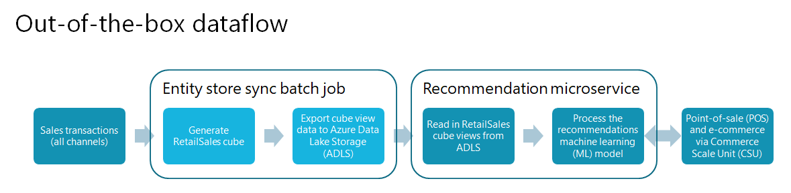
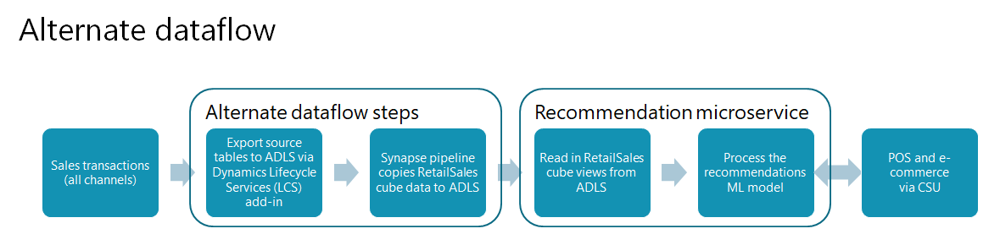

---
# required metadata

title: Set up an alternate dataflow for recommendations
description: This article describes how to configure an environment by using an alternate dataflow to provide data to the recommendations service. 
author: bebeale
ms.date: 04/21/2023
ms.topic: article
audience: Application User, Developer, IT Pro
ms.reviewer: v-chgriffin
ms.search.region: Global
ms.author: bebeale
ms.search.validFrom: 2019-10-31

---

# Set up an alternate dataflow for recommendations

[!include [banner](includes/banner.md)]

This article describes how to configure an environment by using an alternate dataflow to provide data to the recommendations service.

## Comparison of out-of-the-box dataflow with alternate dataflow

The following illustration depicts the out-of-the-box dataflow in an environment.



The following illustration depicts an alternate dataflow, where the entity store sync batch job is replaced with alternate dataflow steps.



## Assumptions

- This article assumes that you've already enabled the recommendations service for your environment. For more information, see [Enable product recommendations](enable-product-recommendations.md).
- When you're working with files and folders in the Microsoft Azure Data Lake storage account:

    - You can use either the Azure web portal interface or the Azure Storage Explorer application.
    - The starting points for working with files and folders are in the **dynamics365-financeandoperations** container that is located under the folder that is named to match your environment URL.
    - If the name of your sandbox environment is **MyUAT**, the environment base URL will be `myuat.sandbox.operations.dynamics.com`.
    - If more than one environment is connected to the same storage account, each environment will have its own root folder.

## Prerequisites

The following prerequisites must be met before you can implement the alternate dataflow approach.

### Set up Microsoft Power Platform

To set up Microsoft Power Platform, follow the instructions in [Enable the Microsoft Power Platform integration](../fin-ops-core/dev-itpro/power-platform/enable-power-platform-integration.md).

### Install the Export to Data Lake add-in

To install the Export to Data Lake add-in, follow the instructions in [Install Export to Azure Data Lake add-in](../fin-ops-core/dev-itpro/data-entities/configure-export-data-lake.md).

> [!NOTE]
> Make note of the configuration values, because you will need them for some of the steps that follow.

### Configure tables to export in Dynamics 365

Table synchronization from Dynamics 365 to Azure Data Lake Storage is managed on the **Export to Data Lake** page. Because that page doesn't currently have a menu item, only users in the **System Administrator** security role can open it.

To configure tables to export in Dynamics 365, follow these steps.

1. To open the **Export to Data Lake** page, add the string `?mi=DataFeedsDefinitionWorkspace` to the environment's base URL, as shown in the following example:

    `https://<environment-URL>/?mi=DataFeedsDefinitionWorkspace`

1. On the **Export to Data Lake** page, and copy the tables that are listed in the [List of RetailSales cube tables](#list-of-retailsales-cube-tables) section of this article.
1. In the **System Name** column, expand the list of filter options.
1. For the filter type, select **is one of**. Then put the cursor in the text box, and paste the list of tables that you copied from the **Export to Data Lake** page.
1. At the bottom of the list of filter options, select **Apply**.
1. Select all the rows in the grid, and then select **Activate**.

> [!NOTE]
> Before you move on to the next step, all rows must be updated to a status of **Running**. Troubleshoot and resolve any errors as required.

### Create a Synapse workspace

To create a Synapse workspace if you don't already have one, follow the instructions in [Quickstart: Create a Synapse workspace](/azure/synapse-analytics/quickstart-create-workspace).

To keep your Azure resources organized, we recommend that you put the Data Lake Storage account and Synapse workspace together in a resource group in Azure. You can reuse the storage account that you created when you installed the Export to Data Lake add-in.

## Create a database in Synapse for recommendation data processing

Use the Common Data Model utility console application (CDMUtil_ConsoleApp) to create a database in your Synapse workspace and populate it from the Common Data Model tables in Data Lake Storage. We recommended that you use the Common Data Model utility with your database in a development environment, in case there are any extensions.

> [!NOTE]
> The following steps assume that no extension data is being added to the RetailSales cube.

To create a database in Synapse, follow these steps.

1. Go to [Dynamics-365-FastTrack-Implementation-Assets GitHub](https://github.com/microsoft/Dynamics-365-FastTrack-Implementation-Assets/tree/master/Analytics/CDMUtilSolution#2-cdmutil-console-app), and follow the steps to download the **CDMUtilConsoleApp.zip** file.
1. Extract the zip file into a local folder.
1. Open the **CDMUtil_ConsoleApp.dll.config** file in a text editor, and update the following values:

    1. Set the **Tenant ID** value (Azure tenant ID).
    1. Set the **Access key** value (the access key for the Data Lake Storage account).

        1. In the Azure portal, open your storage account.
        1. On the menu on the left side of the page, select **Access keys**.
        1. At the top of the page, select **Show keys**.
        1. Select the copy button for one of the two key fields, and then paste the value between the double quotation marks in the configuration file.

    1. Set the **ManifestURL** value to the URL of your **Tables.manifest.cdm.json** file in Azure Data Lake Storage. To obtain the URL, browse to the file in the Azure portal, select the ellipsis (**...**) on the right side of the view, and then select **Properties**. The URL is the first property that is shown on the **Overview** tab.
    1. Set the **TargetDbConnectionString** value to the connection string for the built-in serverless SQL pool of your Synapse workspace.

        1. In the Synapse workspace, select the **Manage** tab.
        1. On the submenu, select **SQL pools**.
        1. Select the name **Built-in** to view the pool's properties.
        1. In the properties dialog box, select the ADO.NET connection type that you want to use. Then copy the connection string value, and paste it between the double quotation marks in the configuration file.

        > [!NOTE]
        > You must have permission to create databases. For ease of use, you might want to use the built-in **sqladminuser** administrator account.

    1. Uncomment the **ProcessEntities** node, and set its value to **true** (for example `<add key="ProcessEntities" value ="true"/>`).

1. Save and close the **CDMUtil_ConsoleApp.dll.config** file.
1. Copy the **EntityList.json** file to the **/Manifest** directory.
1. In a Command Prompt window, run **cdmutil_consoleapp.exe**.

> [!NOTE]
> When you review the output, there should be 35 entities/views, at least 75 tables, and no errors.

## Prepare the Data Lake RetailSales Aggregate Measurements directory

### Back up your current RetailSales cube data from Data Lake Storage

The easiest way to back up your current RetailSales cube data is to rename the **RetailSales** directory in Data Lake Storage **RetailSales-backup** or something similar. This method preserves the existing data in case troubleshooting is required later.

The **/RetailSales** cube folder can be found in the following location:

`<storage-account>/dynamics365-financeandoperations/<environment-url (for example, myuat.sandbox.operations.dynamics.com)>/AggregateMeasurements/RetailSales`

### Create a new RetailSales folder and upload the model file

To create a new **RetailSales** directory and upload the **model.json** file to Data Lake Storage, follow these steps.

1. Create a new empty directory at the same level as the previous directory, and name it **RetailSales**.
1. Upload the **model.json** file to the new directory.

## Create a pipeline to copy the RetailSales cube data

The pipeline will read the RetailSales cube views and export the data to .csv files in Data Lake Storage.

To create a pipeline to copy the RetailSales cube data, follow these steps.

1. In the Synapse workspace, select the **Integrate** tab.
1. Select the plus sign (**+**), and then select **Import from pipeline template**.
1. Download and then select the [ExportRetailSalesCubeViews.zip file](https://aka.ms/reco-alternate-dataflow-files).
1. Select your SQL database linked service.
1. Select your storage account linked service.
1. Open the **Copy Data** tool, and change the **Folder path** property to **\<environment_name\>/...**.

### Test execution of the pipeline

We recommend that you test the pipeline by using only one view. The **RetailSales_RetailMediaTemplateView** view works well because it usually contains fewer than 10 rows.

## Schedule the pipeline to run on a recurring schedule

Every time that the pipeline runs, Azure consumption occurs. We recommended that you schedule executions at intervals of 48 hours or longer. You can always run the pipeline manually if you must sync data immediately. 
 
## Table list for synchronization from Dynamics 365 to Data Lake Storage

The following list of tables is a subset of all the tables that are required for the whole RetailSales cube. Only 15 of the views in the RetailSales cube are used by the recommendations service, and the list of required tables was filtered accordingly.

### List of RetailSales cube tables

- BICalendarOffsets
- BIDateDimension
- BIDateDimensionValue
- Catalog
- CatalogProduct
- CatalogProductCategory
- CustInvoiceJour
- CustInvoiceTrans
- CustTable
- DataArea
- DimensionAttributeValueCombination
- DimensionAttributeValueSet
- DirPartyTable
- EcoResCategory
- EcoResCategoryHierarchy
- EcoResCategoryHierarchyRole
- EcoResColor
- EcoResConfiguration
- EcoResProduct
- EcoResProductCategory
- EcoResProductTranslation
- EcoResSize
- EcoResStyle
- HcmWorker
- InventDim
- InventDimCombination
- InventItemGroup
- InventItemGroupItem
- InventItemSetupSupplyType
- InventTable
- InventTrans
- LogisticsAddressCountryRegion
- LogisticsAddressCountryRegionTranslation
- LogisticsLocation
- LogisticsPostalAddress
- OMHIERARCHYPURPOSE
- RetailAssortmentLookup
- RetailAssortmentLookupChannelGroup
- RetailChannelProfile
- RetailChannelProfileProperty
- RetailChannelTable
- RetailChannelTableExt
- RetailConnDatabaseProfile
- RetailCustInvoiceJourTable
- RetailCustTable
- RetailMediaTemplate
- RetailOfflineProfile
- RetailPeriodicDiscount
- RetailRecoListConfigurationParameters
- RetailSalesTaxOverrideGroup
- RetailSharedParameters
- RetailSpecialCategoryMember
- RetailTenderTypeCardTable
- RetailTenderTypeTable
- RetailTerminalTable
- RetailTmpProductMedia
- RetailTransactionDiscountTrans
- RetailTransactionPaymentTrans
- RetailTransactionPaymentTransExt
- RetailTransactionSalesTrans
- RetailTransactionSalesTransExt
- RetailTransactionTable
- SalesLine
- SalesTable
- SystemParameters
- RETAILCATALOGINTERNALORG
- RETAILGROUPMEMBERLINE
- RETAILINTERNALORGANIZATION
- RETAILSPECIALCATEGORYPRODUCT
- RETAILPRODUCTCATEGORY
- ECORESCONFIGURATION
- DIMENSIONATTRIBUTE
- DIMENSIONATTRIBUTEVALUESET
- DIMENSIONHIERARCHY
- DIMENSIONHIERARCHYINTEGRATION
- DIMENSIONHIERARCHYLEVEL
- DIMENSIONPARAMETER
- OMExplodedOrganizationSecurityGraph

### View list for the parameter to pass to the Synapse pipeline

The following comma-separated list contains the RetailSales cube views that the pipeline will perform a "select" operation on. It will then copy the results to Data Lake Storage.

RetailSales_RetailAssortmentRulesView,RetailSales_RetailChannelNavigationHierarchiesView,RetailSales_RetailChannelNavigationHierarchyCatalogProductsView,RetailSales_RetailChannelNavigationHierarchyCategoryNodesView,RetailSales_RetailChannelNavigationHierarchyCategoryProductsView,RetailSales_RetailMediaBaseUrlChannelView,RetailSales_RetailMediaRelativeUrlProductView,RetailSales_RetailMediaTemplateView,RetailSales_RetailOptOutCustomersView,RetailSales_RetailProductCategory,RetailSales_RetailProductTransaction,RetailSales_RetailProductVariantDimensionsView,RetailSales_RetailRecoListConfigurationParametersView,RetailSales_RetailRecoListsSharedParametersView,RetailSales_RetailEcoResProductTranslation

> [!IMPORTANT]
> The pipeline parameter must be a list of view names that are separated by single commas. There must be no spaces or line feeds.

## Environment-specific fixes

### RETAILCHANNELVIEW fix

The **RETAILCHANNELVIEW** view contains a hard-coded integer that represents an organization of the "retail channel" type. The actual value of the type can change from environment to environment, or from tenant to tenant.

```SQL
CREATE OR ALTER   VIEW [dbo].[RETAILCHANNELVIEW]
AS
SELECT T1.RECID AS RECID1,
       T1.STOREAREA AS STOREAREA,
       T1.OMOPERATINGUNITID AS OMOPERATINGUNITID,
       T1.DEFAULTCUSTACCOUNT AS DEFAULTCUSTOMER,
       T1.RETAILCHANNELID AS RETAILCHANNELID,
       T1.CHANNELTYPE AS CHANNELTYPE,
       T1.PARTITION AS PARTITION,
       T1.RECID AS RECID,
       T2.OMOPERATINGUNITNUMBER AS OMOPERATINGUNITNUMBER,
       T3.NAME AS NAME
FROM   dbo.RETAILCHANNELTABLE AS T1 CROSS JOIN dbo.DIRPARTYTABLE AS T2 CROSS JOIN dbo.DIRPARTYTABLE AS T3
WHERE  ((((T1.OMOPERATINGUNITID = T2.RECID)
          )
         AND ((T2.RECID = T3.RECID)
              ))
        AND T2.INSTANCERELATIONTYPE IN (8363));
```

To update the hard-coded integer, follow these steps.

1. In Dynamics 365, look up the **ChannelID** value for your online channel.
1. In an instance of SQL Server Management Studio (SSMS) that is attached to the Synapse database, run the following query.

    ```SQL
    select INSTANCERELATIONTYPE, NAME, NAMEALIAS, * from dbo.DIRPARTYTABLE where RECID IN (select OMOPERATINGUNITID from dbo.RETAILCHANNELTABLE where RETAILCHANNELID =     <channelID>)
    ```

1. Copy the value from the first column (**INSTANCERELATIONTYPE**), and paste it into the view definition.

## Troubleshooting

### Pipeline task fails

There should be 15 pipeline task executions for the **CopyData** task. If any execution fails, you must validate that all the dependent SQL objects exist, and that the queries run. The easiest way to get to all the dependencies is to use SSMS to connect to the database. You can then select and hold (or right-click) a view and select **Generate CREATE as to a new window**.

The error message might include the following text:

- Error: Failure happened on 'Source' side
- Error handling external file: 'Max errors count'.
- /RetailSales/RetailSales_xxxxxx

#### Example scenario

In this example, the **RetailSales_RetailProductCategory** task fails, and you receive a "Max errors count" error.

To debug the error, follow these steps.

1. Open the **EntityList.json** file in a text editor (for example, Visual Studio Code).
1. Find the view definition for **RetailSales_RetailProductCategory**.

    ```SQL
    CREATE  VIEW [dbo].[RetailSales_RetailProductCategory] AS SELECT 0 AS ROW_UNIQUEKEY ,CATEGORY AS CATEGORYID ,PRODUCT AS PRODUCTID ,PRODUCTNAME ,CATEGORYNAME     ,PARENTCATEGORY AS PARENTCATEGORYID ,PARTITION ,RECID FROM RetailProductCategoryView
    ```

1. This view depends on only one other view: **RetailProductCategoryView***. Find the view definition for **RetailProductCategoryView**.

    ```SQL
    CREATE VIEW [DBO].[RETAILPRODUCTCATEGORYVIEW] AS SELECT T1.CATEGORY AS CATEGORY, T1.PRODUCT AS PRODUCT, T1.PARTITION AS PARTITION, T1.RECID AS RECID, T2.PRODUCTNAME AS PRODUCTNAME, T2.PARTITION AS PARTITION#2, T3.NAME AS CATEGORYNAME, T3.PARENTCATEGORY AS PARENTCATEGORY, T3.PARTITION AS PARTITION#3 FROM RETAILPRODUCTCATEGORY T1 CROSS JOIN ECORESPRODUCTTRANSLATIONS T2 CROSS JOIN RETAILCATEGORYEXPANDED T3 WHERE((( T1.PRODUCT = T2.PRODUCT) AND ( T1.PARTITION = T2.PARTITION)) AND (( T1.CATEGORY = T3.RECID) AND ( T1.PARTITION = T3.PARTITION)))
    ```

1. This view depends on three other views: **RETAILPRODUCTCATEGORY**, **ECORESPRODUCTTRANSLATIONS**, and **RETAILCATEGORYEXPANDED**. Find the definition for each of these views, and list its dependencies. Continue until you find all the dependent views.

    Here is the whole list in dependency tree order. Thirteen views must be validated.

    - RetailSales_RetailProductCategory

        - RetailProductCategoryView

            - RETAILPRODUCTCATEGORY

                - ECORESPRODUCTCATEGORY
                - ECORESCATEGORYHIERARCHYROLE
                - RETAILSPECIALCATEGORYPRODUCT

                    - ECORESPRODUCT
                    - RETAILGROUPMEMBERLINE
                    - RETAILSPECIALCATEGORYMEMBER

            - ECORESPRODUCTTRANSLATIONS

                - ECORESPRODUCT
                - ECORESPRODUCTTRANSLATION
                - SYSTEMPARAMETERS

            - RETAILCATEGORYEXPANDED

                - ECORESCATEGORY
                - ECORESCATEGORYHIERARCHYROLE

1. In Excel, create the following 13 **select count(\*) from \<view_name\>** statements. Run these statements in SSMS, and send the results to text. Then scroll through the results to see whether any of the views failed. The initial error suggests that at least one of the views will fail.

    ```SQL
    select count(*) from RetailProductCategoryView
    select count(*) from RETAILPRODUCTCATEGORY
    select count(*) from ECORESPRODUCTCATEGORY
    select count(*) from ECORESCATEGORYHIERARCHYROLE
    select count(*) from RETAILSPECIALCATEGORYPRODUCT
    select count(*) from ECORESPRODUCT
    select count(*) from RETAILGROUPMEMBERLINE
    select count(*) from RETAILSPECIALCATEGORYMEMBER
    select count(*) from ECORESPRODUCTTRANSLATIONS
    select count(*) from ECORESPRODUCTTRANSLATION
    select count(*) from SYSTEMPARAMETERS
    select count(*) from RETAILCATEGORYEXPANDED
    select count(*) from ECORESCATEGORY
    ```

1. One way to validate what you're looking at is to create a root-dependent view to generate the view definition in SSMS. Then verify that there is an Azure Data Lake file column that is named **r.filepath**. The presence of this column will indicate that the view that you're inspecting is reading data from Data Lake Storage.

## Additional resources

[Product recommendations overview](product-recommendations.md)

[Enable Azure Data Lake Storage in a Dynamics 365 Commerce environment](enable-adls-environment.md)

[Enable personalized recommendations](personalized-recommendations.md)

[Enable "shop similar looks" recommendations](shop-similar-looks.md)

[Opt out of personalized recommendations](opt-out-personalization.md)

[Add product recommendations on POS](product.md)

[Add recommendations to the transaction screen](add-recommendations-control-pos-screen.md)

[Adjust AI-ML recommendations results](modify-product-recommendation-results.md)

[Manually create curated recommendations](create-editorial-recommendation-lists.md)

[Create recommendations with demo data](product-recommendations-demo-data.md)

[Product recommendations FAQ](faq-recommendations.md)

[!INCLUDE[footer-include](../includes/footer-banner.md)]
