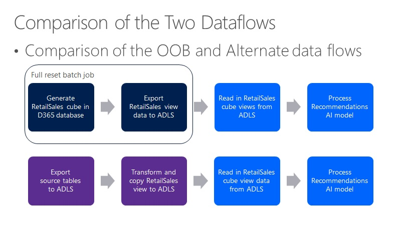

---
# required metadata

title: Set up an alternate dataflow for recommendations
description: This article describes how to configure an environment using an alternate dataflow to provide data to the recommendations service. 
author: bebeale
ms.date: 07/26/2022
ms.topic: article
ms.prod: 
ms.technology: 

# optional metadata

ms.search.form: 
# ROBOTS: 
audience: Application User
# ms.devlang: 
ms.reviewer: josaw
# ms.tgt_pltfrm: 
ms.custom: 
ms.assetid: 
ms.search.region: global
ms.search.industry: Retail, eCommerce
ms.author: bebeale
ms.search.validFrom: 2019-10-31
ms.dyn365.ops.version: 10.0.5

---

# Set up an alternate dataflow for recommendations

[!include [banner](includes/banner.md)]

This article describes how to configure an environment using an alternate dataflow to provide data to the recommendations service. 



## Assumptions

- This document assumes you have already enabled the recommendations service for your environment. For more information, see [Enable product recommendations](enable-product-recommendations.md).
- When working with files and folders in the Microsoft Azure Data Lake storage account:
    - You can use either the Azure web portal interface or the the Azure Storage Explorer application.
    - The starting points for working with files and folders is in the container named **dynamics365-financeandoperations** that is located under the folder that is named to match your environment URL. 
    - If your sandbox environment name is **MyUAT**, then the environment base URL would be `myuat.sandbox.operations.dynamics.com`. 
    - If you have more than one environment connected to the same storage account, each environment will have its own root folder.

## Prerequisites

The following prerequisites must be met to implement the alternate dataflow approach.

### Set up Microsoft Power Platform

For instructions on setting up Microsoft Power Platform, see [Enable the Microsoft Power Platform integration](../fin-ops-core/dev-itpro/power-platform/enable-power-platform-integration.md).

### Install the Export to Data Lake add-in

To install the Export to Data Lake add-in, follow the instructions in [Install Export to Azure Data Lake add-in](../fin-ops-core/dev-itpro/data-entities/configure-export-data-lake.md).

> [!NOTE]
> Make notes of these values. They will be needed later during the configuration steps.

### Configure tables to export in Dynamics 365

Table syncing from Dynamics 365 to Azure Date Lake Store is managed in the **Export to Data Lake** form. The form doesn't currently have a menu item so a user must be in the **System Administrator** security role to open it. 

To configure tables to export in Dynamics 365, follow these steps.

1. To open the form, add the string `?mi=DataFeedsDefinitionWorkspace` to the environment's base URL, as shown in the following example: 

    `https://<environment-URL>/?mi=DataFeedsDefinitionWorkspace`

1. Open the **Export to Data Lake** form and copy the tables listed in [List of Retail Sales cube tables](#list-of-retail-sales-cube-tables).
1. On the **System Name** column, expand the filter options drop-down list. 
1. For the filter type, select **is one of**, place your cursor in the text box, and then paste in the table list copied from the **Export to Data Lake** form.
1. At the bottom of the filter drop-down list, select **Apply**.
1. Select all rows in the grid, and then select **Activate**.

> [!NOTE]
> Ensure that all rows update to the status of **Running** before proceeding to the next step. Troubleshoot and resolve any errors before proceeding.

### Create a Synapse workspace

To create a Synapse workspace if you don't already have one, follow the instructions in [Quickstart: Create a Synapse workspace](/azure/synapse-analytics/quickstart-create-workspace).

To keep your Azure resources organized, it's recommnended that you put the Azure Data Lake Store storage account and Synapse workspace together in a resource group in Azure. You can reuse the storage account you created when you installed the Export to Data Lake add-in.

## Create a database in Synapse for recommendations data processing

Use the Common Data Model (CDM) utility console application (CDMUtil_ConsoleApp) to create a database in your Synapse workspace and populate it from the CDM tables in your Azure Data Lake storage. It's recommended to use the CMD utility in a development environment with your database, in case there are any extensions. 

> [!NOTE] 
> The following steps assume that no extension data is being added to the Retail Sales cube.

To create a database in Synapse, follow these steps.

1. Go to [Dynamics-365-FastTrack-Implementation-Assets GitHub](https://github.com/microsoft/Dynamics-365-FastTrack-Implementation-Assets/tree/master/Analytics/CDMUtilSolution#2-cdmutil-console-app) to follow the steps and download the CDMUtilConsoleApp.zip file.
1. Extract the .zip file into a local folder.
1. Open the **CDMUtil_ConsoleApp.dll.config** file in a text editor and update the following values:
    1. Set the Tenant ID value (Azure tenant ID).
    1. Set the Access key value (the access key for the Azure Data Lake storage account).
        1. In the Azure portal, open your storage account. In the menu on the left side of the page, select **Access keys**. 
        1. At the top of the page, select **Show keys**.
        1. Select the copy symbol for one of the two key fields and then paste it into the config file between the double quotes.
    1. Set the **ManifestURL** value to the URL of your **Tables.manifest.cdm.json** file in Azure Data Lake Store. To obtain the URL, browse to the file In the Azure portal, select the ellipsis (**...**) on the right side of the view, and then select **Properties**. The first property displayed on the overview tab is the URL.
    1. Set the **TargetDbConnectionString** value to the connection string for the built-in serverless SQL pool of your Synapse workspace by doing the following:
        1. In the Synapse workspace, open the **Manage** tab. 
        1. Select **SQL pools** in the submenu. 
        2. Select the name **Built-in** to view its properties.
        3. In the properties dialog box, select the ADO.NET connection type you want to use and then copy the connection string value and paste it into the config file between the double quotes. 
      > [!NOTE]
      > The user must have permission to create databases. For ease of use, you might want to use the built-in administrator account **sqladminuser**.
  5. Uncomment the **ProcessEntities** node and set its value to **true**, for example `<add key="ProcessEntities" value ="true"/>`.
  6. Save and close the **CDMUtil_ConsoleApp.dll.config** file.
  7. Copy the **EntityList.json** file to the **/Manifest** directory.
  8. In a command prompt window, run **cdmutil_consoleapp.exe**.

> [!NOTE]
> When reviewing the output, there should be 35 entities/views, at least 75 tables, and no errors.

## Prepare the Data Lake RetailSales Aggregate Measurements directory

### Back up your current Retail Sales cube data from Azure Data Lake storage

The easiest way to back up your current Retail Sales cube data is to rename the **RetailSales** directory in Azure Data Lake storage to **RetailSales-backup** or something similar. This method preserves the existing data in case troubleshooting is required later.

The **/RetailSales** cube folder can be found in the following location: 

`<storage-account>/dynamics365-financeandoperations/<environment-url>(for example, myuat.sandbox.operations.dynamics.com)/AggregateMeasurements/RetailSales`

### Create a new RetailSales folder and upload the model file

To create a new **RetailSales** directory and upload the **model.json** file in Azure Data Lake storage, follow these steps.

1. Create a new empty directory named **RetailSales** at the same level as the previous directory.
1. Upload the **model.json** file to the new directory.

## Create a pipeline to copy the Retail Sales cube data

The pipeline will read the Retail Sales cube views and export the data to .csv files in the Azure Data Lake storage.

To create a pipeline to copy the Retail Sales cube data, follow these steps.

1.	In the Synapse workspace, select the **Integrate** tab.
1.	Select the plus symbol (**+**), and then select **Import from pipeline template**.
1.	Download and then select the [ExportRetailSalesCubeViews.zip file](https://aka.ms/reco-alternate-dataflow-files).
1.	Select your SQL database linked service.
1.	Select your storage account linked service.
1.	Open the **CopyData** task and change the folder property to **<environment_name>/...**.

### Test execution of the pipeline

It's recommended to test the pipeline using only one view. The **RetailSales_RetailMediaTemplateView** view works well as it usually contains fewer than 10 rows.

## Schedule the pipeline to run on a recurring schedule

Every time the pipeline runs, Azure consumption occurs. It's recommended to schedule executions at intervals of 48 hours or longer. You can always execute the pipeline manually if you need to sync data immediately. 
 
## Table list for syncing from Dynamics 365 to Azure Data Lake Store

The following list of tables is a subset of all tables needed for the whole Retail Sales cube. Only 15 of the views in the Retail Sales cube are used by the recommendations service and the list of tables needed was filtered accordingly.

### List of Retail Sales cube tables

|Table 1|
| --- |
|BICalendarOffsets <br>
BIDateDimension <br>
BIDateDimensionValue <br>
Catalog <br>
CatalogProduct <br>
CatalogProductCategory <br>
CustInvoiceJour <br>
CustInvoiceTrans <br>
CustTable <br>
DataArea <br>
DimensionAttributeValueCombination <br>
DimensionAttributeValueSet <br>
DirPartyTable <br>
EcoResCategory <br>
EcoResCategoryHierarchy <br>
EcoResCategoryHierarchyRole <br>
EcoResColor <br>
EcoResConfiguration <br>
EcoResProduct <br>
EcoResProductCategory <br>
EcoResProductTranslation <br>
EcoResSize <br>
EcoResStyle <br>
HcmWorker <br>
InventDim <br>
InventDimCombination <br>
InventItemGroup <br>
InventItemGroupItem<br>
InventItemSetupSupplyType<br>
InventTable<br>
InventTrans<br>
LogisticsAddressCountryRegion<br>
LogisticsAddressCountryRegionTranslation<br>
LogisticsLocation<br>
LogisticsPostalAddress<br>
OMHIERARCHYPURPOSE<br>
RetailAssortmentLookup<br>
RetailAssortmentLookupChannelGroup<br>
RetailChannelProfile<br>
RetailChannelProfileProperty<br>
RetailChannelTable<br>
RetailChannelTableExt<br>
RetailConnDatabaseProfile<br>
RetailCustInvoiceJourTable<br>
RetailCustTable<br>
RetailMediaTemplate<br>
RetailOfflineProfile<br>
RetailPeriodicDiscount<br>
RetailRecoListConfigurationParameters<br>
RetailSalesTaxOverrideGroup<br>
RetailSharedParameters<br>
RetailSpecialCategoryMember<br>
RetailTenderTypeCardTable<br>
RetailTenderTypeTable<br>
RetailTerminalTable<br>
RetailTmpProductMedia<br>
RetailTransactionDiscountTrans<br>
RetailTransactionPaymentTrans<br>
RetailTransactionPaymentTransExt<br>
RetailTransactionSalesTrans<br>
RetailTransactionSalesTransExt<br>
RetailTransactionTable<br>
SalesLine<br>
SalesTable<br>
SystemParameters<br>
RETAILCATALOGINTERNALORG <br>
RETAILGROUPMEMBERLINE<br>
RETAILINTERNALORGANIZATION<br>
RETAILSPECIALCATEGORYPRODUCT<br>
RETAILPRODUCTCATEGORY<br>
ECORESCONFIGURATION<br>
DIMENSIONATTRIBUTE<br>
DIMENSIONATTRIBUTEVALUESET<br>
DIMENSIONHIERARCHY<br>
DIMENSIONHIERARCHYINTEGRATION <br>
DIMENSIONHIERARCHYLEVEL <br>
DIMENSIONPARAMETER <br>
OMExplodedOrganizationSecurityGraph |

### View list for parameter to pass into the Synapse pipeline

The following comma-separated list of Retail Sales cube views contains the views that the pipeline will perform a "select" operation on and then copy the results to Azure Data Lake storage. 

RetailSales_RetailAssortmentRulesView,RetailSales_RetailChannelNavigationHierarchiesView,RetailSales_RetailChannelNavigationHierarchyCatalogProductsView,RetailSales_RetailChannelNavigationHierarchyCategoryNodesView,RetailSales_RetailChannelNavigationHierarchyCategoryProductsView,RetailSales_RetailMediaBaseUrlChannelView,RetailSales_RetailMediaRelativeUrlProductView,RetailSales_RetailMediaTemplateView,RetailSales_RetailOptOutCustomersView,RetailSales_RetailProductCategory,RetailSales_RetailProductTransaction,RetailSales_RetailProductVariantDimensionsView,RetailSales_RetailRecoListConfigurationParametersView,RetailSales_RetailRecoListsSharedParametersView,RetailSales_RetailEcoResProductTranslation|

> [NOTE]
> The pipeline parameter must be a list of view names separated by single commas with no spaces or line feeds.

## Environment-specific fixes

### RETAILCHANNELVIEW fix

The **RETAILCHANNELVIEW** view contains a hardcoded integer that represents a "retail channel" type of organization. The actual value of the type can change from environment to environment, or from tenant to tenant.

```SQL
CREATE OR ALTER   VIEW [dbo].[RETAILCHANNELVIEW]
AS
SELECT T1.RECID AS RECID1,
       T1.STOREAREA AS STOREAREA,
       T1.OMOPERATINGUNITID AS OMOPERATINGUNITID,
       T1.DEFAULTCUSTACCOUNT AS DEFAULTCUSTOMER,
       T1.RETAILCHANNELID AS RETAILCHANNELID,
       T1.CHANNELTYPE AS CHANNELTYPE,
       T1.PARTITION AS PARTITION,
       T1.RECID AS RECID,
       T2.OMOPERATINGUNITNUMBER AS OMOPERATINGUNITNUMBER,
       T3.NAME AS NAME
FROM   dbo.RETAILCHANNELTABLE AS T1 CROSS JOIN dbo.DIRPARTYTABLE AS T2 CROSS JOIN dbo.DIRPARTYTABLE AS T3
WHERE  ((((T1.OMOPERATINGUNITID = T2.RECID)
          )
         AND ((T2.RECID = T3.RECID)
              ))
        AND T2.INSTANCERELATIONTYPE IN (8363));
```

To update the hardcoded integer, follow these steps.

1. In Dynamics 365, look up the **ChannelID** for your online channel.
1. In a SQL Server Management Studio instance attached to the Synapse database, run the following query:

    ```SQL
    select INSTANCERELATIONTYPE, NAME, NAMEALIAS, * from dbo.DIRPARTYTABLE where RECID IN (select OMOPERATINGUNITID from dbo.RETAILCHANNELTABLE where RETAILCHANNELID =     <channelID>)
    ```
1. Copy the value from the first column (**INSTANCERELATIONTYPE**), and then paste it into the view definition.

## Troubleshooting

### Pipeline task fails

There should be 15 pipeline task executions for the **CopyData** task. If any of them fail, you will need to validate that all the dependent SQL objects exist and the queries execute. To get to all the dependencies, it is easiest to use SQL Server Management Studio to connect to the database. You can then right-click on a view and select Generate CREATE as to a new window’

Example error message text includes: 
- Error: Failure happened on 'Source' side
- Error handling external file: 'Max errors count'.   
- /RetailSales/RetailSales_xxxxxx

#### Example scenario

As an example, let's say that the **RetailSales_RetailProductCategory** task fails with a "Max errors count" error. 

To debug the error, follow these steps.

1. Open the **EntityList.json** file in a text editor (for example, Visual Studio Code).
1. Find the view definition for **RetailSales_RetailProductCategory**.

    ```SQL
    CREATE  VIEW [dbo].[RetailSales_RetailProductCategory] AS SELECT 0 AS ROW_UNIQUEKEY ,CATEGORY AS CATEGORYID ,PRODUCT AS PRODUCTID ,PRODUCTNAME ,CATEGORYNAME     ,PARENTCATEGORY AS PARENTCATEGORYID ,PARTITION ,RECID FROM RetailProductCategoryView
    ```

1. This view depends on only one other view: **RetailProductCategoryView***. Find the view definition for **RetailProductCategoryView**.

    ```SQL
    CREATE VIEW [DBO].[RETAILPRODUCTCATEGORYVIEW] AS SELECT T1.CATEGORY AS CATEGORY, T1.PRODUCT AS PRODUCT, T1.PARTITION AS PARTITION, T1.RECID AS RECID, T2.PRODUCTNAME AS PRODUCTNAME, T2.PARTITION AS PARTITION#2, T3.NAME AS CATEGORYNAME, T3.PARENTCATEGORY AS PARENTCATEGORY, T3.PARTITION AS PARTITION#3 FROM RETAILPRODUCTCATEGORY T1 CROSS JOIN ECORESPRODUCTTRANSLATIONS T2 CROSS JOIN RETAILCATEGORYEXPANDED T3 WHERE((( T1.PRODUCT = T2.PRODUCT) AND ( T1.PARTITION = T2.PARTITION)) AND (( T1.CATEGORY = T3.RECID) AND ( T1.PARTITION = T3.PARTITION)))
    ```

1. This view depends on three other views: **RETAILPRODUCTCATEGORY**, **ECORESPRODUCTTRANSLATIONS**, **RETAILCATEGORYEXPANDED**. Find the definitions for each of these views and list their dependencies. Continue until you find all the dependent views.
1. For this example, the following is the whole list in dependency tree order. There are 13 views that need to be validated.

- RetailSales_RetailProductCategory
   - RetailProductCategoryView
      - RETAILPRODUCTCATEGORY
         - ECORESPRODUCTCATEGORY
         - ECORESCATEGORYHIERARCHYROLE
         - RETAILSPECIALCATEGORYPRODUCT
            - ECORESPRODUCT
            - RETAILGROUPMEMBERLINE
            - RETAILSPECIALCATEGORYMEMBER
      - ECORESPRODUCTTRANSLATIONS
         - ECORESPRODUCT
         - ECORESPRODUCTTRANSLATION
         - SYSTEMPARAMETERS
      - RETAILCATEGORYEXPANDED
         - ECORESCATEGORY
         - ECORESCATEGORYHIERARCHYROLE


1. In Microsoft Excel, create 13 **select count(\*) from <view_name>** statements as shown below. Run these in SQL Server Management Studio sending results to text and scroll through the results to see if any of the views failed. The initial error suggests that at least one of them will.

    ```SQL
    select count(*) from	RetailProductCategoryView
    select count(*) from	RETAILPRODUCTCATEGORY
    select count(*) from	ECORESPRODUCTCATEGORY
    select count(*) from	ECORESCATEGORYHIERARCHYROLE
    select count(*) from	RETAILSPECIALCATEGORYPRODUCT
    select count(*) from	ECORESPRODUCT
    select count(*) from	RETAILGROUPMEMBERLINE
    select count(*) from	RETAILSPECIALCATEGORYMEMBER
    select count(*) from	ECORESPRODUCTTRANSLATIONS
    select count(*) from	ECORESPRODUCTTRANSLATION
    select count(*) from	SYSTEMPARAMETERS
    select count(*) from	RETAILCATEGORYEXPANDED
    select count(*) from	ECORESCATEGORY
    ```

1. One technique to validate what you are looking at is to create a root dependent view to generate the view definition in SQL Server Management Studio and then verify that there is an Azure Data Lake file column named **r.filepath**. That will indicate that the view you are looking at is reading data from the Azure Data Lake storage.

## Additional resources

[Product recommendations overview](product-recommendations.md)

[Enable Azure Data Lake Storage in a Dynamics 365 Commerce environment](enable-adls-environment.md)

[Enable personalized recommendations](personalized-recommendations.md)

[Enable "shop similar looks" recommendations](shop-similar-looks.md)

[Opt out of personalized recommendations](personalization-gdpr.md)

[Add product recommendations on POS](product.md)

[Add recommendations to the transaction screen](add-recommendations-control-pos-screen.md)

[Adjust AI-ML recommendations results](modify-product-recommendation-results.md)

[Manually create curated recommendations](create-editorial-recommendation-lists.md)

[Create recommendations with demo data](product-recommendations-demo-data.md)

[Product recommendations FAQ](faq-recommendations.md)


[!INCLUDE[footer-include](../includes/footer-banner.md)]
