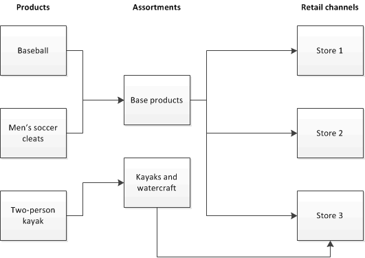

# Set up assortments

[!include [banner](includes/banner.md)]

This article describes what an assortment is and explains how to set up assortments in Dynamics 365 Commerce.

An assortment is a collection of related products that you assign to a commerce channel, such as a brick-and-mortar store or an online store. You use assortments to identify the products that are available in each store. An assortment can include categories of products. Therefore, all products that are assigned to a specific category are included in the assortment. An assortment can also include specific products and specific variants of products. By setting up an assortment, you can assign thousands of products to your channels at that same time, in any combination that your stores require. You can set up as many product assortments as you require. Each product can be included in one or more assortments, and each assortment can be assigned to one or more channels. For example, you define one assortment that includes a base set of products. All stores receive this assortment. You then define another assortment that includes only large sporting equipment. Only your larger stores receive this assortment. The following diagram shows how products can be assigned to assortments, and how those assortments can be assigned to channels.

## Prerequisites

Before you can set up an assortment and assign it to a commerce channel, you must complete the following tasks.

| Task                              | Description |
|-----------------------------------|-------------|
| Set up a channel.          | Channels represent a brick-and-mortar store, an online store, or an online marketplace. You must set up at least one channel and configure the options for the store. Assortments are assigned to stores to identify the products that a particular store carries. |
| Create an organization hierarchy. | After you set up the commerce channels for your organization, you must configure an organization hierarchy that represents the organizational structure of your channels. An organization hierarchy can be used for assortments, replenishment, and reporting. By adding your channels to an organization hierarchy, you can assign assortments to groups of stores. Instead of assigning the assortment individually to each store, you assign the assortment to the high-level organization node. Then, whenever a new channel is added to the high-level organization node, that channel automatically inherits any assortments that were assigned to the higher-level organization node. You can assign assortments only to channels that are included in an organization hierarchy that is assigned the **Retail assortment** purpose. |
| Define products.                  | Before you can add products to an assortment, you must add them in Commerce. You can add products manually, or you can import them from a vendor. After you add the products, you must release them to a legal entity. Only products that have been released to a legal entity can be made available to your channels. Products that haven't yet been released to a legal entity can be added to an assortment, and the assortment can be approved. However, until the products have been released to a legal entity, they can't be made available to the channels. |
| Set up a category hierarchy.      | When you create your commerce products, you can group and categorize them by using the category hierarchy feature. You can create one core hierarchy to group and categorize all products that you distribute through your channels. You can also create separate, supplemental category hierarchies to group or categorize your products for special purposes, such as promotions or assortments. By using category hierarchies, you can assign all the products in a specific category to an assortment. Any products that are added to the category that is included in the assortment are automatically included in the assortment. Then, the next time that the commerce assortment scheduler is run, these products become available to the channels that the assortment is assigned to. |

## Setting up an assortment

After you complete the prerequisites, you can create an assortment and assign it to your channels. To set up an assortment, you must complete the following tasks.

1. Create a new assortment, or copy an existing assortment.
2. Select the channels or the high-level groups of channels that the assortment applies to.
3. Add product categories, individual products, or product variants to the assortment. You can include all products in a specific category, or you can exclude selected products from a category that is included in the assortment.
4. Publish the assortment. When you publish an assortment, the assortment scheduler is automatically run. This process generates the list of products. When this process is completed, the products become available to the channels that the product assortment is assigned to. If changes are made to an assortment that has been published, or to the channels that the assortment is assigned to, the assortment must be updated. To update the assortment when changes are made, you can run the assortment scheduler as a batch job.

[!INCLUDE[footer-include](../includes/footer-banner.md)]
