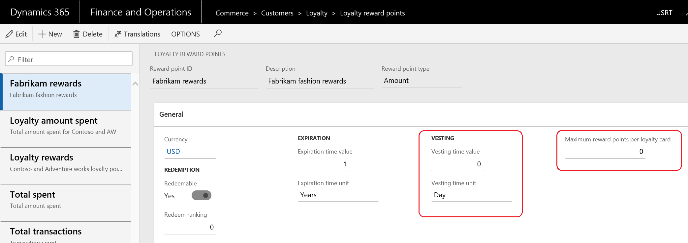

# Loyalty overview

[!include [banner](includes/banner.md)]

Loyalty programs can help increase customer loyalty by rewarding customers for their interactions with the retailer's brand. In Dynamics 365 Commerce, you can set up simple or complex loyalty programs that apply across your legal entities in any commerce channel. This article describes the loyalty capabilities within Commerce and the corresponding setup steps to help the retailer easily get started with their loyalty programs.

You can set up your loyalty program so that they include the following options.

- Set up multiple types of rewards that you offer in your loyalty programs, and track participation in your loyalty programs.
- Set up loyalty programs that represent the different reward incentives that you offer. You can include loyalty program tiers to offer greater incentives and rewards to customers who shop more frequently or spend more money in your stores.
- Define earning rules to identify the activities that a customer must complete to earn rewards. You can also define redemption rules to identify when and how a customer can redeem rewards.
- Issue loyalty cards from any channel that participates in your loyalty programs, and link loyalty cards to one or more loyalty programs that the customer can participate in. You can also link a customer record to a loyalty card, so that the customer can pool loyalty points from multiple cards and redeem them.
- Manually adjust loyalty cards, or transfer the loyalty rewards balance from one card to another to accommodate or reward a customer.

The following video provides an overview and demo of loyalty capabilities in Dynamics 365 Commerce.

> [!VIDEO https://www.microsoft.com/videoplayer/embed/RE5c2wW]

## Setting up loyalty programs

You must set up several components to enable the loyalty feature in Commerce. The following diagram illustrates the loyalty components and how they relate to each other.

## Loyalty components

The following table describes each component and where it's used in the loyalty setup.

| Component                                        | Description | Where it's used |
|--------------------------------------------------|-------------|-----------------|
| Set up discounts (prerequisite)                  | Set up the discounts that you offer to your loyalty customers. For example, you can offer 5 percent off all apparel products. | Discounts must be added to price groups before they can be included in a loyalty program. Price groups are assigned to loyalty programs and loyalty tiers. |
| Set up price groups (prerequisite)               | Price groups are used to create and manage prices and discounts for products. Set up the price groups that include the discounts that apply to your loyalty programs. | Price groups are assigned to loyalty programs and loyalty program tiers. |
| Set up channels (prerequisite)                   | Commerce channels are the stores that participate in your loyalty programs, such as a brick-and-mortar store, an online store, or a call center. You must set up your channels before you can assign loyalty programs to them. | You assign channels to a loyalty program if the channel is participating in the loyalty program. |
| Set up the loyalty payment method (prerequisite) | To ensure the loyalty points can be redeemed in any channel, such as brick and mortar stores, online stores, or call centers, you must set up the bin range for the loyalty cards on the **Card numbers** page. | Set up a loyalty type payment method, and then assign the loyalty payment method to the channels that are participating in the loyalty program. |
| Set up date intervals                            | Date intervals provide a flexible way to set the time span that applies to loyalty tiers. Use date intervals to specify how long a customer can stay in a tier or how much time a customer has to complete an activity to qualify for a tier. | Date intervals apply only if you use tiers in your loyalty programs. You select the date interval that applies to program tiers, and also the date intervals that apply to program tier rules. |
| Set up reward points                             | Reward points are the types of reward that you offer to your customers. Rewards points can be redeemable or non-redeemable. Redeemable reward points can be exchanged for products. Non-redeemable reward points are used for tracking purposes or to advance a customer to the next tier in a loyalty program. | Reward points are referenced in tier rules and are used to qualify a customer for a specific tier. Reward points are also referenced in loyalty schemes in earning and redemption rules. In earning rules, you specify the rewards that a customer can earn for a specific activity. In redemption rules, you specify the reward that the customer can redeem. |
| Set up loyalty programs                          | Loyalty programs are the core loyalty entity that you offer. Each loyalty program can also have loyalty tiers assigned to it. Discounts and price groups are assigned to the loyalty programs at either the program level or the tier level. | You create loyalty schemes for your loyalty programs. You assign loyalty cards to your loyalty programs, and loyalty cards can be assigned to a customer. Channels participate in the loyalty programs that are assigned to the loyalty schemes. Any customer who holds a loyalty card can participate in the loyalty programs that are assigned to the card. |
| Set up loyalty tiers and tier rules              | Loyalty tiers are optional levels that you can define for your loyalty programs. You can set up base discounts and rewards for all customers who participate in the loyalty program, and you can set up additional discounts and rewards for customers who achieve the various levels in the program. For each loyalty tier that you define, you can set up the rules that qualify a customer for that tier. You can also define how long customers can remain in that tier after they have reached it. | Loyalty tiers and loyalty tier rules are defined in the loyalty programs. If you don't define any loyalty tiers, all customers who participate in the loyalty program qualify for the discounts that you assign in the loyalty program price group. If you define loyalty tiers, you can set up earning rules and redemption rules for the loyalty tiers in the loyalty scheme. |
| Set up loyalty schemes                           | Loyalty schemes specify the earning rules and redemption rules that apply to a selected loyalty program. You assign channels to a loyalty scheme to identify which loyalty program, earning rules, and redemption rules apply to a store. | A loyalty scheme is assigned to a loyalty program and channels. You can assign many loyalty schemes to the same loyalty program, and you can assign many loyalty schemes to many channels. |
| Set up loyalty cards                             | A loyalty card entitles the card holder to participate in the loyalty programs that are assigned to the card. Loyalty cards can be issued anonymously, or they can be assigned to a specific customer. You can view the loyalty transactions for a specific card, and you can view a summary of loyalty points that have been accumulated on the card. You can issue loyalty cards from any channel. You can also manually adjust a loyalty card to upgrade the customer to a different tier, add loyalty points, or transfer the loyalty point balance from one card to another. | You assign loyalty programs to a loyalty card. |

## Loyalty processes

The following table describes the processes that must be run to send the loyalty configurations and data to your stores, and to retrieve the loyalty transactions from your stores.

| Process name                         | Description | Page name |
|--------------------------------------|-------------|-----------|
| 1050 (loyalty information)           | Run this process to send the loyalty data from Commerce to the stores. It's a good idea to schedule this process to run frequently, so that loyalty data is transmitted to all stores. | Distribution schedule |
| Process loyalty schemes              | Run this process to associate loyalty schemes with the channels that the loyalty scheme is assigned to. This process can be scheduled to run as a batch process. You must run this process if you change loyalty configuration data, such as loyalty schemes, loyalty programs, or loyalty reward points. | Process loyalty schemes |
| Post earned loyalty points in batches | Run this process to update loyalty cards so that they include transactions that were processed offline. This process applies only if the **Post earned points in batches** check box is selected on the **Commerce shared parameters** page, so rewards can be earned offline. | Post earned loyalty points in batches |
| Update loyalty card tiers            | Run this process to evaluate the customer's earning activity against the tier rules for a loyalty program, and to update the customer's tier status. This process is required only if you change the tier rules in loyalty programs and want the updated rules to be retroactively applied to loyalty cards that have already been issued. This process can be run as a batch process or for individual cards. | Update loyalty card tiers |

## Loyalty capabilities

- Using the price groups associated with the loyalty program and loyalty tiers, retailers can easily create special prices and discounts for loyalty members.

- As a part of a loyalty scheme retailers can create different earning and redemption rules by tiers to differentiate the rewards for customers in different tiers. Retailers can also  include "affiliations" as a part of the earning and redemption rules so that certain group of customers can be a part of existing tiers, but still be rewarded differently. This prevents the need to create additional tiers.
	
    > [!NOTE]
    > The earning rules within a loyalty scheme are additional. For example, if you create a rule to reward a gold tier member 10 points for each US dollar, and you also create a rule for a customer with "veteran" affiliation to reward 5 points for each US dollar, then a veteran who is also a gold tier member would earn 15 points for 1 US dollar, as the customer qualifies for both lines. However, if the veteran customer was not a gold tier member, then the customer would earn 5 points for each dollar. To reflect the changes in the channels, run the **Process loyalty schemes** and **1050** (loyalty information) jobs.
	
    

- Retailers often have special prices for a certain group of customers that they don't want loyalty programs applied to. For example, wholesalers or employees who get special pricing and no loyalty points. Commonly, "affiliations" are used to provide the special pricing to such customer groups. To restrict certain customer groups of customers from earning loyalty points, the retailer can specify one or more affiliations under the **Excluded affiliations** section of the loyalty scheme. That way, when customers belonging to excluded affiliations are existing loyalty members, they won't be able to earn loyalty points for their purchases. To reflect the changes in the channels, run the **Process loyalty schemes** and **1050** (loyalty information) jobs.

    
	
- The Point of Sale allows the flexibility for retailers to either use the physical loyalty cards or generate a unique loyalty card number automatically. To enable the automatic generation of loyalty cards in the stores, turn on **Generate loyalty card number** in the functionality profile associated to the store. For online channels, retailers can use the IssueLoyaltyCard API to issue loyalty cards to customers. Retailers can either provide a loyalty card number to this API, which will be used to generate the loyalty card, or the system will use the loyalty card number sequence set in Commerce. However, if the number sequence is not present, and the retailer does not provide a loyalty card number while calling the API, then an error is displayed.

    

- Earned and redeemed loyalty points can now be saved for each transaction and sales orders against the sales line, so that the same amount can be refunded or taken back in the case of full or partial returns. Moreover, having the visibility for points at the sales line level provides the capability for call center users to answer customer questions on how many points were earned or redeemed for each line. Prior to this change, reward points were always recalculated during returns, which resulted in a different amount than the original, if the earning or redemption rules were changed and also the call center users did not have the visibility on the points breakdown. The points can be viewed under the **Card transactions** form for each loyalty card. To enable this feature turn on the configuration **Post loyalty points per sales line** under **Commerce shared parameters** \> **General** tab.

    > [!NOTE]
    > We strongly recommend turning this feature on to ensure, in case of returns, the correct amount of points can be refunded or taken from the customer.

- Retailers can now define the vesting period for each reward point. A vesting period configuration will define the duration from the earn date, after which the reward points would become available to the customers. Unvested points can be viewed in the **Unvested points** column on the **Loyalty cards** page. When the customers return some items for which the loyalty points were earned, then by default, the system will deduct the unvested points first and then deduct any balance from the available points. However, you can configure to deduct the available points only instead of deducting from unvested points.

Additionally, retailers can define the maximum loyalty reward point limit per loyalty card. This field can be used to reduce the impact of loyalty fraud. When the maximum award points have been reached, the user cannot earn more points. The retailer can decide to block such cards until they have investigated for potential fraud. If the retailer determines fraud, the retailer can block the loyalty card for the customer and mark the customer as blocked. To do this, set the **Block customer for loyalty enrollment** property to **Yes** under **All customers** on the **Commerce** FastTab. The blocked customers will not be able to be issued a loyalty card in any of the channels.

   

- Affiliations are used to provide special pricing and discounts, but there be some affiliations that retailers do not want their customers to see. For example, an affiliation titled "High spend customer" might not be well received by some customers. Moreover, there are some affiliations that should not be managed in the store, for example, employees, because you do not want the cashiers to decide who is an employee and thus provide employee-based discounts. Retailers can now select the affiliations which should be hidden in the  channels. Affiliations marked as **Hide in channels** cannot be viewed, added, or removed in the POS. However, the pricing and discounts associated with the affiliation will still be applied to the products.

    
	
- Call center users can now more easily search for a customer using their loyalty card information, and navigate to the customer's loyalty card and loyalty card transaction pages from the **Customer service** page.

    
	
- If a loyalty card is compromised, a replacement card needs to be generated and the existing points transferred to the new card. The replacement card flow has been simplified in this release. Additionally, customers can gift some or all of their loyalty points to friends and family. When points are transferred, points adjustment entries are created for each loyalty card. The replacement card and transfer balance functionality can be accessed from the **Loyalty cards** page.

    
	
- Retailers may want to capture the effectiveness of a particular channel to enroll customers into a loyalty program. The enrollment source for the loyalty cards is now saved so that retailers can run reports on this data. The enrollments source is automatically captured for all the issued loyalty cards from Store Commerce or e-commerce channels. For the loyalty cards issued from the back office application, the call center user can select an appropriate channel.
- In earlier releases, retailers could use Store Commerce to redeem loyalty points for customers in a store. However, in those releases, because the loyalty balance is displayed in loyalty points, the cashier could not view the currency value amount that could be applied toward the current transaction. The cashier had to do the points to currency conversion before paying by loyalty points. In the current release, after lines are added to the transaction the cashier can see the amount that the loyalty points can cover for the current transaction, making it easy to apply some or all of the loyalty points to the transaction. Additionally, the cashier can see the points that will be expiring in next 30 days, so they can upsell or cross-sell to motivate the customer to spend the expiring points at that transaction.

    

    

- With the 8.1.3 release, we have enabled the "pay by loyalty" option in the call center channel. To enable this option, create a loyalty tender type and associate it with the call center. 

    > [!NOTE]
    > Because the loyalty payments are set up as card payments, you will have to select a card from the **Card setup** page. 

    

    After this is set up, customers can redeem their loyalty points in the call center. Additionally, we are enhancing the user experience further to show the "Amount covered by loyalty points", so that the call center users do not have to navigate to a different screen to view the loyalty balance.

- Many retailers award loyalty points only based on the sales transactions, but the more customer-centric retailers want to reward their customers for any of their engagement activity with their brand. For example, they want to provide rewards for completing an online survey, visiting a store, liking the retailers on Facebook, or tweeting about the retailer. To do this, the retailer can define any number of "Other activity type" and define the corresponding earning rules for these activities. There is also an exposed Commerce Scale Unit API "PostNonTransactionalActivityLoyaltyPoints" that can be called when an activity is identified that should reward the customer with loyalty points. This API expects the Loyalty card ID, Channel ID, and the Other Activity Type ID, so that the customer who should be rewarded can be located and the earning rule for the activity can be identified. 

    Awarding points for non-transaction activities generally has two major steps:

	- Realizing an activity has occurred that should be rewarded.
	- Rewarding the appropriate points.

    The first step is external to Commerce, such as tweeting about the brand or liking the brand on Facebook. After this activity has been recognized, the retailers can call the above-mentioned Commerce Scale Unit API and award loyalty points in real time. In such scenarios, there is no need for a review step because an activity has occurred and corresponding points should be awarded. However, there are scenarios where the retailer would want to review the records prior to awarding the points. For example, the retailer has set up a workshop in the store for which the customers sign up on the ecommerce website or any other event registering application. However, only the attending customers should earn loyalty points. For such scenarios, in the 10.0 release, we introduced a data entity named **Retail loyalty other activity type lines**. This data entity enables the retailers to use either Data Import/Export Framework (DIXF) or OData API to record the activities that should award customers with loyalty points. The data entity stores the activities in a journal named **Loyalty lines for other activities**, which can be used for review and modification purposes. After the data has been reviewed, the IT user can either manually post the activity lines or run a job named **Process other activity type for loyalty lines**, which will post all the unposted activity lines and award the points to the customers based on the earning rules. In the above scenario, the event registration application would call OData API to send the customer information to Commerce. However, the IT user can post the activity lines for only those customers who attended the workshop and delete the activity lines for the other customers. 

    > [!NOTE]
    > Currently, the system forces users to set up a number sequence for "other activity types", but this will not be a required step in future releases. To set up a number sequence, go to **Commerce shared parameters** \> **Number sequences** and select a number sequence for **Loyalty other activity type ID**.

- To provide good customer service and effectively resolve customer queries, it is important for the cashiers to have access to complete customer's profile. With the 10.0 release, cashiers will be able to see loyalty history details along with the associated loyalty program and tier information on POS.
- Free or discounted shipping is one of the highly motivating factors for customers to buy online. To enable the retailers to set up shipping promotions, with the 10.0 release, we have introduced a new type of promotion named "Shipping threshold discount," where the retailer can define the thresholds, which once met, will qualify the customers for discounted or free shipping. For example, spend $35 for free 'Two day ship' or Free 'Two day ship' for all loyalty customers. This feature leverages the new Advanced auto charges capability. Refer the [documentation on Advanced auto charges](/dynamics365/unified-operations/retail/omni-auto-charges). These advanced auto charges need to be enabled for shipping promotion to work. These can be enabled from the **Customer orders** tab on the **Commerce parameters** page and turn on the "Use advanced auto-charges" configuration. Additionally, because a retailer can set up multiple types of charges, such as handling or installation, the retailer needs to specify which charge is considered shipping charge. The shipping discounts are only applied to the shipping charges. To specify charge as Shipping charge, navigate to the **Charge codes** form present under **Retail and Commerce** \> **Retail and Commerce IT** \> **Channel setup** \> **Charges** and turn on the "Shipping charge" checkbox for the desired charges. Now you can navigate to the **Shipping threshold discount** form and set up the discount.

	Like product discounts, this discount honors all the existing standard discount capabilities, such as allowing the retailer to restrict these discounts with the coupons so that only the customers with coupons can get these discounts. Also, these discounts leverage the Price groups capability to determine the eligibility of such discounts. For example, the retailer can choose to run these promotions only in the online channels and/or across channels for certain customer groups such as loyalty customers. After the order lines with the specified delivery mode meets the defined threshold, then the shipping discount gets applied and reduces the shipping charge based on the discount set up. 

    > [!NOTE]
    > Unlike other periodic discounts such as quantity, simple, mix and match, and threshold discounts, the shipping discount does not create discount lines, rather edits the shipping charge directly and appends the name of the discount to the charge description.

[!INCLUDE[footer-include](../includes/footer-banner.md)]
