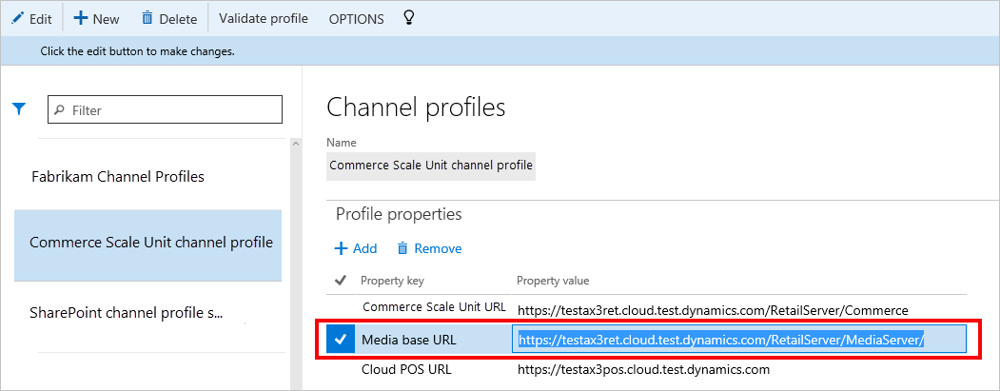
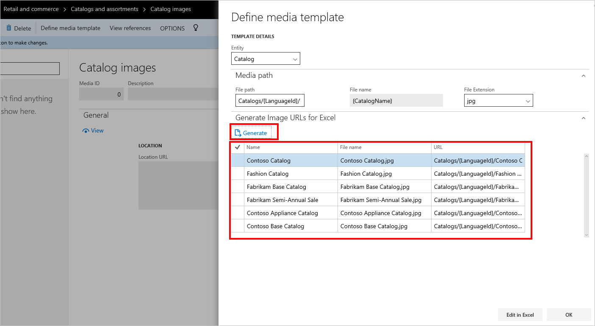
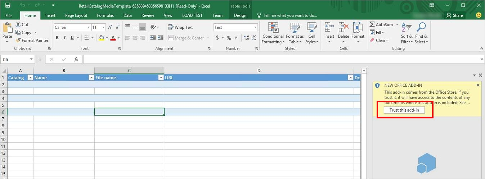
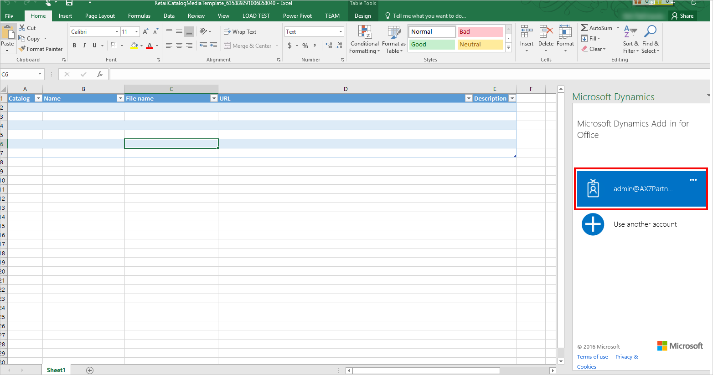
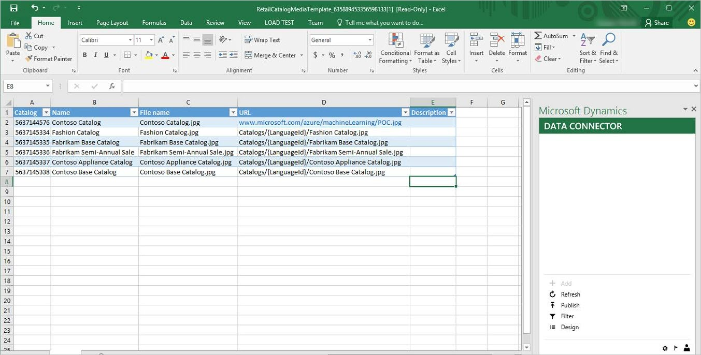
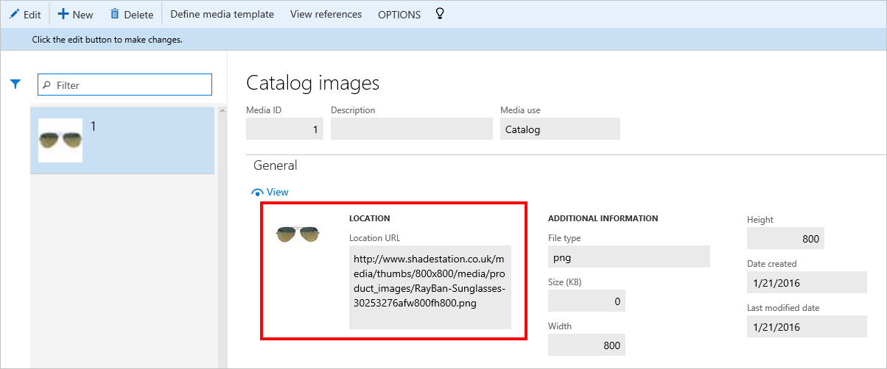
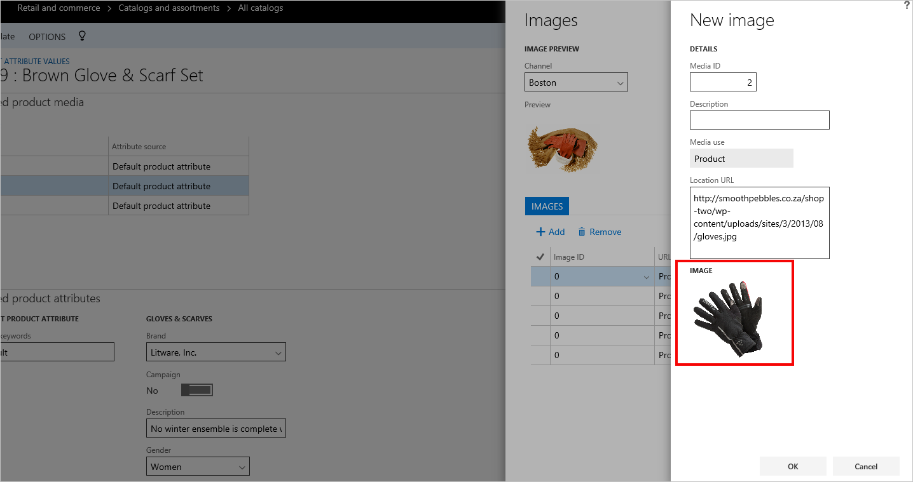
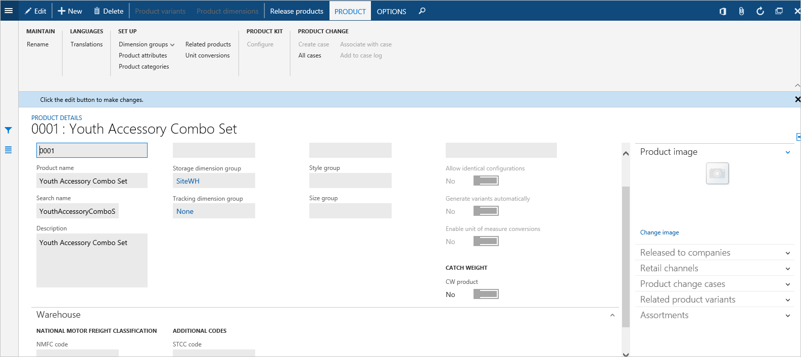
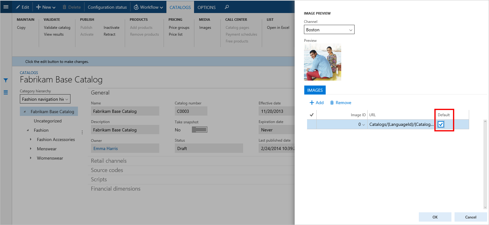

# Set up and manage images for Store Commerce

[!include [banner](includes/banner.md)]

This article explains the steps that are involved in setting up and managing images for the various entities that appear in Store Commerce.

## Set up the media base URL and defining media templates to configure the format for image URLs

The images that appear in Store Commerce must be hosted externally, outside of Commerce. Typically, they are hosted in a content management system, content delivery network (CDN), or media server. Store Commerce then fetches and displays the images for the appropriate entities, such as products and catalogs, by accessing the target URL. To fetch these externally hosted images, Store Commerce requires the correct URL format for the images. You can configure the required URL format for the images by setting up the **Media base URL** value in the channel profile and using the **Define media template** functionality for each entity. You can also overwrite the standard URL format for a subset of entities by using the **Edit in Excel** functionality.

> [!IMPORTANT]
> In the current version of Commerce, you can no longer set up the URL format by using the **Image** attribute XML for Store Commerce in the **Default** attribute group for entities. If you're familiar with Microsoft Dynamics AX 2012 R3 and are now using the current version of Commerce, make sure that you always use the new **Define media template** functionality to set up images. Don't use or modify the **Image** attribute in the **Default** attribute group for any entities, including products. Changes that you make directly in the **Default** attribute group for images won't be reflected. This option will be disabled in a future release.

In the following procedures, images are set up for the Catalog entity as an example. These procedures will help guarantee that the correct image destination path is set implicitly for all catalog images that use a common path. For example, if you've set up a media server or CDN externally, and want the images to appear in Store Commerce for a given store, the **Define media template** functionality helps you the set the path where Store Commerce can look up and retrieve the images.

> [!NOTE]
> For this demo data example, the media server is deployed on the Commerce Scale Unit. However, you can have it anywhere outside Commerce.

### Set up the media base URL for a channel

1. In Commerce headquarters, go to **Retail and Commerce \> Channel setup \> Channel profiles**.

    

3. In the channel profile that your store uses for Store Commerce, update the **Media base URL** field with the base URL of your media server or CDN. The base URL is the first part of the URL that is shared by all image folders of different entities.

    

### Define the media template for an entity

1. Select **Retail and Commerce \> Catalog management \> Catalog images**.
2. On the **Catalog images** page, on the Action Pane, select **Define media template**. In the **Define media template** dialog box, in the **Entity** field, **Catalog** should be selected by default.
3. On the **Media path** FastTab, enter the remaining path of the image location. The media path supports **LanguageID** as a variable. For example, for the demo data, you can create a **Catalogs** folder for all catalog images under the media base URL for your media server (`https://testax3ret.cloud.test.dynamics.com/RetailServer/MediaServer`). You can then have a folder for each language, such as en-US or fr-FR, and copy the appropriate images under each folder. If you don't have different images for the various languages, you can omit the **LanguageID** variable from your folder structure and point directly to the Catalogs folder that contains the catalog images.

    > [!NOTE]
    > The current version of Commerce supports the **{LanguageId}** token for Catalog, Product, and Category entities. (The **{LanguageID}** token isn't supported for Customer and Worker entities, according to the existing standard that has been effective since Microsoft Dynamics AX 6.x.)

4. For images, the file name format is hard-coded to the catalog name and can't be changed. Therefore, rename your images so that they have appropriate catalog names, to help guarantee that Store Commerce handles them correctly.
5. In the **File Extension** field, select the expected file name extension, depending on the type of images that you have. For example, for the demo data, the catalog images are set to the .jpg extension. (The image files are also renamed so that they have catalog names.)
6. Select **OK**.
7. To validate that the media template for images has been saved correctly, on the **Catalog images** page, select **Define media template** again. To validate the template without closing the **Define media template** dialog box, you can use the **Generate Image URLs for Excel** FastTab. Check the appearance of the image URL, and verify that the URL complies with the template standard that was mentioned earlier. The **Define media template** dialog box has now set the image path implicitly for all catalog images that use this common URL path. This URL path applies to all catalog images unless they are overwritten. The first part of the image path is taken from the media base URL that you defined in the channel profile. The remaining part of the path is taken from the path that you defined in the media template. The two parts are concatenated to provide the full URL of the image location. For example, a catalog in the demo data is named Fabrikam Base Catalog. Therefore, the image name must be Fabrikam Base Catalog.jpg so that it uses the catalog name and the .jpg file name extension that is configured in the template. In this case, after concatenation, the URL will be `https://testax3ret.cloud.test.dynamics.com/RetailServer/MediaServer/Catalogs/en-US/Fabrikam Base Catalog.jpg`.
8. Run the synchronization jobs to push the new template to the channel database, so that Store Commerce can use the template to access the images.
9. To update the media template for catalog images on the channel side, be sure to run **Catalog Job 1150** from **Retail and Commerce IT \> Distribution schedule**.

    

## Preview an image from the entity level

1. From the page for the entity item in headquarters, you can preview the image that uses the image URL that is derived from the media template. For this example, go to the appropriate catalog, and then, on the Action Pane, select **Media \> Images**. Use the drop-down list to select different stores that might have different channel profiles.
2. To edit or remove the implicit media template, you must return to the **Define media template** dialog box for the **Catalog images** page.
3. You can use the **Add** and **Remove** buttons to manually change the path that is based on the implicit template and used for a specific image. For more information, see the [Overwrite the media template for entity items](#overwrite-the-media-template-for-entity-items) section later in this article.
4. After you've finished previewing an image and making any changes that you require, start the Store Commerce instance for the appropriate store, and see whether the catalog images are shown.

    

> [!NOTE]
> You can use the same procedure for all the five entities that are supported: Worker, Customer, Catalog, Category, and Products. "Catalog Products" (products that are set at the catalog level) and "Channel Products" (products that are set at the channel level) use the media template that is set for the Products entity. For the Products media template, you can select the number of product images to show per product. You can also set the default image for a given product. In this way, you can prevent blank images in Store Commerce and help to control which image is used as the default image for a product item. In the following example, each product has five images, and the first image is set as the default image. Variant products are treated the same way as master products. The file name of the image file should be based on the product number. Some characters are also escaped while the file name is generated. Therefore, it's a good to verify the file name by using the **Generate Image URLs for Excel** section. See the [Overwrite by using Edit in Excel](#overwrite-by-using-edit-in-excel) section later in this article.

## Synchronization jobs to send a media template to the channel side

For all the five supported entities (Worker, Customer, Catalog, Category, and Products), whenever you update the **Define media template** dialog to set up an image, make sure that you run the Catalog job (1150) from **Retail and Commerce IT \> Distribution schedule**. This job will enable the updated media template to be synced to the channel and used by Store Commerce. Run the Catalog job (1150) after you make any of the following changes:

- You update the Catalog image media template from **Catalog images \> Define media template**.
- You update the Employee image media template from **Employee images \> Define media template**.
- You update the Customer image media template from **Customer image \> Define media template**.
- You update the Product image media template from **Product images \> Define media template**.
- You update the Category image media template from **Category images \> Define media template**. You must also publish the channel.

## Overwrite the media template for entity items

As you learned in the previous section, the media template for a given entity supports only one common path. This path is based on the media base URL that is configured and the media path that is defined. However, in many cases, a retailer wants to be able to use images from different sources for a subset of items in an entity. For example, a store uses the self-hosted media server for one set of catalog images but uses CDN URLs for another set. To overwrite image URLs that are based on a media template for entity images at the entity level, you can use the Edit in Excel and Manual edit functionality from the **Preview** page.

### Overwrite by using Edit in Excel

1. Select **Retail and Commerce \> Catalog management \> Catalog images**.
2. On the **Catalog images** page, select **Define media template**. In the **Define media template** dialog box, in the **Entity** field, **Catalog** should be selected.
3. On the **Media path** FastTab, notice the image location.
4. On the **Generate Image URLs for Excel** FastTab, select **Generate**.

    > [!IMPORTANT]
    > Whenever the media template is changed, you must select **Generate** before you can use the Edit in Excel functionality.

    You now see a preview of the image URLs that were generated based on the last saved media template.

    

    > [!NOTE]
    > The URLs that are generated for Excel use the path and conventions of the media template that is defined. These conventions include the conventions for file names. The expectation is that you've set up the physical images outside Commerce, and the images can be retrieved from the URLs that are derived from the media template that you defined earlier. You can overwrite these derived URLs by using the Edit in Excel functionality.

5. Select **Edit in Excel**.
6. After the Microsoft Excel worksheet is opened, select **Enable edit** when you're prompted.
7. When you're prompted, select **Trust this add-in** in the right pane, and wait for the add-in to complete the installation.

    

8. If you're prompted to sign in, enter the credentials that you used to sign in to headquarters.

    

9. After you sign in, you should be able to see the list of image URLs for the various catalog entries.
10. You edit, add, and remove the image URLs for various entity items.
11. For all entities except Products, you can overwrite the image URLs. Modify the existing image URL, so that it uses the new destination URL of the image, and update the file name with the new file name for the image file. The file name must be unique to help guarantee that the record is unique.

    

    > [!NOTE]
    > When you overwrite image URLs for Products entities by using the Edit in Excel functionality or the entity item page, Store Commerce always shows all the media template image URLs together with the overwritten image URLs.

12. After you've finished making your changes, select **Publish in Excel** to create a new explicit association entry.
13. Return to headquarters, and select **OK**.
14. Run the appropriate synchronization jobs for the entity, and check the preview on the entity page or in Store Commerce.

#### Create new records

You can create new records in Excel. However, make sure that you provide the correct information. For example, to create a new entry for a catalog, make sure that the catalog ID and catalog name are correct, and also provide a unique file name. The unique file name is very important, because the uniqueness of records in Excel is validated during publishing. First copy the details from the catalog that you want to create a new record for, and copy the record. You just have to update the file name and URL, because the rest of the information will be same. To create new records for Product entity items, you use the same basic procedure. From the Excel worksheet, copy an existing record for the product that you to create a new record for, and then replace the image URL and filename. Make sure that the file name is unique.

#### Delete an existing record

Only the overwritten image URL records can be deleted. After an image is deleted and synchronization is completed, the image will no longer appear on the **Preview** page or in Store Commerce. Image URL records that are derived from the media template can't be deleted, because these records are always derived from the media template every time.

### Overwrite from the entity-level Preview page

For all entities except Products, you can overwrite the image URL for a given entity item at the entity item level from the **Preview** page. For Products, you can use the "Catalog Products" entity page. This example shows how to overwrite a catalog image.

1. Select **Catalogs \> Media \> Images**, and select the catalog image to update.
2. Select **Add**, and enter the image URL to overwrite the media template URL.
3. If you want this image to be shown in Store Commerce for the catalog, you can set it as the default image.
4. Select **OK**. The image URL is updated for this catalog image, and a preview is shown.

    

5. You can also see the image preview for all overwritten image URLs on the **Catalog images** gallery page.

    

> [!NOTE]
> Only publicly and anonymously accessible images will render on POS. POS supports the rendering of images that are externally hosted, with the requirement that the images are returned as inline octet-stream to GET requests without headers. With anonymous access policy, specifically for SharePoint-hosted images that require request headers to contain both host and user-agent headers, a "Forbidden" response will be returned. Therefore, image management using SharePoint as the host is currently not supported out-of-the-box. 
> The **Catalog images** gallery page doesn't show image previews for media template image URLs. Because Commerce Scale Unit (CSU) clients show only one image per Catalog, Customer, Worker, and Category entity, if you explicitly provide a URL through this page for Catalog, Worker, Customer, and Category entities, we recommend that you indicate which image is the default image. If you don't specify a default image, the system determines the default image and sends it to the Commerce service caller (Store Commerce or e-commerce).

### Overwrite the image URL for catalog product images from the Preview page

To overwrite image URLs for catalog product images, you must use the **Preview** page. You can't use the Edit in Excel functionality.

1. To overwrite product images at a catalog level, select a catalog, and then select the product to overwrite the image for.
2. Select **Attributes**.
3. On the next page, select **Image**, and then select **Edit**. The **Preview** page opens as a slider dialog box.
4. Select **Add**, and overwrite the image URL with a new URL.
5. Select **OK**. You now see the preview of the new image and can set it as the default image.

    

> [!NOTE]
> After category image association, you must publish the channel and run the Channel job to help guarantee that the changes are published to the channel database.

## Set up images to appear in offline mode for Store Commerce

Store Commerce can run in online mode (when Store Commerce is connected to Commerce Scale Unit) or offline mode (when there is no Commerce Scale Unit or network connectivity, and transactions are stored in a local offline database). When Store Commerce runs in offline mode, it can't get images from the external image server to display from Commerce Scale Unit, because connectivity has been lost. However, you can still set up images so that they are shown when Store Commerce runs in offline mode.

### Set up product images to appear in offline mode for Store Commerce

The product images that must be used in offline mode can be set up by uploading the required physical image into the base product image.

1. Select **Product information management \> Products \> Products**.
2. Select the product to set the offline image for.
3. Select **Edit**, and then select the arrow in the right corner to show the right pane.
4. On the **Product image** FastTab, select **Change image**, and upload the physical image to use for the selected product in offline mode.
5. Save and close the page.
6. While Store Commerce is in online mode, in headquarters run the Products (1040) job to make sure that the data is sent at least one time to the offline database.
7. Put Store Commerce into offline mode. You should see the image that you uploaded for the specific product in headquarters.

    
    
> [!NOTE]
> Offline image support is only available for product images.

### Set up catalog, category, employee, and customer images to appear in offline mode for Store Commerce

The catalog, category, employee, and customer images that must be used in offline mode can be set up by adding the required image's destination link to the gallery and setting the image as the default image for the selected entity.

1. Go to the catalog, and then, on the Action Pane, select **Media \> Images**.
2. Follow the steps in the [Overwrite from the entity-level Preview page](#overwrite-from-the-entity-level-preview-page) section to add the external image URL.
3. Mark this image as the default image for the catalog by selecting the check box against the Image listed in the grid.
4. Run the Catalog job. This image will now be used as the offline image for that catalog in Store Commerce.
5. Follow a similar process for other entities, such as Category, Employee, and Customer.

    

[!INCLUDE[footer-include](../includes/footer-banner.md)]
