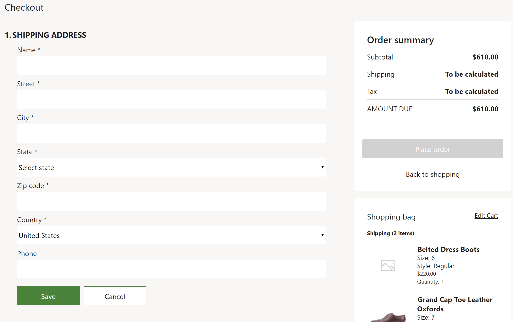

# Shipping address module

[!include [banner](includes/banner.md)]

This article describes covers the shipping address module and explains how to configure it in Microsoft Dynamics 365 Commerce.

The shipping address module lets customers add or select the shipping address for an order during the checkout flow. If a customer is signed in, any addresses that were previously saved for that customer are shown, and the customer can select among them. The customer can also add a new address. The shipping address module is used for all items on an order that require shipping.

Shipping address formats can be defined in Commerce headquarters for each country or region, and the shipping address module then enforces country/region-specific rules.

When customers enter a shipping address during the checkout flow, they have the option to save the address as a primary address. This option is shown only if a customer is signed in.

Although the shipping address module doesn't provide address validation, this functionality can be implemented through customization.

The following illustration shows an example of a new shipping address module on a checkout page.

## Module properties

| Property name | Values | Description |
|---------------|--------|-------------|
| Heading | Heading text and a heading tag (**H1**, **H2**, **H3**, **H4**, **H5**, or **H6**) | An optional heading for the shipping address module. |
| Show address type | **True** or **False** | If this optional property is set to **True**, an address type such as **Home** or **Business** is displayed. If no address type is specified, the address is automatically saved as **Type**=**Other**. |
| Enable auto suggestion| **True** or **False** | If this optional property is set to **True**, automatic address suggestions are provided. These suggestions are powered by Bing Maps. For information about how to set up Bing Maps integration for your site, see [Store selector module](store-selector.md). This feature is available as of the Commerce version 10.0.15 release.|
|Auto suggest options| A number| If automatic address suggestions are enabled, you can specify additional options, such as the maximum number of suggestions that should be provided.|
|Enable multiple shipping addresses for an order| **True** or **False**| If this optional property is set to **True**, then a customer can select multiple shipping addresses for an order by selecting a shipping address for each order line. Because each shipping address requires an individual delivery option, this configuration is dependent on the **Enable multiple delivery options for an order**  configuration of the delivery options module. This feature is available as of the Commerce version 10.0.40 release.|

## Add a shipping address module to a checkout page and set the required properties

A shipping address module can be added only to a checkout module. For more information about how to configure the shipping address module and add it to a checkout page, see [Checkout module](add-checkout-module.md).

## Additional resources

[Cart module](add-cart-module.md)

[Cart icon module](cart-icon-module.md)

[Checkout module](add-checkout-module.md)

[Payment module](payment-module.md)

[Delivery options module](delivery-options-module.md)

[Pickup information module](pickup-info-module.md)

[Order details module](order-confirmation-module.md)

[Gift card module](add-giftcard.md)

[Store selector module](store-selector.md)

[!INCLUDE[footer-include](../includes/footer-banner.md)]
