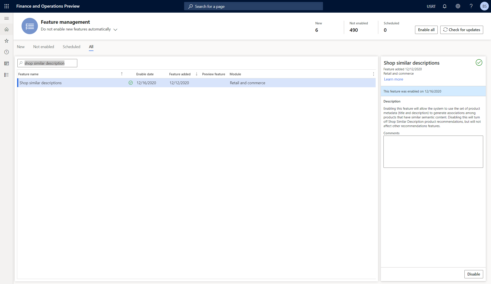

---
# required metadata

title: Enable "shop similar description" recommendations
description: This topic describes how to enable "shop similar description" product recommendations in Microsoft Dynamics 365 Commerce.
author: bsokolov
manager: AnnBe
ms.date: 01/12/2020
ms.topic: article
ms.prod: 
ms.service: dynamics-365-commerce
ms.technology: 

# optional metadata

ms.search.form: 
# ROBOTS: 
audience: Application User
# ms.devlang: 
ms.reviewer: v-chgri
#ms.search.scope: 
# ms.tgt_pltfrm: 
ms.custom: 
ms.assetid: 
ms.search.region: global
ms.search.industry: Retail, eCommerce
ms.author: bebeale
ms.search.validFrom: 2019-10-31
ms.dyn365.ops.version: 10.0.13

---

# Enable "shop similar description" recommendations

[!include [banner](includes/banner.md)]

This topic describes how to enable "shop similar description" product recommendations in Microsoft Dynamics 365 Commerce.

## Overview

The "shop similar description" recommendations feature in Dynamics 365 Commerce uses the power of artificial intelligence and machine learning (AI-ML) to deliver recommendations for products with similar description to customers. By making "shop similar description" recommendations available for all retail channels in Commerce, retailers can increase customer satisfaction by helping customers easily find what they want.

The functionality for "shop similar description" recommendations uses product name and description of seed products to find and recommend similar products in a retailer's product catalog. 

"shop similar description" recommendations are available in both the point of sale (POS) and e-Commerce experiences.

### Example scenarios

- A customer views a pair of retro horn rimmed glasses and receives a set of recommendations for other glasses with similar desgin, based on their description, contextual to the retailer's industry.

- A customer uses "shop similar description" recommendations to discover coffee flavor similar to the one they have already tried with this retailer.

## Enable "shop similar description" recommendations in Commerce headquarters

Product recommendations are supported only for Commerce users who have migrated their storage to Azure Data Lake Gen2.

### Prerequisites

Before retailers can begin to show "shop similar description" recommendations to customers, there are two prerequisite steps:

- [Enable product recommendations](enable-product-recommendations.md) in Commerce headquarters.
- Confirm that the media server supports HTTPS calls.

> [!NOTE]
> When you enable the "shop similar description" recommendations feature, the process of generating product recommendation lists begins. Up to a day might be required before those lists are available and visible online and on POS terminals.

To enable the "shop similar description" recommendations feature in Commerce headquarters, follow these steps.

1. Go to **Feature management**.
1. In the list of available features, search for and select **shop similar description**.
1. In the right pane, select **Enable** to turn on the service.

The following illustration shows the **shop similar description** feature on the **Feature management** page in Commerce headquarters.

> [!NOTE]
> If you turn off the "shop similar description" recommendations feature, no other types of product recommendations are affected. For more information about product recommendations, see [Product recommendations overview](product-recommendations.md).

## Add a shop similar description button to product details pages by using Commerce site builder

After you enable the "shop similar description" recommendations feature in Commerce headquarters, an option in Commerce site builder lets retailers to add a **shop similar description** button to the buy box on any product details page (PDP). A customer who selects this button is taken to a dedicated "shop similar description" page that returns visually similar products. There, the customer can use selectors to further filter the products.

To add a **shop similar description** button to a PDP by using Commerce site builder, follow these steps.

1. Open an existing site builder page that contains a buy box module.
1. In the left navigation pane, select the buy box module.
1. In the right navigation pane, select the **Enable shop similar description Link** check box.
1. Select **Save**, select **Finish editing** to check in the page, and then select **Publish** to publish it. After the page is published, the PDP will include a **shop similar description** button.

The following illustration shows the **Enable shop similar description Link** check box and **shop similar description** button on an example PDP in site builder.

## Additional resources

[Product recommendations overview](product-recommendations.md)

[Enable Azure Data Lake Storage in a Dynamics 365 Commerce environment](enable-adls-environment.md)

[Enable product recommendations](enable-product-recommendations.md)

[Enable "shop similar looks" recommendations](shop-similar-looks.md)

[Opt out of personalized recommendations](personalization-gdpr.md)

[Add product recommendations on POS](product.md)

[Add recommendations to the transaction screen](add-recommendations-control-pos-screen.md)

[Adjust AI-ML recommendations results](modify-product-recommendation-results.md)

[Manually create curated recommendations](create-editorial-recommendation-lists.md)

[Create recommendations with demo data](product-recommendations-demo-data.md)

[Product recommendations FAQ](faq-recommendations.md)
