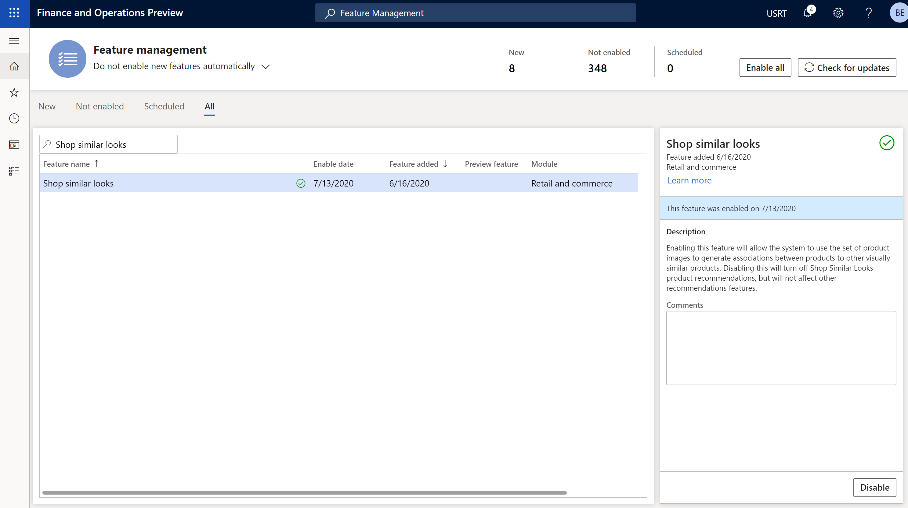
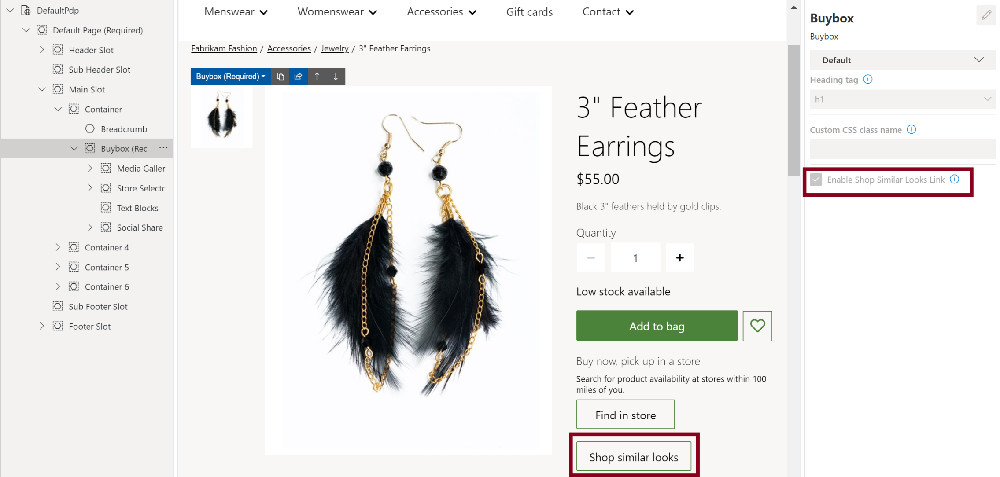

# Enable "shop similar looks" recommendations

[!include [banner](includes/banner.md)]

This article describes how to enable "shop similar looks" product recommendations in Microsoft Dynamics 365 Commerce.

The "shop similar looks" recommendations feature in Dynamics 365 Commerce uses the power of artificial intelligence and machine learning (AI-ML) to deliver recommendations for visually similar products to customers. By making "shop similar looks" recommendations available for all retail channels in Commerce, retailers can increase customer satisfaction by helping customers easily find what they want.

The functionality for "shop similar looks" recommendations uses product images of seed product variants to find and recommend visually similar products in a retailer's product catalog. 

"Shop similar looks" recommendations are available in both the point of sale (POS) and e-Commerce experiences.

### Example scenarios

- A customer views a black striped sweater and receives a recommendation for a similar sweater in red. The customer selects the recommended product instead of the originally viewed product and then receives recommendations for similar products in red. 
- A customer uses "shop similar looks" recommendations to discover matching earrings for a ring that the customer is interested in buying.

## Enable "shop similar looks" recommendations in Commerce headquarters

Product recommendations are supported only for Commerce users who have migrated their storage to Azure Data Lake Gen2.

### Prerequisites

Before retailers can begin to show "shop similar looks" recommendations to customers, there are two prerequisite steps:

- [Enable product recommendations](enable-product-recommendations.md) in Commerce headquarters.
- Confirm that the media server supports HTTPS calls.

For the recommendations engine to access the product images, retailers must generate the product URLs. To generate product URLs in Commerce headquarters, follow these steps.

1. Go to **Product images**.
1. On the Action Pane, select **Define media template**.
1. In the **Define media template** properties pane, under **Media URLs**, select **Generate URLs**.

> [!NOTE]
> When you enable the "shop similar looks" recommendations feature, the process of generating product recommendation lists begins. Up to a day might be required before those lists are available and visible online and on POS terminals.

To enable the "shop similar looks" recommendations feature in Commerce headquarters, follow these steps.

1. Go to **Feature management**.
1. In the list of available features, search for and select **Shop similar looks**.
1. In the right pane, select **Enable** to turn on the service.

The following illustration shows the **Shop similar looks** feature on the **Feature management** page in Commerce headquarters.

After the preceding tasks been completed, POS terminals are automatically enhanced with a contextual **Shop similar products** panel. By selecting **See more**, POS terminal users can be taken to a dedicated "shop similar looks" page that can be filtered further.

> [!NOTE]
> If you turn off the "shop similar looks" recommendations feature, no other types of product recommendations are affected. For more information about product recommendations, see [Product recommendations overview](product-recommendations.md).

## Add a Shop similar looks button to product details pages by using Commerce site builder

After you enable the "shop similar looks" recommendations feature in Commerce headquarters, an option in Commerce site builder lets retailers to add a **Shop similar looks** button to the buy box on any product details page (PDP). A customer who selects this button is taken to a dedicated "shop similar looks" page that returns visually similar products. There, the customer can use selectors to further filter the products.

To add a **Shop similar looks** button to a PDP by using Commerce site builder, follow these steps.

1. Open an existing site builder page that contains a buy box module.
1. In the left navigation pane, select the buy box module.
1. In the right navigation pane, select the **Enable Shop Similar Looks Link** check box.
1. Select **Save**, select **Finish editing** to check in the page, and then select **Publish** to publish it. After the page is published, the PDP will include a **Shop similar looks** button.

The following illustration shows the **Enable Shop Similar Looks Link** check box and **Shop similar looks** button on an example PDP in site builder.

## Additional resources

[Product recommendations overview](product-recommendations.md)

[Enable Azure Data Lake Storage in a Dynamics 365 Commerce environment](enable-adls-environment.md)

[Enable product recommendations](enable-product-recommendations.md)

[Opt out of personalized recommendations](personalization-opt-out.md)

[Add product recommendations on POS](product.md)

[Add recommendations to the transaction screen](add-recommendations-control-pos-screen.md)

[Adjust AI-ML recommendations results](modify-product-recommendation-results.md)

[Manually create curated recommendations](create-editorial-recommendation-lists.md)

[Create recommendations with demo data](product-recommendations-demo-data.md)

[Product recommendations FAQ](faq-recommendations.md)

[!INCLUDE[footer-include](../includes/footer-banner.md)]
